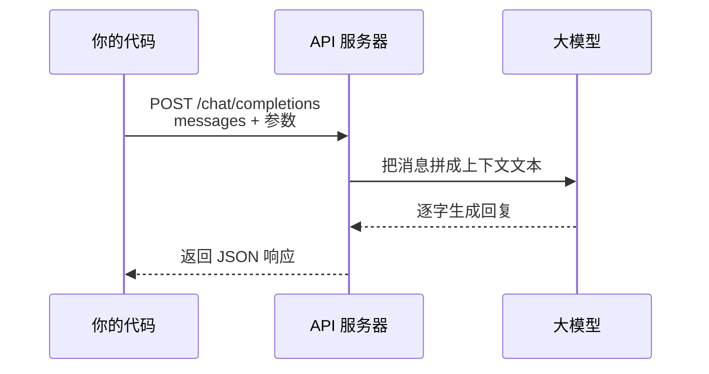
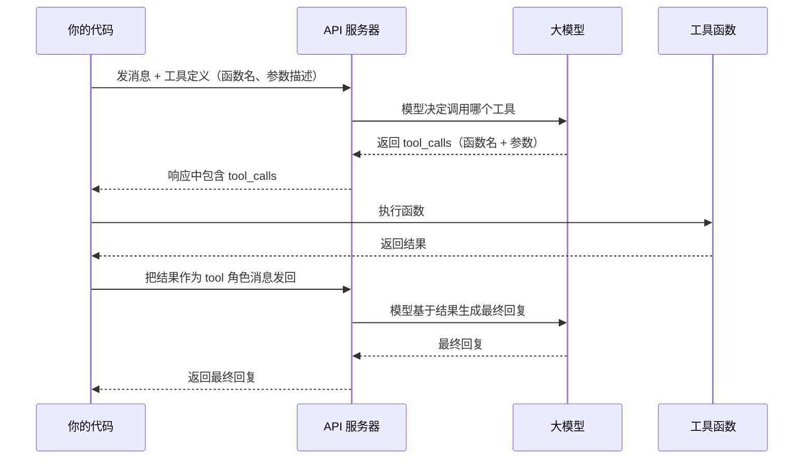
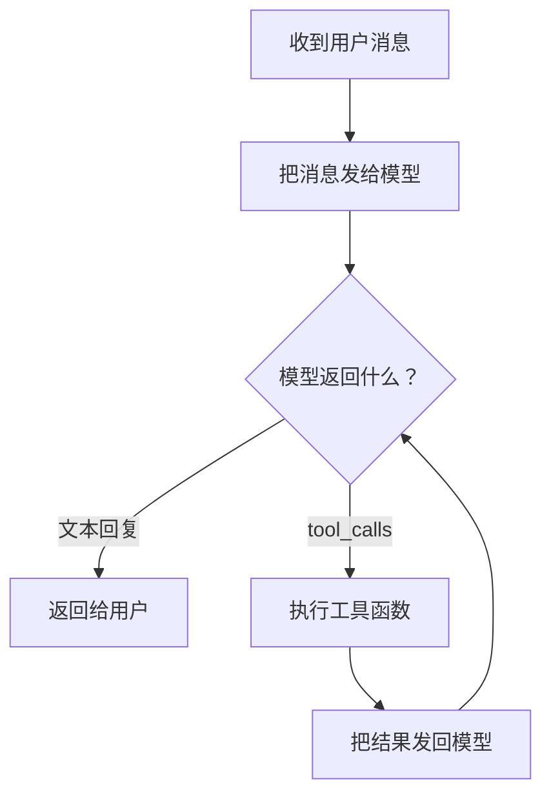
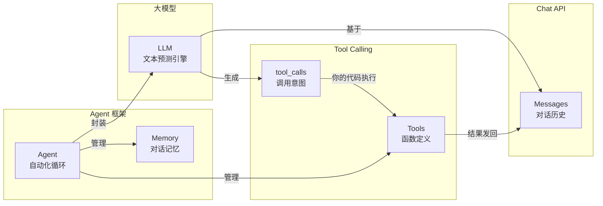

这一章回答三个问题：大模型是什么、它怎么跟你对话、它怎么调用外部工具。读完之后，你会理解全书追踪的那个"天气查询 Agent"到底依赖了什么底层能力。

---

## 1.1 生活类比：超级输入法

你用手机输入法打过字吧？当你输入"今天天气"，输入法会在候选栏显示"很好"、"不错"、"怎么样"——它在**预测下一个词**。

大模型（Large Language Model，简称 LLM）做的事情本质一样，只是规模大了几个数量级：

| | 手机输入法 | 大模型 |
|---|---|---|
| 训练数据 | 你的打字历史 | 互联网上海量的文本 |
| 预测范围 | 下一个词 | 下一段话、整篇文章 |
| 理解深度 | 局部搭配 | 上下文语义、逻辑推理 |

你可以把大模型想象成一个**读过了整个互联网的超级输入法**。你给它一段开头（prompt），它接着往下"预测"。

但这里有一个关键区别：输入法只预测你"可能想打"的字，而大模型能根据你的指令**生成结构化的回答**——甚至生成代码、调用函数。后面我们会看到它是怎么做到的。

---

## 1.2 动手试试：第一次对话

与其空谈概念，不如直接和模型对话。

### 基础级：用 curl 调用 Chat API

大模型厂商（OpenAI、Anthropic、阿里云百炼等）都提供 HTTP 接口。你发一段 JSON，它回一段 JSON。这就是 Chat API（聊天接口）。

> **知识补全：HTTP 请求与 JSON**
>
> HTTP 是浏览器和服务器通信的协议。你平时打开网页，浏览器就是发了一个 HTTP GET 请求。
> 这里我们用 POST 请求：把一段 JSON 数据发给服务器，服务器处理后返回 JSON。
>
> JSON 是一种数据格式，长这样：
> ```json
> {
>   "model": "gpt-4o",
>   "messages": [
>     {"role": "user", "content": "你好"}
>   ]
> }
> ```
> 它就是嵌套的键值对（字典）和列表，和 Python 的 dict/list 几乎一样。

在终端运行以下命令（需要 OpenAI API key）：

```bash
curl https://api.openai.com/v1/chat/completions \
  -H "Content-Type: application/json" \
  -H "Authorization: Bearer $OPENAI_API_KEY" \
  -d '{
    "model": "gpt-4o",
    "messages": [
      {"role": "user", "content": "用一句话解释什么是大模型"}
    ]
  }'
```

你会收到类似这样的响应（已简化）：

```json
{
  "choices": [
    {
      "message": {
        "role": "assistant",
        "content": "大模型是通过海量文本数据训练的AI系统，能够理解和生成人类语言。"
      }
    }
  ],
  "usage": {
    "prompt_tokens": 15,
    "completion_tokens": 25,
    "total_tokens": 40
  }
}
```

核心结构很简单：

1. 你发了一段 `messages`（消息列表），里面有一条用户消息。
2. 模型返回了一段 `choices`（回复列表），里面有一条助手消息。

用 Python 写同样的事情：

```python
from openai import OpenAI

client = OpenAI()  # 自动读取环境变量 OPENAI_API_KEY

response = client.chat.completions.create(
    model="gpt-4o",
    messages=[
        {"role": "user", "content": "用一句话解释什么是大模型"}
    ],
)

print(response.choices[0].message.content)
```

### 没有 API key？

如果你暂时没有 API key，可以用下面的模拟代码体验 API 调用的流程：

```python
# 模拟 Chat API 调用（不需要 API key）
def mock_chat_completion(messages):
    """模拟大模型的回复"""
    user_msg = messages[-1]["content"]

    if "天气" in user_msg:
        return {
            "choices": [{
                "message": {
                    "role": "assistant",
                    "content": "我无法获取实时天气数据。建议你使用天气查询工具来获取准确信息。"
                }
            }]
        }
    return {
        "choices": [{
            "message": {
                "role": "assistant",
                "content": f"你说了：{user_msg}。这是一个模拟回复。"
            }
        }]
    }

# 试试看
response = mock_chat_completion([
    {"role": "system", "content": "你是一个有帮助的助手。"},
    {"role": "user", "content": "北京今天天气怎么样？"},
])
print(response["choices"][0]["message"]["content"])
```

这段代码模拟了 API 的请求-响应结构，帮你理解数据是怎样流动的。后面的章节中，所有需要 API key 的实验都会提供无 key 替代方案。

---

## 1.3 核心概念

### 1.3.1 大模型是什么

大模型是一个**文本预测引擎**。给它一段文本（称为上下文，context），它输出一段续写。

但"预测文本"这件事，在足够大的规模下，涌现出了三种能力：

| 能力 | 例子 |
|---|---|
| **理解指令** | "用一句话解释 X" -- 它真的只写一句话 |
| **推理** | "如果 A > B 且 B > C，那么 A 和 C 谁大？" -- 它能推出 A > C |
| **格式输出** | "用 JSON 格式列出三个城市" -- 它输出合法的 JSON |

这三种能力组合起来，就让"预测下一个字"变成了一件非常有用的事。

### 1.3.2 Chat API 的工作方式

Chat API 是目前最主流的大模型调用方式。它的工作流程可以用一张图说清楚：



请求中的 `messages` 是一个**消息列表**，每条消息有两个关键字段：

- `role`（角色）：`system`（系统指令）、`user`（用户）、`assistant`（助手）、`tool`（工具返回结果）
- `content`（内容）：文本内容

> **知识补全：对话中的四种角色**
>
> Chat API 的每条消息都有一个 `role`，用于告诉模型"这话是谁说的"。四种角色各有分工：
>
> | 角色 | 谁说的 | 作用 |
> |---|---|---|
> | `system` | 开发者设定 | 给模型定"人设"和规则，优先级最高（如"你是天气助手，只回答天气问题"） |
> | `user` | 真实用户 | 用户的提问或指令 |
> | `assistant` | 大模型 | 模型的回复（包括文本回答和工具调用意图） |
> | `tool` | 你的代码 | 工具函数执行后的返回值，发回给模型供它参考 |
>
> 模型的思考方式很简单：读完 `messages` 列表（按时间顺序排列的完整对话记录），预测**下一条 `role: "assistant"` 消息的 `content`**。这就是为什么多轮对话中你必须把历史消息也放进 `messages` 里——模型本身没有"记忆"。

一个完整的对话通常长这样：

```json
{
  "messages": [
    {"role": "system", "content": "你是一个天气助手。"},
    {"role": "user", "content": "北京天气怎么样？"},
    {"role": "assistant", "content": "让我帮你查一下。"},
    {"role": "user", "content": "好的，请查。"}
  ]
}
```

模型看到整个对话历史，然后预测**下一条助手消息**。

> **Token 是什么？**
>
> 响应中的 `usage.prompt_tokens` 和 `completion_tokens` 涉及 Token 的概念。
> Token 是模型处理文本的基本单位，大约 1 个汉字 = 1.5-2 个 Token（通常接近 2 个）。
> Token 计费、Token 上限（context window）是实际使用中的关键约束。
> 本书 ch08 会详细讲解 Token 在源码中的计算方式。
>
> **流式响应是什么？**
>
> 上面的例子中，模型生成完整回复后才一次性返回。
> 流式响应（Streaming）则是模型**每生成几个 Token 就立刻返回**，用户看到"打字机效果"。
> 本书 ch09 会详细讲解流式响应在源码中的实现。

### 1.3.3 Tool Calling：让模型调用函数

大模型本身只能生成文本。但很多场景下，你需要它"动手做事"——比如查天气、查数据库、发邮件。

Tool Calling（工具调用）就是解决这个问题的机制。工作流程如下：



用代码表示，你在请求中告诉模型"你有哪些工具可以用"：

```json
{
  "model": "gpt-4o",
  "messages": [
    {"role": "user", "content": "北京今天天气怎么样？"}
  ],
  "tools": [
    {
      "type": "function",
      "function": {
        "name": "get_weather",
        "description": "查询指定城市的天气",
        "parameters": {
          "type": "object",
          "properties": {
            "city": {
              "type": "string",
              "description": "城市名称"
            }
          },
          "required": ["city"]
        }
      }
    }
  ]
}
```

模型不直接执行函数。它返回的是**调用意图**——告诉你要调哪个函数、传什么参数：

```json
{
  "choices": [
    {
      "message": {
        "role": "assistant",
        "content": null,
        "tool_calls": [
          {
            "id": "call_abc123",
            "type": "function",
            "function": {
              "name": "get_weather",
              "arguments": "{\"city\": \"北京\"}"
            }
          }
        ]
      }
    }
  ]
}
```

你的代码负责：解析这个意图 -> 执行 `get_weather("北京")` -> 把结果发回给模型 -> 模型生成最终的自然语言回复。

这个过程涉及多次 API 调用，循环往复。这正是 Agent 框架（比如 AgentScope）帮你自动化的事情。

### 1.3.4 AgentScope 的角色

回头看全书贯穿的那个天气查询 Agent 代码：

```python
import agentscope
from agentscope.agent import ReActAgent
from agentscope.model import OpenAIChatModel
from agentscope.formatter import OpenAIChatFormatter
from agentscope.tool import Toolkit
from agentscope.memory import InMemoryMemory

agentscope.init(project="weather-demo")

model = OpenAIChatModel(model_name="gpt-4o", stream=True)
toolkit = Toolkit()
toolkit.register_tool_function(get_weather)

agent = ReActAgent(
    name="assistant",
    sys_prompt="你是天气助手。",
    model=model,
    formatter=OpenAIChatFormatter(),
    toolkit=toolkit,
    memory=InMemoryMemory(),
)

result = await agent(Msg("user", "北京今天天气怎么样？", "user"))
```

现在你能看懂这段代码的每一行在做什么了：

| 代码 | 对应概念 |
|---|---|
| `OpenAIChatModel` | 封装了 Chat API 的调用 |
| `toolkit.register_tool_function(get_weather)` | 注册工具函数，会自动生成上面的 JSON Schema |
| `InMemoryMemory()` | 保存对话历史（`messages` 列表） |
| `ReActAgent` | 自动完成"模型决定调用工具 -> 执行 -> 把结果发回 -> 循环"这个过程 |
| `Msg("user", "北京今天天气怎么样？", "user")` | 构造一条用户消息 |
| `await agent(...)` | 启动整个流程 |

> **关于 `await`**：`await` 是 Python 异步编程的关键字，表示"等待这个操作完成，但在等待期间程序可以去做别的事"。ch03 会详细解释 async/await 的工作原理。现在只需要知道它表示"等待 Agent 完成处理"。

其中 ReActAgent 内部的循环逻辑是这样的：



先想（Reasoning），再做（Acting），反复循环，直到模型给出最终文本回复。这就是 ReAct 模式。下一章会详细讲解。

### 1.3.5 概念关系总览



**与官方文档的对应关系**：AgentScope 官方文档的 Basic Concepts 页面详细介绍了 Message、Agent、Model 三大基础概念。其中 Message（`Msg`）是 AgentScope 的基本数据结构，负责在 Agent、用户和工具之间传递信息，支持文本、图像、视频、音频、工具调用等多种内容类型；Agent 是一个独立实体，通过 `reply`（处理消息并生成回复）和 `observe`（接收外部信息更新内部状态）两个核心方法运作；Model 层则提供了统一的异步抽象，覆盖 OpenAI、Anthropic、DashScope、Gemini、Ollama 等多个模型提供商。官方文档侧重"怎么调用 API"，本章则侧重"LLM 和 Agent 的基本原理"。

> AgentScope 1.0 论文（arXiv:2508.16279）第 1 节阐述了框架的设计动机："Driven by rapid advancements of Large Language Models (LLMs), agents are empowered to combine intrinsic knowledge with dynamic tool use, greatly enhancing their capacity to address real-world tasks. ... AgentScope introduces major improvements in a new version (1.0), towards comprehensively supporting flexible and efficient tool-based agent-environment interactions for building agentic applications." 论文还指出，框架将 Agent 行为建立在 ReAct 范式之上，并提供基于系统性异步设计的高级 Agent 基础设施。

---

## 1.4 试一试：搭建环境

这一节让你把 AgentScope 安装到本地，为后续章节做准备。

### 基础级：pip 安装 + 验证

```bash
pip install agentscope
```

安装完成后，运行以下 3 行 Python 代码验证：

```python
import agentscope
agentscope.init(project="verify")
print(f"AgentScope version: {agentscope.__version__}")
```

如果看到版本号输出，说明安装成功。

### 完整级：clone + 开发模式安装

后续章节需要阅读和修改源码，所以推荐从源码安装：

```bash
# 1. 克隆仓库
git clone https://github.com/modelscope/agentscope.git
cd agentscope

# 2. 开发模式安装（-e 表示 editable，改源码立刻生效）
pip install -e .

# 3. 验证
python -c "import agentscope; agentscope.init(project='verify'); print(agentscope.__version__)"
```

开发模式安装的好处是：你在 `src/agentscope/` 下改任何代码，不需要重新安装就能生效。全书后续的"试一试"环节都依赖这个安装方式。

### 验证贯穿示例

安装完成后，你可以尝试运行天气查询 Agent 的骨架代码（不需要 API key 也能验证导入是否正常）：

```python
import agentscope
from agentscope.agent import ReActAgent
from agentscope.model import OpenAIChatModel
from agentscope.formatter import OpenAIChatFormatter
from agentscope.tool import Toolkit
from agentscope.memory import InMemoryMemory

agentscope.init(project="weather-demo")

# 以下构造不需要 API key
model = OpenAIChatModel(model_name="gpt-4o", stream=True)
toolkit = Toolkit()
formatter = OpenAIChatFormatter()
memory = InMemoryMemory()

print("所有组件导入成功！")
print(f"  Model: {type(model).__name__}")
print(f"  Toolkit: {type(toolkit).__name__}")
print(f"  Formatter: {type(formatter).__name__}")
print(f"  Memory: {type(memory).__name__}")
```

如果看到每个组件的类型名打印出来，说明环境完全就绪。

> **遇到问题？**
>
> - `ModuleNotFoundError: No module named 'agentscope'`：确认 `pip install` 成功，检查是否在正确的虚拟环境中。
> - `ImportError` 相关 `openai` 或 `anthropic`：运行 `pip install agentscope[full]` 安装全部依赖。

---

## 1.5 检查点

回顾一下你现在已经理解了什么：

| 概念 | 一句话解释 |
|---|---|
| **大模型（LLM）** | 读过海量文本的"超级输入法"，能理解指令、推理、格式输出 |
| **Chat API** | 发消息列表（JSON）给服务器，收到模型回复（JSON） |
| **Tool Calling** | 模型返回"调用意图"（函数名+参数），你的代码负责执行并把结果发回 |
| **Agent 框架** | 自动化"模型调用 -> 工具执行 -> 循环"这个流程 |
| **AgentScope** | 你将要深入阅读源码的 Agent 框架 |

> **下一章：[第 2 章 什么是 Agent](/posts/71cc54ce/)** —— 详细拆解 Agent 的内部结构（记忆、工具、循环），让你完全理解贯穿示例的每一行代码。

---

> **本章涉及的源码文件（供提前浏览）**
>
> - `src/agentscope/__init__.py` -- `agentscope.init()` 的实现
> - `src/agentscope/agent/_react_agent.py` -- `ReActAgent` 的实现
> - `src/agentscope/message/_message_base.py` -- `Msg` 消息类的实现
> - `src/agentscope/model/` -- 模型适配器的实现
> - `src/agentscope/tool/` -- 工具系统的实现
