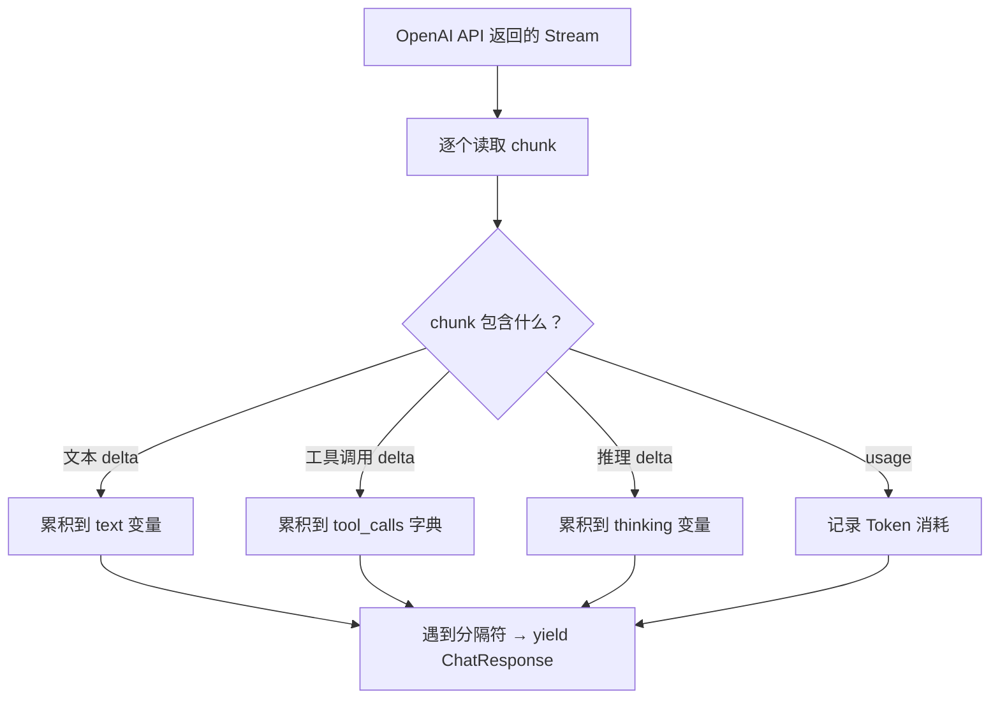
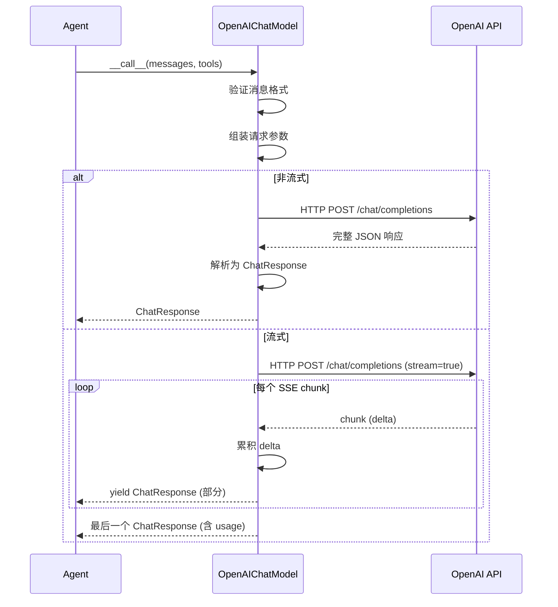

---

title: 第 9 站：调用模型
abbrlink: 03dd72ec
date: 2024-03-31 00:00:00
chapter: 9
description: "本文深入 AgentScope 模型适配层，剖析 ChatModelBase 统一调用接口及流式/非流式响应解析流程。详细解读 ChatResponse 的 Text、ToolUse、Thinking 等内容块类型，并展示结构化输出如何借助工具调用伪装实现自动回退。还涵盖流式增量累积、调试技巧与推理模型思考过程暴露机制。"
categories:
  - AgentScope是如何运行的
tags:
  - AgentScope
  - 模型源码
  - 流式响应
  - 结构化输出
  - ChatResponse
---

> Formatter 把消息翻译好了，现在终于要发送给大模型了。我们追踪 HTTP 请求从发出到响应的全过程。

> **上一章：[第 8 站：格式转换](/posts/a5de3ffa/)**

## 路线图

上一站，Formatter 把 `Msg` 列表翻译成了 `[{"role": "user", "content": "..."}]` 这样的字典列表。现在这些字典被传给 `Model`（模型适配器），由它负责和 API 通信。

```
Formatter 输出: [{"role": "user", "content": "北京天气如何？"}, ...]
                              ↓
                    Model.__call__(messages)
                              ↓
                    HTTP 请求 → OpenAI API
                              ↓
                    HTTP 响应 → ChatResponse
```

读完本章，你会理解：
- `ChatModelBase` 的统一接口
- 流式响应的解析过程
- `ChatResponse` 的内容块（ContentBlock）类型
- 结构化输出（Structured Output）的实现

---

## 知识补全：AsyncGenerator

`ChatModelBase.__call__` 的返回类型有两种：

```python
async def __call__(...) -> ChatResponse | AsyncGenerator[ChatResponse, None]:
```

- **非流式**（`stream=False`）：一次性返回完整的 `ChatResponse`
- **流式**（`stream=True`）：返回一个 `AsyncGenerator`，每次 `yield` 一个包含部分内容的 `ChatResponse`

`AsyncGenerator` 就像一个"异步迭代器"。你可以用 `async for` 遍历它：

```python
async for chunk in model(messages):
    print(chunk)  # 每次收到一小段
```

流式的好处是用户不需要等模型生成完所有内容才开始看到结果。

---

## 第一层：ChatModelBase

打开 `src/agentscope/model/_model_base.py`：

```python
# _model_base.py:13
class ChatModelBase:
    model_name: str    # 模型名称，如 "gpt-4o"
    stream: bool       # 是否流式输出

    @abstractmethod
    async def __call__(
        self, *args, **kwargs,
    ) -> ChatResponse | AsyncGenerator[ChatResponse, None]:
        """调用模型 API"""
```

注意 `__call__` 意味着模型对象可以像函数一样调用：`response = await model(messages)`。

还有一个验证方法：

```python
# _model_base.py:46
def _validate_tool_choice(self, tool_choice: str, tools: list[dict] | None):
    """验证 tool_choice 参数是否合法"""
```

`tool_choice` 有三种预设模式：`"auto"`（模型自己决定）、`"none"`（不调用工具）、`"required"`（必须调用工具）。也可以指定具体的工具名称。

---

## ChatResponse：模型响应的数据结构

打开 `src/agentscope/model/_model_response.py`：

```python
# _model_response.py:20
@dataclass
class ChatResponse(DictMixin):
    content: Sequence[TextBlock | ToolUseBlock | ThinkingBlock | AudioBlock]
    id: str
    created_at: str
    type: Literal["chat"]
    usage: ChatUsage | None
    metadata: dict | None
```

`content` 是核心字段——一个内容块列表。四种可能的类型：

| 内容块 | 含义 | 什么时候出现 |
|--------|------|-------------|
| `TextBlock` | 普通文本 | 模型返回文字回答 |
| `ToolUseBlock` | 工具调用 | 模型决定调用工具 |
| `ThinkingBlock` | 思考过程 | 推理模型（如 o1/o3）的内部推理 |
| `AudioBlock` | 语音 | 语音模型返回音频数据 |

### ChatUsage

```python
# _model_usage.py:11
@dataclass
class ChatUsage(DictMixin):
    input_tokens: int     # 输入 Token 数
    output_tokens: int    # 输出 Token 数
    time: float           # 耗时（秒）
```

每次 API 调用都会消耗 Token。`ChatUsage` 记录了消耗了多少。

---

## OpenAIChatModel 的实现

打开 `src/agentscope/model/_openai_model.py`，找到第 71 行：

```python
# _openai_model.py:71
class OpenAIChatModel(ChatModelBase):
```

### __call__ 方法的签名

```python
# _openai_model.py:176
@trace_llm
async def __call__(
    self,
    messages: list[dict],
    tools: list[dict] | None = None,
    tool_choice: Literal["auto", "none", "required"] | str | None = None,
    structured_model: Type[BaseModel] | None = None,
    **kwargs,
) -> ChatResponse | AsyncGenerator[ChatResponse, None]:
```

四个关键参数：

1. `messages`：Formatter 翻译好的消息列表
2. `tools`：工具的 JSON Schema 列表（告诉模型有哪些工具可用）
3. `tool_choice`：工具选择策略
4. `structured_model`：结构化输出的 Pydantic 模型

方法内部会：
1. 验证消息格式
2. 组装请求参数（model、messages、stream、tools 等）
3. 如果有 `structured_model`，走结构化输出路径
4. 调用 OpenAI SDK 发送请求
5. 解析响应为 `ChatResponse`

### 流式解析

流式响应的解析在 `_parse_openai_stream_response`（第 346 行）中。它的工作是：



关键数据结构：

```python
# _openai_model.py:376
text = ""           # 累积文本
thinking = ""       # 累积推理
audio = ""          # 累积音频
tool_calls = OrderedDict()   # 累积工具调用
```

每个 chunk 只包含一小段增量（delta）。解析器需要把这些增量累积起来，在适当的时机（比如一段完整的文本结束、一个工具调用完成）yield 一个 `ChatResponse`。

### 结构化输出

```python
# _openai_model.py:730
async def _structured_via_tool_call(self, ...):
    """通过"伪装成工具调用"的方式实现结构化输出"""
```

结构化输出的巧妙实现：把 Pydantic 模型转换成一个"工具函数"的 JSON Schema，让模型以为自己要调用工具——但实际上这只是为了让模型返回特定格式的 JSON。

结构化输出有两种实现路径，框架会自动选择：

1. **原生路径**（优先）：使用 OpenAI 的 `response_format` 参数，让 API 直接返回结构化 JSON
2. **工具调用回退**（fallback）：如果 API 不支持 `response_format`（如部分兼容 API），自动回退到"伪装工具调用"方式

```python
# _openai_model.py:293-318（简化）
if not self._structured_output_fallback:
    kwargs["response_format"] = structured_model
    try:
        response = await self.client.chat.completions.parse(**kwargs)
    except openai.BadRequestError:
        # API 不支持 response_format → 回退到工具调用
        self._structured_output_fallback = True
        response = await self._structured_via_tool_call(...)
```

一旦第一次尝试失败，`_structured_output_fallback` 被设为 `True`——后续调用直接走回退路径，不再尝试。

---

## 非流式响应的解析

流式是 ch01 提到的"打字机效果"。但不是所有场景都需要流式——当你只需要最终结果（比如后台批量处理）时，`stream=False` 更高效。

非流式解析在 `_parse_openai_completion_response`（第 561 行）中。它的逻辑比流式简单得多——不需要累积，直接从响应对象中提取：

```python
# _openai_model.py:592（简化）
if response.choices:
    choice = response.choices[0]

    # 1. 推理内容（推理模型如 o1/o3）
    reasoning = getattr(choice.message, "reasoning_content", None)
    if reasoning is not None:
        content_blocks.append(ThinkingBlock(thinking=reasoning))

    # 2. 文本内容
    if choice.message.content:
        content_blocks.append(TextBlock(text=choice.message.content))

    # 3. 音频内容（语音模型）
    if choice.message.audio:
        content_blocks.append(AudioBlock(source=...))

    # 4. 工具调用
    for tool_call in choice.message.tool_calls or []:
        content_blocks.append(ToolUseBlock(
            id=tool_call.id,
            name=tool_call.function.name,
            input=_json_loads_with_repair(tool_call.function.arguments),
        ))
```

和流式解析的关键区别：

| | 流式 | 非流式 |
|---|---|---|
| 输入 | `AsyncStream`（多个 chunk） | `ChatCompletion`（单个对象） |
| 累积 | 需要 `text +=`、`tool_calls[idx]["input"] +=` | 直接取 `choice.message.content` |
| yield | 多次，每个 chunk 一次 | 一次性返回 |
| JSON 修复 | 需要 `_parse_streaming_json_dict` 逐步修复 | 用 `_json_loads_with_repair` 一次修复 |

注意 `_json_loads_with_repair`——模型生成的 JSON 有时不完全合法（比如少了闭合括号），这个工具函数会尝试自动修复。

---

## ThinkingBlock：推理模型的"内心独白"

推理模型（如 o1、o3、DeepSeek-R1）在给出回答前会先"思考"。这个思考过程通过 `ThinkingBlock` 暴露出来。

在流式模式中，`thinking` 变量通过 `+=` 逐步累积（第 432 行）：

```python
# _openai_model.py:422
delta_reasoning = getattr(choice.delta, "reasoning_content", None)
if not isinstance(delta_reasoning, str):
    delta_reasoning = getattr(choice.delta, "reasoning", None)
thinking += delta_reasoning or ""
```

注意代码检查了两个属性名：`reasoning_content`（OpenAI 标准）和 `reasoning`（部分兼容 API）。这是为了兼容不同提供商。

ThinkingBlock 对用户来说是可选展示的——你可以选择显示模型的"思考过程"让用户了解推理链条，也可以隐藏它只展示最终回答。

---

## _validate_tool_choice 详解

```python
# _model_base.py:46
def _validate_tool_choice(self, tool_choice: str, tools: list[dict] | None):
```

`tool_choice` 参数控制模型"是否调用工具"的行为。有四类值：

| 值 | 含义 |
|----|------|
| `"auto"` | 模型自己决定是否调用工具（默认行为） |
| `"none"` | 禁止调用工具，即使有 tools 参数 |
| `"required"` | 必须调用工具，不能只返回文本 |
| `"get_weather"` | 指定调用特定工具 |

验证逻辑分两步：

```python
# _model_base.py:67-77（简化）
if tool_choice in ["auto", "none", "required"]:
    return   # 预设模式，直接通过

# 否则，检查是否是已注册的工具名
available_functions = [tool["function"]["name"] for tool in tools]
if tool_choice not in available_functions:
    raise ValueError(f"Invalid tool_choice '{tool_choice}'")
```

如果你传了一个不存在的工具名，会得到一个清晰的错误信息。

---

## 模型配置参数

`OpenAIChatModel` 的构造函数（第 74 行）接受多个配置参数：

```python
# _openai_model.py:74
def __init__(
    self,
    model_name: str,                    # 模型名称
    api_key: str | None = None,         # API key（默认读环境变量）
    stream: bool = True,                # 是否流式
    reasoning_effort: str | None = None,# 推理强度（o3/o4 系列）
    stream_tool_parsing: bool = True,   # 流式工具解析
    client_type: str = "openai",        # 客户端类型（openai/azure）
    client_kwargs: dict | None = None,  # 额外客户端参数
    generate_kwargs: dict | None = None,# 额外生成参数
):
```

其中 `generate_kwargs` 可以传入 `temperature`、`top_p`、`max_tokens` 等参数：

```python
model = OpenAIChatModel(
    model_name="gpt-4o",
    stream=True,
    generate_kwargs={"temperature": 0.7, "max_tokens": 1000},
)
```

这些参数会合并到每次 API 请求中：

```python
# _openai_model.py:241
kwargs = {
    "model": self.model_name,
    "messages": messages,
    "stream": self.stream,
    **self.generate_kwargs,    # 开发者预设的参数
    **kwargs,                  # 调用时传入的参数（优先级更高）
}
```

注意合并顺序：`**kwargs` 在 `**self.generate_kwargs` 后面，意味着调用时传入的同名参数会覆盖构造时的预设。

---

## 调试实践：观察 Model 的内部状态

在实际调试中，你经常需要知道"模型到底收到了什么参数，返回了什么内容"。这里有几个实用的调试技巧：

### 技巧 1：打印请求参数

在 `__call__` 方法中（第 241 行后），`kwargs` 字典包含了发送给 API 的所有参数：

```python
# 在 _openai_model.py 第 248 行后加一行：
print(f"[DEBUG] 请求参数: model={kwargs.get('model')}, "
      f"messages={len(messages)}条, stream={self.stream}, "
      f"tools={len(kwargs.get('tools', []))}个")
```

这行代码让你看到每次调用的关键参数，不需要 API key 也能看到参数组装过程（构造函数不会发请求）。

### 技巧 2：观察流式解析的累积过程

在 `_parse_openai_stream_response` 中（第 527 行 `yield` 之前），加一行：

```python
print(f"[DEBUG] 流式 chunk: text={len(text)}字, "
      f"thinking={len(thinking)}字, "
      f"tool_calls={len(tool_calls)}个")
```

你会看到文本和工具调用是如何逐步累积的。

### 技巧 3：追踪结构化输出的回退

搜索 `_structured_output_fallback`，观察框架如何从 `response_format` 自动回退到工具调用方式：

```bash
grep -n "structured_output_fallback" src/agentscope/model/_openai_model.py
```

**改完后记得恢复：**

```bash
git checkout src/agentscope/model/
```

AgentScope 官方文档的 Building Blocks > Models 页面展示了不同模型的配置和调用方法。本章解释了 `ChatModelBase.__call__` 的流式解析过程和 `ChatResponse` 的内部结构。

在实际项目中，模型配置和流式调用的典型用法包括：
- 配置 `stream=True` 启用流式输出，逐 chunk 接收模型响应
- 通过 `tool_choice="required"` 强制模型调用工具
- 使用 `structured_model` 参数让模型返回特定格式的 JSON

---

## 完整流程图



> **设计一瞥**：为什么 `__call__` 的返回类型是 Union？
> `ChatResponse | AsyncGenerator[ChatResponse, None]` 是一种妥协。非流式返回一个对象，流式返回一个异步生成器——调用者需要自己判断。
> 另一种设计是让流式和非流式有统一接口（都返回 AsyncGenerator，非流式只是 yield 一次）。但 AgentScope 选择区分它们，因为大多数调用者只使用其中一种模式。
> 详见卷四第 33 章。

---

## 试一试：观察 Model 的调用过程

这个练习需要一个 API key（OpenAI 或兼容服务）。如果你没有，可以用"纯源码阅读"替代方案。

### 方案 A：有 API key

1. 在 `src/agentscope/model/_openai_model.py` 的 `__call__` 方法中（第 176 行后），加一行：

```python
print(f"[DEBUG] 发送请求: model={kwargs.get('model')}, messages={len(messages)}条, stream={self.stream}")
```

2. 运行任意使用 `OpenAIChatModel` 的示例，观察 print 输出。

### 方案 B：无 API key（纯源码阅读）

1. 打开 `_parse_openai_stream_response` 方法（第 346 行），阅读累积逻辑
2. 搜索 `text +=` 和 `tool_calls[`，看看文本和工具调用的增量是如何累积的

```bash
grep -n "text +=" src/agentscope/model/_openai_model.py | head -5
grep -n "tool_calls\[" src/agentscope/model/_openai_model.py | head -5
```

3. 思考：如果一个工具调用的参数被分成了 3 个 chunk 发送，代码如何把它们拼起来？

**改完后恢复：**

```bash
git checkout src/agentscope/model/
```

---

## 检查点

你现在理解了：

- **ChatModelBase** 定义了统一的模型调用接口 `__call__`
- **流式响应**通过 `_parse_openai_stream_response` 解析，逐 chunk 累积内容
- **ChatResponse** 的 `content` 是内容块列表（TextBlock / ToolUseBlock / ThinkingBlock / AudioBlock）
- **结构化输出**通过把 Pydantic 模型伪装成工具调用实现
- `ChatUsage` 记录每次调用的 Token 消耗

**自检练习**：

1. 模型返回了 `ToolUseBlock`，下一步 Agent 应该做什么？（提示：回忆贯穿示例的 ReAct 循环）
2. 流式解析中，`text += chunk_text` 的累积发生在哪个方法中？它在什么时候 yield 一个 ChatResponse？

---

## 下一站预告

模型返回了 `ToolUseBlock`——"请调用 `get_weather` 工具，参数是 `city: 北京`"。但怎么从 JSON Schema 描述的工具变成真正执行 Python 函数？下一站，我们打开 **Toolkit（工具箱）**，追踪工具注册和调用的全过程。

> **下一章：[第 10 站：执行工具](/posts/d4d5d03d/)**
