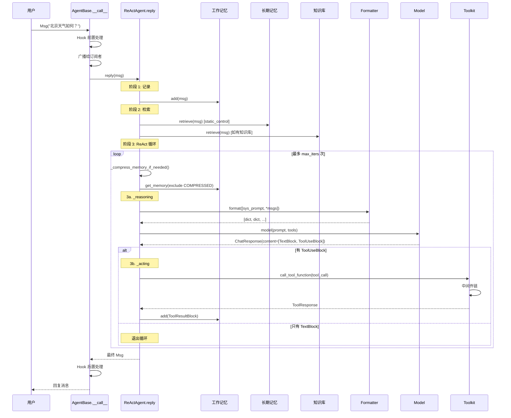

---

title: 旅程复盘
abbrlink: 9c5ca021
date: 2026-05-18 18:29:40
description: "本文回顾了卷一从消息诞生到ReAct循环的完整请求链，串联起Msg、Agent、工作记忆、长期记忆、格式转换、模型调用、工具执行与循环控制八大核心。同时预告卷二将拆解每个齿轮的设计原理，涵盖继承体系、元类、策略模式、中间件洋葱模型与发布-订阅通信，助读者从现象进入架构本质。"
categories:
  - 算法与数据结构
tags:
  - AgentScope
  - 源码解析
  - 多智能体系统
  - 架构全景
  - ReAct模式
---

> 恭喜你走完了卷一的全部 8 个站点！现在我们拉远视角，画一张全景图。

> **上一章：[第 11 站：循环与返回](./ch11-loop-return.md)**

## 全景图



---

## 各站回顾

| 站 | 文件 | 核心概念 | 关键代码行 |
|----|------|---------|-----------|
| **第 1 站**：消息诞生 | `message/` | `Msg` + 7 种 ContentBlock | `Msg` dataclass |
| **第 2 站**：Agent 收信 | `agent/_agent_base.py` | `__call__` → Hook → `reply` + 广播 | line 448 (`__call__`) |
| **第 3 站**：工作记忆 | `memory/_working_memory/` | `MemoryBase` 的 5 个抽象方法 | `_base.py:11`, `_in_memory:10` |
| **第 4 站**：检索与知识 | `memory/_long_term_memory/`, `rag/` | 长期记忆两种模式 + RAG | `_base.py:11`, `_knowledge_base.py:13` |
| **第 5 站**：格式转换 | `formatter/` | `FormatterBase` → 截断 → 具体实现 | `_base.py:11`, `_openai_formatter.py:168` |
| **第 6 站**：调用模型 | `model/` | `ChatModelBase` + 流式解析 | `_base.py:13`, `_openai_model.py:71` |
| **第 7 站**：执行工具 | `tool/_toolkit.py` | 注册 → JSON Schema → 调用 → 中间件 | line 117, 274, 853 |
| **第 8 站**：循环与返回 | `agent/_react_agent.py` | `reply()` 的 ReAct 循环 | line 376, 540, 657, 725 |

---

## 卷一 → 卷二 映射

卷一我们"跟着请求走"，看到了每一步做了什么。卷二我们将"拆开每个齿轮"，看为什么这样设计。

| 卷一（做了什么） | 卷二（为什么这样设计） |
|-----------------|---------------------|
| ch03: `agentscope.init()` 和目录结构 | ch13: 模块系统的命名与导入规则 |
| ch04: Msg 和 ContentBlock | — （已在本卷深入讲解） |
| ch05: AgentBase 和 Hook | ch14: 继承体系（StateModule → AgentBase） |
| ch05: Hook 系统 | ch15: 元类与 Hook 的实现细节 |
| ch06: 工作记忆 | ch14: MemoryBase 的继承设计 |
| ch08: Formatter 继承链 | ch16: 策略模式与 Formatter 多态 |
| ch07: 知识库和 Embedding | ch17: 工厂与 Schema（知识库与向量化检索） |
| ch10: Toolkit 中间件 | ch18: 中间件与洋葱模型 |
| ch05: 广播机制 | ch19: 发布-订阅（多 Agent 通信） |
| ch05/ch06: `StateModule` 与序列化 | ch14: 继承体系（StateModule → AgentBase → MemoryBase） |

### 映射详解

上面这张表每行代表一条"从现象到原理"的线索：

- **ch03 → ch13**：我们在 ch03 看到 `agentscope.init()` 会扫描 `src/agentscope/` 下所有模块并注册。ch13 将解释为什么采用"命名约定 + 自动注册"而非手动 `import` 的模块组织方式。
- **ch05 → ch14**：我们在 ch05 看到 `AgentBase(StateModule)` 和 `MemoryBase(StateModule)` 都继承自 `StateModule`。ch14 将展开完整的继承树，解释为什么序列化能力放在 `StateModule` 而不是每个子类单独实现。
- **ch05 → ch15**：我们在 ch05 看到 `@_AgentMeta` 元类自动收集 Hook 方法。ch15 将解释元类的 `__init_subclass__` 机制如何实现"零代码"的 Hook 注册。
- **ch08 → ch16**：我们在 ch08 看到三个 Formatter 子类共享同一个 `format()` 接口。ch16 将解释这是策略模式（Strategy Pattern）的典型应用——格式转换算法独立于调用者。
- **ch10 → ch18**：我们在 ch10 看到中间件像洋葱一样层层包裹。ch18 将展开 `_apply_middlewares` 的完整实现，解释 `functools.partial` 如何构建调用链。
- **ch05 → ch19**：我们在 ch05 看到 `__call__` 中有"广播给订阅者"的步骤。ch19 将解释发布-订阅模式如何在多 Agent 场景中实现松耦合通信。

AgentScope 官方文档的 Basic Concepts 和 Building Blocks 页面按功能模块分别介绍了 Message、Agent、Model、Memory、Tool 等核心概念。本章把它们串成一次完整的调用旅程。

AgentScope 1.0 论文的 Figure 1 展示了框架的完整架构图——从 Foundational Components（Message、Model、Memory、Tool）到 Agent Infrastructure（ReAct、Hook、Async）再到 Multi-Agent Orchestration（MsgHub、Pipeline），可以和本章的全景序列图对照阅读。

---

## 你现在能做什么

读完卷一，你已经能够：

1. **读懂源码**：打开任意模块的源码文件，能追踪代码执行路径
2. **定位 bug**：从错误信息出发，沿调用链找到问题所在
3. **修改源码**：知道在哪里加 print、改参数、调整行为
4. **理解设计**：知道 Formatter、Memory、Toolkit 各自的职责边界
5. **组合使用**：能独立配置 Model + Formatter + Toolkit + Memory，搭建自定义 Agent

### 用一句话概括每个站点

如果你需要向别人解释卷一的内容，可以这样说：

| 站 | 一句话 |
|----|-------|
| 消息诞生（ch04） | `Msg` 是 Agent 世界的"信封"，`content` 里可以装文字、图片、工具调用等 7 种内容块 |
| Agent 收信（ch05） | `__call__` 是入口：先走 Hook，再广播，最后调 `reply()`——子类只需关心 `reply` |
| 工作记忆（ch06） | `InMemoryMemory` 是一个 `list[tuple]`，按时间顺序存储对话，支持按标记过滤 |
| 检索与知识（ch07） | 长期记忆存跨对话信息，知识库存外部文档，两者都通过"检索 → 注入系统提示"增强推理 |
| 格式转换（ch08） | Formatter 把 `Msg` 翻译成 API 需要的 JSON，超出 Token 限制时自动截断旧消息 |
| 调用模型（ch09） | Model 封装 API 调用，流式模式逐 chunk 累积内容，结构化输出伪装成工具调用 |
| 执行工具（ch10） | Toolkit 注册 Python 函数为工具，中间件像洋葱一样在执行前后插入自定义逻辑 |
| 循环与返回（ch11） | ReAct 循环：推理 → 行动 → 推理 → ... 直到模型给出最终文本回答或达到上限 |

---

## 易混淆点

读完卷一，有几个概念容易搞混。这里集中澄清：

### MemoryBase vs LongTermMemoryBase

- **MemoryBase**（ch06）：工作记忆，存储当前对话的消息。核心方法：`add`、`get_memory`。
- **LongTermMemoryBase**（ch07）：长期记忆，跨对话存储。核心方法：`record`、`retrieve`、`record_to_memory`、`retrieve_from_memory`。

它们是完全独立的两个类，没有继承关系。ReActAgent 同时持有 `self.memory`（工作记忆）和 `self.long_term_memory`（长期记忆）。

### Formatter.format() vs Toolkit 中间件的 _apply_middlewares

两者都涉及"包装"，但层次不同：
- **Formatter.format()**：把 `Msg` 列表翻译成 API 格式的字典列表——是数据格式转换
- **中间件**：在工具函数执行前后插入逻辑（日志、缓存、限流）——是行为增强

### Hook（ch05）vs 中间件（ch10）

- **Hook**：作用在 Agent 层面，拦截 `reply()` 调用（前置/后置处理）。用元类自动收集。
- **中间件**：作用在工具层面，拦截 `call_tool_function()` 调用。用 `register_middleware()` 手动注册。

Hook 管的是"Agent 的行为"，中间件管的是"工具的行为"。

### _reasoning 中的 format vs __call__ 中的 format

- `_reasoning` 调用 `self.formatter.format([sys_prompt, *msgs])`——把消息格式化为 API 请求
- `TruncatedFormatterBase.format()` 内部先 `deepcopy(msgs)`，然后循环"格式化 → 计数 → 截断"

所以每次 `_reasoning` 调用 `formatter.format()` 时，原始消息不会被修改。这个深拷贝是必要的——截断过程会删减消息，不应该影响工作记忆中的原始数据。

---

## 叙事转折

卷一像一场旅行——我们跟着请求从头走到尾。现在你已经知道每个站点在做什么了。

但有些问题卷一没有回答：

- **为什么**消息是 `Msg` 而不是普通的字典？为什么 ContentBlock 是 TypedDict？
- **为什么** Hook 用元类实现而不是装饰器？
- **为什么** Formatter 独立于 Model？
- **为什么**不用 `@tool` 装饰器注册工具？
- **为什么**长期记忆有 `static_control` 和 `agent_control` 两种模式？

这些"为什么"的答案在卷二和卷四。卷二拆解设计模式，卷四讨论设计权衡。

但在进入"为什么"之前，卷二还有一件事要做：**拆开每个齿轮看设计模式**。如果你能看懂继承体系、元类 Hook、策略模式、中间件洋葱模型的实现——那就真正理解了框架的设计。而学会"造新齿轮"（添加新的 Tool、Model、Memory）则是卷三的任务。

---

## 全卷知识自测

**10 道题，检验你对卷一的理解：**

1. `Msg` 对象的 `content` 字段可以包含哪些类型？列出至少 4 种。

2. `AgentBase.__call__` 方法中，`_wrap_with_hooks` 包装的是哪个方法？执行顺序是什么？

3. `InMemoryMemory` 的内部存储结构是什么类型？（提示：`list[tuple[...]]`）

4. `FormatterBase.format()` 的输入和输出分别是什么类型？

5. ReAct 循环的三种退出条件是什么？

6. `static_control` 和 `agent_control` 两种长期记忆模式的区别是什么？哪种把记忆方法注册为工具？

7. 流式响应中，`_parse_openai_stream_response` 用了哪些变量来累积增量内容？（提示：`text`、`thinking`、`tool_calls`...）

8. `preset_kwargs` 在工具执行中的作用是什么？为什么不让模型看到这些参数？

9. 中间件的"洋葱模型"中，最后注册的中间件是最内层还是最外层？（提示：看 `_apply_middlewares` 中 `reversed(middlewares)` 的用法）

10. `_compress_memory_if_needed` 的压缩策略是什么？哪些消息不会被压缩？

---

## 源码验证小技巧

在读源码的过程中，你可以用几个简单的命令快速验证书中的引用：

```bash
# 验证类是否存在，以及它的继承关系
grep -n "class.*AgentBase" src/agentscope/agent/_agent_base.py

# 查找某个方法在哪个文件、哪一行
grep -rn "def format" src/agentscope/formatter/

# 追踪一个调用链：从 Agent 调用到 Model
grep -n "await self.model" src/agentscope/agent/_react_agent.py

# 查看类的所有方法
grep -n "    def " src/agentscope/tool/_toolkit.py
```

这些命令不需要安装任何额外工具，只用 `grep`。当你不确定书中引用的行号是否还准确时（源码可能更新了），用 `grep` 搜索方法名比记住行号更可靠。

---

## 下一卷预告

卷二"拆开每个齿轮"，我们将不再跟随一次请求，而是**横向**打开框架的设计模式：

- **ch13 模块系统**：`agentscope.init()` 是怎么自动发现和注册所有模块的？命名约定起了什么作用？
- **ch14 继承体系**：`StateModule → AgentBase → ReActAgent` 和 `StateModule → MemoryBase → InMemoryMemory` 这两棵继承树是怎么设计的？
- **ch15 元类与 Hook**：`_AgentMeta` 元类如何在不写任何注册代码的情况下自动收集 Hook？
- **ch16 策略模式**：Formatter 的多态设计——为什么不同的模型 API 可以共享同一个调用逻辑？
- **ch17 工厂与 Schema**：`_parse_tool_function` 如何从 Python 函数签名和 docstring 自动生成 JSON Schema——新增一个工具需要写几行描述？
- **ch18 中间件**：`_apply_middlewares` 如何用 `functools.partial` 构建洋葱链？
- **ch19 发布-订阅**：多 Agent 场景下，`MsgHub` 如何实现广播和路由？
- **ch20 可观测性**：`@trace_llm`、`@trace_format` 等装饰器如何实现无侵入的 OpenTelemetry 追踪？

每个问题都是一个设计模式的实战案例。准备好了吗？让我们开始卷二。

> **下一章：[第 13 章 模块系统](../volume-2-patterns/ch13-module-system.md)**
