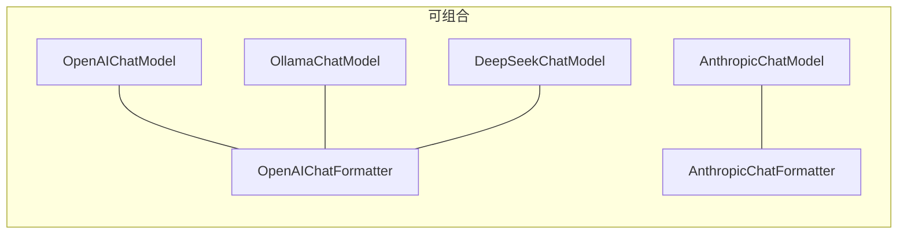

---

title: 第 16 章：策略模式——Formatter 的多态分发
abbrlink: 265e5952
date: 2024-03-15 00:00:00
description: "AgentScope 利用策略模式将 API 格式转换（Formatter）与模型调用（Model）解耦，ReActAgent 只依赖抽象接口，切换 OpenAI 或 Anthropic 等提供商无需改动 Agent。模板方法模式在 TruncatedFormatterBase 中定义格式化骨架与消息分组，让工具调用、系统提示等 JSON 结构差异对上层完全透明，实现格式与调用的正交组合。"
categories:
  - 算法与数据结构
tags:
  - 策略模式
  - AgentScope
  - Formatter
  - 模板方法模式
  - 多模型API
---

> **难度**：中等
>
> 你把 Formatter 从 `OpenAIChatFormatter` 换成 `AnthropicChatFormatter`，Agent 的行为完全不变——只是发送给 API 的 JSON 格式变了。这是怎么做到的？

> **上一章：[第 15 章 元类与 Hook](/posts/1fd0933e/)**

## 知识补全：策略模式

**策略模式（Strategy Pattern）** 的核心思想：定义一个统一接口，不同的实现提供不同的策略，使用者在运行时选择策略。

```
              ┌──────────────┐
              │ FormatterBase │  ← 统一接口
              │  format()    │
              └──────┬───────┘
                     │
        ┌────────────┼────────────┐
        ▼            ▼            ▼
  OpenAI格式    Anthropic格式   Gemini格式
```

调用者只依赖 `FormatterBase`，不关心具体是哪种格式。

AgentScope 官方文档的 Building Blocks > Models 页面展示了不同模型提供商的使用方法——OpenAI、Anthropic、DashScope、Gemini、Ollama 等。每种模型可以搭配对应的 Formatter，实现格式转换与 API 通信的分离。同一个 Model 可以搭配不同的 Formatter，这就是策略模式的威力——算法（格式化）与使用者（Model）解耦。

---

## 策略在 AgentScope 中的体现

Formatter 是最典型的策略模式：

| 类 | 策略（API 格式） |
|----|----------------|
| `OpenAIChatFormatter` | OpenAI Chat Completions API 格式 |
| `AnthropicChatFormatter` | Anthropic Messages API 格式 |
| `DashScopeChatFormatter` | 阿里云通义千问 API 格式 |
| `GeminiChatFormatter` | Google Gemini API 格式 |
| `OllamaChatFormatter` | Ollama 本地模型 API 格式 |

它们都继承自 `FormatterBase`（`_formatter_base.py:11`），实现了同一个 `format()` 方法。

### ReActAgent 如何使用 Formatter

```python
# _react_agent.py 中 _reasoning 方法
prompt = await self.formatter.format(msgs)  # 只调用接口，不关心具体格式
res = await self.model(prompt, tools=self.toolkit.get_json_schemas())
```

Agent 不写 `if isinstance(self.formatter, OpenAIChatFormatter)`——它只调用 `format()`，由具体子类决定输出格式。

### 另一个策略模式：Model

`ChatModelBase` 也是策略模式：

```python
# _model_base.py:13
class ChatModelBase:
    @abstractmethod
    async def __call__(self, messages, tools=None, ...) -> ChatResponse | AsyncGenerator:
```

不同的模型实现（OpenAI、Anthropic、DashScope……）提供不同的"调用策略"。

---

## 为什么要分离 Formatter 和 Model？

如果不用策略模式，每添加一个新模型 API，就要写一个新的 Model 类，里面包含格式转换逻辑。分离后：

- **添加新 API 格式**：只需写一个新的 Formatter
- **添加新模型提供者**：只需写一个新的 Model
- **组合自由**：Ollama 兼容 OpenAI API → `OllamaChatModel` + `OpenAIChatFormatter`



> **设计一瞥**：Formatter 和 Model 的分离是一种"正交分解"——把"格式转换"和"API 调用"作为两个独立的维度。每个维度独立变化，组合时不需要 1:1 绑定。
> 详见卷四第 35 章。

---

## TruncatedFormatterBase：模板方法模式

`TruncatedFormatterBase`（`_truncated_formatter_base.py:19`）使用了另一种设计模式——**模板方法**：

```python
class TruncatedFormatterBase(FormatterBase, ABC):
    async def format(self, msgs, **kwargs):
        while True:
            formatted = await self._format(msgs)     # 子类实现
            n_tokens = await self._count(formatted)
            if n_tokens <= self.max_tokens:
                return formatted
            msgs = self._truncate(msgs)               # 子类实现
```

`format()` 是**模板方法**——它定义了算法骨架（格式化 → 计数 → 截断），但把具体步骤留给子类。`_format()` 和 `_truncate()` 由 `OpenAIChatFormatter` 等具体类实现。

> **设计一瞥**：策略模式解决"用什么算法"的问题，模板方法解决"算法骨架是什么"的问题。
> `TruncatedFormatterBase` 同时使用了两者——对外是策略（可以被替换），对内是模板（定义了格式化流程的骨架）。
> 这是 AgentScope 中两个模式协作的典型案例。

### 模板方法中的消息分组

`_format` 方法（第 85 行）内部调用 `_group_messages` 把消息分成两类：

```python
# _truncated_formatter_base.py:231
async def _group_messages(msgs):
    """把消息分为 tool_sequence 和 agent_message 两组"""
```

为什么需要分组？因为多 Agent 场景中，不同 Agent 的消息交织在一起。工具调用/结果必须连续出现（API 要求），所以需要识别并分组：

- **`tool_sequence`**：包含 `ToolUseBlock` 或 `ToolResultBlock` 的消息序列
- **`agent_message`**：纯文本消息

分组后，每组用不同的格式化策略处理——这就是 `_format_tool_sequence` 和 `_format_agent_message` 两个抽象方法的由来。

---

## Provider 格式差异：代码级对比

策略模式的核心价值在于"同一接口，不同实现"。我们用 OpenAI 和 Anthropic 的实际代码对比来展示差异有多具体。

### 系统提示的处理

**OpenAI**（`_openai_formatter.py`）：系统提示作为一条普通消息

```python
# OpenAI: 系统提示是 messages 列表中的第一条
{"role": "system", "content": "你是天气助手。"}
```

**Anthropic**（`_anthropic_formatter.py:123`）：系统提示从 messages 中分离

```python
# Anthropic: 系统提示是请求的独立字段
{
    "system": "你是天气助手。",
    "messages": [...]  # 不包含系统消息
}
```

### 工具结果的角色

**OpenAI**：工具结果用 `tool` 角色

```python
{"role": "tool", "tool_call_id": "call_123", "content": "北京：晴，25°C"}
```

**Anthropic**：工具结果用 `user` 角色，包含 `tool_result` 内容块

```python
{"role": "user", "content": [
    {"type": "tool_result", "tool_use_id": "call_123", "content": "北京：晴，25°C"}
]}
```

### 工具调用的格式

**OpenAI**：工具调用嵌套在 `tool_calls` 数组中

```python
{"role": "assistant", "tool_calls": [
    {"id": "call_123", "type": "function", "function": {"name": "get_weather", "arguments": "{...}"}}
]}
```

**Anthropic**：工具调用是 `content` 数组中的 `tool_use` 块

```python
{"role": "assistant", "content": [
    {"type": "text", "text": "让我查一下。"},
    {"type": "tool_use", "id": "call_123", "name": "get_weather", "input": {...}}
]}
```

这就是为什么每种 Provider 需要自己的 Formatter——虽然概念一样，但 JSON 结构差异很大。策略模式让 `ReActAgent` 完全不关心这些差异。

---

## 调试实践：对比不同 Formatter 的输出

这个练习不需要 API key。

**目标**：亲眼看到策略模式如何把相同的消息转换成不同的 JSON。

**步骤**：

1. 创建测试脚本 `test_strategy.py`：

```python
import asyncio
import json
from agentscope.message import Msg, TextBlock, ToolUseBlock, ToolResultBlock
from agentscope.formatter import OpenAIChatFormatter

async def main():
    formatter = OpenAIChatFormatter()

    msgs = [
        Msg("system", "你是天气助手。", "system"),
        Msg("user", "北京天气如何？", "user"),
        Msg("assistant", [
            TextBlock(type="text", text="查一下"),
            ToolUseBlock(type="tool_use", id="c1", name="get_weather", input={"city": "北京"}),
        ], "assistant"),
        Msg("system", [
            ToolResultBlock(type="tool_result", tool_use_id="c1", output="北京：晴，25°C"),
        ], "system"),
    ]

    result = await formatter.format(msgs)
    print("=== OpenAI Formatter 输出 ===")
    for msg in result:
        print(json.dumps(msg, ensure_ascii=False, indent=2))
        print("---")

asyncio.run(main())
```

2. 运行并观察输出

3. **进阶**：在 `src/agentscope/formatter/_truncated_formatter_base.py` 的 `_group_messages` 中加 print：

```python
async def _group_messages(msgs):
    for msg in msgs:
        has_tool = msg.has_content_blocks("tool_use") or msg.has_content_blocks("tool_result")
        print(f"[DEBUG] {msg.name}: {'tool_sequence' if has_tool else 'agent_message'}")
```

4. 再运行一次，观察消息分组过程

**完成后清理：**

```bash
rm test_strategy.py
git checkout src/agentscope/formatter/
```

---

## 试一试：查看不同的格式化输出

**步骤**：

1. 搜索 Formatter 的所有实现：

```bash
grep -n "class.*Formatter.*TruncatedFormatterBase" src/agentscope/formatter/*.py
```

2. 对比 `OpenAIChatFormatter._format()` 和 `AnthropicChatFormatter._format()` 的不同——特别注意系统提示的处理方式（OpenAI 用 `{"role": "system"}` 消息，Anthropic 用单独的 `system` 参数）。

---

## 检查点

- **策略模式**：统一接口 + 多种实现，运行时选择
- Formatter 和 Model 的分离是正交分解，允许自由组合
- **模板方法**：`TruncatedFormatterBase.format()` 定义算法骨架，子类填充细节
- `_group_messages` 把消息分为 `tool_sequence` 和 `agent_message` 两组，分别格式化
- Provider 差异集中在系统提示、工具调用、工具结果三个方面的 JSON 格式不同

**自检练习**：

1. 如果 OpenAI API 改变了工具调用的 JSON 格式，你需要修改哪些文件？ReActAgent 需要修改吗？
2. 为什么 `_group_messages` 返回 `AsyncGenerator` 而不是 `list`？（提示：考虑性能）
3. Anthropic 为什么把工具结果放在 `user` 角色而不是 `tool` 角色？这对 Formatter 的实现有什么影响？

---

## 下一章预告

Formatter 把 `Msg` 转成 API 需要的 JSON。但工具的 JSON Schema 是怎么从 Python 函数的 docstring 和类型标注自动生成的？那个"自动生成"的过程涉及 `inspect` 模块、docstring 解析和 Pydantic 模型转换。下一章我们看工厂与 Schema。

> **下一章：[第 17 章 工厂与 Schema](/posts/8e2afebe/)**
