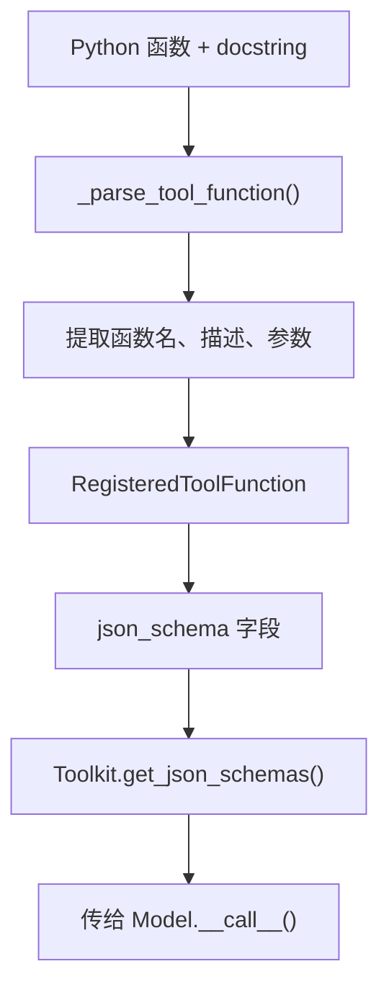

> **难度**：中等
>
> 你写了一个 Python 函数 `get_weather(city: str)`，加了 docstring。AgentScope 怎么从这个函数自动生成 OpenAI 需要的 JSON Schema？这个过程涉及哪些文件？

> **上一章：[第 16 章 策略模式](/posts/265e5952/)**

## 知识补全：JSON Schema 与 Pydantic

**JSON Schema** 是一种描述 JSON 数据格式的规范。OpenAI 的工具调用 API 要求每个工具用 JSON Schema 描述参数：

```json
{
  "type": "function",
  "function": {
    "name": "get_weather",
    "description": "获取天气信息",
    "parameters": {
      "type": "object",
      "properties": {
        "city": {"type": "string", "description": "城市名称"}
      },
      "required": ["city"]
    }
  }
}
```

**Pydantic** 是 Python 的数据验证库。AgentScope 用 Pydantic 的 `BaseModel` 来动态扩展工具的 JSON Schema——在运行时给工具添加参数。

---

## Schema 生成的完整路径



### _parse_tool_function

打开 `src/agentscope/_utils/_common.py`：

```bash
grep -n "_parse_tool_function" src/agentscope/_utils/_common.py
# 339: def _parse_tool_function
```

这个函数（第 339 行）把 Python 函数转换成 JSON Schema。它分四步工作：

**第一步：解析 docstring**

```python
# _common.py:362
docstring = parse(tool_func.__doc__)
params_docstring = {_.arg_name: _.description for _ in docstring.params}
```

使用 `docstring_parser` 库解析 Google 风格的 docstring。把 `Args:` 部分的参数描述提取成字典。

**第二步：提取函数描述**

```python
# _common.py:366-373
descriptions = []
if docstring.short_description:
    descriptions.append(docstring.short_description)
if include_long_description and docstring.long_description:
    descriptions.append(docstring.long_description)
func_description = "\n".join(descriptions)
```

**第三步：遍历函数参数，构建 Pydantic 字段**

这是核心步骤。`inspect.signature(func)` 获取函数签名，然后对每个参数：

```python
# _common.py:421-432（简化）
for name, param in inspect.signature(tool_func).parameters.items():
    if name in ["self", "cls"]:
        continue   # 跳过 self/cls

    # 类型标注：有就用，没有就 Any
    annotation = param.annotation if param.annotation != empty else Any

    # 默认值：没有默认值用 ...（表示必需），有就用
    default = ... if param.default == empty else param.default

    # 描述：从 docstring 提取
    description = params_docstring.get(name, None)

    fields[name] = (annotation, Field(description=description, default=default))
```

特殊处理 `*args`（`VAR_POSITIONAL`）和 `**kwargs`（`VAR_KEYWORD`），它们分别转为 `list` 和 `dict` 类型。

**第四步：用 Pydantic 动态生成 JSON Schema**

```python
# _common.py:434-439
base_model = create_model("_StructuredOutputDynamicClass", **fields)
params_json_schema = base_model.model_json_schema()
```

`create_model` 是 Pydantic 的工厂函数——在运行时动态创建一个 `BaseModel` 类。然后 `model_json_schema()` 把它转换成标准的 JSON Schema。

这个四步过程就是一个**工厂模式**——输入是 Python 函数，输出是 JSON Schema。工厂内部使用 Pydantic 作为中间表示。

### _create_tool_from_base_model

这个函数（第 266 行）做"反向"的工作——把 Pydantic `BaseModel` 转成工具定义：

```python
# _common.py:310-322
def _create_tool_from_base_model(structured_model, tool_name="generate_structured_output"):
    schema = structured_model.model_json_schema()
    _remove_title_field(schema)

    return {
        "type": "function",
        "function": {
            "name": tool_name,
            "description": "Generate the required structured output",
            "parameters": schema,
        },
    }
```

它和 `_parse_tool_function` 的区别：前者从 **Python 函数** → JSON Schema，后者从 **Pydantic 类** → JSON Schema。两者殊途同归，最终都产出 OpenAI 格式的工具定义。

### register_tool_function 中的组装

回到 `_toolkit.py:274`：

```python
def register_tool_function(self, tool_func, ...):
    # 解析函数
    parsed = _parse_tool_function(tool_func, ...)

    # 创建 RegisteredToolFunction
    registered = RegisteredToolFunction(
        name=parsed.name,
        json_schema=parsed.schema,
        original_func=tool_func,
        ...
    )
    self.tools[parsed.name] = registered
```

---

## 动态 Schema 扩展

`RegisteredToolFunction` 有一个 `extended_model` 字段（`_types.py:45`）：

```python
extended_model: Type[BaseModel] | None = None
```

这允许运行时用 Pydantic 模型扩展工具的 JSON Schema。比如，结构化输出功能就在这里插入额外的参数。

`Toolkit.set_extended_model()` 方法把 Pydantic 模型合并到工具的 JSON Schema 中——这样模型在调用工具时必须按扩展后的格式返回数据。

> **设计一瞥**：为什么用 Pydantic 的 `create_model` 做中间层，而不直接写 JSON Schema？
> 直接写 JSON Schema 也能工作，但 `create_model` 提供了类型验证——如果你写了一个 `int` 类型的参数但 docstring 描述了 `str`，Pydantic 会在生成 Schema 时就报错。
> 此外，`model_json_schema()` 会处理嵌套类型、Optional、Union 等复杂情况——手写 JSON Schema 很容易在这些地方出错。
> 代价：引入了 Pydantic 依赖。但 AgentScope 已经在结构化输出中使用 Pydantic，所以这个依赖不是新增的。

AgentScope 官方文档的 Building Blocks > Tool Capabilities 页面展示了"Extending JSON Schema Dynamically"的使用方法——通过 `Toolkit` 的扩展 API 动态修改工具的参数描述。本章解释了 `_parse_tool_function` 如何从 docstring 提取参数信息并自动生成 JSON Schema。

在实际项目中，自动 JSON Schema 生成的常见应用包括：
- 搜索工具：参数 `query: str` + `max_results: int`，从 docstring 自动提取参数说明
- 数据库查询工具：参数 `sql: str`，自动生成描述"要执行的 SQL 查询语句"
- 文件处理工具：参数 `file_path: str` + `encoding: str = "utf-8"`，自动识别可选参数和默认值

---

## 试一试：查看自动生成的 Schema

**步骤**：

1. 在 Python 中运行：

```python
from agentscope.tool import Toolkit, ToolResponse

def get_weather(city: str, unit: str = "celsius") -> ToolResponse:
    """获取天气信息。

    Args:
        city (str): 城市名称
        unit (str, optional): 温度单位，celsius 或 fahrenheit
    """
    return ToolResponse(content=[])

toolkit = Toolkit()
toolkit.register_tool_function(get_weather)

import json
for name, func in toolkit.tools.items():
    print(json.dumps(func.json_schema, ensure_ascii=False, indent=2))
```

2. 观察输出：`city` 是 required，`unit` 有默认值不是 required。docstring 中的描述被提取到了 schema 中。

---

## 调试实践：追踪 Schema 生成过程

**目标**：看到 `_parse_tool_function` 如何逐步从函数提取信息。

**步骤**：

1. 在 `src/agentscope/_utils/_common.py` 的 `_parse_tool_function` 函数（第 362 行后）加 print：

```python
docstring = parse(tool_func.__doc__)
params_docstring = {_.arg_name: _.description for _ in docstring.params}

print(f"[DEBUG] 函数: {tool_func.__name__}")
print(f"[DEBUG] 短描述: {docstring.short_description}")
print(f"[DEBUG] 参数文档: {params_docstring}")

# 在遍历参数时加 print
for name, param in inspect.signature(tool_func).parameters.items():
    if name in ["self", "cls"]:
        continue
    print(f"[DEBUG] 参数: {name}, 类型={param.annotation}, 默认值={param.default}")
```

2. 运行上面的 test 脚本，观察从函数签名中提取了哪些信息。

3. **进阶**：试试给函数添加复杂类型标注，看 Schema 如何变化：

```python
from typing import Optional
def search(query: str, max_results: Optional[int] = None) -> ToolResponse:
    """搜索文档。

    Args:
        query (str): 搜索关键词
        max_results (int, optional): 最大返回数量
    """
    return ToolResponse(content=[])

toolkit.register_tool_function(search)
# 观察：max_results 变成了 optional 参数
```

**完成后清理：**

```bash
git checkout src/agentscope/_utils/
```

---

## 检查点

- `_parse_tool_function()` 从函数签名和 docstring 自动生成 JSON Schema
- `RegisteredToolFunction` 存储工具的完整信息（名称、Schema、原始函数、分组）
- `extended_model` 允许用 Pydantic 模型动态扩展 Schema（用于结构化输出）
- `_create_tool_from_base_model` 把 Pydantic 类转成工具定义——和 `_parse_tool_function` 殊途同归
- Pydantic 的 `create_model` 作为中间层提供类型验证

**自检练习**：

1. 如果函数参数没有类型标注（`def foo(x)` 而非 `def foo(x: str)`），JSON Schema 中 `x` 的类型会是什么？
2. `_remove_title_field` 为什么需要被调用？如果不去掉 title 字段会怎样？
3. `create_model("_StructuredOutputDynamicClass", **fields)` 中的类名为什么用下划线开头？

> **参考答案**：
>
> 1. 类型会是 `Any`。当 `param.annotation == inspect.Parameter.empty` 时，字段类型被设为 `Any`，Pydantic 生成的 JSON Schema 中不会包含 `"type"` 约束——参数接受任意 JSON 值。这意味着模型不知道该传什么类型的值，可能导致调用不准确。
> 2. Pydantic 的 `model_json_schema()` 会自动在每个节点加上 `"title"` 字段（如 `"title": "_StructuredOutputDynamicClass"` 或 `"title": "MyParameter"`）。这些是内部标识，对 LLM 没有意义甚至会误导——模型可能把 title 当作指令或约束。`_remove_title_field` 递归清理所有 title，确保传给模型的 Schema 干净且只包含有用信息。
> 3. 下划线开头表示这是**内部动态创建的临时类**，不是用户应直接引用的公共 API。`create_model` 需要一个类名来创建 Pydantic 模型，但这个类只用于生成 JSON Schema，不需要被外部代码访问。下划线前缀符合项目"内部实现用 `_` 前缀"的命名约定。

---

## 下一章预告

Schema 生成是静态的——定义时确定，运行时不变。但工具执行时可能需要插入额外逻辑：日志记录、权限检查、缓存命中。这些逻辑不能写进工具函数本身（否则每个工具都要重复写），也不能写进 `call_tool_function`（否则每加一种逻辑就要改源码）。下一章我们看**中间件的洋葱模型**如何优雅地解决这个问题。

> **下一章：[第 18 章 中间件与洋葱模型](/posts/988470df/)**
