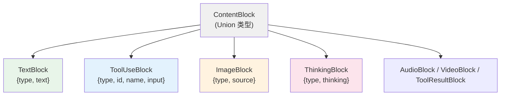

---


title: 第 33 章：为什么 ContentBlock 是 TypedDict Union
abbrlink: f560b5ba
date: 2024-04-01 00:00:00
categories:
  - 算法与数据结构
tags:
  - Python
  - TypedDict
  - 架构决策
  - 序列化
  - AgentScope
description: "AgentScope 采用 TypedDict 定义 ContentBlock，放弃 OOP 继承和 dataclass，因其本质是数据而非行为。TypedDict 既是字典又带类型提示，零序列化成本，与 OpenAI 等 API 返回的 JSON 直接兼容，无需额外转换，并通过 Required 实现精细字段控制。代价是无共享基类和缺失内置方法，但换来了轻量、类型安全和高性能。"
---

> **难度**：进阶
>
> `TextBlock`、`ToolUseBlock`、`ImageBlock`……这些 ContentBlock 都是 `TypedDict`，没有共同基类，没有方法。为什么不用 OOP 继承？为什么不用 dataclass？

> **上一章：[第 32 章 编译期 Hook vs 运行时 Hook](/posts/3630c5b9/)**

## 决策回顾

打开 `src/agentscope/message/_message_block.py`：

```python
# _message_block.py:9-94
class TextBlock(TypedDict, total=False):
    type: Literal["text"]
    text: str

class ThinkingBlock(TypedDict, total=False):
    type: Literal["thinking"]
    thinking: str

class ToolUseBlock(TypedDict, total=False):
    type: Literal["tool_use"]
    id: str
    name: str
    input: dict

class ImageBlock(TypedDict, total=False):
    type: Literal["image"]
    source: dict

# ... 还有 AudioBlock, VideoBlock, ToolResultBlock

ContentBlock = TextBlock | ThinkingBlock | ToolUseBlock | ImageBlock | ...
```

7 种 Block，全部是 `TypedDict`。它们唯一的共同点是 `type` 字段。

---

## 被否方案一：OOP 继承

**方案**：用抽象基类 + 子类：

```python
from abc import ABC, abstractmethod

class ContentBlockBase(ABC):
    @abstractmethod
    def to_dict(self) -> dict: ...

    @abstractmethod
    def get_type(self) -> str: ...

class TextBlock(ContentBlockBase):
    def __init__(self, text: str):
        self.text = text

    def to_dict(self) -> dict:
        return {"type": "text", "text": self.text}

    def get_type(self) -> str:
        return "text"
```

**问题**：

1. **创建开销大**：每个 Block 都需要 `TextBlock(text="hello")` 实例化
2. **序列化多余**：已经有 `dict` 了，为什么要先创建对象再 `.to_dict()`？
3. **与 API 不兼容**：OpenAI / Anthropic 的 API 直接返回 JSON dict，不需要再包装成对象

关键洞察：ContentBlock 的本质是**数据**，不是**行为**。它们不需要方法，只需要字段。

---

## 被否方案二：dataclass

**方案**：用 Python 标准库的 `dataclass`：

```python
from dataclasses import dataclass

@dataclass
class TextBlock:
    type: str = "text"
    text: str = ""
```

**问题**：

1. **不是 dict**：OpenAI API 返回的是 `{"type": "text", "text": "hello"}`，不是 `TextBlock` 对象
2. **需要转换**：`json.loads()` 返回 dict → 需要手动创建 dataclass → 传给 Formatter 时又需要 `.to_dict()`
3. **JSON 序列化需要额外工作**：`json.dumps(dataclass_obj)` 不直接工作

---

## AgentScope 的选择：TypedDict

`TypedDict` 的核心优势：**它既是 dict 又有类型提示**。

```python
# 创建——和普通 dict 一样
block = TextBlock(type="text", text="你好")  # 实际上就是 dict

# 类型检查——mypy/pyright 可以检查字段
def process(block: TextBlock):
    print(block["text"])  # 类型安全
    print(block["foo"])   # mypy 报错：未知字段

# 序列化——不需要 .to_dict()，它就是 dict
import json
json.dumps(block)  # 直接序列化

# 与 API 响应兼容——API 返回的 dict 直接就是 TextBlock
response = {"type": "text", "text": "你好"}
# 不需要转换！
```

### Union 类型的匹配

不同 Block 通过 `type` 字段区分，配合 Union 类型使用：

```python
def handle_block(block: ContentBlock):
    match block.get("type"):
        case "text":
            print(block["text"])         # 类型检查器知道这是 TextBlock
        case "tool_use":
            print(block["name"])         # 类型检查器知道这是 ToolUseBlock
```



---

## 后果分析

### 好处

1. **零序列化成本**：TypedDict 就是 dict，不需要 `.to_dict()` / `.from_dict()`
2. **API 兼容**：直接使用 OpenAI/Anthropic 返回的 JSON dict
3. **类型安全**：mypy 可以检查字段名和类型
4. **轻量**：没有对象创建开销

### 麻烦

1. **无共享基类**：不能 `isinstance(block, ContentBlockBase)`，只能检查 `block.get("type")`
2. **无行为**：不能给 Block 添加方法（如 `block.is_text()`）
3. **IDE 补全较差**：TypedDict 的字段补全不如 dataclass 友好

> **修正**：上文的 `total=False` 说法不够准确。实际源码中，关键字段使用了 `Required[...]` 标记覆盖 `total=False`——例如 `ToolUseBlock` 的 `id`、`name`、`input` 都是 `Required`，类型检查器会要求这些字段存在。`total=False` 只影响未标记 `Required` 的可选字段（如 `raw_input`）。这是 `TypedDict` 在 Python 3.11+ 提供的精细化控制。

---

## 横向对比

| 框架 | 消息块类型 | 优点 | 缺点 |
|------|-----------|------|------|
| **AgentScope** | TypedDict Union | 零序列化成本 | 无共享行为 |
| **LangChain** | dataclass / Pydantic | 有方法、有验证 | 需要转换 |
| **AutoGen** | dict | 极简 | 无类型安全 |
| **OpenAI SDK** | dataclass-like | API 原生 | 框架锁定 |

AgentScope 官方文档的 Basic Concepts > Message 页面展示了 ContentBlock 的 7 种类型（TextBlock、ThinkingBlock、ImageBlock、AudioBlock、VideoBlock、ToolUseBlock、ToolResultBlock），并说明了 `Msg` 如何承载这些不同类型的内容。

Python 的 PEP 589 (TypedDict) 规范对这一设计的支持是：

> "A TypedDict type represents dictionary objects with a specific set of string keys, and with specific value types for each valid key."
>
> — PEP 589, "Specification"

TypedDict 直接对应 JSON dict 结构，与 OpenAI 等 API 的消息格式天然兼容——不需要额外的序列化/反序列化步骤。这是 AgentScope 选择 TypedDict 而非 dataclass 或 OOP 继承的核心原因。

---

---

## 验证性实验：体验 TypedDict Union vs OOP

**目标**：亲手感受两种设计的不同。

**步骤**：

1. 用 `TypedDict` Union 写一个消息处理器：给定 `ContentBlock`，用 `match/case` 分发处理逻辑。

2. 用 OOP 子类（每个 ContentBlock 类型一个子类）写同样的消息处理器。

3. 对比：添加一个新的 Block 类型（如 `ReflectionBlock`），在两种方案中各需要改多少行？

---

## 你的判断

1. 如果要给 ContentBlock 添加验证逻辑（如 "ToolUseBlock 必须有 id"），TypedDict 还合适吗？
2. Pydantic 的 `BaseModel` 能否兼顾 TypedDict 的零序列化优势和 dataclass 的行为能力？

---

## 下一章预告

ContentBlock 的选择是"数据优先 vs 行为优先"。接下来我们看另一个数据相关的选择——配置为什么用 `ContextVar` 而不是全局变量或线程局部存储？

> **下一章：[第 34 章 为什么用 ContextVar](/posts/91f88903/)**
