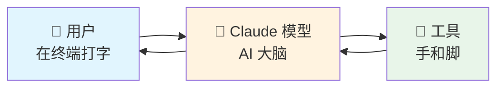
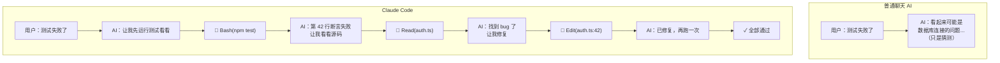
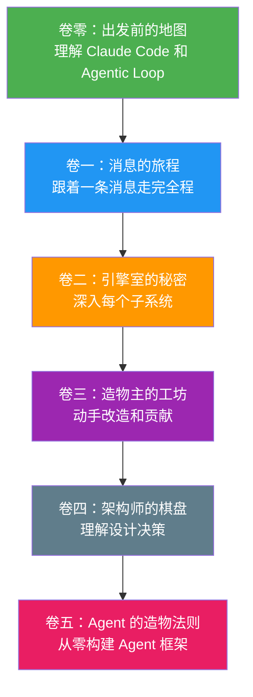

> 源码验证日期：2026-05-15，基于 commit `0d81bb6`

你刚刚在终端里输入了一行字。这行字即将展开一段旅程。

---

## 路线图


---

## 一个住在你终端里的助手

你用过各种 AI 聊天工具。打开浏览器，访问一个网站，在对话框里打字，AI 回复你。这很好用，但总有点隔阂——像是在跟一个只能通过信件交流的朋友说话。你没法让它帮你改代码、读文件、运行命令。

Claude Code 不一样。它是一个**住在你终端里的 AI 助手**。

想象一下，如果你的电脑前坐着一个真正的人，他能看到你的屏幕、能打开文件、能在终端里敲命令、能帮你写代码也能帮你改 bug。他不需要你把东西复制粘贴给他看，因为他就在你的电脑里，可以直接操作。

Claude Code 就是这个"人"。

当然，它不是一个真的人。它是一个程序——一个运行在你终端里的程序。但它的能力边界很有意思：它能读你的文件、编辑你的代码、执行 shell 命令、搜索你的项目目录。你告诉它你想做什么，它会自己判断需要读哪些文件、运行什么命令、修改哪些代码。

这不是魔法。这是工程。而这本书，就是要把这个工程拆开来给你看。

---

## 第一次运行

我们先别急着拆。先把它跑起来。

**第一步：安装。** 如果你已经装了 Node.js（或者 Bun），一行命令就够了：

```bash
npm install -g @anthropic-ai/claude-code
```

**第二步：验证安装。**

```bash
claude --version
```

如果你看到类似 `2.1.88 (Claude Code)` 的输出，说明安装好了。注意这条命令是**瞬间完成**的——这是一个精心设计的"快速路径"，我们会在第 3 章拆解它为什么这么快。

**第三步：启动，说点什么。**

```bash
cd your-project
claude
```

终端变了。光标在闪烁，等待你说话。输入：

```
帮我看看当前目录有什么文件
```

你按下回车。终端安静了一小会儿，然后文字开始一行一行地出现。它可能用 `Bash` 工具运行了 `ls`，也可能用 `Glob` 工具搜索了文件。几秒之后，它给了你回答——不只是列出了文件，还可能告诉你这个项目的结构。

你看到了输入，你看到了输出。中间发生了什么？

> **没有 API key？** 没关系。本书所有"试一试"环节都提供了无 key 替代方案——你可以直接阅读源码来理解原理。

---

## 中间的零点几秒

你按下了回车。"帮我看看当前目录有什么文件" 这几个字——或者说，这几个字节——离开了你的键盘，进入了 Claude Code 的世界。

你的消息不是直接被丢给 AI 模型的。在被发送出去之前，它要经过几道工序：

- **你的消息会被打包。** 不只是你刚说的这句话，还有之前你们聊过的所有内容，加上一些系统级的"备忘录"——比如你现在在哪个目录下、项目里有哪些文件、AI 被允许做什么。所有这些被组装成一个大包裹。
- **这个包裹会飞向远方。** 通过互联网，到达 Anthropic 的服务器。你的文字在那里被一个大型语言模型处理——这个模型就是 Claude。
- **回答会一个字一个字地飞回来。** 不是等全部生成完了再显示给你，而是像一个正在思考的人，想到一个字就写下一个字。这就是**流式响应（Streaming）**。
- **有时候，AI 会说"等一下，我要做件事"。** 它可能想读一个文件，或者运行一条命令。这时候 Claude Code 会暂停回复，先执行 AI 要求的操作，把结果再送回给 AI，然后 AI 才继续回答你。

整个过程可能只有几秒钟。但在这几秒钟里，你的消息穿越了终端界面、消息组装管线、网络请求、AI 推理、工具执行、权限检查、结果返回……一路走完了一个完整的系统。

这本书就是跟着这条消息走的。

---

## 三个组成部分

Claude Code 由三部分组成，缺一不可：



**Claude 模型**：AI 的"大脑"。它理解你的自然语言指令，分析代码，决定下一步做什么。模型本身只会"说话"——生成文本。它不能直接操作你的电脑。

**工具（Tools）**：AI 的"手和脚"。让模型能做事，而不仅仅是说话。Claude Code 内置了五类工具：

| 工具类别 | 能做什么 | 例子 |
|---------|---------|------|
| 文件操作 | 读文件、编辑代码、创建文件 | `Read`、`Edit`、`Write` |
| 搜索 | 按模式查找文件、用正则搜索内容 | `Glob`、`Grep` |
| 执行 | 运行 shell 命令、启动服务器、跑测试 | `Bash` |
| 网络 | 搜索网页、获取文档 | `WebSearch`、`WebFetch` |
| 子代理 | 派出小助手并行处理子任务 | `Agent` |

**Agentic Loop（代理循环）**：把大脑和手脚连接起来的循环。用户给一个任务 → 模型思考需要什么工具 → 调用工具 → 拿到结果 → 再思考 → 再调用 → 直到任务完成。

> **Token 是什么？** AI 模型不按"字"收费，而是按"Token"收费。一个 Token 大约是 3/4 个英文单词或半个中文字。Claude Code 的一次完整对话可能消耗几万到几十万 Token。Token 的经济学影响了很多设计决策——为什么需要缓存？为什么要压缩上下文？为什么子代理只返回摘要？后面会逐步展开。

### Claude Code vs 普通聊天 AI



关键区别：Claude Code 不猜测——它用工具**去看、去试、去改**。

---

## 源码长什么样

Claude Code 的源码是用 TypeScript 写的。现在让我们看看入口文件，先有个印象。

### 入口文件：`src/entrypoints/cli.tsx`

当你在终端输入 `claude` 时，程序从这里开始：

```typescript
// → src/entrypoints/cli.tsx
async function main(): Promise<void> {
  const args = process.argv.slice(2);

  // 快速路径：--version 直接输出，不加载任何模块
  if (args[0] === '--version' || args[0] === '-v') {
    console.log(`${MACRO.VERSION} (Claude Code)`);
    return;
  }

  // 其他路径：加载主模块
  await import('../main.tsx');
}

main();
```

注意两点：
1. **快速路径**：`--version` 直接返回，不加载任何模块——这就是为什么 `claude --version` 瞬间完成
2. **动态导入**：真正的启动逻辑在 `src/main.tsx`，只有需要时才加载

### 源码目录一览

```
src/
├── entrypoints/     # 入口（cli.tsx, main.tsx）
├── query.ts         # 核心：agentic loop
├── QueryEngine.ts   # 查询引擎
├── Tool.ts          # 工具接口
├── tools.ts         # 工具注册
├── context.ts       # system prompt 构建
├── components/      # UI 组件
├── screens/         # 主界面（REPL.tsx 等）
├── ink/             # Ink 框架（React for Terminals 自定义 fork）
├── services/        # 服务层（API、工具执行、MCP、压缩）
├── tools/           # 各工具实现（BashTool, ReadTool 等）
├── state/           # 状态管理（AppState）
├── memdir/          # 自动记忆系统
├── commands/        # 斜杠命令
├── skills/          # 技能系统
├── plugins/         # 插件系统
└── ...
```

不需要现在理解每一个——这正是后续 50 章要做的事。

---

## 为什么要读源码

这就像开车。大多数人开车，不需要知道发动机怎么工作。踩油门走，踩刹车停。够了。但如果你想自己改装车，或者出了点小毛病不想每次去修理厂——那你就需要知道引擎盖下面是什么。

源码就是程序的引擎盖。打开它，你看到的不是魔法，而是齿轮、皮带和气缸——每一样东西都有它存在的理由。

**读源码能让你成为更好的开发者。** 不只是更好地使用 Claude Code，而是理解一个真实的大型项目是怎么被设计、怎么被构建的。这种理解，能迁移到任何项目上。

---

## 这本书怎么读

这本书**跟着一条消息走**。

大多数技术书按模块组织。先讲模块 A，再讲模块 B。这很好，但你看不到模块之间怎么连起来的。这本书不一样——我们跟着你的消息一路走过去，走到哪儿讲哪儿。

这跟一本叫《网络是怎么连接的》的日本技术书用的是同一种写法。

**阅读前提**：
- 会用终端（命令行）
- 写过代码（任何语言都行）
- 不需要会 TypeScript，需要时我们会解释

---

## 旅程的地图



- **卷一**：你的消息从终端出发，被组装、发送、处理、返回。走完这卷，你能完整追踪一次请求。
- **卷二**：深入每个"站点"的内部——工具系统、权限检查、上下文管理。
- **卷三**：动手篇——修改代码、创建工具、写测试、提 PR。
- **卷四**：站在高处——为什么这样设计？如果换一种方式会怎样？
- **卷五**：从零开始——不再分析别人的代码，自己实现一套 Agent 框架。

---

## 常见错误与检查方法

| 常见错误 | 检查方法 |
|---------|---------|
| `claude: command not found` | `which claude` 确认安装路径；检查 npm global bin 是否在 `$PATH` 中 |
| API key 未配置 | 运行 `claude` 时如果提示认证，按指引设置 `ANTHROPIC_API_KEY` 环境变量 |
| Node.js 版本过低 | `node --version` 确认版本 ≥ 18；如果使用 Bun，`bun --version` |
| 首次运行权限被拒绝 | macOS 上可能需要在「系统设置 → 隐私与安全性」中允许终端访问文件 |

---

## 试试看

### 基础级（3 分钟）

```bash
claude --version    # 验证安装
which claude        # 查看安装位置
claude --help       # 查看帮助
```

### 进阶级（10 分钟）

如果你有源码访问权限：

```bash
# 查看入口文件
head -50 src/entrypoints/cli.tsx

# 搜索 agentic loop
grep -n "async function\*" src/query.ts

# 列出所有工具
ls src/tools/
```

即使没有 API key，你也可以通过阅读源码理解架构。

---

## 检查点

你现在理解了：

- **Claude Code 是什么**：一个运行在终端里的 AI 助手，能读文件、跑命令、改代码
- **三个组成部分**：Claude 模型（大脑）+ 工具（手脚）+ Agentic Loop（循环）
- **与普通聊天 AI 的区别**：Claude Code 不猜测，它用工具去看、去试、去改
- **源码入口**：`cli.tsx` → `main.tsx`，快速路径零加载的设计
- **流式响应**：为什么回复一个字一个字地出现

**下一站**：我们将深入 Agentic Loop——理解 Claude Code 怎么把"大脑"和"手脚"串起来，形成能自主完成任务的循环。

---

[下一章：什么是 Agentic Loop](/posts/4eb445bf/)
