> 源码验证日期：2026-05-15，基于 commit `0d81bb6`

你刚刚在终端里输入了 `claude`，然后按下了回车。屏幕闪烁了一下，光标出现在了提示符后面。Claude Code 启动了。

但在你打字之前，程序已经完成了一整套准备工作——它像一位匠人，在开工之前先摆好工具箱、检查每件工具、确认材料齐全。

---

## 路线图


卷零里你了解了 Claude Code 的七大组件和 Agentic Loop 的全貌。从本章开始，我们要逐站深入源码，追踪消息从按下回车到屏幕显示的完整旅程。

---

## 源码入口

本章追踪的调用链：

```
终端输入 claude
  → src/entrypoints/cli.tsx   (main 函数)
    → src/main.tsx            (cliMain 函数)
      → src/entrypoints/init.ts  (init 函数 — 初始化配置/遥测/GrowthBook)
        → src/replLauncher.tsx   (launchRepl — 启动终端 UI)
          → src/screens/REPL.tsx  (query() 在这里被调用)
```

---

## 知识补全：async/await 与 Bun feature()

### async/await

如果你已经熟悉 `async/await`，跳过本节。

```typescript
// 普通（同步）函数：调用后等待结果
function readFile(path: string): string {
  return fs.readFileSync(path, 'utf-8') // 阻塞，什么都做不了
}

// async 函数：调用后可以继续做别的事
async function readFileAsync(path: string): Promise<string> {
  return fs.promises.readFile(path, 'utf-8') // 非阻塞，等文件读完后自动继续
}

// 使用 await 等待 async 函数完成
const content = await readFileAsync('package.json')
console.log(content) // 文件已读完，可以用了
```

Claude Code 大量使用 `async/await`，因为几乎所有操作（API 调用、文件读写、工具执行）都是异步的。

### Bun feature() — 编译时消除

Claude Code 用 Bun 打包，有一个特殊能力：`feature()` 函数。

```typescript
// → src/entrypoints/cli.tsx 的 feature() 导入
import { feature } from 'bun:bundle'
```

`feature()` 在**编译时**（build time）就会被替换为 `true` 或 `false`。如果结果是 `false`，整个代码块会被**物理删除**——不是运行时跳过，而是编译后的文件里根本不存在。

```typescript
// 假设 feature('DUMP_SYSTEM_PROMPT') 在外部构建中 = false

if (feature('DUMP_SYSTEM_PROMPT')) {
  // 这段代码在外部构建的产物中根本不存在
  const prompt = await getSystemPrompt()
  console.log(prompt)
}
```

这意味着内部版本（Anthropic 员工使用的）和外部版本（npm 发布的）编译出来的代码**完全不同**。有些功能只存在于内部版本中。

> **设计一瞥**：编译时消除比运行时检查可靠得多。运行时检查可以被绕过，但编译时消除让信息从二进制层面**根本不存在**。

---

## 逐行阅读

### 3.1 cli.tsx：快速路径架构

当你在终端运行 `claude`，程序从 `src/entrypoints/cli.tsx` 开始：

```typescript
// → src/entrypoints/cli.tsx 的 main() 函数（简化版）
async function main(): Promise<void> {
  const args = process.argv.slice(2)

  // 快速路径 1：--version — 零模块加载
  if (args.length === 1 && (args[0] === '--version' || args[0] === '-v')) {
    console.log(`${MACRO.VERSION} (Claude Code)`)  // MACRO.VERSION 在编译时内联
    return
  }

  // 启动性能追踪
  const { profileCheckpoint } = await import('../utils/startupProfiler.js')
  profileCheckpoint('cli_entry')

  // 快速路径 2：--dump-system-prompt（仅内部版本）
  if (feature('DUMP_SYSTEM_PROMPT') && args[0] === '--dump-system-prompt') {
    // ...输出 system prompt 后退出
  }

  // 快速路径 3-10+：其他子命令...
  // --claude-in-chrome-mcp, --chrome-native-host, --daemon-worker 等
  // 每个都通过动态 import 按需加载
}
```

**设计原则**：每个快速路径都用 `await import(...)` 动态加载模块。只有你实际使用的功能才会被加载——这就是为什么 `claude --version` 瞬间完成，而 `claude`（完整 REPL）需要约 240ms。

`cli.tsx` 的 `main()` 函数就像一个**调度员**——它检查你的命令，然后把你路由到正确的处理程序。如果没有任何快速路径匹配，它最终会加载完整 CLI：

```typescript
// → src/entrypoints/cli.tsx 的完整 CLI 加载（简化版）
startCapturingEarlyInput()  // 在启动过程中就开始捕获按键！
const { main: cliMain } = await import('../main.js')
await cliMain()
```

注意 `startCapturingEarlyInput()`——它在 CLI 完全加载之前就开始监听键盘输入。如果你在启动时就开始打字，这些按键不会丢失。

### 3.2 main.tsx：重量级初始化

`src/main.tsx` 是 Claude Code 的"大块头"——它有超过 200 行的导入和复杂的 Commander.js 命令行解析：

```typescript
// → src/main.tsx 的导入部分
// 启动性能追踪（最先执行）
import { profileCheckpoint } from './utils/startupProfiler.js'
profileCheckpoint('main_tsx_entry')

// 并行启动 MDM 和 Keychain 预读取
import { startMdmRawRead } from './utils/settings/mdm/rawRead.js'
startMdmRawRead()  // 在 macOS 上并行启动 plutil 进程
import { startKeychainPrefetch } from './utils/secureStorage/keychainPrefetch.js'
startKeychainPrefetch()  // 并行预读取 OAuth 和 API key
```

这里有一个精彩的性能优化：`startMdmRawRead()` 和 `startKeychainPrefetch()` 在**模块加载的最开始**就触发了异步操作。当后续 200+ 行的导入（import）在加载模块时，这两个操作在后台并行执行。等所有导入完成、`main()` 函数开始运行时，MDM 配置和 Keychain 数据已经准备好了。

```mermaid
gantt
    title 启动并行化（~240ms 总计）
    dateFormat X
    axisFormat %Lms

    section 并行启动
    模块导入（~135ms）           :a1, 0, 135
    MDM 预读取（~80ms）          :a2, 0, 80
    Keychain 预读取（~65ms）     :a3, 0, 65

    section 后续步骤
    init() 初始化                :b1, 135, 200
    setup() 完整设置             :b2, 200, 240
```



### 3.3 init()：一次性初始化

`src/entrypoints/init.ts` 中的 `init()` 函数是 **memoized**（记忆化的）——只执行一次，后续调用直接返回缓存结果：

```typescript
// → src/entrypoints/init.ts 的 init() 函数
export const init = memoize(async () => {
  // 初始化配置系统
  enableConfigs()
  // 初始化遥测
  initializeTelemetry()
  // 初始化 GrowthBook（远程功能开关）
  await initializeGrowthBook()
  // 初始化代理设置
  // 初始化证书
  // ...
})
```

关键概念：**GrowthBook** 是 Anthropic 使用的远程功能开关系统。很多功能不是硬编码的，而是通过 GrowthBook 从服务器下发配置。这意味着 Anthropic 可以在不发布新版本的情况下开启/关闭功能。

### 3.4 main() 的完整流程

`main.tsx` 中导出的 `main()` 函数是完整的 CLI 初始化流程：

```typescript
// → src/main.tsx 的 main() 函数（简化版）
export async function main() {
  // Step 1: 安全检查（Windows PATH 加固等）
  // Step 2: 解析 CLI 参数（Commander.js）
  // Step 3: 处理 --print / -p 模式（单次执行后退出）
  // Step 4: 交互模式设置
  const actionHandler = async () => {
    // Step 4a: 初始化（init — memoized，只执行一次）
    await init()
    await initializeTelemetryAfterTrust()

    // Step 4b: 认证（OAuth / API key）
    // Step 4c: 获取 bootstrap 数据（模型列表、功能配置等）
    const bootstrapData = await fetchBootstrapData()

    // Step 4d: 组装工具列表
    const tools = getTools(permissionContext)

    // Step 4e: 启动 REPL（终端交互界面）
    await launchRepl(root, appProps, replProps, renderAndRun)
  }
}
```

这个流程揭示了 Claude Code 启动的完整顺序：

1. 安全检查
2. CLI 参数解析
3. 认证
4. Bootstrap（获取服务器配置）
5. 工具组装
6. REPL 启动

### 3.5 从 REPL 到 query()

当 REPL 启动后，用户输入的消息最终会调用 `query()`：

```typescript
// → src/screens/REPL.tsx 的 query() 调用（简化版）
for await (const event of query({
  messages: messagesIncludingNewMessages,
  systemPrompt,
  userContext,
  systemContext,
  canUseTool,
  toolUseContext,
  querySource: getQuerySourceForREPL()
})) {
  onQueryEvent(event)  // 处理每个流式事件（渲染到终端）
}
```

`for await...of` 语法用于消费 AsyncGenerator。`query()` 每产出一个事件（一段文字、一个工具调用、一个工具结果），REPL 就立即处理并渲染到终端。

---

## 常见错误与检查方法

| 常见错误 | 检查方法 |
|---------|---------|
| `claude` 命令找不到 | 检查 PATH 环境变量是否包含 npm 全局 bin 目录 |
| 启动很慢（>1s） | 检查 MDM/Keychain 预读取是否卡住（`profileCheckpoint` 日志） |
| GrowthBook 初始化超时 | 检查网络连接，确认 `enableConfigs()` 是否完成 |
| `--version` 不工作 | 检查 `MACRO.VERSION` 是否在编译时正确内联 |
| REPL 无法启动 | 检查 `launchRepl` 的 `renderAndRun` 回调是否正确 |

---

## 试试看

### 修改 1：观察启动路径

在 `src/entrypoints/cli.tsx` 的 `main()` 函数中，找到快速路径检查。在 `if` 语句之前加一行：

```typescript
console.log('[DEBUG] args =', args)
```

运行后你应该看到类似输出：

```
$ claude --version
[DEBUG] args = [ '--version' ]

$ claude --help
[DEBUG] args = [ '--help' ]

$ claude
[DEBUG] args = []
```

然后分别运行：

```bash
claude --version    # 看看走了哪条路径
claude --help       # 看看走了哪条路径
claude              # 看看走了哪条路径
```

### 修改 2：测量启动时间

在 `src/main.tsx` 中，`profileCheckpoint('main_tsx_entry')` 之后加：

```typescript
console.log('[DEBUG] main.tsx loaded at', Date.now())
```

然后在 `launchRepl()` 调用之前加：

```typescript
console.log('[DEBUG] about to launch REPL at', Date.now())
```

两次时间之差就是从模块加载到 REPL 启动的时间。

---

## 检查点

你现在已经理解了：

- **入口文件架构**：`cli.tsx`（快速路径调度）→ `main.tsx`（完整 CLI）
- **编译时消除**：`feature()` 让代码在编译时就被物理删除
- **并行启动优化**：MDM 和 Keychain 预读取与模块导入并行
- **memoized init()**：一次性初始化，后续调用直接返回缓存
- **启动流程**：安全检查 → CLI 解析 → 认证 → Bootstrap → 工具组装 → REPL
- **从 REPL 到 query()**：`for await...of` 消费 AsyncGenerator

**下一站预告**：第 4 章将追踪"用户按下 Enter 键"之后发生了什么——从 TextInput 组件捕获按键，到 `processUserInput()` 创建消息对象。

---

[← 上一章：什么是 Agentic Loop](/posts/4eb445bf/) | [下一章：回车键之后 →](/posts/7a3522b2/)
