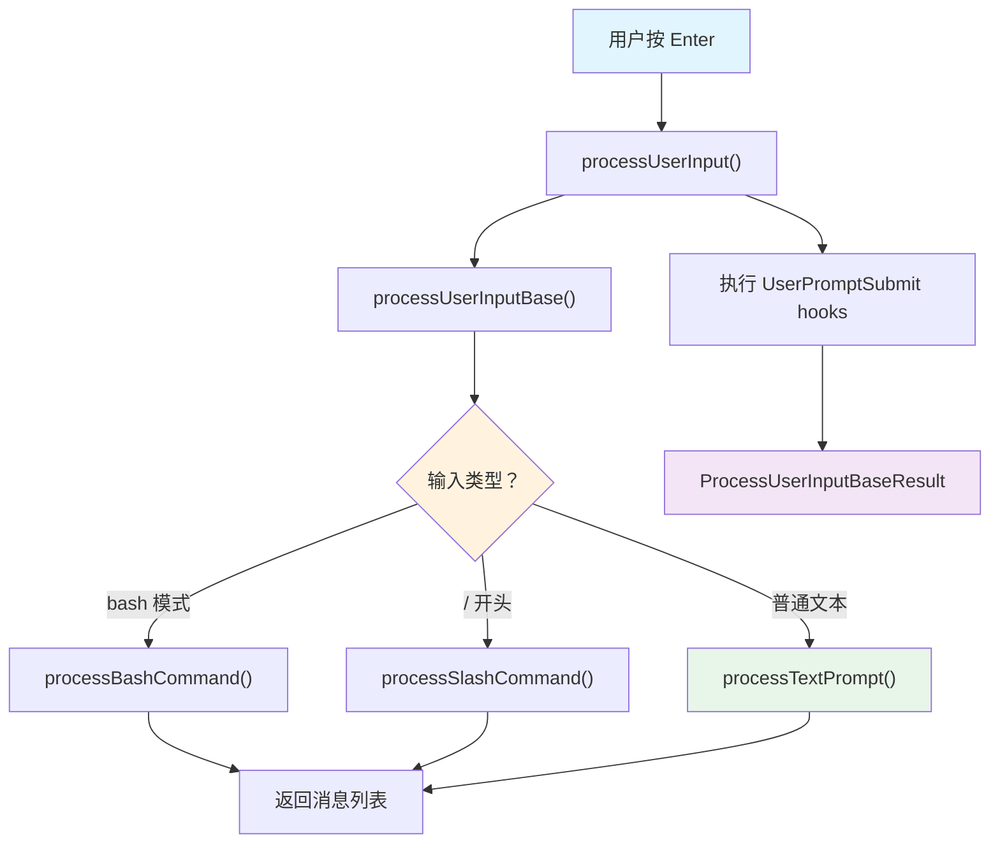

> 源码验证日期：2026-05-15，基于 commit `0d81bb6`

你的手指按下了回车键。在屏幕上，这只是换了一行。但在程序内部，一场接力赛刚刚开始。

---

## 路线图


上一章追踪了从终端输入 `claude` 到 REPL 启动的完整路径。现在 REPL 已经就绪，光标在闪烁。你开始打字："帮我修个 bug"，然后按下了回车。

这一按，消息便从你的指尖进入了程序的血管。它首先遇到的，是输入捕获系统。

---

## 知识补全：React 事件处理

Claude Code 的终端 UI 用 Ink（React for Terminals）构建。虽然运行在终端而非浏览器，但事件处理机制和 React 完全一样：

```typescript
// Ink 中的事件处理，和 React 一样
function MyInput({ onSubmit }) {
  const [value, setValue] = React.useState('')

  const handleSubmit = () => {
    onSubmit(value)  // 把输入值传给父组件
    setValue('')     // 清空输入框
  }

  const handleChange = (newValue) => {
    setValue(newValue)
  }

  return <TextInput value={value} onChange={handleChange} onSubmit={handleSubmit} />
}
```

关键概念：
- **状态提升**：子组件（TextInput）不负责处理逻辑，只负责通知父组件
- **回调函数**：父组件通过 `onSubmit` 属性传入回调，子组件在适当时机调用
- **受控组件**：输入值由 React 状态控制，而非 DOM 直接管理

Claude Code 的输入处理遵循这个模式：`PromptInput` 组件负责渲染和捕获按键，`REPL` 组件负责处理逻辑。

---

## 源码入口

本章追踪的调用链：

```
用户按 Enter
  → src/components/PromptInput/PromptInput.tsx  (Ink 输入组件)
    → src/utils/handlePromptSubmit.ts            (handlePromptSubmit 函数)
      → src/utils/processUserInput/processUserInput.ts  (processUserInput 函数)
        → 分支路由：
          ├── processTextPrompt.ts    (普通文本 → UserMessage)
          ├── processBashCommand.tsx  (bash 模式 → BashTool 调用)
          └── processSlashCommand.tsx (斜杠命令 → 命令执行)
        → src/utils/messages.ts       (createUserMessage — 消息对象工厂)
```

---

## 逐行阅读

### 4.1 PromptInput：终端输入组件

当 REPL 启动后，Ink 渲染的第一个交互组件是 `PromptInput`。它用 Ink 的 `useInput` hook 捕获按键事件，负责：

| 功能 | 实现方式 |
|------|---------|
| 文本输入 | Ink `useInput` hook |
| 历史记录 | `useArrowKeyHistory`（上下键翻历史） |
| 自动补全 | `useTypeahead`（Tab 补全斜杠命令） |
| 图片粘贴 | 剪贴板监听 |
| 模式切换 | `PromptInputMode` 类型控制 |

用户按 Enter 时，`PromptInput` 调用父组件传入的 `onSubmit` 回调，把当前输入文本传递给上层。

### 4.2 PromptInputMode：四种输入模式

```typescript
// → src/types/textInputTypes.ts 的 PromptInputMode 类型
export type PromptInputMode =
  | 'bash'                    // Bash 命令模式（! 开头）
  | 'prompt'                  // 普通提示模式（默认）
  | 'orphaned-permission'     // 孤立权限请求（工具权限弹窗）
  | 'task-notification'       // 任务通知（计划任务触发）
```

大多数时候你处于 `prompt` 模式。输入 `!` 开头的文本会切换到 `bash` 模式。另外两种模式由系统内部使用。

### 4.3 handlePromptSubmit：提交处理中枢

`PromptInput` 的 `onSubmit` 回调指向 `handlePromptSubmit` 函数：

```typescript
// → src/utils/handlePromptSubmit.ts 的 handlePromptSubmit() 函数（简化版）
export async function handlePromptSubmit(
  params: HandlePromptSubmitParams,
): Promise<void> {
  const input = params.input ?? ''
  const mode = params.mode ?? 'prompt'

  // 空输入直接返回
  if (input.trim() === '') return

  // 退出命令特殊处理
  if (['exit', 'quit', ':q', ':q!'].includes(input.trim())) {
    // 触发退出流程
  }

  // 图片引用检查：只保留文本中仍存在的 [Image #N] 对应的图片
  const referencedIds = new Set(parseReferences(input).map(r => r.id))
  const pastedContents = /* 过滤未引用的图片 */

  // 调用核心处理函数
  await processUserInput({
    input,
    mode,
    pastedContents,
    context,
    messages,
    // ...
  })
}
```

这里有一个巧妙的细节：`parseReferences(input)` 解析文本中的 `[Image #N]` 占位符。如果你粘贴了图片但后来删掉了占位符，这张图片就不会被发送给模型——避免浪费 token。

### 4.4 processUserInput：输入处理的中央调度

`processUserInput` 是输入处理的"调度员"——它根据输入类型路由到不同的处理器：

```typescript
// → src/utils/processUserInput/processUserInput.ts 的 processUserInput() 函数（简化版）
export async function processUserInput({
  input, mode, context, pastedContents, messages, ...
}): Promise<ProcessUserInputBaseResult> {

  // 立即显示用户输入（不等处理完成）
  if (mode === 'prompt' && typeof input === 'string') {
    setUserInputOnProcessing?.(input)
  }

  // 核心处理逻辑委托给 processUserInputBase
  const result = await processUserInputBase(input, mode, ...)

  // 执行 UserPromptSubmit hooks（用户自定义钩子）
  for await (const hookResult of executeUserPromptSubmitHooks(input, ...)) {
    if (hookResult.blockingError) {
      return { messages: [createSystemMessage(blockingMessage)], shouldQuery: false }
    }
    if (hookResult.preventContinuation) {
      result.shouldQuery = false
      return result
    }
    if (hookResult.additionalContexts) {
      result.messages.push(createAttachmentMessage(...))
    }
  }

  return result
}
```

### 4.5 processUserInputBase：分支路由

`processUserInputBase` 内部是一条清晰的分支链：

```typescript
// → src/utils/processUserInput/processUserInput.ts 的 processUserInputBase() 函数（简化版）
async function processUserInputBase(input, mode, ...) {
  // 1. 图片处理（如果是多模态输入）
  //    - 调整图片大小（maybeResizeAndDownsampleImageBlock）
  //    - 存储到磁盘（storeImages）以便工具引用

  // 2. Bash 命令模式
  if (mode === 'bash') {
    return processBashCommand(inputString, ...)
  }

  // 3. 斜杠命令（以 / 开头）
  if (inputString.startsWith('/')) {
    return processSlashCommand(inputString, ...)
  }

  // 4. 普通文本提示（最常见路径）
  return processTextPrompt(input, imageContentBlocks, attachmentMessages, ...)
}
```



### 4.6 processTextPrompt：创建 UserMessage

普通文本路径是最常见的，它的处理非常简洁：

```typescript
// → src/utils/processUserInput/processTextPrompt.ts 的 processTextPrompt() 函数（简化版）
export function processTextPrompt(
  input: string | ContentBlockParam[],
  imageContentBlocks: ContentBlockParam[],
  imagePasteIds: number[],
  attachmentMessages: AttachmentMessage[],
  uuid?: string,
  permissionMode?: PermissionMode,
  isMeta?: boolean,
): { messages: (UserMessage | AttachmentMessage)[], shouldQuery: boolean } {

  const promptId = randomUUID()
  setPromptId(promptId)

  if (imageContentBlocks.length > 0) {
    const userMessage = createUserMessage({
      content: [...textContent, ...imageContentBlocks],
      uuid,
      imagePasteIds,
    })
    return { messages: [userMessage, ...attachmentMessages], shouldQuery: true }
  }

  const userMessage = createUserMessage({
    content: input,
    uuid,
    permissionMode,
  })

  return { messages: [userMessage, ...attachmentMessages], shouldQuery: true }
}
```

注意：这个函数总是返回 `shouldQuery: true`——普通文本提示一定会触发 API 调用。

### 4.7 createUserMessage：消息对象工厂

所有路径最终都通过 `createUserMessage` 创建消息对象：

```typescript
// → src/utils/messages.ts 的 createUserMessage() 函数（简化版）
export function createUserMessage({
  content,
  isMeta,
  uuid,
  timestamp,
  imagePasteIds,
  permissionMode,
  origin,
}: {
  content: string | ContentBlockParam[]
  isMeta?: true                   // 对用户隐藏，对模型可见
  uuid?: UUID
  timestamp?: string
  imagePasteIds?: number[]
  permissionMode?: PermissionMode
  origin?: MessageOrigin           // 来源：人类 vs 系统生成
}): UserMessage {
  const m: UserMessage = {
    type: 'user',
    message: {
      role: 'user',
      content: content || NO_CONTENT_MESSAGE,
    },
    uuid: uuid || randomUUID(),
    timestamp: timestamp ?? new Date().toISOString(),
    isMeta,
    imagePasteIds,
    permissionMode,
    origin,
  }
  return m
}
```

`UserMessage` 对象的核心结构：

```typescript
// → src/types/message.js 的 UserMessage 类型
type UserMessage = {
  type: 'user'                    // 消息类型标识
  message: {
    role: 'user'                  // Anthropic API 角色
    content: string | ContentBlockParam[]  // 文本或多媒体内容
  }
  uuid: UUID                      // 唯一标识（用于回溯和调试）
  timestamp: string               // ISO 时间戳
  isMeta?: true                   // 元消息（系统生成，用户不可见）
  imagePasteIds?: number[]        // 粘贴图片的 ID 列表
  permissionMode?: PermissionMode // 发送时的权限模式
  origin?: MessageOrigin          // 消息来源
}
```

### 4.8 附件系统：@ 提及和 IDE 选择

在普通文本路径之外，`processUserInputBase` 还会收集附件消息：

```typescript
// → src/utils/processUserInput/processUserInput.ts 的附件提取逻辑
const shouldExtractAttachments =
  !skipAttachments &&
  inputString !== null &&
  (mode !== 'prompt' || !inputString.startsWith('/'))

const attachmentMessages = shouldExtractAttachments
  ? await toArray(getAttachmentMessages(inputString, context, ideSelection ?? null, [], messages, querySource))
  : []
```

附件包括：
- **@agent-xxx 提及**：通过 `@agent-explore` 语法指定子代理类型
- **IDE 选择**：在 VS Code/JetBrains 中选中代码后发送
- **Hook 附加上下文**：UserPromptSubmit hooks 返回的额外信息

这些附件以 `AttachmentMessage` 类型存在，和 `UserMessage` 一起传递给 `query()`。

---

## 当消息不仅含有文字 — 多模态输入深度

前面讲的输入处理以文本为主。但 Claude Code 支持的不只是文字——你可以粘贴截图、拖入 PDF、甚至使用语音。这一节展开这些能力。

### Vision：AI 能"看见"什么

Messages API 的 `content` 不只可以是字符串，还可以是 ContentBlock 数组。其中 `image` 类型让 AI 能理解图片：

```typescript
// → image content block 的结构
{
  type: "image",
  source: {
    type: "base64",
    media_type: "image/png",  // 支持 image/jpeg, image/png, image/gif, image/webp
    data: "iVBORw0KGgo..."   // base64 编码的图片
  }
}
```

但图片不是免费的。每张图片按照其尺寸消耗 token。粗略规则：**图片 token = 分辨率 / 因子**。一张 1024×768 的截图大约消耗 400-800 个 token。

### 图片预处理：为什么需要压缩

你的屏幕可能是 4K 分辨率（3840×2160）。一张原始截图 = 800 万像素 = 数千 token。大部分 Agent 场景不需要这么高分辨率——你只需要让 AI 看清楚代码行号和错误信息。

Claude Code 的图片处理逻辑（`maybeResizeAndDownsampleImageBlock`）做了两步：

1. **缩尺寸**：长边超过 1024px 时等比缩到 1024px
2. **高压缩**：JPEG 质量 85%，大幅减少数据量

```typescript
// → 最简图片压缩器
async function compressImage(
  data: Buffer,
  mediaType: string,
  maxWidth = 1024,
): Promise<Buffer> {
  // 用 sharp 库（如果可用）或 ImageMagick
  const sharp = await import("sharp")

  let pipeline = sharp(data)

  const metadata = await pipeline.metadata()
  if (metadata.width && metadata.width > maxWidth) {
    pipeline = pipeline.resize(maxWidth, undefined, {
      fit: "inside",
      withoutEnlargement: true,
    })
  }

  return pipeline
    .jpeg({ quality: 85 })
    .toBuffer()
}
```

### PDF 处理

PDF 被处理为多页图片序列。Claude 的 Read 工具支持 `pages` 参数：

```
Read("document.pdf", pages: "1-5")  → 只读取前 5 页
Read("document.pdf", pages: "3")     → 只读取第 3 页
```

每页 PDF 被渲染为一张 PNG 图片，作为 `image` content block 发送给模型。对于文本型 PDF，理论上可以提取文字（更省 token），但对于包含图表和代码的 PDF，图片方式更准确。

### 语音输入

Claude Code 的 `src/voice/` 目录包含语音输入功能。完整链路：

```
用户说话 → 麦克风 → STT (Speech-to-Text) → 文本 → Agent
                                                        ↓
用户听到 ← 扬声器 ← TTS (Text-to-Speech) ← 文本
```

语音转文本通常由外部 API 完成（Whisper / Deepgram），不是 Claude Code 本身。文本收到后，后续流程和普通文本输入完全一样——回到 `processUserInput` 的主线。

### 多模态的未来

Claude Code 当前主要使用图片和文本。但 Messages API 的 ContentBlock 设计为未来扩展留了空间：

```
当前支持：     text | image | tool_use | tool_result | thinking
未来可能支持：  audio | video | file
```

当这些类型被支持时，输入处理管线（本章所讲的 `processUserInputBase` 分支路由）可以扩展新分支，而不改变现有逻辑——这就是 ContentBlock 数组设计的前瞻性。

---

## 常见错误与检查方法

| 常见错误 | 检查方法 |
|---------|---------|
| 按回车无反应 | 检查 `handlePromptSubmit` 是否被调用（加 `console.log`） |
| 图片没发送 | 检查 `parseReferences` 是否正确解析了 `[Image #N]` |
| 斜杠命令没执行 | 检查 `inputString.startsWith('/')` 是否匹配 |
| Hook 阻止了提交 | 检查 `executeUserPromptSubmitHooks` 的返回值 |
| 图片 token 消耗过高 | 检查原始截图分辨率；启用 `maybeResizeAndDownsampleImageBlock` |
| PDF 读取内容不全 | 小 PDF 一次读完；大 PDF 分页读取，注意每页的 token 消耗 |

---

## 试试看

### 修改 1：观察输入路由

在 `src/utils/processUserInput/processUserInput.ts` 的 `processUserInputBase` 函数中加：

```typescript
console.log('[DEBUG] inputString:', inputString?.substring(0, 50), 'mode:', mode)
```

运行后分别尝试：

```
> 你好                    # 普通文本 → 走 processTextPrompt
> !ls -la                 # Bash 命令 → 走 processBashCommand
> /help                   # 斜杠命令 → 走 processSlashCommand
```

### 修改 2：查看消息对象结构

在 `src/utils/processUserInput/processTextPrompt.ts` 的 `return` 语句之前加：

```typescript
console.log('[DEBUG] UserMessage created:', JSON.stringify(userMessage, null, 2))
```

发送一条消息，观察 `UserMessage` 的完整结构——注意 `uuid`、`timestamp`、`type` 等字段。

---

## 检查点

你现在已经理解了：

- **输入组件架构**：`PromptInput`（捕获）→ `handlePromptSubmit`（处理）→ `processUserInput`（路由）
- **四种输入模式**：`prompt`、`bash`、`orphaned-permission`、`task-notification`
- **三条处理路径**：普通文本 → `processTextPrompt`，Bash → `processBashCommand`，斜杠命令 → `processSlashCommand`
- **消息工厂**：`createUserMessage()` 构造 `UserMessage` 对象（type + role + content + uuid + timestamp）
- **图片处理**：粘贴图片自动调整大小、存储到磁盘、通过 `[Image #N]` 占位符关联
- **多模态输入**：Vision (image content block + token估算)、PDF分页处理、语音(STT/TTS)、ContentBlock的扩展性
- **图片压缩**：`maybeResizeAndDownsampleImageBlock` 缩放→1024px + JPEG质量85%，节省大量 token
- **Hook 系统**：`UserPromptSubmit` hooks 可以阻止、修改或附加信息到用户输入
- **附件系统**：`@` 提及、IDE 选择、Hook 附加上下文以 `AttachmentMessage` 传递

**下一站预告**：第 5 章将追踪系统提示（System Prompt）的构建——从 `getSystemPrompt()` 到 CLAUDE.md 加载，理解 Claude 如何获得它的"人格"和"指令"。

---

[← 上一章：准备工具箱](/posts/9ed23b71/) | [下一章：消息被装进信封 →](/posts/e8027bbe/)
