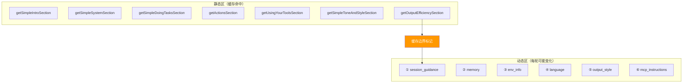
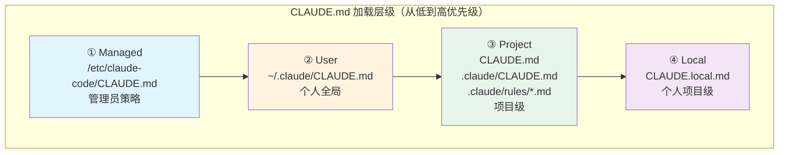

> 源码验证日期：2026-05-15，基于 commit `0d81bb6`

你的消息"帮我修个 bug"现在是一个 `UserMessage` 对象，躺在程序的内存里。但它还不能直接发给 AI——在发出之前，还有一项关键准备工作：**系统提示（System Prompt）的构建**。

每次 API 调用都会携带 system prompt——它告诉 Claude "你是谁"、"你应该怎么做"、"有什么规则"。

---

## 路线图


---

## 知识补全：System Prompt vs User Context

Anthropic API 的消息格式有三个层级：

```typescript
// API 调用时的参数结构
{
  system: "你是一个编程助手...",     // system prompt（每轮不变）
  messages: [
    { role: "user", content: "..." },    // 用户消息
    { role: "assistant", content: "..." } // 模型回复
  ]
}
```

- **System prompt**：告诉模型它的身份、行为规则、约束条件。对用户不可见，但深刻影响模型行为。
- **User message**：用户发给模型的内容。
- **Assistant message**：模型的回复。

Claude Code 的 system prompt 不是一段固定文本，而是在每次查询开始时动态组装的。

---

## 源码入口

本章追踪的调用链：

```
query() 调用前的准备阶段
  → src/constants/prompts.ts       (getSystemPrompt — 组装 system prompt)
    → src/context.ts               (getSystemContext — git 状态等)
    → src/context.ts               (getUserContext — CLAUDE.md 等)
      → src/utils/claudemd.ts     (getMemoryFiles → getClaudeMds — CLAUDE.md 加载)
    → src/memdir/memdir.ts        (loadMemoryPrompt — 自动记忆)
```

---

## 逐行阅读

### 5.1 getSystemPrompt：两大分区架构

`getSystemPrompt()` 返回一个字符串数组，每个元素是一个 prompt section：

```typescript
// → src/constants/prompts.ts 的 getSystemPrompt() 函数（简化版，上半部分）
export async function getSystemPrompt(
  tools: Tools,
  model: string,
  additionalWorkingDirectories?: string[],
  mcpClients?: MCPServerConnection[],
): Promise<string[]> {
  // --bare 模式：极简 prompt
  if (process.env.CLAUDE_CODE_SIMPLE) {
    return [`You are Claude Code...\nCWD: ${getCwd()}\nDate: ...`]
  }

  // 并行加载：技能命令 + 输出样式 + 环境信息
  const [skillToolCommands, outputStyleConfig, envInfo] = await Promise.all([
    getSkillToolCommands(cwd),
    getOutputStyleConfig(),
    computeSimpleEnvInfo(model, additionalWorkingDirectories),
  ])
```

返回值组装——注意静态区和动态区之间的缓存边界标记：

```typescript
// → src/constants/prompts.ts 的 getSystemPrompt() 返回值组装
  return [
    // --- 静态内容（可缓存）---
    getSimpleIntroSection(outputStyleConfig),      // 身份 + 安全指令
    getSimpleSystemSection(),                      // 系统行为规则
    getSimpleDoingTasksSection(),                   // 编码任务指南
    getActionsSection(),                           // 风险评估
    getUsingYourToolsSection(enabledTools),         // 工具使用指引
    getSimpleToneAndStyleSection(),                 // 语气风格
    getOutputEfficiencySection(),                  // 输出效率
    // === 缓存边界标记 ===
    ...(shouldUseGlobalCacheScope() ? [SYSTEM_PROMPT_DYNAMIC_BOUNDARY] : []),
    // --- 动态内容（注册表管理）---
    ...resolvedDynamicSections,
  ].filter(s => s !== null)
```

**关键设计**：System prompt 被分为两部分，中间有一个缓存边界标记。



**为什么这样设计？** Anthropic 的 Prompt Cache 按"前缀匹配"工作——如果 system prompt 的前 N 个字节和上次完全相同，这部分就可以从缓存读取。静态区几乎不变，可以稳定命中缓存。动态区每轮可能变化，放在后面不会影响前面的缓存。

### 5.2 getSystemContext：Git 状态和环境

```typescript
// → src/context.ts 的 getSystemContext() 函数（简化版）
export const getSystemContext = memoize(async () => {
  const gitStatus = await getGitStatus()

  return {
    ...(gitStatus && { gitStatus }),
  }
})
```

`getGitStatus()` 并行执行 5 个 git 命令：

```typescript
// → src/context.ts 的 getGitStatus() 函数
const [branch, mainBranch, status, log, userName] = await Promise.all([
  getBranch(),                          // 当前分支
  getDefaultBranch(),                   // 主分支
  execFileNoThrow(gitExe(), ['status', '--short']),  // 文件状态
  execFileNoThrow(gitExe(), ['log', '--oneline', '-n', '5']),  // 最近 5 条提交
  execFileNoThrow(gitExe(), ['config', 'user.name']),  // git 用户名
])
```

这些信息让 Claude 知道当前分支、有没有未提交的修改、最近的提交历史。注意：`getSystemContext` 是 `memoize` 的——整个对话期间只执行一次。

### 5.3 getUserContext：CLAUDE.md 加载

```typescript
// → src/context.ts 的 getUserContext() 函数（简化版）
export const getUserContext = memoize(async () => {
  const claudeMd = shouldDisableClaudeMd
    ? null
    : getClaudeMds(filterInjectedMemoryFiles(await getMemoryFiles()))

  return {
    ...(claudeMd && { claudeMd }),
    currentDate: `Today's date is ${getLocalISODate()}.`,
  }
})
```

也是 memoized 的——对话期间只加载一次。`currentDate` 确保模型知道当前日期。

### 5.4 CLAUDE.md 四级加载层级



**加载流程**（`getMemoryFiles()` 在 `claudemd.ts` 中）：

1. **Managed 文件**：从 `/etc/claude-code/CLAUDE.md` 加载（管理员设置）
2. **User 文件**：`~/.claude/CLAUDE.md`（个人全局指令）
3. **Project 文件**：从当前目录向上遍历，查找 `CLAUDE.md`、`.claude/CLAUDE.md`、`.claude/rules/*.md`
4. **Local 文件**：`CLAUDE.local.md`（加入 `.gitignore` 的个人偏好）

**越靠近当前目录的文件优先级越高**——因为后加载的内容在 prompt 中更靠后，模型更关注。

### 5.5 @include 语法和条件规则

CLAUDE.md 支持 `@` 语法导入其他文件：

```typescript
// → src/utils/claudemd.ts 的 @include 语法注释
// - Syntax: @path, @./relative/path, @~/home/path, or @/absolute/path
// - Included files are added as separate entries before the including file
// - Circular references are prevented by tracking processed files
```

`.claude/rules/*.md` 文件支持 YAML frontmatter 做条件匹配：

```markdown
---
paths: ['src/**/*.ts', 'test/**/*.ts']
---
Always add explicit return types to TypeScript functions.
```

这条规则只在编辑 `src/` 或 `test/` 下的 `.ts` 文件时生效。

### 5.6 getClaudeMds：格式化输出

```typescript
// → src/utils/claudemd.ts 的 getClaudeMds() 函数（简化版）
export const getClaudeMds = (memoryFiles: MemoryFileInfo[]): string => {
  const memories: string[] = []

  for (const file of memoryFiles) {
    if (file.content) {
      const description =
        file.type === 'Project'
          ? ' (project instructions, checked into the codebase)'
          : file.type === 'Local'
            ? " (user's private project instructions, not checked in)"
            : file.type === 'AutoMem'
              ? " (user's auto-memory, persists across conversations)"
              : " (user's private global instructions for all projects)"

      memories.push(`Contents of ${file.path}${description}:\n\n${file.content}`)
    }
  }

  if (memories.length === 0) return ''

  return `${MEMORY_INSTRUCTION_PROMPT}\n\n${memories.join('\n\n')}`
}
```

每个文件都会被标注类型——模型能看到"这是项目指令"还是"这是个人全局指令"。

### 5.7 自动记忆：MEMORY.md

自动记忆系统存储在 `.claude/memory/` 目录中。加载时有大小限制——最多 200 行 AND 25KB。超过限制的内容会被截断，并附加警告信息。

---

## 常见错误与检查方法

| 常见错误 | 检查方法 |
|---------|---------|
| CLAUDE.md 没生效 | 检查 `getClaudeMds` 是否加载了你的文件（加日志） |
| Git 状态显示错误 | 检查 `getGitStatus()` 的 5 个并行命令是否全部成功 |
| System prompt 太长 | 检查 `getSystemPrompt()` 返回的 section 数量和大小 |
| 缓存命中率低 | 检查动态区是否变化太频繁 |
| @include 循环引用 | 检查 `getMemoryFiles` 的循环引用检测日志 |

---

## 试试看

### 修改 1：观察 CLAUDE.md 加载

创建一个测试用的 CLAUDE.md：

```bash
echo "这是一个测试指令：回复时总是以 [TEST] 开头" > CLAUDE.md
```

在 `src/utils/claudemd.ts` 的 `getClaudeMds` 函数中加日志：

```typescript
console.log('[DEBUG] Memory files loaded:', memoryFiles.map(f => ({ type: f.type, path: f.path })))
```

### 修改 2：观察 system prompt 结构

在 `src/constants/prompts.ts` 的 `getSystemPrompt()` 返回前加：

```typescript
console.log('[DEBUG] System prompt has', result.length, 'sections')
for (let i = 0; i < result.length; i++) {
  console.log(`  Section ${i}: ${(result[i] ?? '').substring(0, 80)}...`)
}
```

### 修改 3：实验 @include 语法

创建多层 CLAUDE.md 文件，验证加载顺序：

```bash
echo "全局指令：总是使用 TypeScript strict 模式" > ~/.claude/CLAUDE.md
echo "项目指令：测试文件放在 test/ 目录" > CLAUDE.md
echo "本地指令：我偏好用 pnpm 而非 npm" > CLAUDE.local.md
```

---

## 检查点

你现在已经理解了：

- **System prompt 两区架构**：静态区（可缓存）+ 动态区（每轮变化），中间有缓存边界标记
- **静态区 7 个 section**：身份、系统行为、编码指南、风险评估、工具指引、语气风格、输出效率
- **CLAUDE.md 四级加载**：Managed → User → Project → Local，越靠近当前目录优先级越高
- **文件发现机制**：从当前目录向上遍历，支持 `@include` 语法和条件规则（YAML frontmatter）
- **自动记忆**：MEMORY.md 最多 200 行 / 25KB
- **Memoize 优化**：`getSystemContext` 和 `getUserContext` 对话期间只执行一次

**下一站预告**：第 6 章将追踪工具注册——`Tool` 接口的完整定义、`getTools()` 如何组装工具列表、Zod schema 如何定义工具参数。

---

[← 上一章：回车键之后](/posts/7a3522b2/) | [下一章：工具的注册与发现 →](/posts/fabd43ba/)
