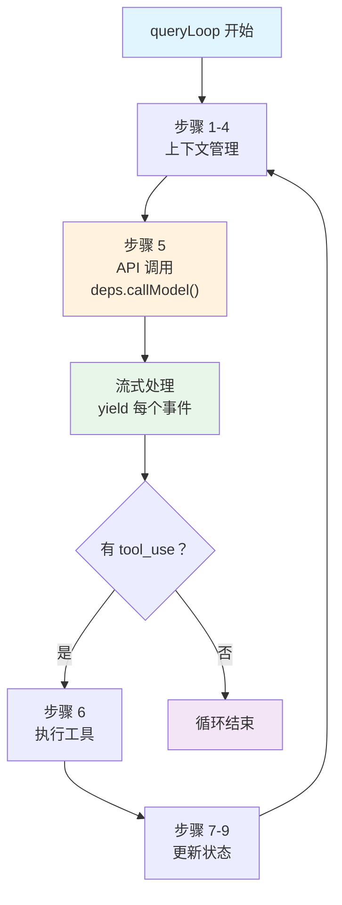

> 源码验证日期：2026-05-15，基于 commit `0d81bb6`

信封装好了——system prompt、消息历史、工具列表全部就绪。现在这个包裹要穿越互联网，飞到 Anthropic 的服务器。这一章追踪的是 API 调用的完整过程。

---

## 路线图


---

## 知识补全：AsyncGenerator

Claude Code 的 Agentic Loop 使用 AsyncGenerator（异步生成器）：

```typescript
async function* numbers(): AsyncGenerator<number> {
  yield 1           // 产出一个值，暂停
  yield 2           // 产出一个值，暂停
  return 3          // 最终返回值
}

// 消费方式 1：for await...of（自动迭代）
for await (const num of numbers()) {
  console.log(num)  // 1, 2
}

// 消费方式 2：yield* 委托（在另一个生成器中转发）
async function* wrapper(): AsyncGenerator<number> {
  const finalValue = yield* numbers()  // 转发所有 yield，获取 return 值
  console.log(finalValue)              // 3
}
```

**为什么用 AsyncGenerator？** 因为 Claude Code 需要**流式输出**。模型回复是一个字一个字到达的——AsyncGenerator 让调用者可以在每个字到达时就立刻处理。

---

## 源码入口

本章追踪的调用链：

```
REPL.tsx 调用 query()
  → src/query.ts                    (query — AsyncGenerator 入口)
    → src/query.ts                  (queryLoop — while(true) 循环)
      → src/query/deps.ts           (productionDeps — 依赖注入)
        → src/services/api/claude.ts (queryModelWithStreaming — API 调用)
```

---

## 逐行阅读

### 7.1 query()：AsyncGenerator 入口

```typescript
// → src/query.ts 的 query() 函数
export async function* query(
  params: QueryParams,
): AsyncGenerator<
  StreamEvent | RequestStartEvent | Message | TombstoneMessage | ToolUseSummaryMessage,
  Terminal
> {
  const consumedCommandUuids: string[] = []
  const terminal = yield* queryLoop(params, consumedCommandUuids)
  for (const uuid of consumedCommandUuids) {
    notifyCommandLifecycle(uuid, 'completed')
  }
  return terminal
}
```

`query()` 是一个薄包装——它用 `yield*` 把所有工作委托给 `queryLoop()`。`yield*` 的意思是"把内层生成器的所有 yield 值直接转发给外层消费者"。

### 7.2 queryLoop()：while(true) 的九步循环

`queryLoop` 是 Claude Code 的心脏：

```typescript
// → src/query.ts 的 queryLoop() 函数（简化版）
async function* queryLoop(params, consumedCommandUuids) {
  const deps = params.deps ?? productionDeps()
  let state: State = {
    messages: params.messages,
    toolUseContext: params.toolUseContext,
    turnCount: 1,
  }

  while (true) {
    // 步骤 1-4：上下文管理（预防溢出）
    // 裁剪过大工具结果 → Snip 压缩 → Microcompact → Autocompact

    // === 步骤 5：API 调用 ===
    for await (const message of deps.callModel({
      messages: prependUserContext(messagesForQuery, userContext),
      systemPrompt: fullSystemPrompt,
      tools: toolUseContext.options.tools,
    })) {
      yield message  // 转发给 UI 层渲染
    }

    // === 步骤 6-9：工具执行 & 循环控制 ===
    if (!needsFollowUp) return { reason: 'end_turn' }
    state = { ...state, messages: [...messages, ...toolResults], turnCount: turnCount + 1 }
  }
}
```



### 7.3 上下文管理：四层压缩管线

每轮循环开始前，有四层上下文管理按成本从低到高执行：

| 层级 | 名称 | 成本 | 做什么 |
|------|------|------|--------|
| 1 | Tool Result Budget | 零 | 裁剪过大的工具输出 |
| 2 | Snip | 极低 | 用轻量摘要替换旧工具结果 |
| 3 | Microcompact | 低 | 缓存编辑，小范围压缩 |
| 4 | Autocompact | 高 | 调用模型生成完整摘要 |

### 7.4 API 调用：deps.callModel()

`deps` 是依赖注入机制——生产环境用真实 API，测试环境可以注入 mock：

```typescript
// → src/query/deps.ts 的 productionDeps() 函数
export function productionDeps(): QueryDeps {
  return {
    callModel: queryModelWithStreaming,
    microcompact: microcompactMessages,
    autocompact: autoCompactIfNeeded,
    uuid: randomUUID,
  }
}
```

`queryModelWithStreaming` 是实际的 API 调用：

```typescript
// → src/services/api/claude.ts 的 queryModelWithStreaming() 函数（简化版）
export async function* queryModelWithStreaming({
  messages, systemPrompt, thinkingConfig, tools, signal, options,
}): AsyncGenerator<StreamEvent | AssistantMessage> {
  return yield* withStreamingVCR(async function* () {
    yield* queryModel(messages, systemPrompt, thinkingConfig, tools, signal, options)
  })
}
```

它也是一个 AsyncGenerator——用 `yield*` 转发内层 `queryModel()` 的所有事件。

### 7.5 SDK 认证

API 客户端根据用户类型选择不同的认证方式：

```typescript
// → src/services/api/client.ts
const clientConfig = {
  apiKey: isClaudeAISubscriber() ? null : apiKey || getAnthropicApiKey(),
  authToken: isClaudeAISubscriber()
    ? getClaudeAIOAuthTokens()?.accessToken
    : undefined,
}
return new Anthropic(clientConfig)
```

### 7.6 重试机制

网络请求可能失败。`withRetry` 提供了带指数退避的重试：

```typescript
// → src/services/api/withRetry.ts 的 shouldRetry() 函数（简化版）
function shouldRetry(error: APIError): boolean {
  if (error.status === 408) return true       // 请求超时
  if (error.status === 401) return true        // 认证失败（刷新令牌后重试）
  if (error.status && error.status >= 500) return true  // 服务器错误
  return false
}
```

重试间隔使用指数退避：500ms, 1000ms, 2000ms, 4000ms...加上随机抖动防止所有客户端同时重试。

### 7.7 消息组装：发给 API 的完整结构

每次 API 调用发送的完整结构：

```typescript
{
  system: [
    { type: 'text', text: '...' },                    // 静态区
    { type: 'text', text: '__SYSTEM_PROMPT_DYNAMIC_BOUNDARY__' },
    { type: 'text', text: '...' },                    // 动态区
  ],
  messages: [
    { role: 'user', content: [...] },
    { role: 'assistant', content: [...] },
    { role: 'user', content: [...] },     // 工具结果
  ],
  tools: [...],                // 工具列表（JSON Schema 格式）
  model: 'claude-sonnet-4-6',
  stream: true,                // 流式响应
}
```

### 7.8 Prompt Cache：缓存边界标记

上一章提到的 `SYSTEM_PROMPT_DYNAMIC_BOUNDARY` 在这里发挥作用：

1. **前缀匹配**：如果 system prompt 的前 N 字节和上次完全相同，这部分从缓存读取
2. **静态区**：7 个静态 section 几乎不变 → 稳定命中缓存
3. **动态区**：每轮可能变化

这意味着绝大多数 API 调用只需要重新处理动态区，静态区直接从缓存读取——**显著减少 token 消耗和延迟**。

---

## 常见错误与检查方法

| 常见错误 | 检查方法 |
|---------|---------|
| API 调用超时 | 检查 `signal: AbortController` 是否被提前触发 |
| 401 认证失败 | 检查 `apiKey` / `authToken` 是否有效 |
| 429 限流 | 检查 `withRetry` 的重试策略和退避时间 |
| Prompt Cache 未命中 | 检查 system prompt 是否有意外变化 |
| 重试循环 | 检查 `maxRetries` 是否设置合理（默认 10） |

---

## 试试看

### 修改 1：观察每轮 API 调用

在 `src/query.ts` 的 `while(true)` 循环内，`deps.callModel` 调用之前加：

```typescript
console.log('[DEBUG] API call - turn:', turnCount, 'messages:', messagesForQuery.length)
```

### 修改 2：追踪流式事件类型

在 `for await` 循环内，`yield message` 之前加：

```typescript
if (message.type === 'assistant') {
  const blockTypes = message.message.content.map(b => b.type).join(', ')
  console.log('[DEBUG] assistant blocks:', blockTypes)
}
```

### 修改 3：观察重试

在 `src/services/api/withRetry.ts` 的重试循环中加：

```typescript
console.log('[DEBUG] Retry attempt:', attempt, 'error:', error.status)
```

---

## 检查点

你现在已经理解了：

- **query() 和 queryLoop()**：AsyncGenerator 模式，`yield*` 委托，`while(true)` 循环
- **九步循环**：上下文管理（4 层压缩）→ API 调用 → 流式处理 → 工具执行 → 状态更新
- **依赖注入**：`productionDeps()` 提供真实 API，测试可注入 mock
- **流式响应**：`for await...of` 逐事件处理，`yield` 立即转发 UI
- **消息结构**：system prompt + messages + tools 的完整组装
- **上下文管理**：Tool Result Budget → Snip → Microcompact → Autocompact
- **Prompt Cache**：静态/动态分区、缓存边界标记、前缀匹配机制
- **重试机制**：指数退避 + 随机抖动，最多重试 10 次
- **SDK 认证**：API Key 或 OAuth 令牌，自动刷新

**下一站预告**：第 8 章将深入流式响应处理——SSE 事件、token 增量、`content_block_delta` 的逐字拼接。

---

[← 上一章：工具的注册与发现](/posts/fabd43ba/) | [下一章：文字一个字一个字地回来 →](/posts/56229ded/)
