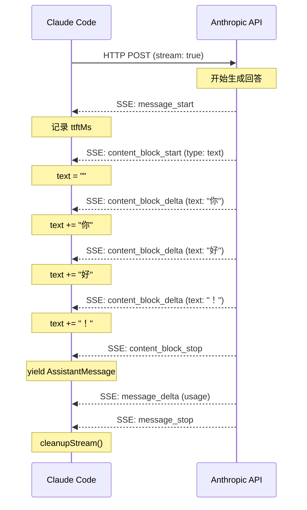

> 源码验证日期：2026-05-15，基于 commit `0d81bb6`

信封飞向远方了——system prompt、消息历史、工具列表全部发给了 Anthropic 的服务器。现在你盯着屏幕，等待。几秒后，AI 的回答开始出现。不是一个整块——而是一个字、一个字地，像有人在屏幕上打字。

这不是魔法。这是流式响应。

---

## 路线图


---

## 为什么不一口气说完

先想一个场景：你让一个朋友帮你写一篇文章。有两种模式。

第一种模式：朋友说"你等着"，然后关上门埋头苦写。三个小时后，门开了，朋友递给你一篇一万字的文章。你在这三个小时里什么都看不到，只能干等。你不知道他写到哪了，不知道他是不是跑了，甚至不知道他还在不在房间里。

第二种模式：朋友写一句，就从门缝里递出来一张纸条。你拿到第一张纸条就知道他在写了。拿到第十张纸条，你已经能看出文章的大致方向。你不用等他全部写完，就可以开始阅读已经递出来的部分。

你选哪个？当然是第二种。

这就是流式响应（streaming）存在的原因。对于 AI 来说，一次完整的回答可能很长——几百字、几千字，甚至需要"思考"很久。如果服务器等整个回答全部生成完毕再一次性返回，你可能要盯着一个空白的屏幕等上十几秒甚至几十秒。这段等待时间在用户体验上是灾难性的——你不知道 AI 在不在工作，不知道它是不是卡死了。

流式响应解决了这个问题。AI 每生成一小段文字，就立刻发送给你。你的终端几乎在发出请求的同时就开始显示文字。

---

## 水管和桶：两种传输方式

想象你需要从楼下的水站把水弄到你家。

方式一：你拎一个桶下楼，把水装满，拎回来。这一桶水就是一次完整的数据。你得等桶装满才能往回走。

方式二：你接一根水管，从水站连到你家。水一滴一滴地流过来。你不需要等所有的水都到位——第一滴水到你家的时候，你就能用了。水管一直在输送，你一直在接收，两边同时工作。

第一种方式叫"一次性返回"（one-shot）。第二种方式叫"流式传输"（streaming）。Claude Code 用的是第二种——水管模式。

---

## 水管的名字叫 SSE

这根"水管"在技术上是通过 SSE（Server-Sent Events，服务器推送事件）协议实现的。

普通的 HTTP 请求是这样的：你发一个请求，服务器返回一个响应，连接关闭。一问一答，结束。

SSE 不一样。你发一个请求，服务器返回一个**不关闭的连接**。然后服务器可以在这个连接上持续发送数据。每次发送的数据叫一个"事件"（event），以 `data:` 开头，以两个换行符结尾。

在 Claude Code 的场景里，Anthropic 的服务器在生成 AI 回答时，每生成一小段内容，就通过 SSE 推送一个事件。你的终端接收到这个事件，把内容显示在屏幕上。然后下一个事件到来，再追加显示。一直持续到服务器说"我回答完了"。

不过，这里说的"字"并不完全准确。每个事件里携带的单位，不一定是人类意义上的一个字。

---

## Token：AI 眼中的"字"

AI 不像人一样一个字一个字地思考。它用一种特殊的单位，叫 token（词元）。

什么是 token？简单说，token 是 AI 处理文字的基本单位。一个 token 可能是一个完整的词，可能是一个词的一部分，也可能是一个标点符号。在英文里，"hello"可能是一个 token，"hamburger"可能是两个 token（"ham" + "burger"）。在中文里，一个汉字通常是一个 token。

你可以把 token 理解为 AI 世界的"音节"。就像人类说话时以音节为基本节奏单位一样，AI 生成文字时以 token 为基本单位。

所以你看到的"一个字一个字地出现"，在技术层面上，是 AI 一次生成一个 token，服务器通过 SSE 推送过来，你的终端接收到之后渲染在屏幕上。

---

## 源码入口

本章追踪的调用链：

```
src/services/api/claude.ts 的 queryModelWithStreaming()
  → src/services/api/claude.ts  (queryModel — 实际 API 调用)
    → Anthropic SDK              (stream: true — 开启 SSE)
      → SSE 事件流               (message_start / content_block_delta / ...)
        → for await 循环          (逐事件处理)
```

---

## 逐行阅读

### 8.1 queryModelWithStreaming：水管入口

上一章我们见过 `queryModelWithStreaming`，它是一个 AsyncGenerator：

```typescript
// → src/services/api/claude.ts 的 queryModelWithStreaming() 函数
export async function* queryModelWithStreaming({
  messages,
  systemPrompt,
  thinkingConfig,
  tools,
  signal,
  options,
}): AsyncGenerator<
  StreamEvent | AssistantMessage | SystemAPIErrorMessage,
  void
> {
  return yield* withStreamingVCR(async function* () {
    yield* queryModel(
      messages,
      systemPrompt,
      thinkingConfig,
      tools,
      signal,
      options,
    )
  })
}
```

这是一个极薄的包装层——用 `yield*` 把所有工作委托给内层的 `queryModel`。`yield*` 是 AsyncGenerator 的"转接头"——把内层生成器的所有 yield 值直接转发给外层消费者，不需要手动写 `for await` 循环。

外面包的 `withStreamingVCR` 是一个测试机制——用来记录和回放 API 响应。在生产环境中，它只是简单地转发。

### 8.2 for await：接住每一滴水

`queryModel` 内部，处理流式数据的核心循环：

```typescript
// → src/services/api/claude.ts 的流式处理循环（简化版）
for await (const part of stream) {
  switch (part.type) {
    case 'message_start':
      // 消息开始了，记录首字节时间
      break
    case 'content_block_start':
      // 一个新内容块开始了（文字、思考、工具调用）
      break
    case 'content_block_delta':
      // 增量来了——一个 token
      break
    case 'content_block_stop':
      // 这个内容块结束了
      break
    case 'message_delta':
      // 消息级更新（token 用量、停止原因）
      break
    case 'message_stop':
      // 整条消息结束了
      break
  }
}
```

`for await (const part of stream)` 就是整个流式处理的骨架。服务器推送的事件像水滴一样，一滴一滴地流进来。每流进来一滴，`switch` 语句就判断它是哪种类型的事件，然后做相应的处理。

### 8.3 一滴水的一生：message_start

AI 开始生成回答。服务器推送第一个事件——`message_start`：

```typescript
// → src/services/api/claude.ts 的 message_start 处理
case 'message_start': {
  partialMessage = part.message
  ttftMs = Date.now() - start
  usage = updateUsage(usage, part.message?.usage)
  break
}
```

`ttftMs`（Time To First Byte）是关键的性能指标——从发出请求到收到第一个字节用了多久。如果这个数字很大，说明网络延迟高或者服务器排队久。

### 8.4 content_block_start：准备容器

接下来，服务器推送 `content_block_start` 事件，表示一个新的内容块开始。代码根据类型初始化一个空的容器：

```typescript
// → src/services/api/claude.ts 的 content_block_start 处理
case 'text':
  contentBlocks[part.index] = {
    ...part.content_block,
    text: '',  // 空字符串，等待增量填充
  }
  break
case 'thinking':
  contentBlocks[part.index] = {
    ...part.content_block,
    thinking: '',
    signature: '',
  }
  break
```

不管是文字还是思考，初始化时内容都是空字符串。因为内容会在后续的事件里一点一点地到来。

### 8.5 content_block_delta：一个 token 来了

重头戏。服务器开始推送 `content_block_delta` 事件——每个 delta 就是一个 token 的内容：

```typescript
// → src/services/api/claude.ts 的 text_delta 处理
case 'text_delta':
  if (contentBlock.type !== 'text') {
    throw new Error('Content block is not a text block')
  }
  contentBlock.text += delta.text
  break
```

`contentBlock.text += delta.text`——就这么一行。每一次增量到来，就追加到文字的末尾。你在屏幕上看到 AI 的文字一个字一个字地增长，背后就是这行代码在反复执行。

思考内容（thinking）和工具调用（tool_use）的处理方式类似：

```typescript
case 'thinking_delta':
  contentBlock.thinking += delta.thinking
  break
case 'input_json_delta':
  contentBlock.input += delta.partial_json
  break
```

工具调用的输入是 JSON 格式的，所以增量是 JSON 片段，一片一片拼起来。

### 8.6 content_block_stop：组装并 yield

当一个内容块的所有增量都到齐后，服务器推送 `content_block_stop`。代码把内容块组装成一条完整的助手消息，然后 `yield` 出去：

```typescript
// → src/services/api/claude.ts 的 content_block_stop 处理
const m: AssistantMessage = {
  message: {
    ...partialMessage,
    content: normalizeContentFromAPI(
      [contentBlock],
      tools,
      options.agentId,
    ),
  },
  requestId: streamRequestId ?? undefined,
  type: 'assistant',
  uuid: randomUUID(),
  timestamp: new Date().toISOString(),
}
newMessages.push(m)
yield m
```

`yield m` 就是生成器函数"交出"数据的关键动作。外层的 `for await...of` 循环会接住这个 yield 出来的消息，然后更新终端的显示。

### 8.7 水管的清洁工

流式传输有一个容易被忽略但非常重要的问题：**清理**。

水管用完了要关水龙头。如果不管它，水会一直流——在程序里，这意味着网络连接不会被释放，内存不会被回收。

```typescript
// → src/services/api/claude.ts 的 cleanupStream() 函数
export function cleanupStream(
  stream: Stream<BetaRawMessageStreamEvent> | undefined,
): void {
  if (!stream) {
    return
  }
  try {
    if (!stream.controller.signal.aborted) {
      stream.controller.abort()
    }
  } catch {
    // 忽略错误——流可能已经关闭了
  }
}
```

逻辑很简单：如果流还在，就中止它。`try...catch` 包了一圈，是因为中止操作本身可能抛异常。对于清理操作来说，报不报错无所谓，重要的是资源被释放了。

### 8.8 记账：Token 用量统计

AI 的每一次调用都是要花钱的。流式传输中，token 用量在不同的事件里分批到来：

```typescript
// → src/services/api/claude.ts 的 updateUsage() 函数（简化版）
export function updateUsage(
  usage: Readonly<NonNullableUsage>,
  partUsage: BetaMessageDeltaUsage | undefined,
): NonNullableUsage {
  if (!partUsage) {
    return { ...usage }
  }
  return {
    input_tokens:
      partUsage.input_tokens !== null && partUsage.input_tokens > 0
        ? partUsage.input_tokens
        : usage.input_tokens,
    // ... 还有 cache_creation_input_tokens、cache_read_input_tokens 等
    output_tokens: partUsage.output_tokens ?? usage.output_tokens,
  }
}
```

精髓在于：对于输入相关的 token，只有当新值是非零的时候才更新。因为 `message_delta` 事件有时候会把这些字段设为 0——但 0 不代表"用了 0 个 token"，而是代表"这一段没有更新这些字段"。这是一个典型的"累计统计"模式。

---

## 整条水管的全貌



第一步，`queryModelWithStreaming` 被调用。第二步，`queryModel` 通过 SDK 向服务器发送 HTTP 请求，带 `stream: true`。第三步，服务器开始通过 SSE 推送事件。第四步，`for await (const part of stream)` 接住每个事件。第五步，`yield*` 把消息透传给外层。第六步，`message_stop` 到来，流结束，清理函数释放资源。

---

## 常见错误与检查方法

| 常见错误 | 检查方法 |
|---------|---------|
| 流式连接中断无输出 | 检查 `signal: AbortController` 是否被提前触发 |
| 首字节延迟过高 | 检查 `ttftMs` 日志，确认网络和服务器状态 |
| Token 用量统计不准 | 检查 `updateUsage` 是否正确忽略零值更新 |
| 流未正确清理 | 检查 `cleanupStream` 是否在异常路径也被调用 |
| yield 事件丢失 | 检查 `yield*` 链是否完整，是否有中间层吞掉了事件 |

---

## 试试看

### 修改 1：观察每个流式事件

在 `src/services/api/claude.ts` 的 `for await` 循环内，`switch` 之前加：

```typescript
console.log('[DEBUG] SSE event:', part.type, part.delta?.type ?? '')
```

运行后你应该看到类似输出：

```
[DEBUG] SSE event: message_start
[DEBUG] SSE event: content_block_start text
[DEBUG] SSE event: content_block_delta text_delta
[DEBUG] SSE event: content_block_delta text_delta
[DEBUG] SSE event: content_block_stop
[DEBUG] SSE event: message_delta
[DEBUG] SSE event: message_stop
```

### 修改 2：追踪 token 增量

在 `content_block_delta` 的 `text_delta` 分支内，`+=` 之前加：

```typescript
console.log('[DEBUG] text delta:', JSON.stringify(delta.text))
```

你会看到 AI 的文字真的是一个片段一个片段到来的：

```
[DEBUG] text delta: "你"
[DEBUG] text delta: "好"
[DEBUG] text delta: "，"
```

### 修改 3：测量首字节时间

在 `message_start` 分支内加：

```typescript
console.log('[DEBUG] TTFB:', ttftMs, 'ms')
```

对比不同网络环境下的首字节延迟。

---

## 检查点

你现在已经理解了：

- **流式响应原理**：SSE 协议、水管模式、不关闭的连接
- **Token**：AI 处理文字的基本单位，不是人类意义上的"字"
- **queryModelWithStreaming**：AsyncGenerator 入口，`yield*` 转发内层事件
- **六种 SSE 事件类型**：message_start → content_block_start → content_block_delta → content_block_stop → message_delta → message_stop
- **增量拼接**：`contentBlock.text += delta.text`，每个 token 追加到已有文字末尾
- **yield 机制**：每完成一个内容块就 yield 一条完整消息，外层 for await 接住并渲染
- **清理机制**：cleanupStream 中止连接，防止资源泄漏
- **Token 用量统计**：累计模式，忽略零值更新

**下一站预告**：第 9 章将讲述 AI 的回答不只是文字——当流式数据中出现 `tool_use` 标记时，AI 从"说话"变成了"做事"。

---

[← 上一章：信封飞向远方](/posts/2b08367f/) | [下一章：AI说要执行命令 →](/posts/be993671/)
