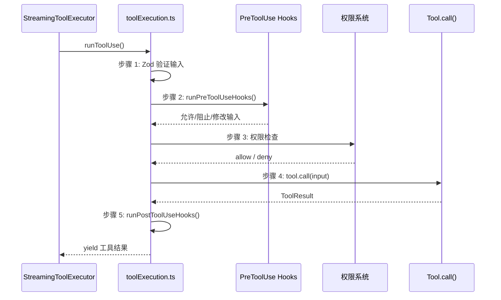

> 源码验证日期：2026-05-15，基于 commit `0d81bb6`

AI 决定要执行 `git status`。这不是一个模拟——这条命令会在你的电脑上真实地运行。

上一章结束时，AI 完成了思考，输出了一段结构化的 JSON：工具名是 `Bash`，参数是 `{ command: "git status" }`。`tool_use` 块已经被识别出来，工具对象也找到了。

但"执行"到底是什么意思？你的终端里明明只有一个 Claude Code 程序在运行，它又不是操作系统，怎么能让另一条命令跑起来？

这就要说到 Claude Code 的"手"了。

---

## 路线图


---

## 源码入口

本章追踪的调用链：

```
StreamingToolExecutor 的 addTool() 添加工具到队列
  → src/services/tools/toolExecution.ts  (checkPermissionsAndCallTool — 执行链)
    → src/tools/BashTool/BashTool.tsx     (call — Bash 工具执行)
      → src/utils/Shell.ts               (exec — spawn 子进程)
```

---

## 完整执行链：五步走

工具执行不是一步到位的。在 `checkPermissionsAndCallTool` 函数里，有一个精心设计的五步链：



**步骤 1：Zod 验证。** 检查 AI 传过来的参数格式是否正确。

**步骤 2：PreToolUse Hooks。** 执行前置钩子——用户或插件注册的脚本，可以阻止执行或修改输入。

**步骤 3：权限检查。** 下一章详细讲——决定这条命令能不能跑。

**步骤 4：工具调用。** 真正执行工具。

**步骤 5：PostToolUse Hooks。** 后置钩子——在结果返回之前做额外处理。

---

## 工具箱里的扳手：BashTool

BashTool 是 Claude Code 工具箱里最基础、最常用的扳手。它的职责很简单：接收一条命令字符串，在你的电脑上执行它，把结果带回来。

```typescript
// → src/tools/BashTool/BashTool.tsx 的 BashTool 定义
export const BashTool = buildTool({
  name: BASH_TOOL_NAME,
  searchHint: 'execute shell commands',
  maxResultSizeChars: 30_000,
  strict: true,
  async description({ description }) {
    return description || 'Run shell command'
  },
  // ...
})
```

`buildTool` 是所有工具的"模具"。不管你是读文件的 FileReadTool、写文件的 FileWriteTool，还是执行命令的 BashTool，都通过同一个 `buildTool` 创建。这是一个工厂模式——同一条生产线造出不同的工具。

---

## 输入格式：Zod 安检

AI 返回的工具调用是 JSON 格式的。但 JSON 可以装任何东西。程序怎么知道这个 JSON 是不是 BashTool 能接受的格式？

答案是 **Zod**——一个 TypeScript 的数据验证库。BashTool 的输入蓝图：

```typescript
// → src/tools/BashTool/BashTool.tsx 的输入 Schema
const fullInputSchema = lazySchema(() => z.strictObject({
  command: z.string().describe('The command to execute'),
  timeout: semanticNumber(z.number().optional())
    .describe(`Optional timeout in milliseconds (max ${getMaxTimeoutMs()})`),
  description: z.string().optional()
    .describe('Clear, concise description of what this command does...'),
  run_in_background: semanticBoolean(z.boolean().optional())
    .describe('Set to true to run this command in the background.'),
  dangerouslyDisableSandbox: semanticBoolean(z.boolean().optional())
    .describe('Set this to true to dangerously override sandbox mode...'),
}))
```

逐行翻译成白话：

- `command`：一个字符串，必填。要执行的命令，比如 `"git status"`。
- `timeout`：一个数字，选填。多久之后强制停掉。
- `description`：一个字符串，选填。AI 给这条命令的简短描述。
- `run_in_background`：一个布尔值，选填。是否在后台运行。
- `dangerouslyDisableSandbox`：一个布尔值，选填。名字里就有"dangerously"——程序在用命名警告你。

当 AI 返回 `{ command: "git status", description: "Show working tree status" }` 时，Zod 逐个字段检查，全部通过，放行。如果 AI 返回了 `{ command: 123 }`——`command` 是个数字——Zod 立刻拦住。

这就像机场的安检：不管你带的是什么，都得过一遍扫描仪。格式对了放行，格式不对挡住。

---

## 子进程：让另一个程序替你跑腿

输入验证通过了。现在到了最关键的一步：怎么在你的电脑上执行 `git status`？

你的 Claude Code 是一个正在运行的 Node.js 进程。它自己没法直接运行 `git status`，因为 `git` 是另一个完全独立的程序。这就像你在办公室里坐着，想让楼下打印店帮你打印一份文件——你得把文件送下去，等打印完再拿回来。

在编程的世界里，这叫"子进程"（child process）。Node.js 提供了 `child_process` 模块，让你的程序去启动另一个程序。

```typescript
// → src/utils/Shell.ts 的子进程创建
const childProcess = spawn(spawnBinary, shellArgs, {
  env: {
    ...subprocessEnv(),
    SHELL: shellType === 'bash' ? binShell : undefined,
    GIT_EDITOR: 'true',
    CLAUDECODE: '1',
    ...envOverrides,
  },
  cwd,
  stdio: usePipeMode
    ? ['pipe', 'pipe', 'pipe']
    : ['pipe', outputHandle?.fd, outputHandle?.fd],
  detached: provider.detached,
  windowsHide: true,
})
```

这段代码做了几件事：

**第一，选择 shell。** `spawnBinary` 是 shell 的路径，通常是 `/bin/zsh` 或 `/bin/bash`。Claude Code 自动检测你系统上的 shell，优先用你配置的那个。

**第二，设置环境变量。** `CLAUDECODE: '1'` 让其他程序知道"我是被 Claude Code 启动的"。`GIT_EDITOR: 'true'` 防止 git 尝试打开交互式编辑器——因为 Claude Code 运行在终端里，没有可用的交互编辑器。

**第三，设置工作目录。** `cwd` 让子进程在你的项目目录下执行命令——这样 `git status` 才能正确找到 `.git` 文件夹。

**第四，配置输入输出。** `stdio` 控制子进程的输入输出管道。`['pipe', 'pipe', 'pipe']` 表示子进程的输入输出被"接管"了，Claude Code 可以通过管道读取输出。

`spawn` 一执行，操作系统就创建一个新的进程。这个新进程独立运行，执行你请求的命令，然后退出。

---

## 输出：命令的"嘴"和"错误喇叭"

命令跑完了，结果得拿回来。但一个命令的输出其实分两路：

- **stdout**（标准输出）：命令的"嘴"——说正常的、预期的内容。`git status` 把仓库状态打印到 stdout。
- **stderr**（标准错误）：命令的"错误喇叭"——喊出错了、警告、辅助信息。

在 BashTool 的输出定义里，你可以清楚地看到这种区分：

```typescript
// → src/tools/BashTool/BashTool.tsx 的输出 Schema
const outputSchema = lazySchema(() => z.object({
  stdout: z.string().describe('The standard output of the command'),
  stderr: z.string().describe('The standard error output of the command'),
  interrupted: z.boolean().describe('Whether the command was interrupted'),
  // ...还有更多字段
}))
```

有趣的细节——stdout 和 stderr 在底层被合并到同一个文件描述符：

```typescript
// → src/utils/Shell.ts 的 stdio 配置
stdio: usePipeMode
  ? ['pipe', 'pipe', 'pipe']
  : ['pipe', outputHandle?.fd, outputHandle?.fd],
```

`outputHandle?.fd` 重复出现了两次——stdout 和 stderr 都指向同一个文件描述符。在 POSIX 系统上，`O_APPEND` 标志保证每次写入都是原子的，所以输出会按时间顺序交替出现，不会互相打断。

---

## 超时和中断：命令跑太久了怎么办

有些命令可能会跑很久。Claude Code 为此设计了超时机制。

默认超时时间——30 分钟（`DEFAULT_TIMEOUT = 30 * 60 * 1000`，在 Shell.ts 中定义）。AI 可以在输入里指定一个更短的 `timeout`。

当超时到了，或者用户按下了 Ctrl+C 想中断命令，会发生什么？

Claude Code 使用 `AbortController`——JavaScript 的标准机制，专门用来发出"停！"的信号：

```typescript
// → src/tools/BashTool/BashTool.tsx 的 call 方法
async call(input: BashToolInput, toolUseContext, ...) {
  const { abortController, ... } = toolUseContext;
  const commandGenerator = runShellCommand({
    input,
    abortController,
    // ...
  });
```

`abortController` 就像遥控器上的"停止"按钮。当超时到了或者用户主动中断时，程序按下这个按钮，信号沿着管道传到子进程，子进程停止执行。

如果命令被中断了，结果里会标记 `interrupted: true`。AI 看到后就知道命令没跑完，可以根据情况决定是重试还是换一种方式。

还有一个更精细的机制——`run_in_background` 选项。设置之后，命令在后台执行，AI 可以继续和你对话。等命令跑完了，系统会发通知告诉 AI 结果出来了。

---

## 兄弟错误级联

当多个工具并行执行时，如果其中一个 Bash 命令失败了，会取消所有并行的兄弟：

```typescript
// → src/services/tools/StreamingToolExecutor.ts 的错误级联
if (isErrorResult) {
  if (tool.block.name === BASH_TOOL_NAME) {
    this.hasErrored = true
    this.erroredToolDescription = this.getToolDescription(tool)
    this.siblingAbortController.abort('sibling_error')
  }
}
```

为什么只有 Bash 错误触发级联？因为 Read、Grep 等是独立的——一个失败不影响其他。但 Bash 命令经常有依赖关系（`mkdir` 失败 → `cp` 无意义），所以 Bash 失败时取消所有并行兄弟。

---

## 一条命令的一生

让我们把 `git status` 的完整旅程串一遍：

1. AI 决定使用 BashTool，输出 `tool_use` 块：`{ name: "Bash", input: { command: "git status" } }`
2. 代码用 Zod 验证输入：`command` 是字符串，格式正确
3. 执行 PreToolUse Hooks（如果有）
4. 权限检查通过（下一章详细讲）
5. BashTool 的 `call` 方法被调用，内部调用 `runShellCommand`
6. `runShellCommand` 调用 `Shell.ts` 的 `exec`，用 `spawn` 创建子进程
7. 子进程在项目目录下执行 `git status`，输出通过管道被捕获
8. 命令完成，执行 PostToolUse Hooks
9. 输出被打包成 `{ stdout: "...", stderr: "", interrupted: false }`，准备送回给 AI

从 AI 做出决定，到命令真正在你的电脑上执行，中间经过了输入验证、前置钩子、权限检查、子进程创建、输出捕获、后置钩子好几道工序。每一步都有检查、有保护、有预案。

这不是魔法。这是一个精心设计的系统。

---

## 常见错误与检查方法

| 常见错误 | 检查方法 |
|---------|---------|
| 命令执行失败（非零退出码） | 检查 stderr 输出和退出码 |
| 命令超时 | 检查 `timeout` 参数和 `AbortController` 状态 |
| 输入验证失败 | 检查 Zod `safeParse` 的错误信息 |
| 子进程无法启动 | 检查 `spawnBinary` 路径和 shell 配置 |
| PreToolUse Hook 阻止 | 检查 hook 返回的 `preventContinuation` |
| 工作目录不正确 | 检查 `cwd` 参数是否指向正确的项目目录 |

---

## 试试看

### 修改 1：观察工具执行链

在 `src/services/tools/toolExecution.ts` 的 `checkPermissionsAndCallTool` 中，`tool.call()` 前后加：

```typescript
console.log('[DEBUG] Tool start:', tool.name, 'at:', Date.now())
const result = await tool.call(callInput, ...)
console.log('[DEBUG] Tool end:', tool.name, 'duration:', Date.now() - startTime, 'ms')
```

运行后你应该看到类似输出：

```
[DEBUG] Tool start: Read at: 1747345678901
[DEBUG] Tool start: Grep at: 1747345678901
[DEBUG] Tool end: Read duration: 12 ms
[DEBUG] Tool end: Grep duration: 45 ms
[DEBUG] Tool start: Write at: 1747345678913
[DEBUG] Tool end: Write duration: 8 ms
```

### 修改 2：追踪子进程创建

在 `src/utils/Shell.ts` 的 `spawn` 调用之前加：

```typescript
console.log('[DEBUG] Spawning:', spawnBinary, 'args:', shellArgs, 'cwd:', cwd)
```

### 修改 3：观察超时和中断

在 BashTool 的 `call` 方法中，`abortController` 使用处加日志，追踪命令被中断的原因和时机。

---

## 检查点

你现在已经理解了：

- **完整执行链**：Zod 验证 → PreToolUse Hooks → 权限检查 → `tool.call()` → PostToolUse Hooks
- **BashTool**：`buildTool` 工厂函数创建，`call` 方法是执行入口
- **Zod 验证**：输入蓝图定义了 `command`、`timeout`、`description` 等字段及其约束
- **子进程机制**：`spawn` 创建新进程，环境变量标记 `CLAUDECODE: '1'`，`GIT_EDITOR: 'true'`
- **stdout/stderr**：双路输出在底层合并，原子写入保证顺序
- **超时和中断**：AbortController 信号传播，`run_in_background` 后台执行
- **兄弟错误级联**：Bash 失败取消并行兄弟，其他工具失败不影响
- **进度消息**：不等待完成就立即 yield，实现实时反馈

**下一站预告**：第 11 章将深入权限系统——在命令被执行之前，程序会问你"你确定吗？"。这个停顿背后是整套安全防线。

---

[← 上一章：AI说要执行命令](/posts/be993671/) | [下一章：你确定吗 →](/posts/7066806a/)
