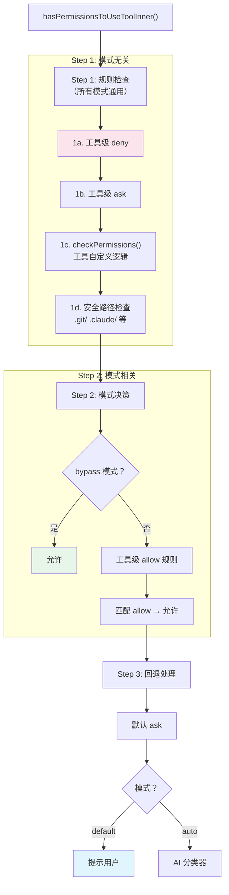

> 源码验证日期：2026-05-15，基于 commit `0d81bb6`

AI 要在你的电脑上执行命令。但程序停了下来，问你："你确定吗？"这个停顿不是多余的——它是你的安全网。

上一章里，`git status` 通过了输入验证，子进程的管道已经准备好，一切就绪。但在 `spawn` 被调用之前，还有一道关卡。程序拦住了这条命令，转头问你："Claude 想要使用 Bash，你还没有授权。"

你按下回车，命令才开始执行。

这个"按下回车"的动作看似简单，背后是一整套权限系统在工作。

---

## 路线图


---

## 源码入口

本章追踪的调用链：

```
toolExecution.ts 的 checkPermissionsAndCallTool()
  → src/utils/permissions/permissions.ts     (hasPermissionsToUseTool — 主入口)
    → src/utils/permissions/permissions.ts   (hasPermissionsToUseToolInner — 分层检查)
      → src/tools/BashTool/bashPermissions.ts (bashToolHasPermission — Bash 专用)
```

---

## 为什么需要权限系统

想象你雇了一个助手帮你管理文件。你会希望他能自主处理日常事务，但涉及到删除文件、执行系统命令这种大事，你一定会想先知道一声。不是因为你信不过他，而是因为有些操作一旦做了就收不回来。

Claude Code 面对的情况类似。AI 可以读取文件、执行命令、修改代码。这些操作一旦失控，后果可能很严重。所以 Claude Code 有一个基本原则：**AI 的每一个动作，都需要经过许可**。

许可不是一刀切的。有些操作你已经提前允许了，静默通过。有些你明确拒绝了，连尝试的机会都没有。还有些需要你当场拍板。三种状态，三种命运。

---

## 三种状态：allow、deny、ask

权限有三种行为（behavior）：

```typescript
// → src/utils/permissions/PermissionRule.ts 的 permissionBehaviorSchema
export const permissionBehaviorSchema = lazySchema(() =>
  z.enum(['allow', 'deny', 'ask']),
)
```

用保安的比喻来理解：

- **`'allow'`**——保安认识你，看过工牌了，直接放行。命令静默执行。
- **`'deny'`**——保安把你拦住了。不管什么情况，这条命令绝对不能执行。
- **`'ask'`**——保安不确定，需要你亲自确认。程序暂停，在终端里等你。

---

## 权限检查的入口

当 AI 决定使用某个工具，程序先问一个函数："这条工具调用有权限吗？"

```typescript
// → src/utils/permissions/permissions.ts 的 hasPermissionsToUseTool() 函数
export const hasPermissionsToUseTool: CanUseToolFn = async (
  tool,
  input,
  context,
  assistantMessage,
  toolUseID,
): Promise<PermissionDecision> => {
  const result = await hasPermissionsToUseToolInner(tool, input, context)

  if (result.behavior === 'allow') {
    // 重置连续拒绝计数器
    return result
  }

  if (result.behavior === 'ask') {
    const appState = context.getAppState()

    // dontAsk 模式：把 ask 变成 deny
    if (appState.toolPermissionContext.mode === 'dontAsk') {
      return {
        behavior: 'deny',
        decisionReason: { type: 'mode', mode: 'dontAsk' },
        message: DONT_ASK_REJECT_MESSAGE(tool.name),
      }
    }
    // ...还有 auto 模式等处理
  }
```

函数先调用 `hasPermissionsToUseToolInner` 拿到初步结果，然后根据 `behavior` 字段做不同处理。这是 TypeScript 里的**模式匹配**——检查联合类型的不同分支，走不同逻辑。

---

## 分层检查管线

`hasPermissionsToUseToolInner` 的内部是三步分层检查：



**核心原则：deny 始终覆盖 allow。** 无论什么模式，Step 1 的 deny 规则都会生效。

```typescript
// → src/utils/permissions/permissions.ts 的 hasPermissionsToUseToolInner() 函数（简化版）
function hasPermissionsToUseToolInner(tool, input, context) {
  // Step 1: 规则检查（所有模式通用）

  // 1a. 工具级 deny：整个工具被禁用
  const denyRule = getDenyRuleForTool(tool.name, context)
  if (denyRule) return { behavior: 'deny', reason: 'rule' }

  // 1b. 工具级 ask：需要提示
  const askRule = getAskRuleForTool(tool.name, context)
  if (askRule) return { behavior: 'ask', reason: 'rule' }

  // 1c. 工具自定义检查
  const toolResult = tool.checkPermissions(input, context)

  // Step 2: 模式决策
  if (isBypassMode(context)) return { behavior: 'allow' }
  if (toolAlwaysAllowedRule(tool.name, context)) return { behavior: 'allow' }

  // Step 3: 回退到 ask
  return { behavior: 'ask' }
}
```

---

## 权限模式：你选择哪种保安策略

Claude Code 有多种权限模式，最常见的三种：

| 模式 | 行为 | 对用户意味着什么 |
|------|------|----------------|
| `default` | 未被规则覆盖的每个工具调用都需要确认 | 最安全，每一步都能审查 |
| `bypassPermissions` | 跳过所有权限检查（除安全关键检查） | `--dangerously-skip-permissions` 标志 |
| `auto` | AI 分类器自动决定允许/拒绝 | 无需手动确认，Opus 模型做判断 |

```typescript
// → src/types/permissions.ts 的 PermissionMode 类型（简化版）
type PermissionMode =
  | 'default'           // 默认：逐个提示
  | 'plan'              // 计划模式：只读
  | 'acceptEdits'       // 自动接受文件编辑
  | 'bypassPermissions' // 跳过权限检查
  | 'dontAsk'           // 静默拒绝
  | 'auto'              // AI 分类器
```

模式初始化有优先级：`--dangerously-skip-permissions` 标志 > `--permission-mode` CLI 参数 > settings 配置。

---

## Bash 安全分析管线

BashTool 有最复杂的权限系统——因为 shell 命令的攻击面最大：

```typescript
// → src/tools/BashTool/bashPermissions.ts 的 bashToolHasPermission() 函数（简化版）
function bashToolHasPermission(command, context) {
  // 1. AST 安全解析（tree-sitter）
  const parseResult = parseCommandAST(command)

  if (parseResult === 'too-complex') {
    return { behavior: 'ask' }  // AST 无法静态分析 → ask
  }

  // 2. 语义检查：危险构造（eval、命令替换等）
  const semanticResult = checkSemantics(command)

  // 3. 沙盒自动允许（如果启用）
  if (isSandboxed && autoAllowBashIfSandboxed) {
    return { behavior: 'allow', sandboxed: true }
  }

  // 4. 精确匹配 deny/ask
  // 5. 子命令分割和逐个检查
  return checkSubcommands(command, context)
}
```

BashTool 还用两种机制判断命令是否只读：

- **命令白名单**（约 30 个命令）：git、grep、sed、sort、ps 等，每个命令定义 safeFlags
- **正则表达式匹配**（约 60 个命令）：cat、head、tail、wc、ls、find、diff 等

---

## 被拦下来时，你看到了什么

当命令被判定为 `'ask'`，程序生成一条详细的提示消息：

```typescript
// → src/utils/permissions/permissions.ts 的 createPermissionRequestMessage() 函数
export function createPermissionRequestMessage(
  toolName: string,
  decisionReason?: PermissionDecisionReason,
): string {
  if (decisionReason) {
    switch (decisionReason.type) {
      case 'rule': {
        const ruleString = permissionRuleValueToString(decisionReason.rule.ruleValue)
        return `Permission rule '${ruleString}' requires approval for ${toolName}`
      }
      case 'mode': {
        return `Current permission mode requires approval for ${toolName}`
      }
      // ... hook、safetyCheck 等
    }
  }
  return `Claude requested permissions to use ${toolName}, but you haven't granted it yet.`
}
```

这就是为什么你在终端里看到的权限提示总是很详细——它不是一句干巴巴的"你确定吗？"而是告诉你"为什么我要问你"。

---

## 权限永不跨会话恢复

**关键安全事实**：权限信任在每次会话中重新建立。`resume` 恢复对话时，所有 session 级别的权限规则不会恢复——用户需要重新确认工具调用。这是有意为之的设计：防止权限泄漏。

---

## 一条命令的权限旅程

让我们用 `git status` 把权限检查的完整流程串一遍：

1. AI 决定使用 BashTool，输出 `{ name: "Bash", input: { command: "git status" } }`
2. 程序调用 `hasPermissionsToUseTool`
3. `hasPermissionsToUseToolInner` 开始：先看 deny 规则——不在黑名单。再看 allow 规则——如果没有配置过，没匹配。工具自定义检查——`git status` 是只读命令
4. 如果初步结果是 `'ask'`，检查当前模式。`default` 模式保持 `'ask'`
5. 程序在终端显示权限提示，等你回应
6. 你按下回车（允许），命令开始执行

---

## 常见错误与检查方法

| 常见错误 | 检查方法 |
|---------|---------|
| 权限总是被拒绝 | 检查 deny 规则列表和当前模式 |
| 意外的权限提示 | 检查 `hasPermissionsToUseToolInner` 走了哪条分支 |
| dontAsk 模式下全被拒 | 检查模式是否正确设置 |
| auto 模式仍然询问 | 检查分类器的决策和 SAFE_YOLO_ALLOWLISTED_TOOLS |
| 规则不生效 | 检查规则来源优先级（policy > user > session） |

---

## 试试看

### 修改 1：观察权限决策

在 `src/utils/permissions/permissions.ts` 的 `hasPermissionsToUseTool` 函数中加：

```typescript
console.log('[DEBUG] Permission check:', tool.name, 'mode:', context.mode)
```

运行后你应该看到类似输出：

```
[DEBUG] Permission check: Read mode: default
[DEBUG] Permission check: Bash mode: default
[DEBUG] Permission check: Write mode: default
```

### 修改 2：测试 Bash 只读检测

在 `src/tools/BashTool/readOnlyValidation.ts` 的只读判断函数中加：

```typescript
console.log('[DEBUG] Bash readOnly:', isReadOnly, 'command:', input.command?.substring(0, 80))
```

运行后你应该看到类似输出：

```
[DEBUG] Bash readOnly: true command: ls -la
[DEBUG] Bash readOnly: true command: git status
[DEBUG] Bash readOnly: false command: rm -rf node_modules
```

### 修改 3：追踪规则匹配

在规则匹配函数中加日志，观察 deny/allow 规则如何匹配：

```typescript
console.log('[DEBUG] Rule match:', ruleSource, ruleBehavior, 'for:', toolName)
```

---

## 检查点

你现在已经理解了：

- **三种权限行为**：allow（放行）、deny（拒绝）、ask（确认）
- **分层检查管线**：Step 1 规则检查（模式无关）→ Step 2 模式决策 → Step 3 回退处理
- **核心原则**：deny 始终覆盖 allow，安全路径检查 bypass 不可覆盖
- **权限模式**：default（逐个提示）、bypass（跳过检查）、auto（AI 分类器）
- **Bash 安全分析**：AST 解析 → 语义检查 → 沙盒检测 → 规则匹配 → 子命令分割
- **只读命令检测**：白名单 + 正则两种机制，约 90 个命令
- **跨会话安全**：权限永不跨会话恢复，每次 resume 重新建立信任

**下一站预告**：第 12 章将追踪结果如何回到 AI 手中——工具输出被包装成 `tool_result`，追加到对话历史，整个对话被重新发送给 AI。

---

[← 上一章：命令真的被执行了](/posts/d42d8c3f/) | [下一章：结果回到AI手中 →](/posts/0a4b4b9a/)
