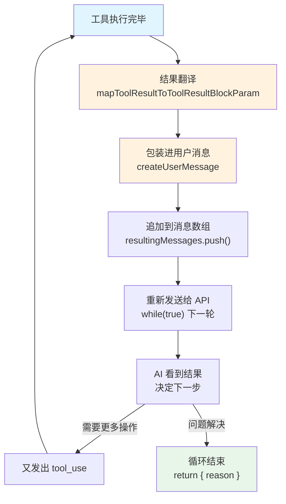

> 源码验证日期：2026-05-15，基于 commit `0d81bb6`

命令执行完了。结果——可能是一段输出，也可能是报错——现在需要被送回给 AI。

权限检查通过了，BashTool 执行了 `git status`。命令跑完了，终端吐出了一串文字。但这段文字现在还躺在工具函数的返回值里，AI 看不到它。

要让 AI 看到结果，Claude Code 需要做三件事：把结果包装成特定格式，把它放进对话流，然后把整个对话重新发送给 AI。

---

## 路线图


---

## 源码入口

本章追踪的调用链：

```
StreamingToolExecutor 收集工具结果
  → src/services/tools/toolExecution.ts  (addToolResult — 结果包装)
    → src/query.ts                       (消息历史更新 — while(true) 循环继续)
```

---

## 第一站：结果长什么样

当 `git status` 执行完毕，BashTool 返回的是一个结构化的对象——stdout、stderr、exit code、执行耗时。但 AI 不需要看到所有细节。

在结果被送回给 AI 之前，有一个"翻译"步骤。每个工具都有自己的实现——BashTool 把 stdout 和 stderr 拼起来，FileReadTool 返回文件内容，FileEditTool 返回 diff 信息。

翻译完之后，结果变成了一个固定格式：

```typescript
{
  type: 'tool_result',
  content: "On branch cmbt\nChanges not staged for commit...",
  is_error: false,
  tool_use_id: "toolu_01ABC123"
}
```

四个字段，各有各的意义：

- `type: 'tool_result'`——告诉 API "这是一个工具执行结果"
- `content`——实际的内容
- `is_error`——标记这次执行是否出了错
- `tool_use_id`——和之前 AI 发出的工具调用配对的 ID

`tool_use_id` 是关键。还记得第 9 章里每个工具调用都带了一个唯一的 ID 吗？现在结果里也带着同样的 ID。这样 API 就知道这个结果是哪条命令的回答——就像信封上的收件人地址。

---

## 第二站：包装进消息

光有结果还不够。在 Claude Code 的消息系统里，一条 `tool_result` 不是独立存在的。它必须被放进一条"用户消息"里。

为什么？因为从 API 的角度来看，对话只有两个角色：`assistant`（AI）和 `user`（你）。AI 发出工具调用，那是一个 `assistant` 消息的一部分。工具执行的结果，必须以 `user` 消息的形式回来。API 不认识第三个角色。

```typescript
// → src/services/tools/toolExecution.ts 的 addToolResult() 函数
async function addToolResult(
  toolUseResult: unknown,
  preMappedBlock?: ToolResultBlockParam,
) {
  const toolResultBlock = preMappedBlock
    ? await processPreMappedToolResultBlock(preMappedBlock, tool.name, tool.maxResultSizeChars)
    : await processToolResultBlock(tool, toolUseResult, toolUseID)

  const contentBlocks: ContentBlockParam[] = [toolResultBlock]
  // 如果用户在批准权限时附加了反馈，也一并加入
  if ('acceptFeedback' in permissionDecision && permissionDecision.acceptFeedback) {
    contentBlocks.push({
      type: 'text',
      text: permissionDecision.acceptFeedback,
    })
  }

  resultingMessages.push({
    message: createUserMessage({
      content: contentBlocks,
      toolUseResult: toolUseResult,
      sourceToolAssistantUUID: assistantMessage.uuid,
    }),
  })
}
```

`resultingMessages.push(...)` ——每个工具执行完毕，结果就被 `push` 进消息数组。如果 AI 一次调用了三个工具，这个数组就 `push` 三次。

还有一个有趣的细节：如果你在批准权限时顺便写了点什么（比如"记得加上 --verbose"），这段话也会被当作 `text` 块塞进同一个消息里。这样 AI 不仅能看到命令的结果，还能看到你的额外要求。

---

## 出错了怎么办

错误和成功走的路径几乎一样，只有一个关键区别：`is_error` 被设为 `true`。

```typescript
// → src/services/tools/toolExecution.ts 的错误处理
return [
  {
    message: createUserMessage({
      content: [{
        type: 'tool_result',
        content: `<tool_use_error>InputValidationError: ${errorContent}</tool_use_error>`,
        is_error: true,
        tool_use_id: toolUseID,
      }],
      toolUseResult: `InputValidationError: ${parsedInput.error.message}`,
      sourceToolAssistantUUID: assistantMessage.uuid,
    }),
  },
]
```

错误内容被 `<tool_use_error>` 标签包裹。这不是为了好看，而是给 AI 一个明确的信号：这不是正常输出，这是错误。AI 看到这个标签，就知道需要换一种方式重试。

---

## 第三站：对话循环

结果准备好了。现在到了最关键的一步：把结果送回给 AI。

但这不是简单地发一条消息。Claude Code 把整个对话历史重新发送给 API——你的原始问题、AI 的第一次回答、AI 请求执行的工具、工具执行的结果，全部打包。

为什么要这样？因为 API 是"无状态"的。它不记得你们之前聊过什么。每次你调用 API，都得把完整的对话历史告诉它。就像给一个健忘的朋友写信——你每次都得把之前的来往信件全部附上。

在源码里，这个循环是 `query.ts` 的 `while(true)`：

```typescript
// → src/query.ts 的 queryLoop() 函数（简化版）
while (true) {
  // 准备消息历史
  // 调用 API
  // 收到 AI 的回复
  // 如果 AI 请求了工具：
  //   执行工具
  //   把结果加入消息历史
  //   回到循环开头，重新发送给 API
  // 如果 AI 没有请求工具：
  //   跳出循环，结束
}
```

`while (true)` 会一直跑，直到 AI 的回复不再包含工具调用——也就是说，AI 直接给出了文字回复。

当一轮工具执行全部完成，所有结果收集完毕后：

```typescript
// → src/query.ts 的状态更新
const next: State = {
  messages: [...messagesForQuery, ...assistantMessages, ...toolResults],
  turnCount: turnCount + 1,
  // ...
}
state = next
```

旧的消息、AI 的回复、工具的结果，全部用 `...` 展开运算符拼在一起，变成新一轮对话的起点。`state = next` 把新的对话状态赋给 `state`，然后 `while(true)` 把你带回循环开头。

---

## 多轮工具调用：一次不够

解决一个 bug 很少只需要一条命令。AI 看了 `git status`，又发出 `git diff`。等 `git diff` 的结果回来，发现需要读一个文件，又调用 FileReadTool。

每一轮工具调用都经历同样的流程：AI 请求 → 权限检查 → 执行 → 结果包装 → 追加到对话历史 → 重新发送给 API。

当然，循环不是无限期的。Claude Code 有一个最大轮次限制：

```typescript
// → src/query.ts 的 maxTurns 检查
if (maxTurns && nextTurnCount > maxTurns) {
  yield createAttachmentMessage({
    type: 'max_turns_reached',
    maxTurns,
    turnCount: nextTurnCount,
  })
  return { reason: 'max_turns', turnCount: nextTurnCount }
}
```

就像棋局有步数限制，对话也有轮次上限。如果 AI 在限定的轮次内还没解决问题，循环强制终止。

---

## 结果的旅途，一图以蔽之



从命令执行完毕到 AI 看到结果，只有四步：

1. **翻译**成 `tool_result` 格式
2. **包装**进一条用户消息
3. **追加**到消息数组
4. **重新发送**整个对话历史给 API

如果 AI 又请求了工具，回到第 1 步。如此循环。

这就是 Claude Code 的心跳：提问、执行、反馈、再提问。每一次循环都让 AI 离答案更近一步。

---

## 常见错误与检查方法

| 常见错误 | 检查方法 |
|---------|---------|
| 工具结果没回到 AI | 检查 `resultingMessages.push()` 是否被执行 |
| tool_use_id 不匹配 | 检查结果中的 `tool_use_id` 是否与请求一致 |
| 结果格式不对 | 检查 `processToolResultBlock` 的输出 |
| 对话循环不终止 | 检查 `needsFollowUp` 是否正确设为 `false` |
| 超过最大轮次 | 检查 `maxTurns` 配置和 `turnCount` 计数 |

---

## 试试看

### 修改 1：观察工具结果

在 `src/services/tools/toolExecution.ts` 的 `addToolResult` 函数中加：

```typescript
console.log('[DEBUG] Tool result:', tool.name, 'is_error:', toolResultBlock.is_error,
  'content length:', String(toolResultBlock.content).length)
```

### 修改 2：追踪对话循环

在 `src/query.ts` 的 `while(true)` 循环开头加：

```typescript
console.log('[DEBUG] Loop turn:', state.turnCount, 'messages:', state.messages.length)
```

运行后你应该看到类似输出：

```
[DEBUG] Loop turn: 1 messages: 3
[DEBUG] Loop turn: 2 messages: 7
[DEBUG] Loop turn: 3 messages: 11
```

### 修改 3：观察 needsFollowUp

在 `src/query.ts` 的 `needsFollowUp` 判断处加：

```typescript
console.log('[DEBUG] needsFollowUp:', needsFollowUp, 'tool_use blocks:', toolUseBlocks.length)
```

---

## 检查点

你现在已经理解了：

- **结果翻译**：工具输出被转换成 `tool_result` 格式，包含 type、content、is_error、tool_use_id
- **消息包装**：结果被放进用户消息（因为 API 只认识 assistant 和 user 两个角色）
- **用户反馈注入**：批准权限时的附加文字也会被包含在结果消息中
- **错误标记**：`is_error: true` + `<tool_use_error>` 标签让 AI 识别错误
- **对话循环**：`while(true)` + 状态更新 + `continue`，直到 AI 不再请求工具
- **展开运算符**：`[...oldMessages, ...toolResults]` 拼接新旧消息
- **轮次限制**：`maxTurns` 防止无限循环

**下一站预告**：第 13 章将讲述对话越来越长时发生的事——上下文窗口、token 阈值、自动压缩。

---

[← 上一章：你确定吗](/posts/7066806a/) | [下一章：对话越来越长 →](/posts/5c1bade7/)
