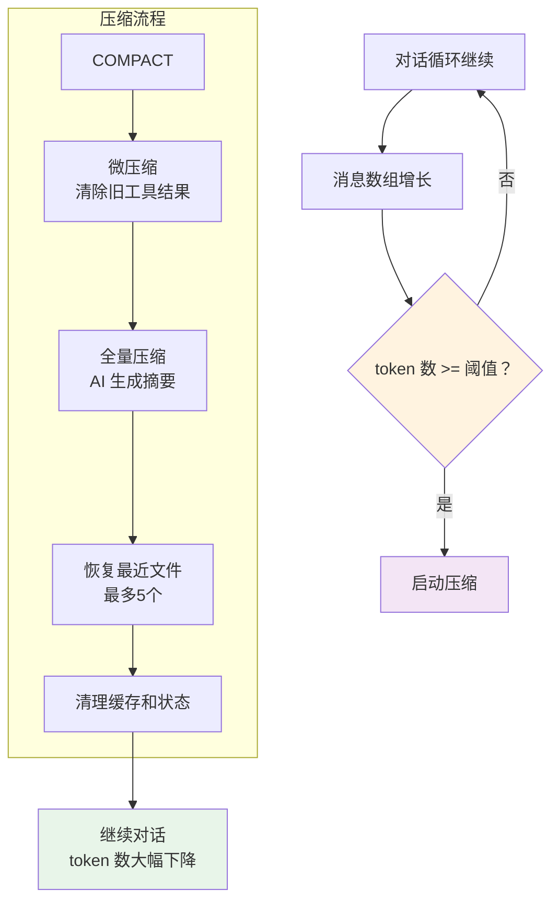

> 源码验证日期：2026-05-15，基于 commit `0d81bb6`

你的对话已经很长了。用户消息、AI 回答、工具调用、工具结果……加起来可能有好几万字。但 AI 的"记忆"是有限的。

AI 读到了工具执行的结果，根据这些结果继续思考，又决定执行下一条命令、读另一个文件、再做一次搜索。一轮接一轮，消息数组越来越长。

一切看起来运转正常。但在平静的水面下，一个危机正在酝酿。

---

## 路线图


---

## 白板满了

想象你站在一块白板前。这块白板就是 AI 能"看到"的全部内容。白板很大——大约 200,000 个 token——但它不是无限大的。

一轮典型的调试会话会消耗多少？你的消息几十个 token，AI 的回答几百个 token，然后读文件——几千个 token，搜索代码——又是几千个 token，再来一轮工具调用和结果……

一轮下来几千个 token。聊上十轮、二十轮，加上文件内容、命令输出，token 数量很快就会逼近白板的边缘。白板满了会怎样？新内容写不进去了。对话就断了。

所以在白板写满之前，必须做一件事：擦掉一些旧内容，腾出空间来。但不是随便擦——你需要一种聪明的方式来"总结"旧内容。

这个过程叫 **compact**（压缩）。

---

## 源码入口

本章追踪的调用链：

```
src/query.ts 的 queryLoop() 每轮开始前
  → src/services/compact/autoCompact.ts  (shouldAutoCompact — 是否需要压缩)
    → src/services/compact/microCompact.ts  (微压缩 — 清除旧工具结果)
    → src/services/compact/compact.ts       (compactConversation — 全量压缩)
```

---

## 三道防线：从轻到重

第 7 章介绍了四层压缩管线（Tool Result Budget → Snip → Microcompact → Autocompact），其中 Snip 是对工具结果中过长行的截断处理。本章聚焦的是**需要 API 调用的**压缩防线，Snip 是纯本地字符串操作（零 API 成本），因此归入第一道 Tool Result Budget 的范畴不再单独列出。以下三道防线按"轻量"到"重量"排列：

### 第一道：Tool Result Budget（裁剪过大输出）

最轻量的处理——直接裁剪过大的工具输出。每个工具都定义了 `maxResultSizeChars`，BashTool 是 30,000 字符。超过限制的输出会被截断，附带一个说明。

### 第二道：微压缩（Micro-compact）

微压缩是最安静的记忆术。它不生成摘要，不重启对话，只是悄悄地把旧工具的执行结果清空：

```typescript
// → src/services/compact/microCompact.ts 的清除标记
export const TIME_BASED_MC_CLEARED_MESSAGE = '[Old tool result content cleared]'
```

不是所有工具结果都会被清除。有一个白名单：

```typescript
// → src/services/compact/microCompact.ts 的可清除工具
const COMPACTABLE_TOOLS = new Set<string>([
  FILE_READ_TOOL_NAME,   // 读文件
  ...SHELL_TOOL_NAMES,   // Shell 命令
  GREP_TOOL_NAME,        // 搜索
  GLOB_TOOL_NAME,        // 文件匹配
  WEB_SEARCH_TOOL_NAME,  // 网页搜索
  WEB_FETCH_TOOL_NAME,   // 网页抓取
  FILE_EDIT_TOOL_NAME,   // 文件编辑
  FILE_WRITE_TOOL_NAME,  // 文件写入
])
```

这些工具的输出通常很长，但信息在后续对话中往往已经被"消化"了。

微压缩有两种触发方式：基于时间（距上一次 AI 回复超过 60 分钟）和基于缓存编辑（通过 API 的 `cache_edits` 功能，不修改本地消息内容）。

### 第三道：全量压缩（Autocompact）

当微压缩不够用时，Claude Code 祭出最后的手段——让 AI 自己读一遍整个对话，然后写一段摘要。旧的对话被丢弃，只保留这段摘要。

压缩提示词要求摘要必须包含九个部分：

```
1. Primary Request and Intent        -- 用户的主要请求
2. Key Technical Concepts            -- 关键技术概念
3. Files and Code Sections           -- 涉及的文件和代码
4. Errors and fixes                  -- 遇到的错误和修复方式
5. Problem Solving                   -- 问题解决过程
6. All user messages                 -- 所有用户消息（非工具结果）
7. Pending Tasks                     -- 待办任务
8. Current Work                      -- 当前正在做的工作
9. Optional Next Step                -- 下一步计划
```

注意第 6 条——要求列出**所有用户消息**。工具结果可以重新获取，但用户说过什么，一旦丢失就无法恢复。

压缩指令里还明确写了"不要使用任何工具"：

```
CRITICAL: Respond with TEXT ONLY. Do NOT call any tools.
```

为什么？如果 AI 在压缩过程中又去调工具，就完全本末倒置了——压缩的目的是节省 token。

---

## 什么时候该压缩

Claude Code 用 `shouldAutoCompact` 函数判断：

```typescript
// → src/services/compact/autoCompact.ts 的 shouldAutoCompact() 函数（简化版）
export async function shouldAutoCompact(
  messages: Message[],
  model: string,
  querySource?: QuerySource,
  snipTokensFreed = 0,
): Promise<boolean> {
  // 递归保护：压缩内部的 AI 调用不能再触发压缩
  if (querySource === 'session_memory' || querySource === 'compact') {
    return false
  }

  if (!isAutoCompactEnabled()) {
    return false
  }

  const tokenCount = tokenCountWithEstimation(messages) - snipTokensFreed
  const threshold = getAutoCompactThreshold(model)

  const { isAboveAutoCompactThreshold } = calculateTokenWarningState(
    tokenCount,
    model,
  )

  return isAboveAutoCompactThreshold
}
```

几个关键设计决策：

**递归保护。** 压缩本身就是一次 AI 调用。如果这次调用又触发了压缩检查，就会陷入死循环。所以代码明确排除了 `compact` 来源。

**阈值计算。** 不是等于白板大小时才触发，而是留了 13,000 token 的缓冲区：

```typescript
// → src/services/compact/autoCompact.ts
export const AUTOCOMPACT_BUFFER_TOKENS = 13_000
```

为什么需要缓冲区？因为从判断"该压缩了"到真正完成压缩，用户可能又发了一条消息，AI 可能又开始了一轮工具调用。这 13,000 token 就是给这段"空档期"留的余量。

**熔断器。** 连续失败 3 次就不再尝试：

```typescript
const MAX_CONSECUTIVE_AUTOCOMPACT_FAILURES = 3
```

这是一个自我保护机制——避免在上下文已经爆炸的情况下反复发起注定失败的 API 调用。

---

## 压缩之后

AI 生成了摘要。旧的对话消息被替换为：

```typescript
// → src/services/compact/compact.ts 的 buildPostCompactMessages() 函数
export function buildPostCompactMessages(result: CompactionResult): Message[] {
  return [
    result.boundaryMarker,        // 压缩边界标记
    ...result.summaryMessages,    // 摘要消息
    ...(result.messagesToKeep ?? []), // 保留的最近消息
    ...result.attachments,        // 附件信息
    ...result.hookResults,        // 钩子结果
  ]
}
```

压缩前后，消息数组的变化：

```
压缩前（50 条消息，180,000 token）:
  [系统消息, 用户消息, AI回复, 工具调用, 工具结果, ...]

压缩后（8 条消息，40,000 token）:
  [压缩边界标记, 摘要消息, 最近的用户消息, 最近的AI回复, 附件信息]
```

从 180,000 降到 40,000，腾出大量空间。对话可以继续了。

压缩后，系统还会自动重新读取最近访问过的文件（最多 5 个，每个不超过 5000 token），作为附件注入——防止 AI 在压缩后忘记它正在编辑的文件内容。

```typescript
// → src/services/compact/compact.ts 的恢复预算
export const POST_COMPACT_MAX_FILES_TO_RESTORE = 5
export const POST_COMPACT_TOKEN_BUDGET = 50_000
export const POST_COMPACT_MAX_TOKENS_PER_FILE = 5_000
```

---

## 压缩后的清理

压缩完成后，还有大量缓存和状态需要重置：

```typescript
// → src/services/compact/postCompactCleanup.ts 的 runPostCompactCleanup() 函数
export function runPostCompactCleanup(querySource?: QuerySource): void {
  resetMicrocompactState()        // 重置微压缩状态
  clearSystemPromptSections()     // 清空系统提示缓存
  clearClassifierApprovals()      // 清空分类器审批缓存
  clearSpeculativeChecks()        // 清空推测性权限检查
  clearSessionMessagesCache()     // 清空会话消息缓存
  // ...不清除已调用的技能（skill）内容——技能必须跨压缩存活
}
```

---

## 白板永远不会满



整个过程对你是透明的。你可能注意到屏幕上闪过一行 "Compacting conversation..."，但除此之外一切如常。AI 依然记得你的核心需求，依然知道之前改了哪些文件，只是它"记住"的方式从"逐字复述"变成了"概括总结"。

白板永远不会满。因为每次快要满的时候，就会有人来擦掉旧内容，写上一段简洁的摘要，腾出空间来写新的东西。

---

## 常见错误与检查方法

| 常见错误 | 检查方法 |
|---------|---------|
| 压缩频繁触发 | 检查 `AUTOCOMPACT_BUFFER_TOKENS` 和对话长度 |
| 压缩后丢失关键信息 | 检查压缩提示词中的 9 个部分是否完整 |
| 压缩连续失败 | 检查熔断器 `MAX_CONSECUTIVE_AUTOCOMPACT_FAILURES` |
| 压缩后 AI 忘记文件 | 检查 `POST_COMPACT_MAX_FILES_TO_RESTORE` 是否足够 |
| 递归压缩 | 检查 `querySource` 过滤是否正确 |

---

## 试试看

### 修改 1：观察压缩触发

在 `src/services/compact/autoCompact.ts` 的 `shouldAutoCompact` 中加：

```typescript
console.log('[DEBUG] Auto-compact check:', tokenCount, 'vs threshold:', threshold, 'result:', isAboveAutoCompactThreshold)
```

### 修改 2：追踪微压缩

在 `src/services/compact/microCompact.ts` 的清除逻辑中加：

```typescript
console.log('[DEBUG] Micro-compact cleared:', toolName, 'saved:', savedTokens, 'tokens')
```

### 修改 3：观察压缩前后对比

在 `src/services/compact/compact.ts` 的 `compactConversation` 中加：

```typescript
console.log('[DEBUG] Compact: before', preCompactTokenCount, 'tokens,',
  messages.length, 'messages')
// ... 压缩后 ...
console.log('[DEBUG] Compact: after', postCompactTokenCount, 'tokens,',
  resultMessages.length, 'messages')
```

---

## 检查点

你现在已经理解了：

- **上下文窗口**：AI 的"白板"有限（约 200K token），满了就写不进去
- **三道防线**：Tool Result Budget（裁剪）→ 微压缩（清旧工具结果）→ 全量压缩（AI 生成摘要）
- **微压缩**：白名单控制哪些工具可清除，基于时间（60 分钟）或缓存编辑
- **全量压缩**：9 部分摘要模板，"不要使用任何工具"的严格约束
- **触发阈值**：有效窗口 - 13,000 token 的缓冲区
- **递归保护**：压缩内部的 AI 调用不会再触发压缩
- **熔断器**：连续失败 3 次停止尝试
- **压缩后恢复**：自动重新读取最近 5 个文件（每个不超过 5000 token）
- **清理机制**：重置微压缩状态、系统提示缓存、分类器审批缓存等

**下一站预告**：第 14 章将追踪屏幕上的每一帧——流式事件如何变成终端上的字符，Ink 框架的帧渲染管线。

---

[← 上一章：结果回到AI手中](/posts/0a4b4b9a/) | [下一章：屏幕上的每一帧 →](/posts/0f77bc7d/)
