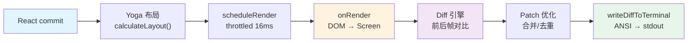

> 源码验证日期：2026-05-15，基于 commit `0d81bb6`

消息在系统内部流转了这么久——从你的键盘到消息封装，从网络请求到 AI 思考，从工具调用到结果返回，从对话压缩到重新开始——但你还什么都看不到。你的屏幕上发生了什么？

这一章追踪最后一公里：流式事件如何变成终端上的字符。

---

## 路线图


---

## 源码入口

本章追踪的调用链：

```
REPL.tsx 的 for await (event of query(...)) 循环
  → src/utils/messages.ts          (handleMessageFromStream — 事件分发)
    → React setState               (streamingText / messages)
      → React Reconciler           (重新渲染组件树)
        → src/ink/reconciler.ts    (自定义 host config)
          → src/ink/ink.tsx         (Ink 核心 — 帧渲染循环)
            → src/ink/renderer.ts   (DOM 树 → 屏幕缓冲)
              → src/ink/log-update.ts (差异引擎)
                → src/ink/terminal.ts  (ANSI 写入 stdout)
```

---

## 流式事件到 React 状态

REPL.tsx 的核心数据流：

```typescript
// → src/screens/REPL.tsx 的 query() 消费（简化版）
for await (const event of query({messages, systemPrompt, ...})) {
  onQueryEvent(event)
}
```

`handleMessageFromStream` 把 SSE 事件分发到 React 状态：

```typescript
// → src/utils/messages.ts 的 handleMessageFromStream() 函数（简化版）
export function handleMessageFromStream(event, {
  onSetStreamMode,
  onStreamingText,
  onStreamingToolUses,
  onMessage,
}) {
  switch (event.type) {
    case 'content_block_start':
      if (event.content_block.type === 'text') {
        onSetStreamMode('responding')
      }
      break

    case 'content_block_delta':
      if (event.delta.type === 'text_delta') {
        // 追加文字——逐字流式更新
        onStreamingText(text => (text ?? '') + event.delta.text)
      }
      if (event.delta.type === 'input_json_delta') {
        // 工具输入流式更新
        onStreamingToolUses(/* ... */)
      }
      break

    default:
      if (event.type === 'assistant') {
        onMessage(event)
      }
  }
}
```

**关键设计**：`onStreamingText` 用函数式更新 `text => (text ?? '') + delta`，每个文字 delta 追加到已有文本末尾。

REPL 维护了几个流式状态：

```typescript
// → src/screens/REPL.tsx 的流式状态
const [streamingText, setStreamingText] = useState<string | null>(null)
const [streamingToolUses, setStreamingToolUses] = useState<StreamingToolUse[]>([])
const [streamingThinking, setStreamingThinking] = useState<StreamingThinking | null>(null)
```

有趣的细节——`visibleStreamingText` 按行截断：

```typescript
// → src/screens/REPL.tsx 的 visibleStreamingText
const visibleStreamingText = streamingText
  ? streamingText.substring(0, streamingText.lastIndexOf('\n') + 1) || null
  : null
```

只有到换行符为止的内容才显示。这避免了最后一行的部分渲染闪烁。

---

## 组件树：从根到消息

完整的组件层级：

```
<ThemeProvider>              // src/ink.ts: withTheme()
  <App>                      // src/components/App.tsx
    <AppStateProvider>       // 应用状态上下文
      <StatsProvider>        // 统计上下文
        <FpsMetricsProvider> // FPS 度量
          <REPL>             // src/screens/REPL.tsx
            <Messages>       // src/components/Messages.tsx
              <VirtualMessageList> // 虚拟滚动
                <MessageRow>
                  <Message>  // 按消息类型分发
```

`<VirtualMessageList>` 只渲染视口内的消息——长对话可能有 2800+ 条消息，不可能全部渲染。

---

## Message 分发：按类型渲染

```typescript
// → src/components/Message.tsx 的 MessageImpl() 组件（简化版）
function MessageImpl({ message }) {
  switch (message.type) {
    case 'assistant':
      return message.message.content.map(block => {
        switch (block.type) {
          case 'text': return <AssistantTextMessage block={block} />
          case 'tool_use': return <AssistantToolUseMessage block={block} />
          case 'thinking': return <ThinkingBlock block={block} />
        }
      })
    case 'user':
      return <UserMessage message={message} />
    case 'system':
      return message.subtype === 'compact_boundary'
        ? <CompactBoundaryMessage />
        : <SystemTextMessage text={message.text} />
    case 'grouped_tool_use':
      return <GroupedToolUseContent message={message} />
  }
}
```

每种消息类型有专门的渲染组件。两层 switch——先按消息类型，再按内容块类型。

---

## Ink 核心渲染循环

Claude Code 用的是一套自定义 Ink 框架——React 组件渲染到终端。不是 npm 上的 `ink` 包，而是一个深度定制的 fork。

`Ink` 类是渲染引擎的心脏：

```typescript
// → src/ink/ink.tsx 的 Ink 类（简化版）
class Ink {
  render(node: ReactNode): void {
    this.currentNode = node
    const tree = <App ...>{node}</App>
    reconciler.updateContainerSync(tree, this.container, null, noop)
    reconciler.flushSyncWork()
  }

  resetAfterCommit() {
    this.rootNode.onComputeLayout()  // Yoga 布局计算
    this.scheduleRender()             // 调度帧渲染
  }
}
```

**帧渲染管线**（throttled 到约 60fps）：



```typescript
// → src/ink/ink.tsx 的帧间隔常量
const FRAME_INTERVAL_MS = 16  // ~60fps

const deferredRender = (): void => queueMicrotask(this.onRender)
this.scheduleRender = throttle(deferRender, FRAME_INTERVAL_MS, {
  leading: true,
  trailing: true,
})
```

多个快速 `setState` 在一个帧间隔（16ms）内到达时，只触发一次渲染——文字 delta 被批量合并。

---

## 双层帧缓冲和差异引擎

```typescript
// → src/ink/ink.tsx 的 onRender() 方法（简化版）
onRender() {
  // 1. 渲染 DOM 树到 Screen 缓冲
  const frame = this.renderer({
    frontFrame: this.frontFrame,
    backFrame: this.backFrame,
    isTTY, terminalWidth, terminalRows,
  })

  // 2. 交换前后帧
  this.backFrame = this.frontFrame
  this.frontFrame = frame

  // 3. 差异对比
  const diff = this.log.render(prevFrame, frame)

  // 4. 优化补丁
  const optimized = optimize(diff)

  // 5. 写入终端
  writeDiffToTerminal(this.terminal, optimized)
}
```

Screen 缓冲是一个 2D 单元格网格，用三个池化结构节省内存：CharPool（字符池化）、StylePool（ANSI 样式池化）、HyperlinkPool（OSC 8 超链接池化）。

---

## Blit 优化：不变子树的快速复制

```typescript
// → src/ink/render-node-to-output.ts 的 renderNodeToOutput() 函数（简化版）
function renderNodeToOutput(node, output, options) {
  if (canBlit(node, options.prevScreen, nodeCache)) {
    // 直接从上一帧的屏幕缓冲复制单元格
    output.blit(prevScreen, rect)
    return  // 跳过整棵子树的重新渲染
  }

  for (const child of node.childNodes) {
    renderNodeToOutput(child, output, options)
  }
}
```

如果一棵子树没有变化（比如已滚出视口的历史消息），直接从上一帧的屏幕缓冲复制单元格，而不是重新遍历渲染。这是关键性能优化。

---

## OffscreenFreeze：滚动优化

`VirtualMessageList` 只渲染视口内的消息。滚出视口的消息被 `OffscreenFreeze` 包裹——它缓存最后一次可见时的子元素，不可见时返回相同引用。这防止了 spinner 动画等在不可见时仍然触发帧渲染。

---

## Markdown 渲染

```typescript
// → src/components/Markdown.tsx 的 Markdown 组件（简化版）
function Markdown({ content }) {
  const tokens = marked.lexer(content)  // 500 条 LRU 缓存
  return tokens.map(token => renderToken(token))
}
```

Markdown 渲染用 `marked.lexer()` 解析，结果被 LRU 缓存（按内容哈希，最多 500 条）。混合渲染策略：表格用 React 组件 + Flexbox 布局，其他内容用 ANSI 字符串。

---

## 完整管线回顾

从 API 流式事件到终端像素：

```
API SSE 事件到达
  → handleMessageFromStream()
    → setStreamingText(delta)        // React 状态更新
    → setMessages(append)            // 完整消息追加
  → React Reconciler
    → updateContainerSync()          // 同步协调
    → flushSyncWork()                // 刷新
  → resetAfterCommit()
    → Yoga calculateLayout()         // Flexbox 布局
    → scheduleRender()               // throttled 16ms
  → queueMicrotask → onRender()
    → renderer()                     // DOM → Screen 缓冲
    → log.render(prev, next)         // 差异对比 → Patch[]
    → optimize(patches)              // 合并/去重
    → writeDiffToTerminal()          // ANSI 转义序列 → stdout
```

---

## 常见错误与检查方法

| 常见错误 | 检查方法 |
|---------|---------|
| 渲染卡顿 | 检查 `scheduleRender` 的 throttle 是否生效 |
| 文字闪烁 | 检查 `visibleStreamingText` 的换行截断 |
| 内存占用高 | 检查 `VirtualMessageList` 的可见范围 |
| 差异对比慢 | 检查 Blit 优化是否跳过了不变子树 |
| 终端乱码 | 检查 ANSI 转义序列和终端编码 |

---

## 试试看

### 修改 1：观察帧渲染频率

在 `src/ink/ink.tsx` 的 `onRender` 方法开头加：

```typescript
console.log('[DEBUG] onRender at:', Date.now(), 'terminal size:', this.terminalColumns + 'x' + this.terminalRows)
```

运行后观察正常对话时的帧渲染频率——大约每 16ms 一帧。

### 修改 2：追踪消息渲染

在 `src/components/Message.tsx` 的 `MessageImpl` 开头加：

```typescript
console.log('[DEBUG] Message type:', message.type, 'subtype:', message.subtype ?? 'none')
```

### 修改 3：观察虚拟滚动

在 `src/components/VirtualMessageList.tsx` 中找到虚拟滚动逻辑，加：

```typescript
console.log('[DEBUG] Visible messages:', visibleStart, '-', visibleEnd, 'of', total)
```

长对话时观察只有可见范围的消息被渲染。

---

## 检查点

你现在已经理解了：

- **Ink 框架**：自定义 fork，用 React Reconciler 把组件渲染到终端
- **流式更新**：`handleMessageFromStream` 把 SSE 事件分发到 React 状态
- **组件树**：ThemeProvider → App → REPL → Messages → VirtualMessageList → Message
- **Message 分发**：两层 switch——先按消息类型，再按内容块类型
- **帧渲染管线**：React commit → Yoga 布局 → throttled onRender → Screen 缓冲 → Diff 引擎 → ANSI 写入
- **双层帧缓冲**：前后帧交换，差异引擎只对比变化部分
- **性能优化**：Blit（不变子树直接复制）、OffscreenFreeze（视口外冻结）、VirtualMessageList（只渲染可见消息）
- **Markdown 渲染**：marked.lexer + LRU 缓存 + 混合策略

**下一站预告**：第 15 章将回到 queryLoop 的循环控制——三阶段错误恢复、stop hooks、token 预算，以及循环的终点与起点。

---

[← 上一章：对话越来越长](/posts/5c1bade7/) | [下一章：循环的终点与起点 →](/posts/e9f1cbe9/)
