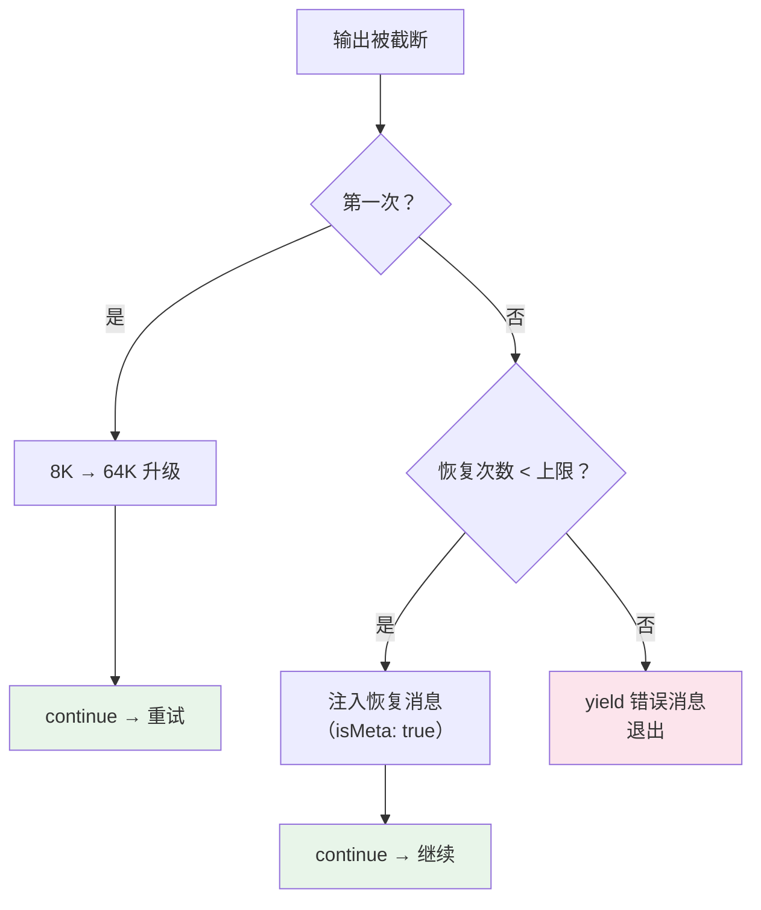
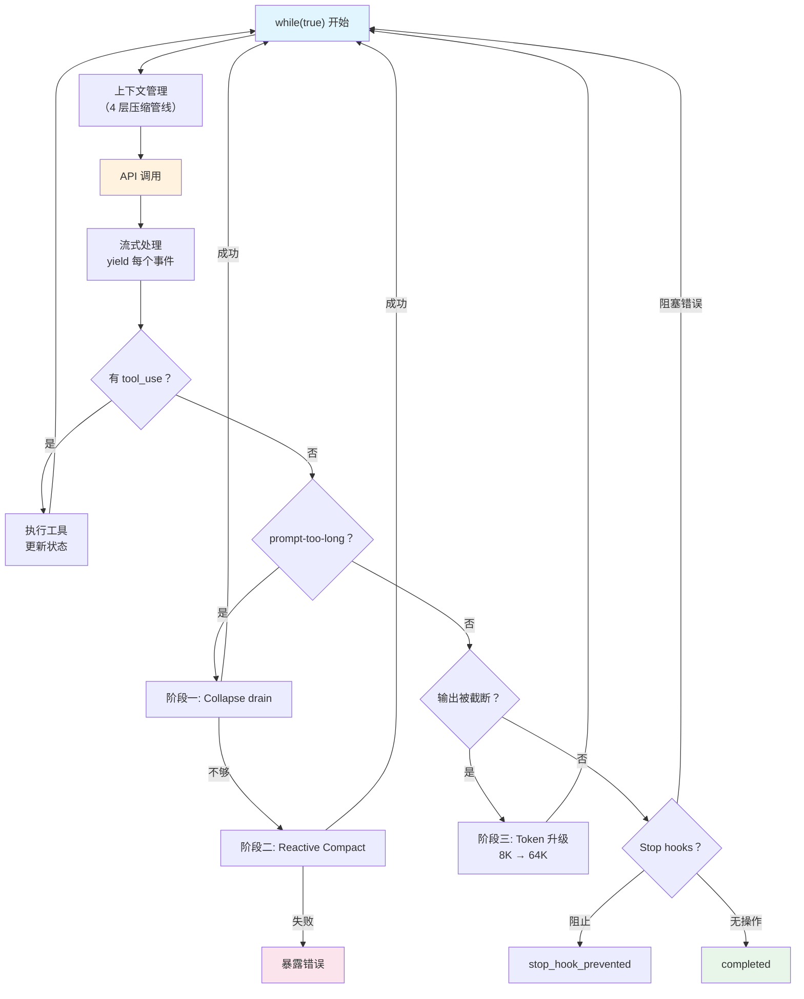

> 源码验证日期：2026-05-15，基于 commit `0d81bb6`

前两章追踪了渲染管线和上下文压缩。现在回到 queryLoop 的循环控制——它怎么决定继续还是停止、怎么处理错误恢复、循环的终点在哪里。

上一章看到了屏幕上的一帧一帧。但那些帧是从哪里来的？是从 `queryLoop` 的 `while(true)` 循环中 `yield` 出来的。循环不停止，帧就不停地产生。那循环什么时候停？

---

## 路线图


---

## 源码入口

本章追踪的调用链：

```
src/query.ts 的 queryLoop() — while(true) 循环
  → State 类型定义              (循环状态)
  → 三阶段错误恢复              (Collapse drain → Reactive Compact → Token 升级)
  → handleStopHooks()          (后置拦截)
  → checkTokenBudget()         (预算控制)
```

> **与第 7 章和第 13 章的关系**：第 7 章介绍了四层压缩管线（Tool Result Budget → Snip → Microcompact → Autocompact），它在每轮 API 调用**之前**执行，目的是预防上下文溢出。第 13 章详细讲了压缩的三道防线。本章描述的是循环**退出时**的错误恢复——当 API 调用已经失败后的补救措施。两者互补：第 7/13 章是"预防"，本章是"治疗"。

---

## State：每轮循环的可变状态

`queryLoop` 内部维护一个 `State` 对象，每轮循环结束时更新：

```typescript
// → src/query.ts 的 State 类型（简化版）
let state: State = {
  messages: params.messages,          // 对话历史
  toolUseContext: params.toolUseContext,
  maxOutputTokensOverride: undefined,  // 输出 token 覆盖
  autoCompactTracking: undefined,      // 压缩追踪
  stopHookActive: undefined,           // stop hook 是否激活
  maxOutputTokensRecoveryCount: 0,     // max-output 恢复次数
  hasAttemptedReactiveCompact: false,  // 是否已尝试响应式压缩
  turnCount: 1,                        // 当前轮次
  pendingToolUseSummary: undefined,    // 待处理的工具摘要
  transition: undefined,               // 上一轮的转换原因
}
```

`State` 使用**不可变更新**模式——每轮用 `state = { ...state, ...updates }` 创建新对象。这让每轮的状态都是独立的快照。

`transition` 字段特别有用——它记录了本轮为什么被触发（如 `collapse_drain_retry`、`reactive_compact_retry`、`max_tokens_escalation`），是调试循环行为的关键线索。

---

## 循环退出条件：!needsFollowUp

每轮 API 调用后，`queryLoop` 检查模型是否请求了工具调用：

```typescript
// → src/query.ts 的 queryLoop() 函数（简化版）
if (!needsFollowUp) {
  // 模型没有请求工具调用 → 对话可以结束
  // ... 但先检查是否有错误需要恢复 ...
  return { reason: 'completed' }
}
```

当模型回复不包含 `tool_use` blocks 时，`needsFollowUp` 为 `false`，循环可以结束。

但"可以结束"不等于"真的结束"。在退出之前，有大量错误恢复逻辑。

---

## 阶段一：Context Collapse drain

当 `!needsFollowUp` 但最后一条消息是 `prompt-too-long` 错误时，触发第一阶段恢复。

**原理**：`prompt-too-long` 意味着发送给 API 的消息太长了。在放弃之前，先尝试低成本恢复。

**什么是 Collapse drain**：Microcompact 阶段会将一些旧消息标记为"折叠"（collapsed），但不立即删除——因为删除会改变 prompt 的字节前缀，破坏 Prompt Cache。drain 的意思是"释放这些已暂存的折叠"，真正删除它们来腾出空间。

```typescript
// → src/query.ts 的 queryLoop() 函数（简化版）
if (isPromptTooLongError(lastMessage)) {
  const drainResult = await drainCollapsedMessages(messages)
  if (drainResult.freedSpace > 0) {
    state = {
      ...state,
      messages: drainResult.trimmedMessages,
      transition: { reason: 'collapse_drain_retry' },
    }
    continue  // 回到 while(true) 开头，重新调用 API
  }
  // drain 不够 → 进入阶段 2
}
```

**成本**：极低。只是删除已标记的旧消息，不调用 API。

---

## 阶段二：Reactive Compact

如果 Collapse drain 释放的空间不够，触发第二阶段。

**原理**：调用模型对整个对话历史生成摘要，用摘要替换原始消息。

```typescript
// → src/query.ts 的 queryLoop() 函数（简化版）
if (shouldAttemptReactiveCompact) {
  const compactResult = await reactiveCompact(messages, systemPrompt, model)

  if (compactResult.success) {
    state = {
      ...state,
      messages: compactResult.compactedMessages,
      hasAttemptedReactiveCompact: true,  // 标记已尝试，不再重复
      transition: { reason: 'reactive_compact_retry' },
    }
    continue  // 回到 while(true) 开头
  }
  // 压缩也失败了 → 暴露错误给用户
}
```

**关键保护**：`hasAttemptedReactiveCompact` 标记确保只尝试一次。如果压缩后的消息仍然太长，不会再循环尝试——避免无限重试。

**成本**：高。需要额外调用一次 API 生成摘要。但这是最后手段。

---

## 阶段三：Max Output Token 升级

前两个阶段处理的是"输入太长"。如果问题是**模型输出被截断**（`max-output-tokens` 限制），则触发第三阶段。

```typescript
// → src/query.ts 的 queryLoop() 函数（简化版）
if (isWithheldMaxOutputTokens(lastMessage)) {
  // 第一次遇到：从默认 8K 升级到 64K
  if (maxOutputTokensOverride === undefined) {
    state = {
      ...state,
      maxOutputTokensOverride: ESCALATED_MAX_TOKENS,  // 64K
      transition: { reason: 'max_tokens_escalation' },
    }
    continue
  }

  // 升级后仍不够：注入恢复消息让模型继续
  if (maxOutputTokensRecoveryCount < MAX_OUTPUT_TOKENS_RECOVERY_LIMIT) {
    const recoveryMessage = createUserMessage({
      content: 'Output token limit hit. Resume directly where you left off...',
      isMeta: true,  // 对用户隐藏
    })
    state = {
      ...state,
      messages: [...messages, recoveryMessage],
      maxOutputTokensRecoveryCount: count + 1,
      transition: { reason: 'max_tokens_resume' },
    }
    continue
  }

  // 恢复次数耗尽 → 暴露错误
  yield lastMessage
}
```



**`isMeta: true`**：恢复消息对用户不可见，但对模型可见。模型理解为"我上次的输出被截断了，需要继续"。

---

## Stop Hooks：后置拦截

即使模型没有请求工具且没有错误，stop hooks 仍可能拦截：

```typescript
const stopHookResult = yield* handleStopHooks(...)

if (stopHookResult.preventContinuation) {
  return { reason: 'stop_hook_prevented' }
}

if (stopHookResult.blockingErrors.length > 0) {
  // 注入错误消息后继续循环（不是退出！）
  state = {
    ...state,
    messages: [...messages, ...assistantMessages, ...blockingErrors],
    stopHookActive: true,
    transition: { reason: 'stop_hook_blocking' },
  }
  continue
}
```

Stop hooks 的三种行为：

| 行为 | 效果 | 用途 |
|------|------|------|
| `preventContinuation` | 阻止回复，直接退出 | 安全策略拦截 |
| `blockingErrors` | 注入错误，继续循环 | 强制模型修正行为 |
| 无操作 | 允许正常退出 | 默认行为 |

**关键洞察**：`blockingErrors` 会让循环**继续**而不是退出。这意味着 stop hook 可以把一个"模型认为已经完成"的对话重新激活。

---

## 收益递减检测

如果模型连续多轮只产生很少的输出，自动停止：

```typescript
if (turnCount > 3 && lastOutputTokenCount < DIMINISHING_RETURN_THRESHOLD) {
  consecutiveLowOutputTurns++
  if (consecutiveLowOutputTurns >= 3) {
    return { reason: 'completed' }
  }
}
```

这防止了模型陷入"反复调用工具但产出越来越少"的无限循环。

---

## 工具执行后的状态更新

当 `needsFollowUp` 为 `true`（有工具需要执行）时：

```typescript
state = {
  messages: [...messages, ...assistantMessages, ...toolResults],
  toolUseContext,
  turnCount: turnCount + 1,
  pendingToolUseSummary: undefined,       // 重置
  maxOutputTokensRecoveryCount: 0,        // 重置恢复计数
  hasAttemptedReactiveCompact: false,      // 重置压缩标记
  stopHookActive: undefined,              // 重置
  transition: undefined,                  // 重置
}
continue  // 回到 while(true) 开头
```

**注意**：每轮开始时，大部分恢复相关字段都被重置。这意味着每轮都有完整的错误恢复机会——上一轮的失败不会影响这一轮。

---

## 循环全景图



---

## 常见错误与检查方法

| 常见错误 | 检查方法 |
|---------|---------|
| 循环不终止 | 检查 `needsFollowUp`、`transition.reason`、`turnCount` |
| 反复压缩失败 | 检查 `hasAttemptedReactiveCompact` 标记 |
| 输出被截断 | 检查 `maxOutputTokensOverride` 和恢复计数 |
| Stop hook 阻止正常退出 | 检查 hook 返回的 `preventContinuation` |
| 收益递减误判 | 检查 `DIMINISHING_RETURN_THRESHOLD` 阈值 |

---

## 试试看

### 修改 1：追踪状态转换

在 `src/query.ts` 的 `while(true)` 循环中，每个 `continue` 之前加：

```typescript
console.log('[DEBUG] State transition:', state.transition?.reason, 'turn:', state.turnCount)
```

然后发送一个需要多轮的任务，观察输出中的转换原因：

```
[DEBUG] State transition: undefined turn: 1           ← 首轮，无转换
[DEBUG] State transition: undefined turn: 2           ← 工具执行后继续
[DEBUG] State transition: max_tokens_escalation turn: 3  ← 输出被截断
```

### 修改 2：触发错误恢复

临时将默认 token 限制改小，强制触发截断：

```typescript
const ORIGINAL_MAX_TOKENS = 200  // 临时极小值
```

然后发送一个需要长回复的请求，观察三阶段恢复流程。

### 修改 3：观察收益递减

在循环末尾加：

```typescript
console.log('[DEBUG] Output tokens this turn:', outputTokenCount)
```

如果连续看到低数字（如 < 100），说明触发了收益递减检测。

---

## 案例重访：当循环停不下来

还记得卷零第 2 章介绍的那个 bug 吗？Agent 反复读同一个文件 25 次，直到 maxTurns 强行终止。

现在我们有了理解它的全部工具：

```
这个 bug 触及了循环的四个退出条件：

1. needsFollowUp = true — 模型每次都认为"还需要看更多信息"
   → 它读了一遍，没理解，觉得再看看就懂了（其实永远不懂）

2. maxTurns = 25 — 唯一的防线
   → 这就是为什么 maxTurns 默认 25 而不是 100
   → 如果设太大，Agent 会在循环中烧掉大量 token

3. 三阶段恢复都帮不了 — 没有错误发生
   → Collapse drain：对话不长，没有可释放的
   → Reactive Compact：上下文不大，不需要压缩
   → Token 升级：没超出窗口，不需要升级

4. 收益递减检测本应捕获——但可能不够敏感
   → 连续 3 轮低产出触发退出
   → 但如果模型每次读文件后还发了一段"我正在分析..."，
      output_tokens 看起来不低，检测可能漏过
```

这个 bug 在卷一的视角是**循环退出条件**的问题。
在卷二的视角（ch21）将变成**工具选择逻辑**的问题。
在卷三的视角（ch38）将变成**动手调试定位 root cause**的问题。
在卷四的视角（ch48）将变成**架构设计取舍**的问题。
在卷五的视角（ch63）将变成**LoopDetector 实现终结**的问题。

现在你知道了"循环怎么结束"。真正的挑战是：判断它**应该**在什么时候结束。

---

## 检查点

你现在已经理解了：

- **State 不可变更新**：每轮用 `state = { ...state, ... }` 创建新对象，`transition` 字段记录转换原因
- **预防 vs 治疗**：第 7/13 章的压缩管线（调用前）vs 本章的三阶段错误恢复（失败后）
- **阶段一：Collapse drain**：低成本，释放已折叠的旧消息，不调 API
- **阶段二：Reactive Compact**：高成本，调用 API 生成对话摘要，只尝试一次
- **阶段三：Token 升级**：8K → 64K 升级 + 恢复消息注入，最多重试 N 次
- **Stop Hooks**：可以阻止退出、注入错误使循环继续、或允许正常退出
- **收益递减**：连续 3+ 轮低产出自动停止
- **每轮重置**：工具执行后重置所有恢复字段，每轮有完整的错误恢复机会
- **死循环案例**：maxTurns 是唯一天花板；重复工具调用不会被自动检测（卷五 ch63 实现）

**下一站预告**：第 16 章是卷一的最后一章——一次完整的实战追踪，从打开源码到定位问题，把前面 15 章学到的全部用上。

---

[← 上一章：屏幕上的每一帧](/posts/0f77bc7d/) | [下一章：你的第一次追踪 →](/posts/6884c5de/)
