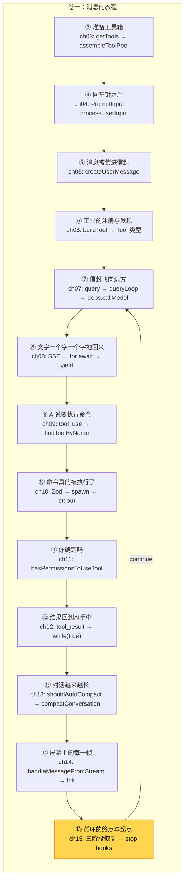

> 源码验证日期：2026-05-15，基于 commit `0d81bb6`

你读完了消息的旅程。现在，你要亲手追踪一次。

---

## 路线图


---

## 打开源码

如果你还没有 Claude Code 的源码，现在是时候把它拿出来了：

```bash
git clone https://github.com/anthropics/claude-code.git
cd claude-code
```

用你喜欢的编辑器打开这个目录。唯一的要求是能方便地在文件之间跳转、搜索关键词。

准备好了吗？我们来追踪一条消息。

---

## 设定场景

假设你是 Claude Code 团队的新成员。有用户报告了一个问题："我明明装了那个工具，但 AI 说找不到。为什么这个工具没有被加载？"

你不知道答案。但你知道消息是怎么走的——你刚刚花了十五章学完了整条链路。现在该用上了。

你的追踪策略：从入口开始，沿着消息的路径，在每个关键检查点停下来看看。

---

## 第一站：入口

打开 `src/main.tsx`，找到 `main()` 函数。这是整个程序的入口。当你在终端里输入 `claude` 并按下回车，控制权就到了这里。

在 `main()` 函数内部，你会看到它做了一大堆初始化工作：解析命令行参数、加载配置文件、设置日志、初始化权限系统。然后，它启动了 REPL。

先不在入口处停留太久。加一行日志，留个记号：

```typescript
console.log("[TRACE] main() entered")
```

---

## 第二站：REPL

消息的旅程从用户输入开始，而用户输入发生在 REPL 里。

打开 `src/screens/REPL.tsx`，找到 REPL 组件的定义。在 REPL 组件里，关注用户消息的提交逻辑。当你在终端里输入"帮我修个 bug"并按下回车，这条消息就在这里被捕获。

加一行日志：

```typescript
console.log("[TRACE] REPL received user message:", userMessage)
```

---

## 第三站：消息封装

你的文字被 REPL 捕获了。但它不能以原始文字的形式被发送给 AI——它需要被"装进信封"。

在消息封装函数里加日志，你会看到你的"帮我修个 bug"变成了一个带着 `role: "user"`、`content: [...]` 结构的 JSON 对象。从这一刻起，它不再是一行纯文字，而是一个"信封"。

---

## 第四站：API 调用

信封封装好了，要被寄出去了。在 `queryModelWithStreaming` 函数的开头加：

```typescript
console.log("[TRACE] API call started, model:", model)
```

你会看到这行日志在几毫秒内被触发。然后程序"暂停"——在等待网络响应。几秒后，AI 的回答开始流回来。

---

## 第五站：工具分发——关键线索

我们的场景是"为什么工具没有被加载"。所以工具分发这一站是关键。

打开 `src/services/tools/toolExecution.ts`，找到 `runToolUse` 函数。函数的第一件事是根据工具名字找到对应的工具对象：

```typescript
let tool = findToolByName(toolUseContext.options.tools, toolName)
```

加两行关键日志：

```typescript
console.log("[TRACE] Tool lookup:", toolName, tool ? "FOUND" : "NOT FOUND")
console.log("[TRACE] Available tools:", toolUseContext.options.tools.map(t => t.name))
```

运行程序，重现用户报告的问题。当 AI 尝试使用那个"找不到"的工具时，你会看到：

```
[TRACE] Tool lookup: SomeTool NOT FOUND
[TRACE] Available tools: ["Read", "Write", "Bash", "Glob", "Grep", "Edit", ...]
```

线索出现了。`SomeTool` 确实不在可用工具列表里。但为什么？是工具没有被注册，还是注册了但被过滤掉了？

这就是追踪的价值：你不需要理解整个系统，你只需要在关键位置停下来，看看数据的实际状态。

---

## 第六站：权限检查

在工具被执行之前，还有一道关卡。打开 `src/utils/permissions/permissions.ts`，找到 `hasPermissionsToUseTool` 函数。

在我们的场景里，如果工具根本没被加载，权限检查就不会被触发——因为代码在找到工具之后才会走到权限检查。但如果追踪的是一个"工具被找到了但没执行"的问题，权限检查就是必看的地方。

加一行日志：

```typescript
console.log("[TRACE] Permission check for:", toolName, "result:", allowed)
```

---

## 第七站：工具执行

以 Bash 工具为例，打开 `src/tools/BashTool/BashTool.tsx`。找到 `call` 函数，在它启动子进程的地方加日志：

```typescript
console.log("[TRACE] BashTool executing:", command)
```

---

## 第八站：压缩

如果你的追踪会话很长，压缩会被触发。在 `shouldAutoCompact` 里加日志：

```typescript
console.log("[TRACE] Auto-compact check:", tokenCount, "vs threshold:", threshold)
```

---

## 第九站：回到屏幕

一切处理完毕，最终都要显示在你的终端上。如果屏幕上显示的内容不对，问题很可能出在 REPL 的渲染逻辑里。

---

## 定位问题：为什么工具没被加载？

通过前面几站的日志，你已经知道了：

1. 工具确实不在可用列表里（第五站的日志告诉你的）
2. 不是权限问题（因为工具根本没进入权限检查环节）

那问题就出在更早的地方：工具的注册阶段。工具是在程序启动时被注册到列表里的。回到工具初始化的代码，搜索工具注册相关的逻辑。你可能会发现工具的注册受到某个配置项的控制——比如一个功能开关，或者一个允许/禁止工具列表。

找到那个配置项，检查它的值。修改配置，重启程序，再次追踪——这次第五站的日志应该显示 `FOUND` 而不是 `NOT FOUND`。

问题定位完毕。修复方法可能只是一行配置的改动。

---

## 你刚刚做了什么

回顾你的追踪过程：

1. 你从程序入口 `main()` 开始，确认程序正常启动
2. 你检查 REPL 组件，确认用户消息被正确捕获
3. 你查看消息封装函数，确认消息被正确打包
4. 你检查 API 调用，确认请求被正确发送
5. 你在工具分发处找到线索——目标工具不在可用列表里
6. 你检查权限系统，排除了权限问题
7. 你回溯到工具注册阶段，找到了根本原因：配置项把工具禁用了

整个过程不需要调试器，不需要复杂的开发环境，只需要几个 `console.log` 和对消息链路的理解。

---

## 追踪的艺术

你在这次追踪中用到的技巧，适用于任何大型代码库：

**从已知点出发。** 你知道消息从 `main()` 开始，所以从那里出发。你沿着消息的路径一步步走。

**在岔路口停下来。** 每次消息从一个模块传递到另一个模块，就是一个"岔路口"。在岔路口加日志，看看消息的实际状态。

**排除法。** 你先排除了"工具不存在"，然后排除了"权限拒绝"，最终锁定了"注册阶段"。每排除一个可能性，搜索范围就缩小一圈。

**看数据，不看猜测。** 你没有靠猜——你用日志看到了实际的数据。数据驱动的调试比直觉驱动的调试高效得多。

---

## 常见追踪错误

| 常见错误 | 症状 | 检查方法 |
|---------|------|---------|
| 日志没输出 | 加了 `console.log` 但终端没看到 | 确认在正确的分支加了日志；检查是否走了 `--verbose` 模式 |
| 找到错误的函数 | 追踪到一半发现走错了模块 | 回顾路线图中的函数速查表，确认函数名和文件路径 |
| 工具名大小写不匹配 | AI 调用的工具名是 `Read`，你找的是 `read` | 工具注册表里的名字是 PascalCase；用 `grep -i` 做不区分大小写的搜索 |
| 动态导入未触发 | 修改了文件但日志没变化 | Claude Code 使用动态 `import()`，某些模块在首次使用时才加载；确认你的追踪场景确实触发了目标代码路径 |
| 修改被构建缓存覆盖 | 改了 `.ts` 文件但运行的是旧的 `.js` | 确认你在运行源码（`bun run dev`）还是构建产物（`cli.js`）；如果是后者，先 `bun run build` |
| 日志太多看不清 | `--verbose` 输出了几千行，找不到你的 `[TRACE]` | 用 `grep TRACE` 过滤，或改用独特的前缀如 `[MY_TRACE_001]` |

---

## 试试看

### 练习一：换一个场景追踪（10 分钟）

不追踪"工具找不到"，改追踪"为什么 AI 说没有权限"。在 `hasPermissionsToUseTool` 的入口、每个检查点、出口各加一行日志。让 AI 执行一个需要权限的操作（如 `Bash(npm install)`），观察日志输出的决策路径。画出你看到的实际决策流程图。

### 练习二：追踪流式数据（15 分钟）

在 `queryModelWithStreaming` 的 `for await` 循环内，为每种 SSE 事件类型加日志（参考第 8 章的 `switch` 语句）。发一条简单消息（如"hello"），记录你观察到的完整事件序列。对比第 8 章中的事件顺序图——你看到的事件类型和顺序与课文一致吗？

### 练习三：反向追踪（15 分钟）

不从头开始，从"输出"反向追溯。找到屏幕更新函数 `handleMessageFromStream`，往上逐层追溯：是谁调用了它？调用者又是被谁调用的？一直追溯到 `queryLoop`。画出一张反向调用链图。这种"从后往前读"的能力在排查 UI 问题时特别有用。

---

## 检查点

- **追踪完整链路**：入口 main() → REPL → 消息封装 → API 调用 → 工具分发 → 权限检查 → 工具执行 → 压缩 → 屏幕渲染 → 循环
- **关键函数速查**：15 个站点的核心函数名和文件路径（见速查表）
- **追踪技巧**：从已知点出发、在岔路口加日志、用排除法缩小范围、看数据不靠猜测
- **trace 命令**：用 `claude --verbose` 或自定义 `[TRACE]` 前缀日志追踪实际执行路径

---

## 完整调用链全景图

从用户按下回车到终端显示回复，我们追踪了一条完整的路径。现在是时候把所有站点串联起来：



---

## 各站关键函数速查

| 站 | 章节 | 核心函数 |
|----|------|---------|
| 准备工具箱 | ch03 | `getTools()`, `assembleToolPool()` |
| 回车键之后 | ch04 | `processUserInput()`, `createUserMessage()` |
| 消息装进信封 | ch05 | `userMessageToMessageParam()` |
| 工具注册与发现 | ch06 | `buildTool()`, `findToolByName()` |
| 信封飞向远方 | ch07 | `query()`, `queryLoop()`, `productionDeps()` |
| 文字流式回来 | ch08 | `queryModelWithStreaming()`, `updateUsage()` |
| AI说要执行命令 | ch09 | `StreamingToolExecutor.addTool()`, `canExecuteTool()` |
| 命令真的被执行 | ch10 | `checkPermissionsAndCallTool()`, `spawn()` |
| 你确定吗 | ch11 | `hasPermissionsToUseTool()`, `bashToolHasPermission()` |
| 结果回到AI手中 | ch12 | `addToolResult()`, `while(true)` |
| 对话越来越长 | ch13 | `shouldAutoCompact()`, `compactConversation()` |
| 屏幕上的每一帧 | ch14 | `handleMessageFromStream()`, `onRender()` |
| 循环的终点与起点 | ch15 | `State`, 三阶段恢复, `handleStopHooks()` |

---

## 卷一：你学到了什么

十五章的故事，加上一次实战追踪。你手里多了哪些能力？

**你能追踪一条消息的完整旅程。** 从你在终端里敲下回车键，到 AI 的回答出现在屏幕上，中间经过的每一个步骤你都知道：REPL 捕获输入、消息被封装、API 调用发起、流式数据返回、工具被识别和分发、权限被检查、命令被执行、结果被送回、对话被压缩、界面被更新。这些不再是黑箱。

**你能读懂 Claude Code 的源码结构。** 消息相关的代码在 `src/services/api/` 里，工具相关的代码在 `src/services/tools/` 和 `src/tools/` 里，UI 相关的代码在 `src/screens/` 和 `src/components/` 里，压缩相关的代码在 `src/services/compact/` 里。

**你能在源码里定位问题。** 在关键位置加日志，沿着消息路径排查，用排除法缩小范围。

**你理解了核心设计模式。** AsyncGenerator 流式传播、不可变状态更新、分层优先级、缓存驱动设计、防御性默认值——这些不只是理论，你在真实代码里看到了它们的应用。

---

## 但你还没看到引擎室

你跟着一条消息走完了它的旅程。你知道了它从哪里来、经过了哪些站点、最终去了哪里。这是一条完整的观光路线。

但观光路线不会带你进入引擎室。想想这些问题：

工具注册表是怎么组织的，才能让新工具随时被添加进来而不用修改任何已有代码？压缩算法是怎么设计的，才能保证摘要既简洁又不丢失关键信息？权限系统是怎么实现的，才能兼顾安全性和用户友好？Ink 框架是怎么把 React 组件渲染到终端的？

这些问题有一个共同特点：它们问的不是"发生了什么"，而是"为什么这样设计"。

卷二回答这些问题。你在卷一学会了看消息的旅程。卷二，你要学会看代码的骨架。

---

[← 上一章：循环的终点与起点](/posts/e9f1cbe9/)

**卷一完。卷二：引擎室的秘密。**
