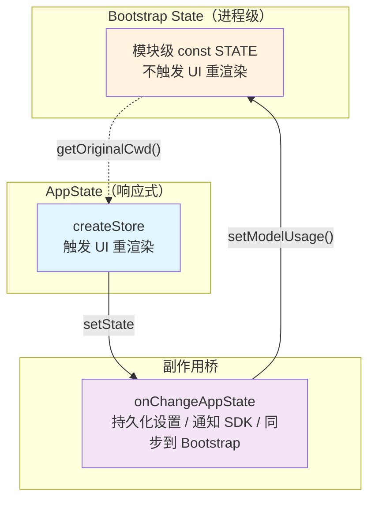

> 源码验证日期：2026-05-15，基于 commit `0d81bb6`

你刚从卷一走出来。在那十章里，你跟着一条消息走完了它的完整旅程：从你按下回车键开始，经过输入解析、消息封装、API 调用、流式返回、工具执行、权限确认，一直到结果渲染在终端屏幕上。你知道了"发生了什么"。

但"发生了什么"只是故事的一半。

一座大桥，你开车从上面走过，感受的是平坦和通畅。但如果要理解为什么这座桥能承载你，你得走到桥下面去——看钢索的张力、看桥墩的深度、看每个焊接点的工艺。

卷二就是桥下面的世界。我们要打开引擎室的门，走进去，一台一台引擎地拆开来看。不再追踪消息的旅程，而是解剖每一台引擎的内部构造。

---

## 路线图


---

## 这是什么——从旅客到工程师

打个比方。卷一里，你是一个旅客，坐在火车上看着窗外的风景一站一站地闪过。你知道火车从起点到终点经过了哪些站、在每个站做了什么。

卷二里，你要走下火车，走进机车车厢。那里有柴油发动机、有传动系统、有信号接收器、有制动装置。你要搞清楚每台机器怎么运转、为什么要这样设计、如果出了问题该怎么修。

Claude Code 的源码就是那座机车车厢。它有近两千个 TypeScript 文件，三十三个顶级目录，还有十八个散落在 `src/` 根目录的独立文件。初看像迷宫，但它有清晰的逻辑。这章的目标就是给你一张地图，让你能在迷宫里自由行走。

---

## 打开源码——地图的第一层

先看整个项目的骨架。打开终端，进入源码的根目录，你会看到：

```
claude-code/
  bun.lock
  docs/
  package.json
  README.md
  src/
  teaching/
  vendor/
```

`src/` 是一切的起点。所有源码都在这里。`vendor/` 是第三方依赖的本地副本，`teaching/` 是你正在读的这本书，`docs/` 是项目文档。`package.json` 告诉你这个项目的基本身份：

```json
{
  "name": "@anthropic-ai/claude-code",
  "version": "2.1.88",
  "bin": {
    "claude": "cli.js"
  },
  "engines": {
    "node": ">=18.0.0"
  },
  "type": "module"
}
```

几个关键信息：这个包叫 `@anthropic-ai/claude-code`，命令行入口是 `cli.js`（构建产物，源码中不存在），要求 Node.js 18 以上，使用 ES Module 格式。

但真正的战场在 `src/` 目录。来看它的完整面貌：

```
src/
  main.tsx              (4683 行 -- 整个项目的入口和主循环)
  QueryEngine.ts        (1295 行 -- 查询引擎，驱动对话循环)
  query.ts              (1729 行 -- 查询相关工具函数)
  tools.ts              (389 行 -- 工具注册和加载)
  Tool.ts               (792 行 -- 工具基类定义)
  commands.ts           (754 行 -- 命令注册和加载)
  setup.ts              (477 行 -- 初始化设置)
  history.ts            (464 行 -- 对话历史管理)
  context.ts            (189 行 -- 系统上下文收集)
  Task.ts               (125 行 -- 任务抽象)
  tasks.ts              (39 行 -- 任务注册)
  cost-tracker.ts       (323 行 -- 费用追踪)
  interactiveHelpers.tsx (365 行 -- 交互式辅助逻辑)
  ink.ts                (85 行 -- 终端 UI 框架入口)
  ...以及其他几个较小的文件

  assistant/            (助手模式)
  bootstrap/            (启动引导状态)
  bridge/               (IDE 桥接通信)
  buddy/                (终端宠物角色)
  cli/                  (命令行输出处理)
  commands/             (斜杠命令实现)
  components/           (React 终端 UI 组件)
  constants/            (常量定义)
  context/              (React Context)
  coordinator/          (多代理协调器)
  entrypoints/          (不同模式的入口)
  hooks/                (React Hooks)
  ink/                  (终端渲染引擎)
  keybindings/          (键盘快捷键)
  memdir/               (记忆目录管理)
  migrations/           (配置迁移)
  moreright/            (扩展右侧面板)
  native-ts/            (原生模块绑定)
  outputStyles/         (输出样式)
  plugins/              (插件系统)
  query/                (查询配置)
  remote/               (远程会话)
  schemas/              (校验模式)
  screens/              (全屏页面)
  server/               (直连服务器)
  services/             (后台服务)
  skills/               (技能系统)
  state/                (全局状态管理)
  tasks/                (任务实现)
  tools/                (工具实现)
  types/                (类型定义)
  upstreamproxy/        (上游代理)
  utils/                (工具函数)
  vim/                  (Vim 模式)
  voice/                (语音模式)
```

三十三个子目录加上十八个根级文件。数字看起来吓人，但别急——我们按功能分组来看。

---

## 地图的第二层——按功能分区

一个大型项目的目录结构不是随意摆放的。每个目录的命名都暗示了它的职责。把这三十三目录分成几个大区，地图就清晰了。

### 核心引擎区

这是整座工厂的心脏。

| 目录/文件 | 职责 |
|---|---|
| `main.tsx` | 万物之源。4683 行，包含命令行解析、初始化、以及整个交互式 REPL 的主循环 |
| `QueryEngine.ts` | 查询引擎。驱动"发消息、收回复、执行工具、再发消息"的循环 |
| `query.ts` | 查询的辅助逻辑——消息构建、上下文组装、流处理 |
| `entrypoints/` | 不同使用模式的入口：CLI、MCP 服务器、SDK |
| `setup.ts` | 启动时的环境初始化 |

你在卷一追踪的那条消息，就是在这些文件之间流转的。`main.tsx` 是起点，`QueryEngine.ts` 是引擎，`query.ts` 是传动装置。

### 工具区

这是 Claude 的双手——它能执行的所有操作。

| 目录/文件 | 职责 |
|---|---|
| `tools/` | 三十七个工具的具体实现，每个子目录是一个工具 |
| `tools.ts` | 工具的注册、加载、筛选 |
| `Tool.ts` | 工具的基类定义和通用逻辑 |

打开 `tools/` 目录你会看到：

```
tools/
  BashTool/          执行 shell 命令
  FileReadTool/      读取文件
  FileEditTool/      编辑文件
  FileWriteTool/     写入文件
  GrepTool/          搜索文件内容
  GlobTool/          搜索文件路径
  WebFetchTool/      抓取网页
  WebSearchTool/     搜索互联网
  NotebookEditTool/  编辑 Jupyter 笔记本
  TaskCreateTool/    创建子任务
  McpAuthTool/       MCP 服务器认证
  MCPTool/           调用 MCP 工具
  SkillTool/         调用技能
  ...以及其他二十多个工具
```

每个工具目录内通常有一个主文件，包含工具的定义、参数校验、执行逻辑和结果格式化。这就是卷一第七章"命令真的被执行了"的幕后。

### 用户界面区

这是你看到的那个终端界面。

| 目录/文件 | 职责 |
|---|---|
| `components/` | React 组件，构建终端 UI |
| `ink/` | 底层终端渲染引擎（基于 Ink 框架的定制版本） |
| `hooks/` | React Hooks，管理 UI 状态和副作用 |
| `context/` | React Context，跨组件共享状态 |
| `state/` | 全局应用状态（AppState） |
| `screens/` | 全屏页面（REPL、Doctor、恢复对话） |
| `keybindings/` | 键盘快捷键系统 |
| `vim/` | Vim 模式的按键处理 |

`components/` 是最大的目录之一，有一百四十六个文件。从消息气泡、工具结果展示、权限对话框，到成本显示、模型选择器——你终端里看到的每一个像素，都是这些组件画出来的。

### 命令区

斜杠命令——你输入 `/help`、`/clear`、`/commit` 时触发的东西。

| 目录/文件 | 职责 |
|---|---|
| `commands/` | 一百零三个斜杠命令的实现，每个子目录是一个命令 |
| `commands.ts` | 命令的注册和路由 |

### 服务区

后台运行的各种服务。

| 目录/文件 | 职责 |
|---|---|
| `services/` | 后台服务集合 |
| `services/api/` | API 通信层 |
| `services/analytics/` | 数据分析（GrowthBook 等） |
| `services/mcp/` | MCP 服务器管理 |
| `services/oauth/` | OAuth 认证 |
| `services/plugins/` | 插件管理 |
| `services/compact/` | 上下文压缩 |
| `services/tools/` | 工具相关服务 |

### 基础设施区

支撑一切的底层模块。

| 目录/文件 | 职责 |
|---|---|
| `utils/` | 三百三十一个工具函数文件 |
| `constants/` | 常量定义 |
| `types/` | TypeScript 类型定义 |
| `schemas/` | 校验模式 |
| `migrations/` | 版本间配置迁移 |

`utils/` 是最大的目录。从文件操作、Git 操作、认证逻辑、权限管理到终端处理——几乎所有公共逻辑都放在这里。它是整个项目的工具箱。

### 通信区

与其他系统交互的桥梁。

| 目录/文件 | 职责 |
|---|---|
| `bridge/` | 与 IDE（VS Code 等）的桥接通信 |
| `remote/` | 远程会话管理 |
| `server/` | 直连服务器模式 |
| `upstreamproxy/` | 上游代理 |

### 特色功能区

一些独特的能力。

| 目录/文件 | 职责 |
|---|---|
| `skills/` | 技能系统——可扩展的命令模块 |
| `plugins/` | 插件系统 |
| `memdir/` | 记忆目录——跨会话的记忆管理 |
| `voice/` | 语音输入/输出 |
| `buddy/` | 终端宠物动画角色 |
| `assistant/` | 助手模式（实验性） |
| `coordinator/` | 多代理协调（实验性） |
| `tasks/` | 后台任务实现 |

---

## 导航技巧

有了地图，还得学会用。面对近两千个文件，你不可能一个一个打开看。你需要导航技巧。

### 技巧一：从入口开始

当你想理解某个功能，不要从中间的文件开始猜。从入口追溯。比如你想理解工具执行的流程。起点是 `main.tsx`——在那里搜索 `getTools` 或 `executeTool`，找到调用链的第一环。然后跳到 `tools.ts` 看注册逻辑，再跳到 `tools/` 下具体的工具目录看实现。这条路径永远是：入口 -> 注册 -> 实现。

### 技巧二：目录名就是线索

Claude Code 的目录命名遵循一致的约定：

- **单个名词 = 功能模块**：`tools/`、`commands/`、`hooks/`、`services/`、`utils/`
- **名词 + 动作 = 具体实现**：`FileReadTool/`、`TaskCreateTool/`
- **形容词/副词 = 辅助功能**：`moreright/`、`upstreamproxy/`

### 技巧三：看文件命名模式

在同一目录里，文件命名有模式可循：

- `use*.ts` 或 `use*.tsx`：React Hook（如 `useSettings.ts`）
- `*Tool.ts`：工具定义
- `*Dialog.tsx` 或 `*Dialog/`：对话框组件
- `*Message.tsx`：消息展示组件
- `*Config.ts`：配置相关
- `index.ts`：目录的导出入口

### 技巧四：善用全局搜索

在大型代码库中，全局文本搜索是最强大的导航工具。一些有用的搜索模式：

- 搜索函数名：`export async function main`——找到函数的定义位置
- 搜索类型名：`type ToolResult`——找到类型定义
- 搜索常量：`MAX_TURNS`——找到限制逻辑
- 搜索错误消息：用户报告的错误文字可以直接搜到源码

### 技巧五：看 import 链

TypeScript 的 import 语句是最好的地图。打开任何文件，看它的顶部 import 了什么，你就知道它依赖哪些模块。比如打开 `main.tsx` 的前八十行，你会看到它 import 了：

```
from './utils/startupProfiler.js'     -- 启动计时
from './utils/settings/mdm/rawRead.js' -- MDM 配置
from './utils/secureStorage/keychainPrefetch.js' -- 密钥预读
from './constants/oauth.js'           -- OAuth 配置
from './context.js'                   -- 系统上下文
from './entrypoints/init.js'          -- 初始化
from './tools.js'                     -- 工具系统
from './services/analytics/growthbook.js' -- 功能开关
from './services/api/bootstrap.js'    -- 引导数据
```

这些 import 告诉你：main.tsx 的启动过程涉及性能分析、配置管理、认证、上下文收集、工具加载和功能开关。光看 import 就能画出一张依赖图。

---

## 状态管理的架构：两颗心脏

在用户界面区中我们提到了 `state/` 目录。但它值得专门拿出来讲，因为 Claude Code 的状态管理不是一颗心脏——而是两颗。

### 第一颗：Bootstrap State（进程级单例）

```typescript
// → src/bootstrap/state.ts
const STATE: State = getInitialState()
// 模块作用域的单一可变对象——进程生命周期内唯一
```

这就是 **Bootstrap State**。它在 React 之前就存在——进程一启动就需要记录 `sessionId`、`cwd`、遥测计数器等。访问通过 getter/setter 对：

```typescript
export function getSessionId(): SessionId { return STATE.sessionId }
export function setOriginalCwd(cwd: string): void { STATE.originalCwd = cwd }
```

**为什么用 getter/setter 而不是直接导出 STATE？** 因为 getter/setter 是 API——未来可以在里面加日志、验证、通知，而调用方无需改动。

Bootstrap State 的核心字段：`sessionId`、`projectRoot`、`totalCostUSD`、`modelUsage`、遥测计数器、`kairosActive` 等模式标记。源码注释明确警告：`// DO NOT ADD MORE STATE HERE - BE JUDICIOUS WITH GLOBAL STATE`。

### 第二颗：AppState（响应式存储）

Bootstrap State 不触发 UI 重渲染。终端屏幕上的变化，由 AppState 驱动。它是一个轻量的自定义响应式存储（不是 Redux/Zustand）：

```typescript
// → src/state/store.ts（完整仅 35 行）
function createStore<T>(initialState: T, onChange?: (state: T) => void): Store<T> {
  let state = initialState
  const listeners = new Set<() => void>()
  return {
    getState: () => state,
    setState(updater) {
      const nextState = updater(state)
      if (Object.is(state, nextState)) return  // 相同引用 → 跳过
      state = nextState
      onChange?.(state)
      listeners.forEach(l => l())
    },
    subscribe(listener) { listeners.add(listener); return () => listeners.delete(listener) },
  }
}
```

React 组件通过 `useAppState(selector)` 订阅 AppState 的变化——只有 selector 返回值变化时才重渲染。AppState 管着 settings、mcp、plugins、tasks、permissions、notifications 等跟 UI 相关的所有状态。

### 两颗心脏的桥梁



Bootstrap State 先于 React 存在——开机就需要。AppState 需要 React 集成——UI 组件用 selector 订阅变化。两者通过 `onChangeAppState` 桥接：AppState 变了自动同步到 Bootstrap 和外部系统（SDK、持久化、CCR）。

---

## 常见错误与检查方法

| 常见错误 | 检查方法 |
|---------|---------|
| 找不到某个功能的代码 | 从 `main.tsx` 入口开始追溯，不要从中间猜 |
| 修改一个文件后其他功能坏了 | 检查该文件的 import 列表，看谁依赖了它 |
| 误改了基础设施层导致全局问题 | 先确认改动在哪个"区"——组件层安全，引擎层危险 |
| 搜索函数名没结果 | 尝试搜索函数名的一部分，或搜索它操作的数据类型 |

---

## 试试看

### 练习一：画一张你自己的功能分区图

打开 `src/` 目录，不看上面的分区表，自己尝试把三十三个子目录分成几个大组。然后和上面的分区对比，看看你的直觉和实际设计的差距在哪里。

### 练习二：追踪一个你最感兴趣的功能

选一个你最感兴趣的功能（比如权限系统、MCP、记忆），从 `main.tsx` 开始，通过搜索和 import 追溯，画出它的调用链。不用完全理解每一步，只要知道"从入口怎么走到那里"就行。

### 练习三：读一个最简单的工具目录

打开 `src/tools/GlobTool/` 目录，读一遍里面的文件。这是最简单的工具之一——一个输入一个输出。通过它建立对"工具长什么样"的直觉，后面章节会更容易理解。

---

## 检查点

你已经看到了 Claude Code 源码的全貌：

1. **三十三目录，十八个根级文件**，近两千个 TypeScript 文件
2. **八大功能分区**：核心引擎区、工具区、用户界面区、命令区、服务区、基础设施区、通信区、特色功能区
3. **五个导航技巧**：从入口追溯、目录名做线索、文件命名模式、全局搜索、import 链分析
4. **分区原则**是"按功能领域"而非"按架构角色"——这是终端应用与 Web 应用在组织方式上的根本差异

从下一章开始，我们要一台一台引擎地拆开来看。不着急，不跳步。每一章聚焦一个子系统，从入口读到底，从调用链读到设计理由。

引擎室的门已经打开了。我们先从最核心的引擎开始——`main.tsx` 里那五步启动流程。

---

## 对比：如果用 Java

Java 项目的源码组织以 Maven/Gradle 的多模块（multi-module）结构为主——每个模块有独立的 `pom.xml` 或 `build.gradle`，模块间通过 artifact 坐标声明依赖。Claude Code 的 TypeScript 单仓（monorepo）则不同：一个 `src/` 目录下按**功能领域**（而非架构角色）组织为 33 个子目录。Java 的 `com.example.service` vs `com.example.controller` 分层在 Claude Code 里被"工具区 / 服务区 / UI 区"的功能分区取代。导航方式也不同——Java 开发者习惯从接口跳到实现（Ctrl+Alt+B），Claude Code 的读者更多依赖 import 链和目录命名来理解模块关系。

---

[上一章：你的第一次追踪](/posts/6884c5de/) | [下一章：主入口一切的起点](/posts/8c4aaef7/)
