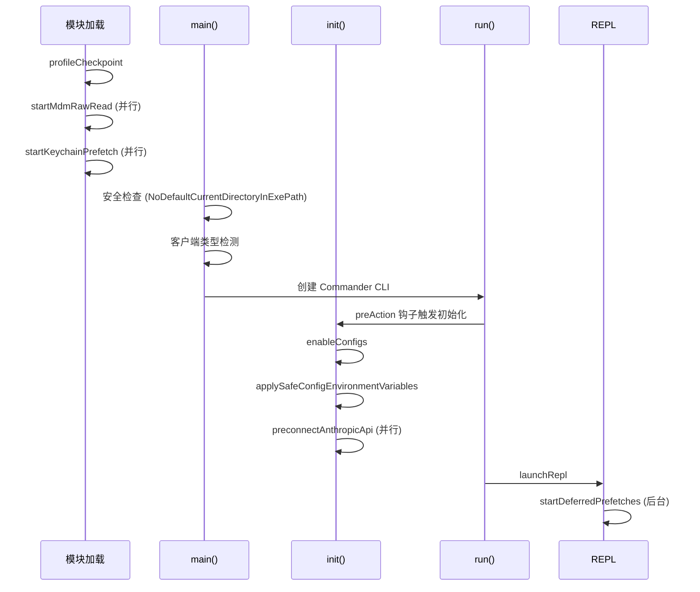

> 源码验证日期：2026-05-15，基于 commit `0d81bb6`

你在终端里敲下 `claude`，按下回车。光标闪了一下，然后整个终端变成了一个对话界面。

你等了不到一秒。但在这一秒里，程序做了什么？

如果你写过 Java 的 `public static void main(String[] args)`，你大概能想象一个程序的入口函数长什么样：解析参数、初始化配置、启动主循环。Claude Code 的入口也做了这些事，但它的编排方式值得你仔细看一遍——因为这里藏着这个项目最核心的设计思路之一：**把启动顺序当作性能武器**。

---

## 路线图


---

## 这是什么

想象你开了一家餐厅。客人推门进来之前，你得先做一堆准备工作：检查厨房的煤气关没关好、把食材从冰箱里拿出来解冻、把菜单摆在桌上、给服务员安排好站位。这些事情有先后顺序——你不能在检查煤气之前就开火，也不能在食材解冻之前就开始做菜。

Claude Code 的启动就是这个"开店前的准备"。它的入口文件 `main.tsx` 在大约一秒内完成了五件事：

1. **安全检查** -- 检查环境，设置防护栏
2. **客户端识别** -- 判断你是从终端来的、从 IDE 来的、还是从脚本来的
3. **配置加载** -- 读取设置文件，准备权限系统
4. **状态初始化** -- 建立全局状态，让后续组件有地方放数据
5. **REPL 启动** -- 把终端界面渲染出来，等待你的输入

每一件事都依赖前一件事的完成。但你如果仔细看源码，会发现一个有趣的模式：有些事被故意"延后"了，有些事在"并行"跑。这种编排不是随意的——它关乎启动速度，而启动速度关乎用户体验。

---

## 打开源码

打开你的编辑器，跟着我走。

**主入口文件：**

```
src/main.tsx
```

这个文件有接近 4000 行。别慌——你不需要一次读完。我们关注的是三个关键函数：

| 函数 | 作用 |
|------|------|
| `main()` | 入口函数，编排整个启动流程 |
| `run()` | 创建 Commander CLI，注册命令和选项 |
| `init()` | 初始化配置、网络、安全 |

**状态文件：**

```
src/bootstrap/state.ts
```

这是全局状态的"仓库"。整个程序运行期间用到的会话数据都在这里——成本统计、模型信息、权限状态等等。

**初始化文件：**

```
src/entrypoints/init.ts
```

被 `main.tsx` 的 `preAction` 钩子调用，是真正的"开店准备"函数。

---

## 它怎么工作

### 阶段一：模块加载时就开始了

在你还没有进入 `main()` 函数之前，准备工作就已经开始了。

`main.tsx` 文件的前 20 行不是普通的 `import` 语句。它们是**带副作用的导入**，在模块被加载时就执行：

```typescript
// main.tsx
// 这些副作用必须在所有其他导入之前执行：
// 1. profileCheckpoint 在重量级模块求值前标记入口点
// 2. startMdmRawRead 触发 MDM 子进程（plutil/reg query），让它们与
//    下面剩余的 ~135ms 导入并行运行
// 3. startKeychainPrefetch 触发 macOS 钥匙串读取（OAuth + 旧版 API
//    key），否则 isRemoteManagedSettingsEligible() 会同步读取它们
import { profileCheckpoint } from './utils/startupProfiler.js';
profileCheckpoint('main_tsx_entry');          // 标记时间戳
import { startMdmRawRead } from './utils/settings/mdm/rawRead.js';
startMdmRawRead();                            // 启动 MDM 子进程
import { startKeychainPrefetch } from './utils/secureStorage/keychainPrefetch.js';
startKeychainPrefetch();                      // 启动钥匙串预读取
```

注意看注释里的关键词：**"并行运行"**。在 TypeScript 模块还在被一个一个加载的 ~135ms 里，子进程和钥匙串读取已经跑起来了。这是一种用导入阶段做并行的技巧——等到 `main()` 被调用时，这些数据已经准备好了。

### 阶段二：main() 函数 -- 安全第一

```typescript
export async function main() {
  profileCheckpoint('main_function_start');

  // 安全：防止 Windows 从当前目录执行命令
  process.env.NoDefaultCurrentDirectoryInExePath = '1';

  // 初始化警告处理器
  initializeWarningHandler();
  process.on('exit', () => {
    resetCursor();
  });
  process.on('SIGINT', () => {
    if (process.argv.includes('-p') || process.argv.includes('--print')) {
      return;
    }
    process.exit(0);
  });
```

`main()` 的第一行是设置环境变量 `NoDefaultCurrentDirectoryInExePath`。这不是业务逻辑，而是**安全防护**。在 Windows 上，如果你在当前目录下有一个和系统命令同名的可执行文件（比如 `cmd.exe`），系统会优先执行当前目录的版本。这是经典的 PATH 劫持攻击向量。

这种"安全检查先于一切"的模式在源码里反复出现。Claude Code 是一个能执行 shell 命令的程序，安全是它的生命线。

### 阶段三：客户端类型检测

接下来的代码做了一件关键的事：**判断你是谁**。

```typescript
// 检查 -p/--print 和 --init-only 标志
const cliArgs = process.argv.slice(2);
const hasPrintFlag = cliArgs.includes('-p') || cliArgs.includes('--print');
const hasInitOnlyFlag = cliArgs.includes('--init-only');
const hasSdkUrl = cliArgs.some(arg => arg.startsWith('--sdk-url'));
const isNonInteractive = hasPrintFlag || hasInitOnlyFlag || hasSdkUrl || !process.stdout.isTTY;

setIsInteractive(!isNonInteractive);
initializeEntrypoint(isNonInteractive);

// 确定客户端类型
const clientType = (() => {
  if (isEnvTruthy(process.env.GITHUB_ACTIONS)) return 'github-action';
  if (process.env.CLAUDE_CODE_ENTRYPOINT === 'sdk-ts') return 'sdk-typescript';
  if (process.env.CLAUDE_CODE_ENTRYPOINT === 'sdk-py') return 'sdk-python';
  if (process.env.CLAUDE_CODE_ENTRYPOINT === 'sdk-cli') return 'sdk-cli';
  if (process.env.CLAUDE_CODE_ENTRYPOINT === 'claude-vscode') return 'claude-vscode';
  if (process.env.CLAUDE_CODE_ENTRYPOINT === 'local-agent') return 'local-agent';
  return 'cli';
})();
setClientType(clientType);
```

为什么这一步这么重要？因为 Claude Code 不只是你手动敲 `claude` 时才启动。它可能是 VS Code 插件调起的、可能是 GitHub Actions 跑的、可能是 Python SDK 启动的。不同的调用者需要不同的行为：

- 终端用户需要交互界面、需要彩色输出、需要信任对话框
- SDK 调用者需要 JSON 输出、不需要颜色、信任默认通过
- GitHub Actions 需要非交互模式、特殊的认证流程

客户端类型一旦确定，它就被存入 `bootstrap/state.ts` 里的全局状态，后续所有组件都能读到。

### 阶段四：init() -- 真正的开店准备

`init()` 函数定义在 `entrypoints/init.ts` 里，被 Commander 的 `preAction` 钩子调用。这个函数用 `memoize` 包装过，保证即使被调用多次也只执行一次：

```typescript
export const init = memoize(async (): Promise<void> => {
  const initStartTime = Date.now()
  logForDiagnosticsNoPII('info', 'init_started')
  profileCheckpoint('init_function_start')

  try {
    enableConfigs()                        // 激活配置系统
    applySafeConfigEnvironmentVariables()  // 只应用安全的环境变量
    applyExtraCACertsFromConfig()          // TLS 证书配置
    setupGracefulShutdown()                // 注册退出清理
    // ... 后续还有很多步骤
```

注意这里的 `applySafeConfigEnvironmentVariables()` 而不是 `applyConfigEnvironmentVariables()`。为什么是"安全"版本？因为此时还没有经过信任对话框——用户还没有确认信任当前目录。项目目录下的 `.claude/settings.json` 可能包含恶意的环境变量注入（比如 `LD_PRELOAD`）。所以这里只应用那些"安全"的、来自用户级配置的环境变量。完整的环境变量要等到信任确认之后才应用。

这种**基于信任级别的分阶段初始化**是 Claude Code 安全模型的核心设计。

`init()` 的后半部分是网络和安全配置：

```typescript
configureGlobalMTLS()          // 配置全局 mTLS 设置
configureGlobalAgents()        // 配置全局 HTTP 代理
preconnectAnthropicApi()       // 预连接 Anthropic API
```

`preconnectAnthropicApi()` 又是一个性能优化：提前建立到 Anthropic 服务器的 TCP 连接和 TLS 握手。当用户在 REPL 里输入第一条消息时，这个连接已经准备好了，可以省掉 100-200ms 的网络延迟。

### 阶段五：run() 和 Commander CLI

`run()` 函数创建了 Commander.js 的命令行解析器：

```typescript
async function run(): Promise<CommanderCommand> {
  const program = new CommanderCommand()
    .configureHelp(createSortedHelpConfig())
    .enablePositionalOptions();

  // preAction 钩子：只在执行命令时（不是显示帮助时）运行初始化
  program.hook('preAction', async thisCommand => {
    await Promise.all([
      ensureMdmSettingsLoaded(),
      ensureKeychainPrefetchCompleted()
    ]);
    await init();
    // ... 设置日志接收器、运行迁移、加载远程设置
  });

  program
    .name('claude')
    .description('Claude Code - 默认启动交互会话')
    .argument('[prompt]', 'Your prompt', String)
    // ... 数十个选项注册
```

这里有一个巧妙的设计：`preAction` 钩子。Commander 在执行任何命令的 action 之前会先调用这个钩子。这意味着 `init()` 只在你真正执行命令时才运行——如果你只是敲 `claude --help` 查看帮助，`init()` 根本不会被调用。

### 阶段六：setup() 和 REPL 启动

当 Commander 解析完参数，执行默认的 action handler 时，`setup()` 函数被调用。这个函数负责建立工作目录、设置权限系统、初始化 MCP 服务器、加载命令和 Agent 定义，最终渲染 REPL 界面。

最终，一切汇聚到 `launchRepl()`：

```typescript
export async function launchRepl(
  root: Root,
  appProps: AppWrapperProps,
  replProps: REPLProps,
  renderAndRun: (root: Root, element: React.ReactNode) => Promise<void>,
): Promise<void> {
  const { App } = await import('./components/App.js')
  const { REPL } = await import('./screens/REPL.js')
  await renderAndRun(
    root,
    <App {...appProps}>
      <REPL {...replProps} />
    </App>,
  )
}
```

`launchRepl` 做的事情很简单：动态导入 `App` 和 `REPL` 组件，然后渲染它们。

### startDeferredPrefetches：启动后的后台任务

REPL 渲染出来之后，还有一个重要函数被调用：`startDeferredPrefetches()`。这个函数启动了一系列后台任务，它们**不影响首次渲染**，但对后续的用户体验很重要：

```typescript
export function startDeferredPrefetches(): void {
  void initUser();                       // 预取用户信息
  void getUserContext();                 // 预取用户上下文
  prefetchSystemContextIfSafe();         // 预取系统上下文
  void getRelevantTips();               // 预取使用技巧
  void countFilesRoundedRg(getCwd());   // 统计项目文件数
  void refreshModelCapabilities();       // 刷新模型能力
  void initializeAnalyticsGates();
  void prefetchOfficialMcpUrls();
}
```

这些 `void` 前缀不是随手写的——它们是故意的"fire-and-forget"模式。这些异步操作被启动后，主线程不等待它们完成。

### bootstrap/state.ts：全局状态的仓库

所有这些阶段都需要一个地方来存放运行时数据。`bootstrap/state.ts` 就是这个地方。它的设计很简单：一个大的 `State` 类型，一个模块级的 `STATE` 常量，然后是一堆 getter/setter 函数。

这个文件的最上方有一条注释值得留意：

```
// DO NOT ADD MORE STATE HERE - BE JUDICIOUS WITH GLOBAL STATE
// （不要在这里添加更多状态 -- 请谨慎对待全局状态）
```

这是一条写在代码里的架构约束。全局状态是必要的恶——它是组件间通信的枢纽，但也是耦合的来源。Claude Code 的团队选择了一个简单的策略：全局状态集中在一个文件里，所有访问都通过函数，这样至少可以在一个地方审计所有的状态读写。

---

## 启动流程总览



---

## 常见错误与检查方法

| 常见错误 | 检查方法 |
|---------|---------|
| 启动后配置没生效 | 检查 `init()` 是否被调用了——`--help` 模式不会触发 `init()` |
| 环境变量注入失败 | 确认信任对话框是否通过了——只有 `applySafeConfigEnvironmentVariables` 在 init 阶段运行 |
| SDK 模式下行为异常 | 检查 `CLAUDE_CODE_ENTRYPOINT` 环境变量是否正确设置 |
| 启动性能回退 | 查找是否新增了同步 I/O 或阻断了 `startDeferredPrefetches` 的 fire-and-forget |

---

## 试试看

### 练习一：观察启动性能

在 `main.tsx` 的关键节点添加 `console.log(Date.now() - start)` 计时，观察每个阶段花了多少毫秒。特别关注模块加载阶段和 `init()` 阶段的时间差。

### 练习二：追踪客户端类型判断

在 `main()` 函数中找到客户端类型检测代码，试着用不同的环境变量组合（如 `CLAUDE_CODE_ENTRYPOINT=sdk-ts`）运行，观察程序行为的变化。

### 练习三：添加一个新的 CLI 标志

在 `run()` 函数的 `.option(...)` 链中添加一个 `--greet` 标志，在 action handler 里打印一条欢迎消息。这是最安全的入口修改——不影响启动流程的核心逻辑。

---

## 检查点

1. **五阶段启动流程**：安全检查 -> 客户端识别 -> 配置加载 -> 状态初始化 -> REPL 启动
2. **性能武器**：模块加载阶段就启动子进程预取、`preconnectAnthropicApi` 并行建立网络连接、`startDeferredPrefetches` 延迟非关键任务
3. **安全优先**：`NoDefaultCurrentDirectoryInExePath` 在 main() 第一行、`applySafeConfigEnvironmentVariables` 只应用安全变量
4. **Commander 的 preAction 钩子**：避免不必要的初始化（`--help` 不触发 `init()`）
5. **全局状态集中在 `bootstrap/state.ts`**：有"不要添加更多状态"的架构约束

启动流程走完了，REPL 跑起来了。但 REPL 的界面是怎么渲染出来的？终端不是一个浏览器，没有 DOM，没有 CSS。下一章我们来回答这个问题。

---

## 对比：如果用 Java

Java 程序的启动始于 `public static void main(String[] args)`——一个确定的、同步的入口点。Spring Boot 应用在 `main()` 里启动嵌入式 Tomcat，依赖注入容器（ApplicationContext）在启动时完成所有 Bean 的装配。Claude Code 的启动则完全不同：TypeScript 的模块级副作用让代码在 import 时就开始执行（预取 MDM 数据、预热 Keychain），没有统一的 DI 容器，状态通过模块级变量和闭包管理。Java 的"显式启动"提供了清晰的初始化边界；TypeScript 的"隐式启动"换来了极致的启动速度——但代价是初始化逻辑散布在几十个 import 语句中，追踪困难。

---

## 你能改什么

**安全区域**：`src/components/` 下的 UI 组件——修改终端显示不会影响核心逻辑；配置开关（环境变量控制的特性）——改动限制在局部。

**危险区域**：`src/main.tsx` 的 5 阶段启动顺序——任何顺序调整都可能导致未初始化的依赖被访问；`bootstrap/state.ts` 的全局状态结构——所有模块共享，修改会影响整个系统；模块级的副作用 import——看似无害的 import 顺序调整可能打破性能优化假设。

---

[上一章：打开引擎室的门](/posts/8ceaa9d1/) | [下一章：React在终端里奔跑](/posts/623dffcd/)
