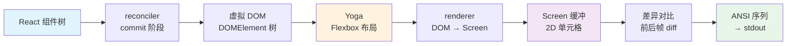

> 源码验证日期：2026-05-15，基于 commit `0d81bb6`

你打开 Claude Code，终端里出现了一个精致的界面：底部是输入框，上面是消息列表，中间穿插着工具调用的动画。这一切看起来很流畅，像一个原生的桌面应用。

但你心里清楚——这是一个终端程序。终端能做的事情有限：在指定位置显示字符、改变颜色、移动光标。它没有 CSS，没有浏览器引擎，没有 DOM。那么，React 怎么能在一个没有浏览器的地方跑起来？

上一章我们看到了程序启动的入口。这一章，我们要深入一个更底层的问题：Claude Code 用了什么机制，让 React 这个"网页框架"变成了"终端框架"？

---

## 路线图


---

## 这是什么

用一个类比来理解。想象你在写一份中文文档。你可以手动排版——一个字一个字地数，决定每个字在第几行第几列。这当然能行，但一旦要修改内容，你就得重新数所有的字。

所以你用了一个排版软件，比如 Word。你只需要说"标题用二号字，正文用小四号，首行缩进两格"，软件帮你计算每一个字的精确位置。你修改内容，排版自动更新。

React 就是这个"排版软件"。你告诉它你想要什么界面（通过 JSX），它帮你计算每一个元素的精确位置和内容。但 React 原本是为浏览器设计的——它的"排版结果"是 DOM 节点，它的"输出设备"是浏览器窗口。在终端里，没有 DOM，也没有浏览器窗口。

Ink 就是那个"翻译层"。它做了一件精妙的事：替换了 React 的输出后端。React 仍然负责"你想显示什么"，但 Ink 告诉 React："别把结果画到浏览器里了，画到终端里。"

这就像把一个打印机的驱动换掉了——Word 还是那个 Word，排版逻辑没变，但输出从 A4 纸变成了热敏小票纸。

---

## 打开源码

打开 `src/ink/` 目录。你会看到五十多个文件，但核心的渲染管线只涉及几个关键文件：

```
src/ink.ts                  -- 入口门面（85行），封装 Ink 的 render 和 createRoot
src/ink/
  reconciler.ts             -- Fiber 协调器适配（512行）
  root.ts                   -- 创建渲染根（184行）
  renderer.ts               -- DOM 节点 -> 屏幕缓冲区（178行）
  render-node-to-output.ts  -- 逐节点绘制（~1800行，最重的文件）
  ink.tsx                   -- Ink 主类，调度渲染循环（~900行）
  frame.ts                  -- 帧数据结构，双缓冲定义
  output.ts                 -- 输出缓冲区管理
  screen.ts                 -- 屏幕缓冲区（每个字符一格的二维数组）
  layout/
    engine.ts               -- 布局引擎入口，委托给 Yoga
  components/
    Box.tsx                 -- 终端里的矩形区域
    Text.tsx                -- 终端里的文字
    ScrollBox.tsx           -- 可滚动的区域
```

---

## 它怎么工作

### 第一站：入口门面 `src/ink.ts`

只有 85 行，但它是整个终端渲染系统的门面：

```typescript
function withTheme(node: ReactNode): ReactNode {
  return createElement(ThemeProvider, null, node)
}

export async function render(
  node: ReactNode,
  options?: NodeJS.WriteStream | RenderOptions,
): Promise<Instance> {
  return inkRender(withTheme(node), options)
}

export async function createRoot(options?: RenderOptions): Promise<Root> {
  const root = await inkCreateRoot(options)
  return {
    ...root,
    render: node => root.render(withTheme(node)),
  }
}
```

`withTheme` 做的事情很简单：在你的组件树外面包一层 `ThemeProvider`。Claude Code 的所有 UI 组件都依赖主题系统来决定颜色和样式。`render` 和 `createRoot` 暴露了两种创建 UI 的方式。

### 第二站：Fiber 协调器 `src/ink/reconciler.ts`

这是整条管线中最精妙的部分。React 本身并不知道怎么画界面。React 的核心是一个叫 Fiber 的架构——它负责维护组件树、比较新旧差异、决定哪些节点需要更新。但"怎么更新"这件事，React 留给了"宿主环境"去实现。

`react-reconciler` 是 React 暴露出来的一个底层 API，让你可以自定义宿主环境。Ink 用它告诉 React："当你说'创建节点'时，我不会创建 DOM 节点——我会创建一个终端节点。"

看看这个协调器是怎么定义的：

```typescript
const reconciler = createReconciler<
  ElementNames,    // 节点类型：'ink-box', 'ink-text', 'ink-root'...
  Props,
  DOMElement,      // 宿主节点类型
  DOMElement,
  TextNode,        // 文本节点类型
  // ... 更多泛型参数
>({
  getRootHostContext: () => ({ isInsideText: false }),
  createInstance(originalType, newProps, _root, hostContext) {
    if (hostContext.isInsideText && originalType === 'ink-box') {
      throw new Error(`<Box> can't be nested inside <Text> component`)
    }
    const node = createNode(type)
    for (const [key, value] of Object.entries(newProps)) {
      applyProp(node, key, value)
    }
    return node
  },
  createTextInstance(text, _root, hostContext) {
    if (!hostContext.isInsideText) {
      throw new Error(
        `Text string "${text}" must be rendered inside <Text> component`,
      )
    }
    return createTextNode(text)
  },
  // ...更多回调
})
```

**`createInstance`**——React 说"我要创建一个元素节点"。Ink 就创建一个 `DOMElement` 对象（不是浏览器 DOM，而是 Ink 自己的轻量节点）。还有一个有趣的规则：`<Text>` 嵌套在 `<Text>` 里面时，内层的会被标记为 `ink-virtual-text`（虚拟文本节点），因为它不需要单独的布局计算。

**`createTextInstance`**——React 说"我要创建一个纯文本节点"。Ink 就创建一个 `TextNode`。注意那个校验：裸文本必须放在 `<Text>` 里面，否则直接报错。

还有一个特别重要的回调：`resetAfterCommit`。React 每次提交完更新后都会调用它。Ink 在这里触发 Yoga 布局计算和渲染调度：

```typescript
resetAfterCommit(rootNode) {
  if (typeof rootNode.onComputeLayout === 'function') {
    rootNode.onComputeLayout()
  }
  rootNode.onRender?.()
}
```

### 第三站：DOM 节点模型

Ink 的 `DOMElement` 不是浏览器的 DOM，而是一个轻量的 JavaScript 对象：

```typescript
export type DOMElement = {
  nodeName: ElementNames      // 'ink-box', 'ink-text', 'ink-root'...
  attributes: Record<string, DOMNodeAttribute>
  childNodes: DOMNode[]
  yogaNode?: LayoutNode       // Yoga 布局节点
  style: Styles
  dirty: boolean              // 是否需要重新渲染
  scrollTop?: number          // 滚动位置
  focusManager?: FocusManager // 焦点管理器
}
```

注意 `yogaNode` 字段。每个 Ink 节点都关联一个 Yoga 布局节点——Yoga 是 Facebook 开发的 Flexbox 布局引擎，用 C++ 编写，通过 WASM 绑定到 JavaScript。你在 JSX 里写的 `flexDirection="column"`、`paddingLeft={2}` 这些样式属性，最终都会被应用到这个 Yoga 节点上。

### 第四站：渲染管线

当状态变化时，整条管线是怎么运转的？



**阶段一：React 协调（reconcile）**——某个 state 变了，React 的 Fiber 调度器开始工作，找出所有受影响的组件，调用 `reconciler.ts` 里定义的回调。

**阶段二：Yoga 布局计算（layout）**——React 提交完成后，`resetAfterCommit` 被触发。Yoga 从根节点开始，递归地计算每个节点的位置和尺寸。

**阶段三：绘制到屏幕缓冲区（paint）**——`renderer.ts` 遍历布局好的节点树，把每个节点"画"到一块内存缓冲区上。这个缓冲区是一个二维数组，每个格子存储一个字符及其样式。

**阶段四：差异对比（diff）**——有了新的屏幕缓冲区后，Ink 把它和上一帧的缓冲区做对比，找出哪些格子变了。

**阶段五：输出到终端（draw）**——补丁被序列化为 ANSI 转义序列，通过 `stdout.write()` 发送到终端。

### 优化手段

上面描述的五个阶段，每一次状态变化都会触发。但 Ink 做了大量优化：

1. **脏标记（dirty flag）**：只有实际变化的节点才会被重新绘制
2. **双缓冲（double buffering）**：Ink 维护两个帧缓冲区——`frontFrame`（当前显示的）和 `backFrame`（下一帧正在绘制的）
3. **差异输出**：只发送变化的行到终端，而不是每帧都重绘整个屏幕
4. **Blit 优化**：不变子树直接从上一帧的 Screen 缓冲复制单元格，跳过整棵子树的遍历
5. **Yoga 缓存**：Yoga 会缓存布局计算结果，子树尺寸没变就跳过重新计算

### 组件树从 App 到 REPL

了解了底层机制，看看实际的组件树。最外层是 `App` 组件：

```typescript
export function App({ getFpsMetrics, stats, initialState, children }: Props) {
  return (
    <FpsMetricsProvider getFpsMetrics={getFpsMetrics}>
      <StatsProvider store={stats}>
        <AppStateProvider initialState={initialState}>
          {children}
        </AppStateProvider>
      </StatsProvider>
    </FpsMetricsProvider>
  )
}
```

三层 Provider 嵌套。`AppStateProvider` 管理全局状态，`StatsProvider` 管理统计信息，`FpsMetricsProvider` 管理帧率监控。这三层 Provider 不直接渲染任何可见内容——它们的工作是让所有子组件都能通过 React 的 context 机制访问这些数据。

`REPL` 的核心结构是这样的：

```
AlternateScreen                -- 终端备用屏幕（全屏模式）
  KeybindingSetup              -- 键盘快捷键注册
  GlobalKeybindingHandlers     -- 全局按键处理
  FullscreenLayout             -- 全屏布局容器
    scrollable=
      Messages                 -- 消息列表
        UserTextMessage        -- 用户消息
        AssistantMessage       -- AI 回复
        ToolUseMessage         -- 工具调用展示
      SpinnerWithVerb          -- 加载动画
    bottom=
      PromptInput              -- 输入框
      PermissionStickyFooter   -- 权限提示
```

从 `App` 到 `REPL`，再到 `Messages`、`PromptInput`，整棵组件树可能有上百层嵌套。但每一层都只关心自己的职责。

---

## 常见错误与检查方法

| 常见错误 | 检查方法 |
|---------|---------|
| 组件不显示 | 检查是否被 `OffscreenFreeze` 冻结了——不可见时返回缓存的子元素 |
| 文本报错 "must be inside Text" | 裸文本必须放在 `<Text>` 里面——reconciler 会校验 |
| 界面闪烁 | 检查是否有过于频繁的 state 更新——渲染被限制在 `FRAME_INTERVAL_MS` |
| 布局错位 | 检查 Yoga 节点的样式属性是否被正确应用 |

---

## 试试看

### 练习一：添加一个新的 UI 组件

在 `src/components/` 下创建一个新的 `.tsx` 文件，使用 `<Box>` 和 `<Text>` 来组合界面。比如在消息列表底部加一个"今日名言"的小组件：

```tsx
function DailyQuote({ quote }: { quote: string }) {
  return (
    <Box borderStyle="round" paddingX={1} marginTop={1}>
      <Text dimColor>{quote}</Text>
    </Box>
  )
}
```

### 练习二：观察 Blit 命中率

在 `render-node-to-output.ts` 的 `canBlit` 检查处添加计数器，观察滚动时 blit 命中率的变化——已滚过的消息应该全部命中 blit。

### 练习三：改变颜色主题

修改 `src/components/design-system/` 下的颜色定义，观察整个应用外观的变化。这是纯配置的改动，不涉及渲染逻辑。

---

## 检查点

1. **Ink 是什么**：一个 React 渲染器，把 React 的输出从浏览器 DOM 替换为终端字符
2. **Fiber 协调器**：通过 `react-reconciler` API，Ink 自定义了 React 的"宿主环境"
3. **渲染管线五阶段**：React 协调 -> Yoga 布局 -> 绘制到缓冲区 -> 差异对比 -> ANSI 输出
4. **组件树**：从 `App`（三层 Provider）到 `REPL`（全屏布局、消息列表、输入框）
5. **五种优化**：脏标记、双缓冲、差异输出、Blit 优化、Yoga 缓存
6. **安全修改区域**：组件层（`src/components/`、`src/screens/`）安全，基础设施层（`src/ink/`）危险

终端 UI 的秘密揭开了。现在我们进入 Claude Code 最核心的系统——工具。先从工具的 DNA 开始。

---

## 对比：如果用 Java

Java 的终端 UI 开发用 Lanterna 或 JLine——它们基于字符缓冲区（ScreenBuffer）和 ANSI 转义序列直接操作终端。Lanterna 的 `TerminalScreen` 和 Ink 的"虚拟 DOM → 差异检测 → ANSI 输出"在底层原理相同（都是字符格子的差异渲染），但上层架构完全不同：Lanterna 是命令式 API（`screen.putString(x, y, text)`），Ink 是声明式（React 组件）。Java 要获得 React 的组件化终端体验，基本没有现成的成熟方案。Claude Code 为 Ink 写了 1500 行自定义代码——ScrollBox、双缓冲、Blit 优化——这些在 Java Lanterna 中有等价概念（ScrollingTerminal、DoubleBuffer、Region.copy），实现路径不同但解决的问题一致。

---

[上一章：主入口一切的起点](/posts/8c4aaef7/) | [下一章：工具的DNA](/posts/4209b89a/)
