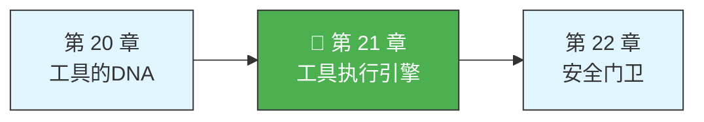
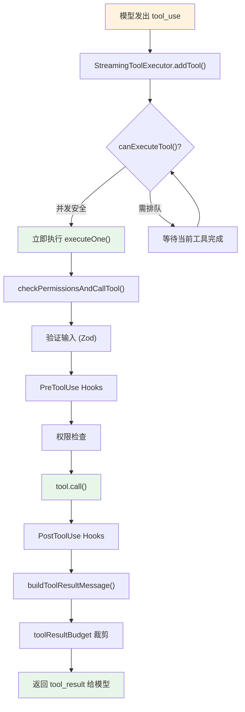
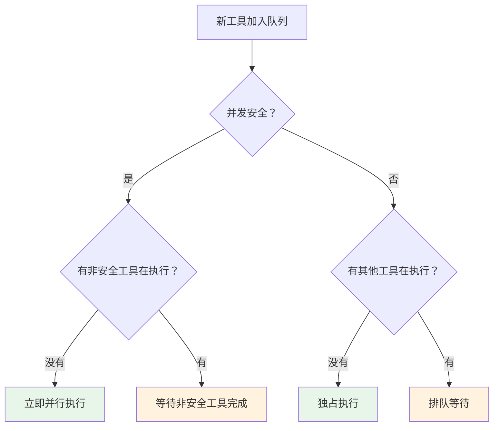

> 源码验证日期：2026-05-15，基于 commit `0d81bb6`

上一章我们看了工具的 DNA——那个统一的 `Tool` 类型。但你有没有想过，当 AI 说"我要读一个文件"的时候，从这句话到文件内容真正出现在你面前，中间到底发生了什么？

你可能以为过程很简单：AI 发请求，工具执行，返回结果。但实际上，这中间有一条精心设计的流水线。就像快递一样，你以为只是"下单->收货"，但背后有订单验证、仓库拣货、安检扫描、物流配送、签收确认。每一步都有它的理由。

这条流水线就是**工具执行引擎**。它的核心是一个叫 `runToolUse` 的函数。

---

## 路线图



---

## 这是什么

想象你是一个工厂的生产调度员。每天你收到几十张工单，每张工单写着"做某件事"。你的工作不是亲自去做每一件事，而是确保每张工单按正确流程走完：

1. **核对工单**——工单填得对不对？材料齐不齐？
2. **查安全许可**——这个操作有危险吗？需要特别授权吗？
3. **通知前置工位**——告诉上下游，"我要开始做这件事了"
4. **执行**——让对应的工位开工
5. **通知后置工位**——做完了，让后续流程接手
6. **交还结果**——把成品交给下一环节

`runToolUse` 就是这个调度员。

---

## 打开源码

工具执行引擎的核心代码在 `src/services/tools/toolExecution.ts` 文件中，约 1745 行。并发控制在 `src/services/tools/StreamingToolExecutor.ts` 中。整个执行流程可以用一张生命周期图看清：



---

## 它怎么工作

### 并发控制：安全工具并行，危险工具串行

模型可能同时返回多个工具调用。Claude Code 用 `StreamingToolExecutor` 管理并发，核心算法是 `canExecuteTool`：

```typescript
private canExecuteTool(isConcurrencySafe: boolean): boolean {
  const executingTools = this.tools.filter(t => t.status === 'executing')
  return (
    executingTools.length === 0 ||
    (isConcurrencySafe && executingTools.every(t => t.isConcurrencySafe))
  )
}
```

规则很简单：如果所有正在执行的工具都是并发安全的，新的安全工具可以并行开始。否则排队等。**关键设计**：模型仍在流式输出时，工具就已经开始执行了——这叫**预测性工具执行**。



### 完整执行链：六步流水线

找到了工具之后，`runToolUse` 把实际执行委托给了 `checkPermissionsAndCallTool` 函数。执行引擎的完整生命周期是：

```
验证输入 -> 运行前置钩子 -> 检查权限 -> 执行工具 -> 运行后置钩子 -> 返回结果
```

**第一步：验证输入**——用 Zod 做 schema 验证，再用工具自定义逻辑做深度验证。

**第二步：运行 PreToolUse Hooks**——外部脚本可以修改参数、批准或拒绝执行：

```typescript
for await (const result of runPreToolUseHooks(
  toolUseContext, tool, processedInput, toolUseID,
)) {
  switch (result.type) {
    case 'hookPermissionResult': // 钩子做出了权限决定
    case 'hookUpdatedInput':     // 钩子修改了输入参数
    case 'preventContinuation':  // 钩子要求停止执行
  }
}
```

**第三步：检查权限**——合并钩子决定和规则系统的决定。关键安全设计：**钩子不能绕过安全规则**。即使钩子说"批准"，如果 `settings.json` 里有 deny 规则，deny 仍然生效。

**第四步：执行工具**——调用 `tool.call()`。

**第五步：运行 PostToolUse Hooks**——后置钩子可以修改结果、记录日志、做清理。

**第六步：返回结果**——打包所有消息返回给 AI。

### 兄弟错误级联

Bash 命令失败会取消所有并行兄弟——因为 Bash 命令经常有依赖关系（`mkdir` 失败 -> `cp` 无意义）。其他工具（Read、Grep）失败不会影响并行任务。

---

## StreamingToolExecutor 内部结构

`StreamingToolExecutor` 不只是 `canExecuteTool` 一个方法。它是一个完整的工具调度器：

```typescript
// → src/services/tools/StreamingToolExecutor.ts（简化结构）
class StreamingToolExecutor {
  private tools: ToolExecution[]      // 所有待执行/执行中的工具
  private executedTools: Set<string>  // 已完成的工具 ID
  private abortController: AbortController

  // 核心方法
  addTool(tool: ToolExecution): void           // 将工具加入队列
  canExecuteTool(isConcurrencySafe: boolean): boolean  // 判断是否可立即执行
  async executeAll(): Promise<ToolResult[]>     // 执行所有工具，返回结果集
  cancelAll(reason: string): void              // 取消所有未完成的工具
  private async executeOne(tool: ToolExecution): Promise<ToolResult>  // 执行单个工具
}
```

`executeAll()` 是调度循环的核心：

```typescript
async executeAll(): Promise<ToolResult[]> {
  const results: ToolResult[] = []
  const pending = new Set(this.tools)

  while (pending.size > 0) {
    for (const tool of [...pending]) {
      if (this.canExecuteTool(tool.isConcurrencySafe)) {
        pending.delete(tool)
        // 不 await——让多个工具并发执行
        this.executeOne(tool).then(result => {
          results.push(result)
          if (result.isError && tool.name === 'Bash') {
            this.cancelAll('兄弟命令失败，取消并行任务')  // Bash 错误级联
          }
        })
      }
    }
    await sleep(10)  // 微等待，避免忙轮询
  }
  return results
}
```

关键设计：
1. **非阻塞调度**：`.then()` 而非 `await`——多个工具真正并发执行
2. **微轮询**：10ms 的 `sleep` 防止 CPU 空转
3. **动态队列**：工具可以在执行过程中动态添加（模型边流式输出边追加新工具调用）

---

## 预测性工具执行

Claude Code 的一个关键优化：**不等模型说完就开始执行工具**。

模型的流式输出可能包含多个 `tool_use` 块。当第一个 `tool_use` 的 JSON 完整到达时（`content_block_stop` 事件），即使模型还在生成后续内容，`StreamingToolExecutor.addTool()` 就被调用了。如果工具是并发安全的（Read、Grep、Glob），它立刻开始执行。

这意味着：当用户看到模型"说完"所有工具调用时，前几个只读工具的结果已经回来了。这就是为什么有时候 AI 的"思考"看起来几乎瞬间完成——它在你等待的时候已经悄悄做完了。

```
时间线：
模型流式输出    ████ tool_use #1 ████ tool_use #2 ████ 文字回复 ████
工具执行        ...............████████ Read 执行中 ████████
                                           ████████ Grep 执行中 ████████
用户看到        .......................................AI 已经拿到结果，立即回复
```

---

## 工具结果格式化

工具执行完后，原始输出需要被格式化为 Anthropic API 要求的 `tool_result` 消息格式：

```typescript
// → src/services/tools/toolExecution.ts 的 buildToolResultMessage()
function buildToolResultMessage(
  toolUse: ToolUse,
  result: ToolCallResult,
  toolUseID: string,
): ToolResultMessage {
  return {
    type: 'user',
    message: {
      role: 'user',
      content: [{
        type: 'tool_result',
        tool_use_id: toolUseID,
        content: typeof result === 'string'
          ? result
          : formatToolOutput(result),
        is_error: result.isError ?? false,
      }],
    },
  }
}
```

注意 `is_error` 字段——即使工具执行失败，结果仍然要返回给模型。模型需要看到错误信息来调整下一步策略。隐藏错误会让模型陷入困惑——它不知道为什么自己的操作没有生效。

对于长输出（如 `tail -n 500`），结果会经过 `toolResultBudget` 裁剪，避免撑爆上下文窗口。这个裁剪器是上下文压缩四层管线的第一层（详见第 13 章）。

---

## 错误恢复与取消传播

工具执行中有三类错误，处理方式不同：

| 错误类型 | 示例 | 处理方式 |
|---------|------|---------|
| **工具逻辑错误** | `cat: no such file` | 标记 `is_error: true`，结果返回模型 |
| **基础设施错误** | 进程崩溃、OOM | 捕获异常，包装为 tool_result 返回模型 |
| **用户取消** | Ctrl+C | 取消所有并行工具，清空队列，向模型注入取消通知 |

取消信号的传播路径：

```typescript
// → src/services/tools/toolExecution.ts
if (abortController.signal.aborted) {
  return {
    content: 'Tool execution cancelled by user.',
    isError: true,
  }
}
```

`abortController` 是全局共享的——用户按一次 Ctrl+C，所有正在执行和等待执行的工具全部终止。这避免了"按了取消还在跑命令"的糟糕体验。

对于长时间运行的命令（如 `npm install`），工具执行有超时保护：

```typescript
const result = await withTimeout(
  tool.call(processedInput, context),
  TOOL_EXECUTION_TIMEOUT_MS,  // 默认 10 分钟
  `Tool ${tool.name} timed out after ${TOOL_EXECUTION_TIMEOUT_MS}ms`,
)
```

超时后结果被标记为 `is_error: true` 返回给模型，模型可以决定重试或换一种方式。

---

## 常见错误与检查方法

| 常见错误 | 检查方法 |
|---------|---------|
| 工具执行被意外拒绝 | 检查 PreToolUse Hook 是否返回了 deny |
| 并行工具互相干扰 | 确认工具的 `isConcurrencySafe` 标记是否正确 |
| 钩子超时导致卡死 | 检查 `TOOL_HOOK_EXECUTION_TIMEOUT_MS` 设置 |
| 修改输入参数无效 | Hook 修改的是 `processedInput`，不是原始 `input` |

---

## 试试看

### 练习一：观察并发执行

在 `StreamingToolExecutor.ts` 的 `canExecuteTool` 方法中加调试日志，给 Claude 一个需要读多个文件的任务，观察哪些工具并行执行。

### 练习二：测量工具执行时间

在 `toolExecution.ts` 的 `tool.call()` 调用前后加计时，观察不同工具的执行时间差异。

### 练习三：追踪一次完整的 FileReadTool 执行

让 AI 读取一个文件，然后在 `runToolUse` 的关键节点打 `console.log`，观察日志输出的顺序。

---

## 检查点

1. **StreamingToolExecutor** 实现预测性工具执行——模型还在流式输出时，只读工具已经开始执行
2. **并发分区算法**：`isConcurrencySafe` 判断——安全工具并行、非安全工具串行
3. **六步执行链**：验证输入 -> PreToolUse Hooks -> 权限检查 -> `tool.call()` -> PostToolUse Hooks -> 返回结果
4. **安全设计**：钩子的"批准"不能绕过规则系统的"拒绝"
5. **兄弟错误级联**：Bash 失败取消并行兄弟，其他工具失败不影响
6. **非阻塞调度**：`.then()` 而非 `await`，多工具真正并发；10ms 微轮询防止 CPU 空转
7. **结果格式化**：`buildToolResultMessage` 将原始输出包装为 API 要求的 tool_result 格式，`is_error` 让模型看到失败
8. **取消传播**：全局 `abortController`——一次 Ctrl+C 终止全部工具
9. **超时保护**：`TOOL_EXECUTION_TIMEOUT_MS`，超时后标记 is_error 返回模型

---

## 案例重访：为什么 Agent 选错了工具（而且反复选）

卷零 ch02 和卷一 ch15 的那个死循环 bug——Agent 反复调用 Read 25 次——在工具执行引擎的视角下有了新的解释。

Agent 的每一轮，模型输出 `tool_use: { name: "Read", input: { file_path: "src/auth.ts" } }`。`StreamingToolExecutor` 忠实地执行它——Read 工具确实是 isConcurrencySafe 的，也确实返回了文件内容。执行引擎没有做错任何事。

**问题不在执行，在决策。** 模型连续 25 次选择了 Read 而不是 Edit。工具执行引擎是"手脚"，它只能执行——它不能质疑大脑的决策。

但执行引擎可以做的，是提供更好的**反馈信号**：

```typescript
// → 在 tool_result 中加入元信息，帮助模型判断
const toolResult = {
  type: "tool_result",
  tool_use_id: block.id,
  content: fileContent,
  // 如果加入这条信息，模型可能意识到自己在重复
  // metadata: { call_count: 3, message: "这是第3次读取同一文件" }
}
```

不过 Anthropic API 的 tool_result 格式不支持自定义 metadata。所以工具执行引擎无法直接干预——真正的解决方案在卷三 ch38（调试定位 root cause）、卷四 ch48（理解这是架构取舍而非 bug）和卷五 ch63（在自己的框架中实现 LoopDetector）中层层展开。

你看到了工具执行的流水线。但有一个关键问题我们还没深入：权限系统到底是怎么工作的？下一章，我们走进安全门卫的岗亭。

---

## 对比：如果用 Java

Java 的 `ExecutorService` 提供了与工具执行引擎类似的并发调度能力——`submit()` 提交任务、`invokeAll()` 并行执行、`Future.get()` 获取结果。Claude Code 的 `StreamingToolExecutor` 在此基础上做了两件 Java Executor 不直接支持的事：(1) 预测性执行——只读工具在模型还在输出时就开始执行，这需要提前解析不完整的 tool_use JSON；(2) 并发分区——`isConcurrencySafe` 标记决定哪些工具可以并行、哪些必须串行，类似 Java 的 `ForkJoinPool` 但分区逻辑是自定义的。Java 要实现同样的效果，需要 `CompletionService` + 自定义 `Callable` 包装 + `invokeAny`/超时管理的组合。

---

## 你能改什么

**安全区域**：工具注册表中的单个工具实现（`src/tools/` 下的各工具目录）——独立封装，改动影响范围可控。

**危险区域**：`toolExecution.ts` 的执行管线——所有工具调用都经过这里，修改排序或错误处理可能中断整个工具执行链路；`StreamingToolExecutor` 的并发分区算法——时序相关的 bug 极难复现和调试。

---

[上一章：工具的DNA](/posts/4209b89a/) | [下一章：安全门卫](/posts/b69d5aa2/)
