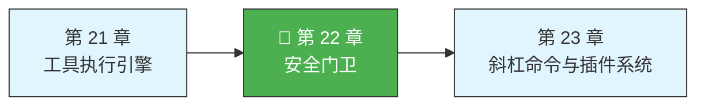
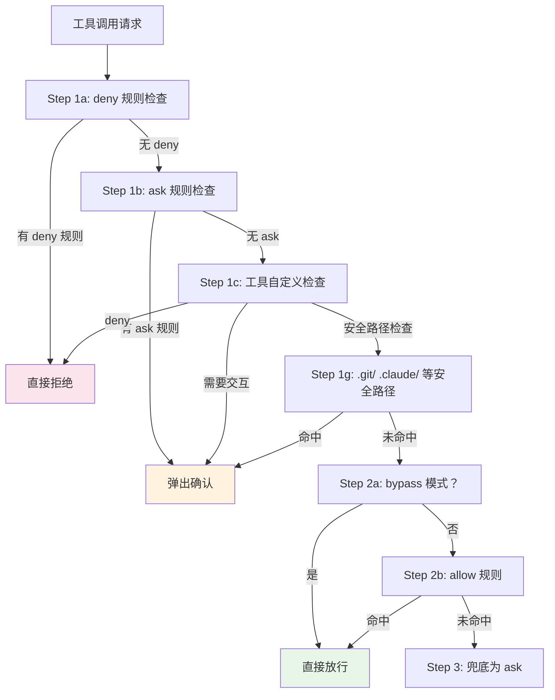

> 源码验证日期：2026-05-15，基于 commit `0d81bb6`

上一章你看到了工具执行引擎——AI 说"执行这个命令"，引擎就调用 BashTool，命令就跑了。但你有没有注意到，有时候命令直接就执行了，有时候终端底部却弹出一个提示："Claude 想要运行 `npm install`，是否允许？"

是谁在拦住那些命令？是谁在说"这个可以放行"或者"这个必须问一下用户"？

这个角色叫做**权限系统**。它就像一栋大楼的门卫——每天有无数人（工具调用）要进出，门卫得快速判断：这个人有通行证吗？是老熟人可以直接放行？还是得请示一下上级？

---

## 路线图



---

## 这是什么

Claude Code 的权限系统是一个三层决策机制。每当 AI 要执行一个工具，系统都会先问一句话："这个操作有权限吗？"答案有三种：

- **`allow`**（允许）——直接执行，不打扰用户
- **`deny`**（拒绝）——直接拦下
- **`ask`**（询问）——弹出一个提示，让用户来拍板

```typescript
export type PermissionBehavior = 'allow' | 'deny' | 'ask'
```

就这么简单。三个单词，撑起了整个安全体系。

---

## 打开源码

权限系统的核心代码在 `src/utils/permissions/` 目录下。核心逻辑集中在一个函数上：**`hasPermissionsToUseTool`**，定义在 `src/utils/permissions/permissions.ts`。

| 文件 | 作用 |
|---|---|
| `permissions.ts` | 主函数，决策的总调度 |
| `PermissionRule.ts` | 权限规则的类型定义 |
| `permissionRuleParser.ts` | 解析规则字符串 |
| `PermissionMode.ts` | 权限模式配置 |
| `bashClassifier.ts` | Bash 命令的 AI 分类器 |
| `dangerousPatterns.ts` | 危险命令模式列表 |
| `denialTracking.ts` | 拒绝次数追踪 |

---

## 它怎么工作

### 六种权限模式

系统支持六种权限模式（5 种外部模式 + 1 种内部 AI 分类器模式）。其中 5 种外部模式定义在 `EXTERNAL_PERMISSION_MODES` 常量中，用户通过 Shift+Tab 循环切换；`auto` 模式是内部 AI 分类器模式，由系统自动激活：

| 模式 | 类型 | 行为 |
|---|---|---|
| `default` | 外部 | 正常流程，该问就问 |
| `plan` | 外部 | 只做规划，不实际执行 |
| `acceptEdits` | 外部 | 自动接受文件编辑类的操作 |
| `bypassPermissions` | 外部 | 跳过所有权限检查（但安全路径检查不跳过） |
| `dontAsk` | 外部 | 不弹窗——需要询问的操作直接拒绝 |
| `auto` | 内部 | AI 分类器（Opus 模型）自动评估每个操作的风险并决定允许/拒绝 |

### 分层规则检查的完整流程

`hasPermissionsToUseToolInner` 是一个安检流程，每个工具调用都要依次经过多道检查：



### 安全路径检查：bypass-immune

某些路径即使 `bypassPermissions` 模式也必须提示：

- `.git/`——Git 仓库元数据
- `.claude/`——Claude Code 配置
- `.bashrc`、`.zshrc`——Shell 配置文件

这些是安全关键路径——恶意工具调用修改它们可能导致持久性后门。

### Auto 模式的三级快速路径

当权限模式是 `auto` 时，决策走三级快速路径：

1. **acceptEdits 兼容**——如果 acceptEdits 模式下会允许，直接允许
2. **安全工具白名单**——Read、Grep、Glob 等只读工具直接放行
3. **完整 AI 分类器**——调用 Opus 模型评估完整对话上下文

大多数工具调用走快速路径 1 或 2——只有写操作才需要调用 AI 分类器。

### 拒绝追踪：防止分类器退化

```typescript
const DENIAL_LIMITS = {
  maxConsecutive: 3,   // 连续拒绝上限
  maxTotal: 20,        // 总拒绝上限
}
```

如果 AI 分类器连续拒绝了 3 次，或者总共拒绝了 20 次，系统会停止自动模式，回退到用户提示。

### 权限规则语法

规则以字符串形式存储，格式是 `ToolName(content)`：

- `"Bash"` —— 匹配所有 Bash 命令
- `"Bash(npm install)"` —— 精确匹配
- `"Bash(npm:*)"` —— 前缀匹配
- `"Bash(git *)"` —— 通配符匹配

### 8 种规则来源

按优先级从高到低：

1. `policySettings`——企业管理（不可覆盖）
2. `flagSettings`——功能标志覆盖
3. `userSettings`——用户级配置
4. `projectSettings`——项目级配置
5. `localSettings`——本地配置
6. `cliArg`——命令行参数
7. `command`——程序化规则
8. `session`——仅内存，当前会话

**关键安全属性：权限永不跨会话恢复。** session 级别的规则存在内存中，resume 恢复对话时不恢复。

---

## 常见错误与检查方法

| 常见错误 | 检查方法 |
|---------|---------|
| 工具被意外拒绝 | 检查 deny 规则和工具自定义的 `checkPermissions` |
| bypass 模式下仍弹出确认 | 这是安全路径检查（.git/ 等），是正常行为 |
| auto 模式频繁拒绝 | 检查 `denialTracking` 的阈值——连续 3 次后会回退 |
| 规则不生效 | 检查规则来源的优先级——policySettings 不可覆盖 |

---

## 试试看

### 练习一：添加自定义权限规则

在 `.claude/settings.json` 的 `permissions` 中添加 allow/deny/ask 规则，观察不同命令的行为变化。

### 练习二：测试不同权限模式

分别用 `--permission-mode acceptEdits`、`--dangerously-skip-permissions` 和默认模式运行，观察同一个工具调用的行为差异。

### 练习三：追踪权限决策路径

在 `hasPermissionsToUseToolInner` 的每个步骤加日志，发送一个需要权限的工具调用，观察走了哪条路径。

---

## 检查点

1. **三种决策**：`allow`、`deny`、`ask` 构成权限系统的基石
2. **六种权限模式**：5 种外部模式（default、plan、acceptEdits、bypassPermissions、dontAsk）+ 1 种内部 AI 分类器模式（auto）
3. **分层检查**：从 deny 到 allow，从工具自身检查到安全路径保护
4. **安全路径检查**：`.git/`、`.claude/`、shell 配置文件——bypass-immune
5. **Auto 模式三级快速路径**：acceptEdits 兼容 -> 安全工具白名单 -> AI 分类器
6. **拒绝追踪**：连续 3 次或总计 20 次拒绝后退回手动提示
7. **跨会话安全**：权限永不跨会话恢复

门卫保护了大楼的安全。下一章我们看另一种机制——斜杠命令和插件系统。

---

## 对比：如果用 Java

Java 的安全模型以 `SecurityManager` 和 `AccessController` 为核心——基于代码来源（CodeSource）和签名（ProtectionDomain）在 JVM 层做权限控制。Claude Code 的权限系统完全不同：它不控制 JVM 级的资源访问，而是控制 AI 调用工具的权限。Java SecurityManager 的 `checkPermission()` 和 Claude Code 的 `hasPermissionsToUseTool()` 名字相似但层次不同——前者保护系统资源，后者保护用户免受 AI 的不当操作。一个值得注意的共通点是 deny 优先的设计：Java 的 `AccessController` 要求所有 ProtectionDomain 都通过检查（任一 deny 即拒绝），Claude Code 的权限管线同样是 deny 最先检查、allow 无法覆盖 deny。

---

## 你能改什么

**安全区域**：添加自定义权限规则（`src/utils/permissions/` 的规则配置）——规则是声明式的，改错只会影响单个操作；Hook 系统配置——独立于权限核心管线。

**危险区域**：`hasPermissionsToUseToolInner` 的三步检查顺序——deny 必须最先、allow 不能覆盖 deny，任何顺序调整都是安全漏洞；bypass-immune 路径列表（`.git/`、`.claude/`、shell 配置文件）——删除或缩小这个列表会暴露敏感文件；Bash 安全分类器——2600 行的命令安全检查逻辑，任何修改都需要 Bash 注入攻防经验。

---

[上一章：工具执行引擎](/posts/3b30cc5e/) | [下一章：斜杠命令与插件系统](/posts/105c1ac7/)
