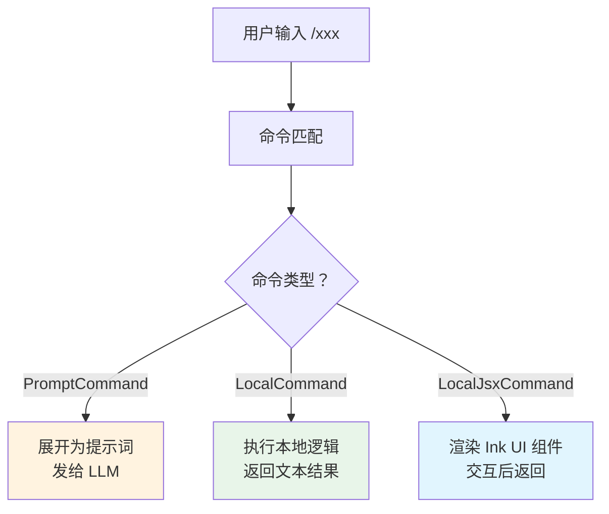

> 源码验证日期：2026-05-15，基于 commit `0d81bb6`

你在终端里输入 `/help`，屏幕上弹出一列命令清单。输入 `/compact`，对话历史被压缩。输入 `/init`，Claude Code 为你生成一份 CLAUDE.md。这些以斜杠开头的命令看起来像魔法——输入几个字母，系统就做出响应。

但魔法背后是一套精密的系统：**命令注册表**管理着约 90 个命令，**三种命令类型**各有不同的执行路径，而**插件系统**让命令的来源不限于内置——任何人都能扩展。这一章，我们拆开斜杠命令和插件系统的工作原理。

---

## 路线图


---

## 这是什么

想象一家餐厅的菜单系统。菜单上列着几十道菜（命令），每道菜有名字、描述、做法。客人点菜时，服务员（命令分发器）根据菜名找到对应的厨师（处理器），厨师做好菜端上来。

但这家餐厅还有个特别之处：允许外面的小摊贩（插件）来摆摊。他们可以提供自己的菜，甚至覆盖餐厅原有的菜。客人不知道哪道菜是餐厅做的、哪道是小摊贩的——统一上菜单。

Claude Code 的命令系统就是这家餐厅。`commands.ts` 是菜单册，三种命令类型是三种烹饪方式，插件系统就是那个允许小摊贩摆摊的机制。

---

## 打开源码

命令和插件系统的核心代码分布在以下位置：

| 文件 | 作用 |
|------|------|
| `src/commands.ts` | 命令注册表，~90 个命令的入口 |
| `src/types/command.ts` | Command 类型定义——三种命令类型 |
| `src/commands/` | 命令实现目录，每个子目录一个命令 |
| `src/types/plugin.ts` | 插件类型定义 |
| `src/utils/plugins/schemas.ts` | 插件 manifest 的 schema |
| `src/plugins/builtinPlugins.ts` | 内置插件注册 |

数据流很简单：用户输入 → 命令匹配 → 类型分发 → 执行 → 返回结果。

---

## 它怎么工作

### 三种命令类型

Claude Code 的命令不是铁板一块。它们分为三种类型，每种有不同的执行路径：

```typescript
// → src/types/command.ts（简化版）
type Command =
  | PromptCommand      // 展开为提示词发给模型
  | LocalCommand       // 非交互式本地命令
  | LocalJsxCommand    // 交互式 JSX 命令（Ink UI）
```



**PromptCommand**：命令变成一段提示词，注入到对话中，让模型来处理。比如 `/init` 命令生成"分析项目结构并创建 CLAUDE.md"的提示词。模型收到后就像用户说了那句话一样，开始工作。

```typescript
// → src/commands/init/index.ts（简化版）
const initCommand = {
  type: 'prompt',
  name: 'init',
  description: 'Initialize CLAUDE.md...',
  getPromptForCommand(args) {
    return 'Analyze this project and create a CLAUDE.md file...'
  },
} satisfies Command
```

PromptCommand 还可以指定 `allowedTools`（允许使用的工具）、`model`（使用的模型）、`context`（在当前对话还是新对话中执行）等参数。

**LocalCommand**：命令直接执行本地逻辑，不需要模型参与。比如 `/compact` 命令压缩对话历史。它返回的结果类型有三种：`text`（文本）、`compact`（触发压缩）、`skip`（跳过）。

**LocalJsxCommand**：命令渲染一个交互式 UI 界面，用户在界面上操作后返回结果。比如 `/hooks` 命令显示 Hook 配置界面。`immediate: true` 标记表示这个命令不需要模型参与，立刻执行。

### CommandBase：所有命令共享的字段

不管哪种类型，每个命令都有这些基础字段：

```typescript
// → src/types/command.ts（简化版）
type CommandBase = {
  name: string                    // 命令名（不含 /）
  description: string             // 帮助描述
  aliases?: string[]              // 别名
  isEnabled?(): boolean           // 是否启用
  isHidden?: boolean              // 是否隐藏
  availability?: 'normal' | 'auth' | 'pro'  // 可用性要求
  argumentHint?: string           // 参数提示
  whenToUse?: string              // 使用场景描述
  loadedFrom?: string             // 加载来源
  supportsNonInteractive?: boolean // 是否支持非交互模式
}
```

`availability` 字段控制命令的可见性——有些命令需要登录才能用（`auth`），有些需要订阅（`pro`）。`isEnabled` 是运行时检查——比如 `daemon` 命令只在 daemon 功能开启时才出现。

### 命令注册：COMMANDS 数组

所有内置命令集中注册在一个函数里：

```typescript
// → src/commands.ts（简化版）
const COMMANDS = memoize(() => {
  return [
    help, compact, clear, config, doctor, init,
    login, logout, mcp, model, permissions,
    review, status, bug, vim, memory,
    // ... 更多命令
    // feature-gated 命令
    ...(feature('DAEMON') ? [daemon] : []),
    ...(feature('BRIDGE_MODE') ? [bridge] : []),
  ]
})
```

`memoize` 保证命令列表只计算一次。feature-gated 命令用条件展开——只有对应的功能开关打开时才注册。

### 命令合并优先级

命令的来源不止一个。Claude Code 会从七个来源加载命令，按优先级从高到低合并：

```typescript
// → src/commands.ts（简化版）
function loadAllCommands(context) {
  const all = [
    ...bundledSkills,          // 1. 内置技能
    ...builtinPluginSkills,    // 2. 内置插件技能
    ...skillDirCommands,       // 3. /skills/ 目录
    ...workflowCommands,       // 4. 工作流命令
    ...pluginCommands,         // 5. 插件命令
    ...pluginSkills,           // 6. 插件技能
    ...COMMANDS(),             // 7. 硬编码命令（最低优先级）
  ]

  return all.filter(cmd =>
    meetsAvailabilityRequirement(cmd) &&
    isCommandEnabled(cmd)
  )
}
```

高优先级来源的同名命令覆盖低优先级。这意味着插件可以覆盖内置命令——比如你可以写一个自定义的 `/review` 命令，替代默认的。

合并后，`auth` 门控和 `feature flags` 做最终过滤。

### 插件系统：组件类型

插件不只是添加命令。一个插件可以提供五种组件：

```typescript
// → src/types/plugin.ts
type PluginComponent =
  | 'commands'       // 斜杠命令
  | 'agents'         // 代理定义
  | 'skills'         // 技能
  | 'hooks'          // Hook 配置
  | 'output-styles'  // 输出样式
```

这意味着一个插件可以同时注册命令、定义 Agent、配置 Hook、改变输出样式——从多个维度扩展 Claude Code。

### 插件 Manifest

每个插件通过 manifest 文件描述自己：

```typescript
// → src/utils/plugins/schemas.ts（简化版）
type PluginManifest = {
  // 元数据
  name: string
  version: string
  description?: string
  author?: string
  homepage?: string
  repository?: string
  license?: string
  keywords?: string[]
  dependencies?: Record<string, string>

  // 组件
  commands?: string | string[] | Record<string, CommandDef>
  agents?: string | string[]
  skills?: string | string[]
  hooks?: object | string              // Hook 配置
  outputStyles?: string | string[]     // 输出样式
  mcpServers?: McpServerConfig[]       // MCP 服务器
  lspServers?: LspServerConfig[]       // LSP 服务器
  channels?: ChannelConfig[]           // 通知通道
  settings?: Partial<Settings>         // 启用时合并的设置
  userConfig?: UserConfigDef[]         // 用户可配置值
}
```

Manifest 是插件的"身份证"。它声明插件提供什么、需要什么、来自哪里。

### 插件来源

插件可以从多种来源安装：

```typescript
// → src/utils/plugins/schemas.ts（简化版）
type PluginSource =
  | string                               // 相对路径
  | { source: 'npm', package, version? }    // npm 包
  | { source: 'pip', package, version? }    // Python 包
  | { source: 'url', url, ref?, sha? }      // URL 下载
  | { source: 'github', repo, ref?, sha? }  // GitHub 仓库
  | { source: 'git-subdir', url, path, ref?, sha? }  // monorepo 子目录
```

从 npm 安装、从 GitHub 克隆、从 URL 下载——甚至直接指向本地路径。来源多样，但加载流程统一。

### 插件生命周期

一个插件从发现到卸载，经历八个阶段：

```
1. 发现 — 扫描 marketplace、配置文件
2. 下载 — 从来源获取插件文件
3. 验证 — 检查 manifest 完整性
4. 安装 — 解压到插件目录
5. 启用 — 注册命令、Hook、MCP 服务器
6. 运行 — 响应用户请求
7. 禁用 — 注销组件
8. 卸载 — 删除文件
```

插件 ID 使用 `name@marketplace` 格式。内置插件用 `@builtin` 后缀——比如 `plugin-name@builtin`。

---

## 常见错误与检查方法

| 常见错误 | 检查方法 |
|---------|---------|
| 自定义命令不出现 | 检查文件路径（`.claude/commands/`）和 frontmatter 格式 |
| 插件命令没覆盖内置命令 | 检查合并优先级——`loadAllCommands` 的顺序 |
| 命令在非交互模式下不可用 | 检查 `supportsNonInteractive` 字段 |
| 命令不可见 | 检查 `isEnabled()` 返回值和 `availability` 门控 |
| feature-gated 命令不出现 | 检查 `feature('xxx')` 是否开启 |

---

## 试试看

### 练习一：创建自定义命令

在项目根目录创建 `.claude/commands/my-command.md`：

```markdown
---
description: "My custom command"
allowed-tools: Read, Grep
---

Analyze the current project structure and summarize the architecture.
```

然后在 Claude Code 中输入 `/my-command` 测试。观察模型收到了什么提示词。

### 练习二：列出所有已注册命令

在 `src/commands.ts` 的 `loadAllCommands` 返回前加一行日志：

```typescript
console.log('[DEBUG] Commands:', result.map(c => `${c.type}/${c.name}`).join(', '))
console.log('[DEBUG] Total:', result.length)
```

重启 Claude Code，观察输出了多少命令、每种类型各多少个。

### 练习三：观察插件加载

在 `builtinPlugins.ts` 中加日志，看内置插件注册了哪些组件（命令、Agent、技能）。

---

## 检查点

1. **三种命令类型**：PromptCommand（提示词发给模型）、LocalCommand（本地逻辑）、LocalJsxCommand（交互式 UI）
2. **CommandBase**：所有命令共享的字段——name、description、aliases、isEnabled、availability
3. **命令注册**：`COMMANDS()` 静态数组用 `memoize` 缓存，feature-gated 命令用条件展开
4. **合并优先级**：内置技能 > 内置插件技能 > /skills/ > 工作流 > 插件命令 > 插件技能 > 硬编码命令
5. **插件组件**：commands、agents、skills、hooks、output-styles 五种组件类型
6. **插件 Manifest**：元数据 + 组件路径 + MCP/LSP 服务器 + 设置
7. **插件来源**：npm、pip、GitHub、URL、本地路径、git-subdir
8. **插件 ID**：`name@marketplace` 格式，内置用 `@builtin`

命令系统让用户用简短的斜杠触发复杂操作。插件系统让这些操作可以被无限扩展。下一章，我们看另一个扩展机制——Hook 系统，它能在工具执行前后拦截和修改行为。

---

## 对比：如果用 Java

Java 的 `ServiceLoader` (SPI) 和 OSGi 是命令/插件系统的传统实现方式。ServiceLoader 通过 `META-INF/services/` 文件声明实现类，在运行时动态发现和加载；OSGi 提供了完整的模块生命周期（install/start/stop/uninstall）和隔离的类加载器。Claude Code 的插件系统介于两者之间——比 ServiceLoader 复杂（有 manifest 校验、版本缓存、多来源合并），但比 OSGi 简单（没有模块级类隔离，依赖 npm 而不是 bundle classpath）。一个有趣的对应：Claude Code 的 7 源合并优先级（内置 > 用户 > 插件 > 企业）在 Java 里等价于多 ClassLoader 的委派链（delegation chain），只是 Java 通过 Parent-First 委派控制，Claude Code 通过显式优先级数组控制。

---

[上一章：安全门卫](/posts/b69d5aa2/) | [下一章：Hook系统](/posts/b893ae1e/)
