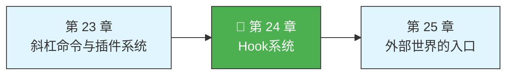
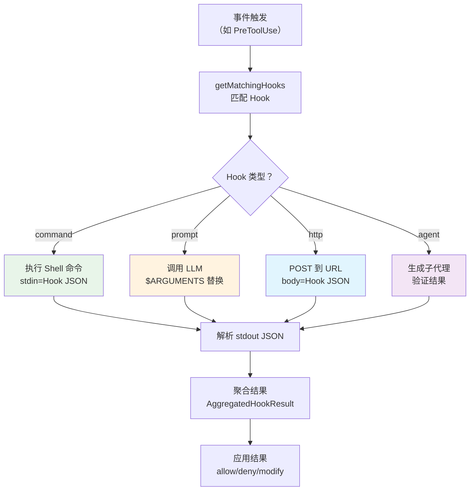

> 源码验证日期：2026-05-15，基于 commit `0d81bb6`

上一章你看到了斜杠命令和插件系统——用户主动触发，系统做出响应。但还有一种更隐蔽的机制：不是用户主动触发，而是系统内部发生了某件事，你希望在事情发生前或后做点什么。

比如，每次 AI 写文件之前自动跑一次 linter。每次工具执行完之后给监控系统发一个通知。每次会话开始时加载自定义配置。

这就是 **Hook 系统**——一个事件驱动的拦截机制。它不创造新功能，但在现有功能的执行路径上插入了你自己的逻辑。

---

## 路线图



---

## 这是什么

想象一条工厂流水线。零件从一端进入，经过多道工序，最终从另一端出来。现在你想在某个工序之前加一道质检——零件到了这里，先检查一遍，合格了才放行，不合格就打回去。

Hook 就是那道质检。它插在 Claude Code 的关键操作路径上，在特定事件发生时触发你定义的逻辑。你可以选择放行、阻止、甚至修改数据。

Claude Code 的 Hook 不需要写 TypeScript。任何能从 stdin 读取 JSON、向 stdout 写 JSON 的程序都可以——Shell 脚本、Python、Go、Rust，甚至一个简单的 `echo` 命令。

---

## 打开源码

Hook 系统的代码分布在以下位置：

| 文件 | 作用 |
|------|------|
| `src/entrypoints/sdk/coreTypes.ts` | `HOOK_EVENTS` 常量——25 个事件定义 |
| `src/schemas/hooks.ts` | Hook Zod schema——四种执行类型 |
| `src/utils/hooks.ts` | Hook 执行引擎——匹配、运行、结果处理 |
| `src/types/hooks.ts` | Hook 类型定义 |

核心执行引擎在 `src/utils/hooks.ts`，它是整个 Hook 系统的心脏。

---

## 它怎么工作

### 25 个 Hook 事件

Claude Code 定义了 25 个 Hook 事件，覆盖了系统的方方面面：

```typescript
// → src/entrypoints/sdk/coreTypes.ts:25-53
const HOOK_EVENTS = [
  // 工具执行（5 个）
  'PreToolUse',              // 工具执行前
  'PostToolUse',             // 工具执行后（成功）
  'PostToolUseFailure',      // 工具执行后（失败）
  'PermissionRequest',       // 权限请求时
  'PermissionDenied',        // 权限被拒绝时

  // 会话生命周期（5 个）
  'SessionStart',            // 会话开始
  'SessionEnd',              // 会话结束
  'Stop',                    // 代理停止
  'StopFailure',             // 代理停止（失败）
  'Setup',                   // 初始设置

  // 子代理（2 个）
  'SubagentStart',           // 子代理启动
  'SubagentStop',            // 子代理停止

  // 上下文管理（2 个）
  'PreCompact',              // 上下文压缩前
  'PostCompact',             // 上下文压缩后

  // 用户交互（4 个）
  'UserPromptSubmit',        // 用户提交提示
  'Notification',            // 通知发送
  'Elicitation',             // 信息请求
  'ElicitationResult',       // 信息请求结果

  // 任务系统（2 个）
  'TaskCreated',             // 任务创建
  'TaskCompleted',           // 任务完成

  // 团队（1 个）
  'TeammateIdle',            // 队友空闲

  // 环境变化（4 个）
  'ConfigChange',            // 配置变更
  'WorktreeCreate',          // 工作树创建
  'WorktreeRemove',          // 工作树移除
  'InstructionsLoaded',      // 指令加载完成
  'CwdChanged',              // 工作目录变更
  'FileChanged',             // 文件变更
]
```

这些事件被分成七类：工具执行、会话生命周期、子代理、上下文管理、用户交互、任务系统、环境变化。几乎覆盖了 Claude Code 运行时可能发生的所有重要事件。

### 四种执行类型

当一个 Hook 事件被触发时，你定义的逻辑怎么执行？有四种方式：

```typescript
// → src/schemas/hooks.ts:31-171（简化版）

// 类型 1：command（Shell 命令）
{
  type: 'command',
  command: 'my-script.sh',       // 要执行的命令
  shell?: 'bash' | 'powershell', // Shell 类型
  timeout?: number,               // 超时（毫秒）
  once?: boolean,                 // 只运行一次
  async?: boolean,                // 异步执行（不阻塞）
  if?: string,                    // 条件过滤
}

// 类型 2：prompt（LLM 评估）
{
  type: 'prompt',
  prompt: 'Evaluate: $ARGUMENTS', // $ARGUMENTS 被替换为 Hook 输入 JSON
  model?: string,                 // 使用的模型
  timeout?: number,
}

// 类型 3：http（Webhook）
{
  type: 'http',
  url: 'https://example.com/hook',
  headers?: { 'Authorization': 'Bearer $API_KEY' },
  allowedEnvVars?: ['API_KEY'],
  timeout?: number,
}

// 类型 4：agent（子代理验证）
{
  type: 'agent',
  prompt: 'Verify this change is safe',
  model?: string,
  timeout?: number,
}
```

**command** 最常用——直接执行一个 Shell 命令，命令从 stdin 接收 JSON 格式的 Hook 输入，向 stdout 写 JSON 格式的结果。**prompt** 把 Hook 输入交给 LLM 评估——让 AI 自己判断该怎么做。**http** 发一个 HTTP POST 请求——适合跟外部系统集成。**agent** 启动一个子代理来验证——最强大但也最昂贵。

还有一种内部类型 `callback`（定义在 `src/types/hooks.ts`），用于编程式 Hook——不持久化到设置文件，只在运行时生效。

### Hook 配置结构

Hook 配置按事件名组织，每个事件可以有多个 matcher：

```typescript
// → src/schemas/hooks.ts:194-222（简化版）
{
  "hooks": {
    "PreToolUse": [
      {
        "matcher": "Write",     // 只匹配 Write 工具
        "hooks": [
          { "type": "command", "command": "lint.sh" }
        ]
      },
      {
        "matcher": "Bash(git *)", // 匹配 git 开头的 Bash 命令
        "hooks": [
          { "type": "command", "command": "audit.sh" }
        ]
      }
    ],
    "PostToolUse": [
      {
        "matcher": "Edit",
        "hooks": [
          { "type": "http", "url": "https://ci.example.com/hook" }
        ]
      }
    ]
  }
}
```

`matcher` 是一个过滤条件——不是所有事件都会触发所有 Hook。对于工具相关的事件，matcher 匹配工具名（如 `Write`），还支持 Bash 命令模式匹配（如 `Bash(git *)`）。

### Hook 输入结构

每次 Hook 触发时，系统会构造一个 JSON 输入对象，通过 stdin 传给命令或作为请求体发送：

```typescript
// → src/utils/hooks.ts:301-328
function createBaseHookInput(context) {
  return {
    session_id: context.sessionId,
    transcript_path: context.transcriptPath,
    cwd: context.cwd,
    permission_mode: context.permissionMode,
    agent_id: context.agentId,
    agent_type: context.agentType,
  }
  // 工具事件额外添加：tool_name, tool_input, tool_result 等
}
```

### PreToolUse Hook：拦截和修改

`PreToolUse` 是最强大的 Hook 事件之一。它发生在工具执行之前，可以：

- **阻止执行**——返回 `permissionDecision: 'deny'`
- **允许执行**——返回 `permissionDecision: 'allow'`
- **修改工具输入**——返回 `updatedInput`
- **注入额外上下文**——返回 `additionalContext`

```typescript
// → src/utils/hooks.ts:550-622（简化版）
if (result.hookEventName === 'PreToolUse') {
  if (result.updatedInput) {
    processedInput = result.updatedInput  // 替换原始输入
  }
  if (result.permissionDecision === 'deny') {
    return { type: 'preventContinuation', ... }
  }
}
```

这意味着你可以在 AI 写文件之前自动修改文件内容，在 AI 执行命令之前拦截危险的命令。

### PostToolUse Hook：结果修改

`PostToolUse` 发生在工具执行之后。它可以替换 MCP 工具的输出、注入额外上下文：

```typescript
// → src/utils/hooks.ts:643-650（简化版）
if (result.updatedMCPToolOutput !== undefined) {
  toolOutput = result.updatedMCPToolOutput
}
```

### Matcher 逻辑

不同事件的 matcher 匹配方式不同：

```typescript
// → src/utils/hooks.ts:1603-1679（简化版）
function getMatchingHooks(eventName, matchQuery, hooks) {
  switch (eventName) {
    case 'PreToolUse':
    case 'PostToolUse':
      // 匹配 tool_name，支持 Bash(git *) 模式
      return filterByToolName(matchQuery.tool_name, hooks)

    case 'SessionStart':
      // 匹配 source（"cli", "resume", "sdk"）
      return filterBySource(matchQuery, hooks)

    case 'Notification':
      // 匹配 notification_type
      return filterByType(matchQuery, hooks)

    case 'FileChanged':
      // 匹配 basename(file_path)
      return filterByFileName(matchQuery, hooks)

    default:
      // 大多数事件没有 matcher——运行所有 Hook
      return hooks
  }
}
```

大多数事件没有精细的 matcher，直接运行所有注册的 Hook。只有工具相关的事件、会话启动、通知和文件变更事件有自定义匹配逻辑。

### 执行流程



---

## 常见错误与检查方法

| 常见错误 | 检查方法 |
|---------|---------|
| Hook 没有触发 | 检查事件名拼写和 matcher 格式 |
| Hook 的 command 执行失败 | 确保脚本从 stdin 读 JSON、向 stdout 写 JSON、退出码为 0 |
| PreToolUse Hook 没有阻止工具 | 检查返回的 JSON 是否包含 `decision: "deny"` |
| async Hook 阻塞了主流程 | 确认 `async: true` 已设置 |
| matcher 没有匹配到目标 | 用 `Bash(git *)` 格式而非 `git *` |

---

## 试试看

### 练习一：添加调试 Hook

在 `.claude/settings.json` 中添加一个 PreToolUse Hook，观察 Bash 工具的调用：

```json
{
  "hooks": {
    "PreToolUse": [{
      "matcher": "Bash",
      "hooks": [{
        "type": "command",
        "command": "echo '{\"decision\": \"allow\"}' && echo '[HOOK] Bash called:' $CLAUDE_TOOL_INPUT >&2"
      }]
    }]
  }
}
```

让 Claude Code 执行几个 Bash 命令，观察 stderr 的输出。

### 练习二：观察 Hook 匹配过程

在 `src/utils/hooks.ts` 的 `getMatchingHooks` 中加一行日志：

```typescript
console.log('[DEBUG] Hook match:', eventName, 'query:', matchQuery, 'matched:', matched.length)
```

触发几个不同的操作（写文件、执行命令、修改配置），观察 matcher 是怎么工作的。

### 练习三：用 Hook 实现 lint 检查

写一个 Shell 脚本，在 AI 写文件之前自动检查代码格式。如果格式不对，返回 `deny` 阻止写入。

---

## 检查点

1. **25 个 Hook 事件**：工具执行（5）、会话生命周期（5）、子代理（2）、上下文管理（2）、用户交互（4）、任务系统（2）、团队（1）、环境变化（4）
2. **四种执行类型**：command（Shell）、prompt（LLM）、http（Webhook）、agent（子代理验证）
3. **Matcher 机制**：按工具名、命令模式、事件源、文件名过滤
4. **PreToolUse Hook**：可以阻止执行、允许执行、修改工具输入、注入上下文
5. **PostToolUse Hook**：可以替换 MCP 输出、注入上下文
6. **Hook 输入**：session_id、cwd、tool_name、tool_input 等标准字段
7. **配置结构**：按事件名组织，每个事件可有多个 matcher + hooks 数组

Hook 系统是 Claude Code 最灵活的扩展点——不需要改源码，不需要写插件，一个 Shell 脚本就能改变系统的行为。下一章，我们走出内部机制，看看 Claude Code 如何连接外部世界。

---

## 对比：如果用 Java

Java 的拦截器模式（Interceptor Pattern）和 AOP（Aspect-Oriented Programming）提供了与 Hook 系统类似的"在方法执行前后插入逻辑"的能力。Spring AOP 的 `@Before`/`@After`/`@Around` 注解和 `ProceedingJoinPoint` 分别对应 PreToolUse/PostToolUse Hook 和 Hook 可以阻止/修改执行的能力。但一个关键区别：Java AOP 是在编译时（AspectJ 织入）或运行时（Spring CGLIB 代理）修改字节码，Hook 系统的拦截是在业务代码中**显式调用**——`runPreToolUseHooks()` 嵌在 `runToolUse` 函数里，不是魔法般的字节码织入。显式调用失去了 AOP 的透明性，但换来了完全的控制力和可调试性。Hook 的 Matcher 机制（按工具名/事件源/文件名过滤）在 Java 中没有直接等价物——Spring AOP 的 Pointcut 表达式接近但语法更复杂。

---

[上一章：斜杠命令与插件系统](/posts/105c1ac7/) | [下一章：外部世界的入口](/posts/77769bd0/)
