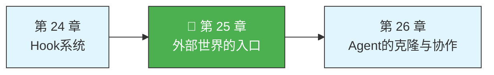
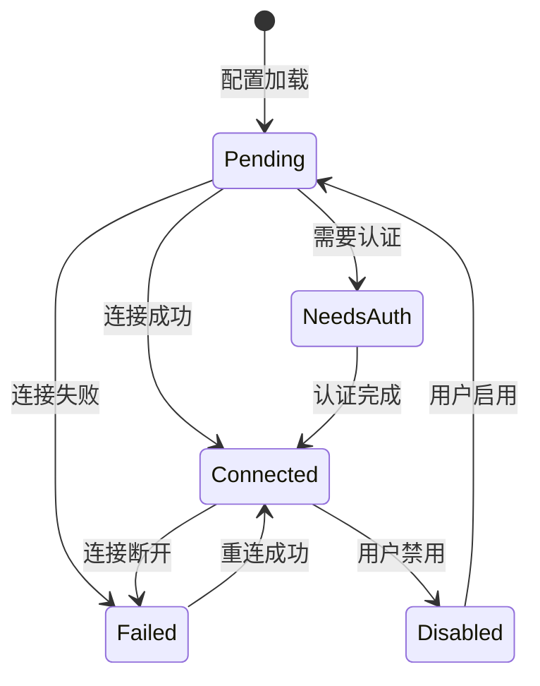
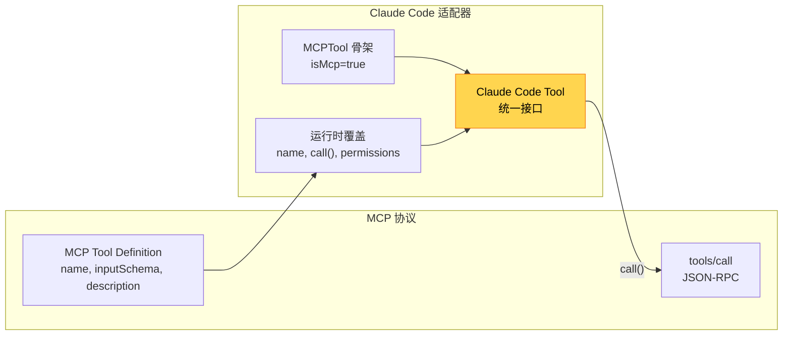
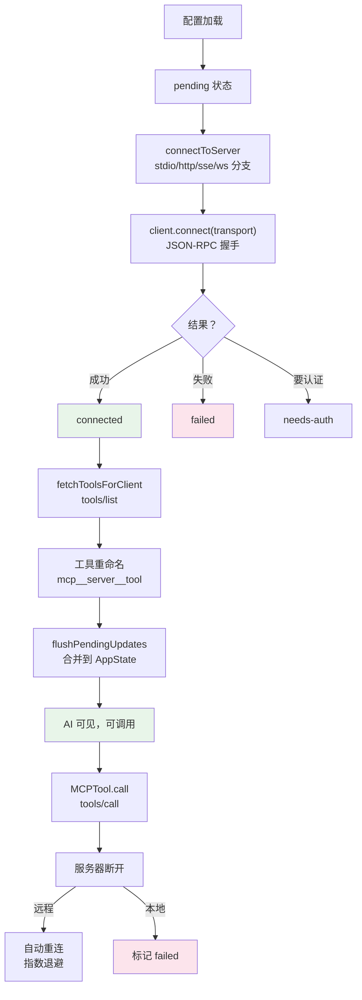

> 源码验证日期：2026-05-15，基于 commit `0d81bb6`

前四章你看到的都是 Claude Code 的内部机制——命令注册、Hook 拦截、权限检查、工具执行。这些机制让 Claude Code 成了一个功能完备的系统。但一个系统如果只能用自己内置的工具，终究是一座孤岛。

你见过 Claude Code 操作浏览器、查询数据库、调用 Slack API——这些不是内置的。它们来自外部世界，通过一扇名为 **MCP** 的大门进入。

MCP 全称 Model Context Protocol（模型上下文协议），是 Anthropic 提出的开放协议。它定义了一套标准化的通信规则，让 Claude Code 能跟任何支持这套规则的外部服务器对话。这一章，我们打开这扇门，看看门后面是什么。

---

## 路线图



---

## 这是什么

先打个比方。你家的路由器有很多网口——有的插电脑，有的插电视，有的插手机充电器。设备千差万别，但网口是统一的。路由器不关心对面插的是什么，只要接头对得上，数据就能流通。

MCP 就是 Claude Code 的网口。它是一个协议——一套约定好的消息格式和交互规则。任何实现了这套规则的服务器（我们叫它 MCP Server），都可以被 Claude Code 发现、连接、使用。

一个 MCP Server 可以提供三种东西：

- **工具（Tools）**——让 AI 调用的函数。比如数据库 MCP Server 提供 `query` 工具，AI 就能发 SQL 查询。
- **资源（Resources）**——让 AI 读取的数据。比如文件系统 MCP Server 暴露配置文件内容。
- **提示（Prompts）**——预定义的提示模板，可以注册为斜杠命令。

Claude Code 扮演 **MCP Client** 的角色。它的职责是：找到服务器、建立连接、询问"你有什么工具"、把工具注册到自己的工具表里，最后在 AI 需要的时候转发调用请求。

---

## 打开源码

MCP 相关的代码全部住在 `src/services/mcp/` 目录下：

| 文件 | 作用 |
|------|------|
| `types.ts` | 所有 MCP 类型定义——服务器配置、连接状态、传输类型 |
| `config.ts` | 配置管理——从多个来源加载服务器配置 |
| `client.ts` | 核心客户端——建立连接、发现工具、调用工具 |
| `useManageMCPConnections.ts` | React Hook——管理连接生命周期 |
| `normalization.ts` | 名称规范化——服务器名转为合法工具名前缀 |
| `mcpStringUtils.ts` | 字符串工具——解析 `mcp__server__tool` 格式 |
| `envExpansion.ts` | 环境变量展开——处理 `${VAR}` 和 `${VAR:-default}` |
| `auth.ts` | 认证处理——OAuth 流程、token 管理 |

还有适配器和 Bridge 相关的代码：

| 文件 | 作用 |
|------|------|
| `src/tools/MCPTool/MCPTool.ts` | MCP 工具骨架——适配器模式的基础 |
| `src/bridge/types.ts` | Bridge 协议类型 |
| `src/bridge/bridgeMain.ts` | Bridge 主入口 |
| `src/entrypoints/agentSdkTypes.ts` | Agent SDK 公共 API |

数据流是清晰的：**配置决定连接哪些服务器，连接发现哪些工具，工具合并到工具表，工具表交给 AI 使用**。

---

## 它怎么工作

### 第一步：配置——告诉 Claude Code 该连接谁

MCP 服务器的配置可以来自六个来源，按优先级从低到高：

1. **插件配置**（`scope: 'plugin'`）——来自已安装的插件
2. **用户配置**（`scope: 'user'`）——来自全局 `settings.json`，跨项目生效
3. **项目配置**（`scope: 'project'`）——来自项目根目录的 `.mcp.json`
4. **本地配置**（`scope: 'local'`）——来自 `settings.local.json`，不提交到版本控制
5. **企业配置**（`scope: 'enterprise'`）——管理员分发，优先级最高
6. **claude.ai 配置**（`scope: 'claudeai'`）——从 claude.ai 网站同步

最常见的是项目配置。你在项目根目录放一个 `.mcp.json`：

```json
{
  "mcpServers": {
    "my-database": {
      "command": "npx",
      "args": ["-y", "@my-org/mcp-database"],
      "env": {
        "DB_URL": "${DB_URL}"
      }
    },
    "my-api": {
      "type": "http",
      "url": "https://api.example.com/mcp"
    }
  }
}
```

注意两种不同的配置模式。`my-database` 没有写 `type`，默认是 `stdio`——Claude Code 启动一个子进程，通过标准输入输出通信。`my-api` 写了 `type: "http"`，走 HTTP 网络连接。

除了 `stdio` 和 `http`，还有 `sse`（Server-Sent Events）、`ws`（WebSocket）、`sse-ide`（IDE 扩展专用）等传输类型，定义在 `types.ts` 的 `Transport` 类型中。

配置加载后，`envExpansion.ts` 会展开环境变量——`${VAR}` 和带默认值的 `${VAR:-default}` 语法。

### 第二步：连接——跟服务器握手

配置加载完毕后，`useManageMCPConnections` 启动两阶段加载：

- **Phase 1**：快速加载本地配置（文件读取，不走网络），立即开始连接
- **Phase 2**：等待 claude.ai 的远程配置下载完成，然后连接远程服务器

实际的连接逻辑在 `client.ts` 的 `connectToServer` 函数里，被 `memoize` 包裹——同一个服务器不会重复连接：

```typescript
// → src/services/mcp/client.ts（简化版）
export const connectToServer = memoize(
  async (name, serverRef, serverStats) => {
    let transport

    if (serverRef.type === 'sse') {
      transport = new SSEClientTransport(new URL(serverRef.url), options)
    } else if (serverRef.type === 'http') {
      transport = new StreamableHTTPClientTransport(new URL(serverRef.url), options)
    } else if (serverRef.type === 'stdio' || !serverRef.type) {
      transport = new StdioClientTransport({
        command: serverRef.command,
        args: serverRef.args,
        env: { ...subprocessEnv(), ...serverRef.env },
      })
    }

    const client = new Client(
      { name: 'claude-code', version: MACRO.VERSION },
      { capabilities: { roots: {}, elicitation: {} } }
    )
    await client.connect(transport)
  }
)
```

不管哪种传输方式，最终都创建一个 MCP SDK 的 `Client` 对象，调用 `client.connect(transport)` 完成握手。底层用的是 JSON-RPC 2.0 协议。

连接的结果有五种状态，定义在 `types.ts`：

```typescript
// → src/services/mcp/types.ts
type MCPServerConnection =
  | ConnectedMCPServer    // 连接成功
  | FailedMCPServer       // 连接失败
  | NeedsAuthMCPServer    // 需要认证
  | PendingMCPServer      // 等待连接
  | DisabledMCPServer     // 已禁用
```



### 第三步：发现——服务器你有什么工具

连接成功后，`fetchToolsForClient` 向服务器发送 `tools/list` 请求，获取工具列表：

```typescript
// → src/services/mcp/client.ts（简化版）
export const fetchToolsForClient = memoizeWithLRU(
  async (client) => {
    const result = await client.request(
      { method: 'tools/list' },
      ListToolsResultSchema,
    )

    return result.tools.map((tool) => {
      const fullyQualifiedName = buildMcpToolName(client.name, tool.name)
      return {
        ...MCPTool,
        name: fullyQualifiedName,      // mcp__server__tool 格式
        mcpInfo: { serverName: client.name, toolName: tool.name },
        isMcp: true,
        isConcurrencySafe: () => tool.annotations?.readOnlyHint ?? false,
        isReadOnly: () => tool.annotations?.readOnlyHint ?? false,
        isDestructive: () => tool.annotations?.destructiveHint ?? false,
        inputJSONSchema: tool.inputSchema,
        description: () => tool.description,
      }
    })
  }
)
```

注意一个关键细节：**工具名被重命名了**。假设服务器叫 `my-database`，提供了 `query` 工具，Claude Code 会把它重命名为 `mcp__my_database__query`。

为什么？因为不同服务器可能提供同名工具。两个数据库服务器都有 `query` 工具，没有前缀就冲突了。`mcp__服务器名__工具名` 的三段式命名保证了全局唯一。

这是适配器模式的核心——MCP 协议的工具定义被包装成 Claude Code 的 `Tool` 对象，使用 `...MCPTool` 骨架 + 运行时属性覆盖。



### 第四步：注册——合并到工具表

发现的工具通过批处理机制合并到 `AppState.mcp.tools`。多个服务器几乎同时连接完成，与其每个都触发一次 UI 刷新，不如攒在一起 16 毫秒后统一更新：

```typescript
// → src/services/mcp/useManageMCPConnections.ts（简化版）
const flushPendingUpdates = useCallback(() => {
  setAppState(prevState => {
    for (const update of updates) {
      // 移除这个服务器旧的工具，加入新的
      const updatedTools = [
        ...reject(mcp.tools, t => t.name?.startsWith(prefix)),
        ...tools
      ]
    }
    return { ...prevState, mcp }
  })
}, [setAppState])
```

策略是**替换而非追加**。以 `mcp__服务器名__` 为前缀，先删掉旧工具，再加入新发现的。

MCP 工具跟内置工具放在同一个 `mcp.tools` 数组里，对 AI 来说没有区别——它们共享同一个 `Tool` 类型。AI 只看到一个扁平的工具列表，不知道哪些是内置的、哪些是 MCP 外来的。

### 第五步：使用——转发调用请求

当 AI 调用一个 MCP 工具时，执行路径经过 `MCPTool.call`：

```typescript
// → src/services/mcp/client.ts（简化版）
const connectedClient = await ensureConnectedClient(client)
const result = await connectedClient.client.request(
  {
    method: 'tools/call',
    params: {
      name: tool.name,        // 原始工具名
      arguments: args,        // AI 传入的参数
    },
  },
  CallToolResultSchema,
)
```

`ensureConnectedClient` 会检查连接是否还活着。如果会话过期了，会自动重新连接。结果返回后，`transformMCPResult` 负责把图片、文件等二进制内容转成 AI 能理解的格式。

### 第六步：清理——断开与重连

服务器断开连接时，`onclose` 回调触发。远程传输（SSE、HTTP、WebSocket）尝试自动重连，使用指数退避：1s → 2s → 4s → ... → 30s，最多 5 次。stdio 类型不会重连——进程死了，重连也没意义。

`excludeStalePluginClients` 还会比较配置哈希值。配置变了的服务器会被标记为过期，断开旧连接，建立新连接。

### 完整生命周期图



### Bridge：远程会话控制

Bridge 让外部系统远程控制 Claude Code 会话。它的配置包括工作目录、Git 分支、最大并行会话数、会话生成模式等。

工作模式是：启动 → 注册环境 → 轮询任务 → 收到任务后生成 Claude Code 会话 → 执行 → 上报结果。Bridge 通过 `BridgeApiClient` 的 `pollForWork` 和 `heartbeatWork` 方法与外部系统通信。

### Agent SDK：编程式控制

SDK 提供了编程式 API 来控制 Claude Code：

```typescript
// → src/entrypoints/agentSdkTypes.ts（简化版）
// 定义 MCP 工具
function tool<Schema>(config: {
  name: string
  description: string
  inputSchema: Schema
  run: (args) => Promise<string>
}): void

// 创建进程内 MCP 服务器
function createSdkMcpServer(name: string): McpServer

// 一次性查询
async function query(prompt: string, options?: QueryOptions): Promise<QueryResult>
```

SDK 控制协议通过 `SdkControlTransport` 在 CLI 和 SDK 之间桥接 JSON-RPC 消息。进程内传输 `createLinkedTransportPair` 使用 `queueMicrotask` 传递消息，零网络开销。

---

## 常见错误与检查方法

| 常见错误 | 检查方法 |
|---------|---------|
| MCP 服务器连不上 | 设置 `MCP_DEBUG=1` 查看详细日志 |
| 工具没有出现 | 检查服务器状态（`/mcp`），确认 `connected` |
| 工具名冲突 | 检查 `normalization.ts` 的命名规则——非字母数字替换为下划线 |
| 环境变量未展开 | 检查 `envExpansion.ts` 的 `${VAR}` 语法 |
| 连接超时 | 设置 `MCP_TIMEOUT` 环境变量调整（默认 30 秒） |
| 工具调用超时 | 设置 `MCP_TOOL_TIMEOUT` 环境变量调整 |

---

## 试试看

### 练习一：配置一个 MCP 服务器

在 `.claude/settings.json` 中添加：

```json
{
  "mcpServers": {
    "filesystem": {
      "command": "npx",
      "args": ["-y", "@modelcontextprotocol/server-filesystem", "/tmp"]
    }
  }
}
```

重启 Claude Code，运行 `/mcp` 查看连接状态。然后让 AI 列出 `/tmp` 目录的文件。

### 练习二：观察 MCP 工具转换

在 `client.ts` 的 `fetchToolsForClient` 中加日志：

```typescript
console.log('[DEBUG] MCP tools:', tools.map(t => `${client.name}__${t.name}`))
```

观察工具名是怎么被转换的。

### 练习三：构建一个自定义 MCP 服务器

用 MCP SDK 写一个最小服务器：

```typescript
import { McpServer } from '@modelcontextprotocol/sdk/server/mcp.js'
import { StdioServerTransport } from '@modelcontextprotocol/sdk/server/stdio.js'
import { z } from 'zod'

const server = new McpServer({ name: 'my-tools', version: '1.0.0' })

server.tool(
  'hello',
  '向指定的人问好',
  { name: z.string().describe('名字') },
  async ({ name }) => ({
    content: [{ type: 'text', text: `你好，${name}！` }]
  })
)

const transport = new StdioServerTransport()
await server.connect(transport)
```

在 `.mcp.json` 中配置它，观察 Claude Code 如何发现和使用你的工具。

---

## 检查点

1. **MCP 协议**：基于 JSON-RPC 2.0，定义了工具发现（`tools/list`）和调用（`tools/call`）的标准化接口
2. **传输类型**：stdio（本地进程）、SSE、HTTP、WebSocket、SDK（进程内）
3. **配置来源**：六个来源按优先级合并——plugin < user < project < local < enterprise < claudeai
4. **连接状态机**：Pending → Connected / Failed / NeedsAuth / Disabled
5. **适配器模式**：MCP 工具定义 → `...MCPTool` 骨架 + 运行时覆盖 → Claude Code Tool
6. **名称规范化**：`mcp__server__tool` 三段式命名防止冲突
7. **批处理注册**：16ms 窗口合并多个服务器的工具到 AppState
8. **自动重连**：远程服务器指数退避重连（1s→30s，最多 5 次）
9. **Bridge**：远程会话控制——轮询任务、生成会话、上报结果
10. **Agent SDK**：`tool()`、`createSdkMcpServer()`、`query()` 等编程式 API

MCP 把 Claude Code 从一个封闭的工具箱变成了一个开放的平台。只要有人写了 MCP 服务器，AI 的能力就能无限扩展。下一章，我们看另一种扩展方式——Agent 的克隆和协作。

---

## 对比：如果用 Java

Java RMI (Remote Method Invocation) 和 gRPC 是 MCP 在 Java 生态中的精神前辈。RMI 让 Java 对象跨进程通信，gRPC 用 Protocol Buffers 定义了跨语言的服务接口。MCP 比 RMI 更轻量（JSON-RPC 而非 Java 序列化），比 gRPC 更简单（不需要 `.proto` 编译步骤）。但 MCP 的 stdio 传输层在 Java 中可以通过 `ProcessBuilder` + 标准输入输出流实现——`ProcessBuilder.start()` 等价于 Node.js 的 `spawn()`，`BufferedReader`/`PrintWriter` 等价于 `readline`/`stdin.write()`。关键区别在于协议目标：RMI 和 gRPC 为通用 RPC 设计，MCP 专门为 AI 工具调用设计——`tools/list` 和 `tools/call` 的语义比通用的 `invoke` 更精确。

---

[上一章：Hook系统](/posts/b893ae1e/) | [下一章：Agent的克隆与协作](/posts/dfae88d8/)
