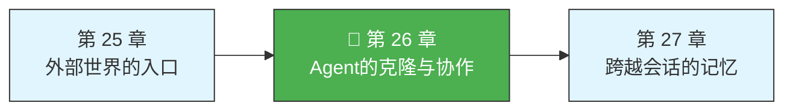
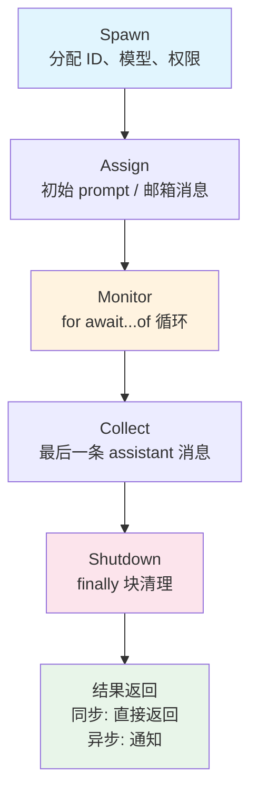

> 源码验证日期：2026-05-15，基于 commit `0d81bb6`

上一章你看到了 Claude Code 如何通过 MCP 连接外部世界。但还有一种场景比"跟外部通信"更微妙：**跟自己通信**。

什么意思？想象你在改一个大型项目的 Bug。你要同时搜索代码、跑测试、查文档、改文件。一个人做这些事，得一件一件来。但如果能"分身"——让另一个自己去找 Bug 原因，另一个自己跑测试，另一个自己查文档——然后把结果汇总回来呢？

Claude Code 的 Agent 系统就是干这个的。它能让一个 Agent "克隆"出子 Agent，把任务分给它们，然后收集结果。更进一步，多个 Agent 还能组成一个"团队"，互相发消息协作。

---

## 路线图



---

## 这是什么

Claude Code 的 Agent 系统有三层能力：

**第一层：Subagent（子 Agent）**。最基本的"分身术"。主 Agent 遇到一个子任务时（比如"帮我搜索所有包含 TODO 的文件"），调用 AgentTool 创建一个子 Agent 来处理。子 Agent 运行完毕后，结果返回给主 Agent。像函数调用——发起、执行、返回。

**第二层：Fork（分叉）**。特殊的子 Agent。普通子 Agent 会得到一个新的系统提示词，从零开始理解任务。而 Fork 子 Agent **继承父 Agent 的完整对话上下文**——就像把脑中的所有想法复制一份给"分身"。更重要的是，多个 Fork 子 Agent 共享相同的 API 请求前缀，命中 prompt cache，省下大量 token。

**第三层：Team/Swarm（团队协作）**。最高级的协作模式。多个 Agent 各自是一个独立的 Claude Code 进程，在终端的不同窗格里运行。它们通过文件系统上的"邮箱"互相发消息，由一个"队长"分配任务、收集结果。

用现实类比：Subagent 像你叫同事帮个忙，他干完就走了。Fork 像你克隆了一个自己，分身跟你一样了解情况。Team 像你组建了一个项目组，大家各干各的、随时沟通。

---

## 打开源码

Agent 系统的核心代码集中在 `src/tools/AgentTool/` 目录下：

| 文件 | 职责 |
|------|------|
| `AgentTool.tsx` | Agent 工具主体——处理调用请求，决定走哪条路径 |
| `runAgent.ts` | 子 Agent 的执行引擎——启动独立的 query 循环 |
| `forkSubagent.ts` | Fork 分叉逻辑——构建消息、防止递归分叉 |
| `builtInAgents.ts` | 内置 Agent 类型注册表 |
| `loadAgentsDir.ts` | 从文件系统加载自定义 Agent 定义 |
| `agentToolUtils.ts` | 共享工具函数——进度追踪、结果提取 |

团队协作的代码分布在其他位置：

| 文件 | 职责 |
|------|------|
| `src/tools/shared/spawnMultiAgent.ts` | 创建 teammate 进程 |
| `src/utils/teammateMailbox.ts` | 文件系统的邮箱消息系统 |
| `src/utils/teamDiscovery.ts` | 团队发现和成员状态查询 |
| `src/utils/forkedAgent.ts` | Fork Agent 的查询循环和上下文隔离 |

---

## 它怎么工作

### Subagent：创建一个子 Agent

一切从 `AgentTool.call()` 开始。当 AI 决定要委托一个任务时，它调用 Agent 工具，传入 prompt 和 subagent_type。

`AgentTool.tsx` 首先决定走哪条路径：

```typescript
// → src/tools/AgentTool/AgentTool.tsx（简化版）
const effectiveType = subagent_type
  ?? (isForkSubagentEnabled() ? undefined : GENERAL_PURPOSE_AGENT.agentType);
const isForkPath = effectiveType === undefined;
```

如果指定了 `subagent_type`，用它。如果没指定但 Fork 功能开启了，走 Fork 路径。如果都没指定，默认用 `general-purpose`。

假设走普通 Subagent 路径。系统找到对应的 Agent 定义后，进入关键决策点——**同步还是异步**：

```typescript
// → src/tools/AgentTool/AgentTool.tsx（简化版）
const shouldRunAsync =
  (run_in_background === true || selectedAgent.background === true
   || isCoordinator || forceAsync || assistantForceAsync
   || (proactiveModule?.isProactiveActive() ?? false))
  & !isBackgroundTasksDisabled;
```

**同步模式**：主 Agent 等子 Agent 干完，拿到结果才继续。像打电话叫外卖，等外卖到了才吃饭。

**异步模式**：主 Agent 发出任务后立刻继续自己的事。子 Agent 在后台运行，干完了发通知。像点了外卖继续工作，外卖到了有人通知你。

### RunAgent：子 Agent 的执行引擎

无论同步还是异步，子 Agent 的实际执行都由 `runAgent()` 函数驱动。

**1. 创建隔离的上下文**

```typescript
// → src/tools/AgentTool/runAgent.ts（简化版）
const agentToolUseContext = createSubagentContext(toolUseContext, {
  options: agentOptions,
  agentId,
  agentType: agentDefinition.agentType,
  messages: initialMessages,
  readFileState: agentReadFileState,
  abortController: agentAbortController,
  getAppState: agentGetAppState,
  shareSetAppState: !isAsync,         // 异步模式不共享
  shareSetResponseLength: true,
});
```

子 Agent 不能随意修改父 Agent 的状态。`createSubagentContext()` 创建了一个隔离的上下文——子 Agent 有自己的消息队列、文件缓存、中断控制器。异步模式下 `shareSetAppState` 是 `false`，防止子 Agent 意外修改父 Agent 的 UI 状态。

**2. 启动查询循环**

```typescript
// → src/tools/AgentTool/runAgent.ts（简化版）
for await (const message of query({
  messages: initialMessages,
  systemPrompt: agentSystemPrompt,
  userContext: resolvedUserContext,
  systemContext: resolvedSystemContext,
  canUseTool,
  toolUseContext: agentToolUseContext,
  querySource,
  maxTurns: maxTurns ?? agentDefinition.maxTurns,
})) {
  // 处理每一条消息...
}
```

子 Agent 拥有自己的 `query()` 循环，像一个独立的小型 Agent 运行。

**3. 清理**

子 Agent 运行结束后，`finally` 块做清理工作：

```typescript
// → src/tools/AgentTool/runAgent.ts（简化版）
finally {
  await mcpCleanup()                          // 关闭 MCP 连接
  clearSessionHooks(...)                      // 清理 hook
  cleanupAgentTracking(...)                   // 清理缓存追踪
  agentToolUseContext.readFileState.clear()   // 释放文件缓存
  unregisterPerfettoAgent(agentId)            // 注销追踪
  clearAgentTranscriptSubdir(agentId)         // 清理目录
  killShellTasksForAgent(agentId, ...)        // 杀死残留 shell
}
```

注意 `killShellTasksForAgent()`——如果子 Agent 启动了后台 shell 任务，子 Agent 自己退出了但 shell 还在。这个函数确保不会留下"僵尸进程"。

### Fork：继承父 Agent 的记忆

Fork 是一种特殊的 Subagent。普通 Subagent 的 system prompt 根据角色重新生成，跟父 Agent 的不同。但 Fork 子 Agent 直接继承父 Agent 的 system prompt。

为什么？因为**缓存**。

Anthropic API 的 prompt cache 机制有一个特点：如果多个 API 请求的前缀完全相同（包括 system prompt、tools 定义、历史消息），就可以复用缓存，跳过重复计算。Fork 子 Agent 继承父 Agent 的完整上下文，意味着 API 请求前缀几乎一样——只有最后那条指令不同。

`forkSubagent.ts` 的 `buildForkedMessages()` 函数实现了这个缓存策略：

```typescript
// → src/tools/AgentTool/forkSubagent.ts（简化版）
export function buildForkedMessages(
  directive: string,
  assistantMessage: AssistantMessage,
): MessageType[] {
  // 1. 保留父 Agent 的完整 assistant 消息（所有 tool_use blocks）
  const fullAssistantMessage = { ...assistantMessage, ... };

  // 2. 给每个 tool_use block 构建相同的占位符 tool_result
  const toolResultBlocks = toolUseBlocks.map(block => ({
    type: 'tool_result',
    tool_use_id: block.id,
    content: [{ type: 'text', text: FORK_PLACEHOLDER_RESULT }],
  }));

  // 3. 占位符结果 + 子 Agent 的专属指令合成一条 user 消息
  const toolResultMessage = createUserMessage({
    content: [...toolResultBlocks, { type: 'text', text: buildChildMessage(directive) }],
  });

  return [fullAssistantMessage, toolResultMessage];
}
```

所有 Fork 子 Agent 共享**完全相同的** assistant 消息和 tool_result 占位符——只有最后那条指令文本不同。API 请求的前缀完全一致，缓存命中率极高。

Fork 子 Agent 收到的指令很特别。`buildChildMessage()` 生成一段严格的规则：

```text
STOP. READ THIS FIRST.
You are a forked worker process. You are NOT the main agent.
RULES (non-negotiable):
1. Do NOT spawn sub-agents; execute directly.
2. Do NOT converse, ask questions, or suggest next steps
3. USE your tools directly: Bash, Read, Write, etc.
```

这段指令告诉 Fork 子 Agent：你是工人，不是管理者。不要创建子 Agent，不要问问题，直接干活。这防止了递归分叉。

系统还有第二道防线：`isInForkChild()` 通过检查消息历史中的 fork 标记来检测递归。

### Team/Swarm：组建 Agent 团队

Fork 和 Subagent 是"父子关系"——父创建子，子完成后结果返回。Team 模式是"同事关系"——多个 Agent 平等地协作。

创建 Teammate 的入口也在 `AgentTool.call()` 里：

```typescript
// → src/tools/AgentTool/AgentTool.tsx（简化版）
if (teamName && name) {
  const result = await spawnTeammate({
    name,
    prompt,
    description,
    team_name: teamName,
    use_splitpane: true,
    plan_mode_required: spawnMode === 'plan',
    model: model ?? agentDef?.model,
    agent_type: subagent_type,
  }, toolUseContext);
}
```

`spawnTeammate()` 支持两种后端：

**进程内模式（in-process）**：Teammate 在同一个 Node.js 进程内运行，通过 `AsyncLocalStorage` 维护独立的上下文。不需要额外软件。

**Tmux/iTerm2 模式**：每个 Teammate 是一个独立的 Claude Code 进程，运行在终端模拟器的独立窗格里。需要安装 tmux 或使用 iTerm2。真正的隔离——独立进程、独立工作目录。

进程内模式的 spawn 流程做了这些事：生成唯一的 Agent ID 和颜色 → 创建运行环境 → 启动独立的查询循环 → 在 AppState 中注册 → 写入团队文件。

### 邮箱：Agent 之间的消息系统

多个 Agent 要协作，必须能互相通信。Claude Code 用了一个简单而可靠的方案：**基于文件的邮箱系统**。

每个 Agent 有一个收件箱文件，路径格式是：

```
~/.claude/teams/{team_name}/inboxes/{agent_name}.json
```

发消息就是往对方的收件箱文件追加一条 JSON 记录：

```typescript
// → src/utils/teammateMailbox.ts（简化版）
export async function writeToMailbox(
  recipientName: string,
  message: Omit<TeammateMessage, 'read'>,
  teamName?: string,
): Promise<void> {
  // 文件锁防止并发写入冲突
  let release = await lockfile.lock(inboxPath, { ... });
  const messages = await readMailbox(recipientName, teamName);
  messages.push({ ...message, read: false });
  await writeFile(inboxPath, jsonStringify(messages, null, 2), 'utf-8');
  await release();
}
```

注意那个文件锁（lockfile）——多个 Agent 可能同时往同一个收件箱写消息。没有锁就会互相覆盖。

邮箱支持多种结构化协议消息：

- **任务分配**（`task_assignment`）：队长给队员分配任务
- **权限请求**（`permission_request`）：队员向队长请求工具权限
- **计划审批**（`plan_approval_request`）：队员提交执行计划等队长批准
- **关闭请求**（`shutdown_request`）：队长通知队员可以退出了
- **空闲通知**（`idle_notification`）：队员告诉队长自己闲下来了

### 隔离：Worktree 模式

Agent 还有一种特别的隔离方式：**Git Worktree**。当设置 `isolation: "worktree"` 时，子 Agent 在一个独立的 git worktree 中工作——同一个仓库，但一份独立的工作副本：

```typescript
// → src/tools/AgentTool/AgentTool.tsx（简化版）
if (effectiveIsolation === 'worktree') {
  const slug = `agent-${earlyAgentId.slice(0, 8)}`;
  worktreeInfo = await createAgentWorktree(slug);
}
```

子 Agent 可以随意修改文件，不影响主 Agent 的工作区。完成后，系统检查 worktree 是否有实际改动——有改动就保留，没改动就自动清理。

### 完整生命周期



---

## 常见错误与检查方法

| 常见错误 | 检查方法 |
|---------|---------|
| 子 Agent 没有返回结果 | 检查 `maxTurns` 是否太小，子 Agent 可能没来得及完成 |
| Fork 子 Agent 递归创建子 Agent | 检查 `isInForkChild()` 是否正确检测到 fork 标记 |
| Teammate 邮箱消息丢失 | 检查文件锁是否正常工作——并发写入可能冲突 |
| 异步子 Agent 的 MCP 连接泄漏 | 检查 `mcpCleanup()` 是否在 `finally` 块中被调用 |
| Worktree 没有被清理 | 检查子 Agent 是否异常退出——正常退出才会触发清理 |
| Teammate 权限不正确 | 检查 `createSubagentContext` 的权限继承设置 |

---

## 试试看

### 练习一：创建自定义 Agent 类型

在 `.claude/agents/` 目录下放一个 Markdown 文件：

```markdown
---
description: "专门处理测试的 Agent"
tools: ["Bash", "Read", "Write"]
model: sonnet
max_turns: 50
---

你是一个测试专家。你的任务是运行测试、分析失败原因、修复测试。
```

系统启动时 `loadAgentsDir.ts` 会扫描这个目录，注册新的 Agent 类型。

### 练习二：观察 Fork 缓存命中

在 `forkSubagent.ts` 的 `buildForkedMessages` 中加日志，观察 Fork 子 Agent 的消息结构。对比普通 Subagent 的消息结构，理解为什么 Fork 的缓存命中率更高。

### 练习三：追踪子 Agent 生命周期

在 `runAgent.ts` 的关键步骤（创建上下文、启动循环、清理）加日志，触发一个子 Agent 调用，观察完整生命周期。

---

## 检查点

1. **三层协作**：Subagent（函数调用式）、Fork（上下文继承 + 缓存优化）、Team/Swarm（平等协作 + 邮箱通信）
2. **同步 vs 异步**：同步模式阻塞父 Agent；异步模式通过通知返回结果
3. **上下文隔离**：`createSubagentContext()` 创建独立的消息队列、文件缓存、中断控制器
4. **Fork 缓存策略**：共享 assistant 消息 + tool_result 占位符，只有 directive 不同
5. **递归防护**：严格的行为规则 + `isInForkChild()` 双重防线
6. **邮箱系统**：基于文件的 JSON 消息，lockfile 防并发冲突
7. **Worktree 隔离**：独立 git 工作副本，完成后检查是否有实际改动
8. **清理保障**：`finally` 块关闭 MCP、清理 hook、释放缓存、杀死僵尸 shell

Agent 系统是 Claude Code 架构里最精巧的部分之一。核心思想很简单——把复杂任务分解成独立的小任务，让多个执行单元并行处理。但实现细节处处体现了工程智慧：缓存共享、递归防护、文件锁、僵尸清理。下一章，我们看另一个跨越时间的问题——Agent 怎么记住之前会话里发生过的事。

---

## 对比：如果用 Java

Java 的 `ThreadPoolExecutor` + `ForkJoinPool` 提供了与 Agent 协作模型类似的能力——`submit()` 提交子任务、`invokeAll()` 并行执行、`ForkJoinTask.fork()` 创建轻量级子任务。Claude Code 的 Subagent/Fork/Team 三层模型映射到 Java：(1) Subagent 类似 `CompletableFuture.supplyAsync()`——提交任务、等待结果、超时取消；(2) Fork 利用 prompt cache 共享类似 `ForkJoinTask` 的工作窃取（work-stealing）思想——复用已计算的工作；(3) Team 的邮箱系统（文件锁 + JSON 消息）在 Java 中可以直接用 `BlockingQueue` 替代——但 Claude Code 选择文件系统而非内存队列是为了跨进程协作。一个 Java 做不到的优化是 Fork 的缓存共享——`buildForkedMessages` 复用 assistant 前缀来命中 Prompt Cache，这利用了 Anthropic API 的字节级缓存前缀匹配，Java 线程池没有等价概念。

---

[上一章：外部世界的入口](/posts/77769bd0/) | [下一章：跨越会话的记忆](/posts/b5164991/)
