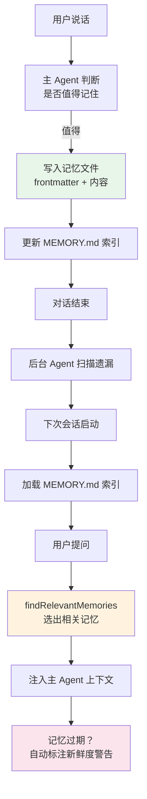

> 源码验证日期：2026-05-15，基于 commit `0d81bb6`

你今天下午跟 Claude Code 配合得天衣无缝。它知道你是个后端工程师，习惯用 Go，正在调试一个支付模块。你们一起修了三个 bug，重构了两处代码。

然后你关上电脑，回家吃晚饭。

第二天早上你打开终端，重新启动 Claude Code。它还记得你是谁吗？还记得你昨天在做什么吗？

答案是：**记得**，但不是靠魔法。靠的是一套精巧的文件系统——**跨会话记忆（cross-session memory）**。

---

## 路线图


---

## 这是什么

想象你在一家咖啡馆有个固定座位。你不是每次去都重新跟服务员自我介绍的——你有一张会员卡，上面记着你的名字、你的偏好、你上次点了什么。服务员看你来了，扫一眼会员卡，就知道该怎么服务你。

Claude Code 的记忆系统就是这张"会员卡"。

但跟简单的会员卡不同，Claude Code 的记忆分两个层次：

**第一层：会话记忆（Session Memory）**——只在单次会话内有效。系统在后台悄悄记录对话要点。当对话太长需要压缩时（还记得 compaction 吗？），这些记录就派上用场了。会话记忆存在 `~/.claude/projects/<项目路径>/<session-id>/session-memory/summary.md`，每个会话一份，对话结束就完成使命。

**第二层：持久记忆（Auto Memory）**——跨越会话边界，永远存在。你告诉 Claude Code "我是数据科学家"或者"别用 mock"，这些信息被写成独立的 Markdown 文件，存在 `~/.claude/projects/<项目路径>/memory/` 目录下。下次你开新会话，Claude Code 自动加载这些文件。

两层记忆各司其职：会话记忆帮你应对超长对话，持久记忆帮你跨越会话鸿沟。

---

## 打开源码

记忆系统的代码分散在几个目录里，每个目录负责记忆生命周期的不同阶段：

| 文件 | 作用 |
|------|------|
| `src/memdir/paths.ts` | 记忆文件路径计算（`getAutoMemPath`） |
| `src/memdir/memoryTypes.ts` | 四种记忆类型定义 |
| `src/memdir/memoryScan.ts` | 扫描记忆文件、解析 frontmatter |
| `src/memdir/memoryAge.ts` | 记忆新鲜度计算 |
| `src/memdir/findRelevantMemories.ts` | 根据用户查询找到相关记忆 |
| `src/memdir/memdir.ts` | 构建记忆提示词、加载 MEMORY.md |
| `src/services/SessionMemory/sessionMemory.ts` | 后台提取会话记忆 |
| `src/services/SessionMemory/sessionMemoryUtils.ts` | 提取阈值判断 |
| `src/services/SessionMemory/prompts.ts` | 会话记忆的模板 |
| `src/services/extractMemories/extractMemories.ts` | 对话结束时提取持久记忆 |
| `src/services/extractMemories/prompts.ts` | 提取记忆的提示词模板 |

文件不少，但按照记忆的**生命周期**来读就清晰了：创建 → 存储 → 索引 → 加载 → 使用 → 更新。

---

## 它怎么工作

### 第一步：记忆从哪里来

Claude Code 的持久记忆有三个来源：

**来源 A：主 Agent 直接写入。** 你在对话中说"我是个 Go 程序员，第一次碰 React"，系统提示词里有指导：遇到这种情况，写入一条 `user` 类型的记忆文件。主 Agent 在正常对话中直接调用 Write 工具保存。

**来源 B：后台提取 Agent。** 这是最主要的来源。每次对话结束（AI 生成最终回复、没有更多工具调用时），系统会悄悄启动一个后台 Agent——`extractMemories`。它像个小助手，读完整个对话记录，挑出值得记住的内容，写成记忆文件。

```typescript
// → src/services/extractMemories/extractMemories.ts（简化版）
export function initExtractMemories(): void {
  let lastMemoryMessageUuid: string | undefined
  let inProgress = false
  let turnsSinceLastExtraction = 0

  async function runExtraction({ context, appendSystemMessage, isTrailingRun }) {
    // 如果主 Agent 已经写了记忆，跳过
    if (hasMemoryWritesSince(messages, lastMemoryMessageUuid)) return

    // 扫描已有记忆文件，构建清单
    const existingMemories = formatMemoryManifest(
      await scanMemoryFiles(memoryDir, signal),
    )

    // 启动后台 Agent 执行提取
    const result = await runForkedAgent({
      promptMessages: [createUserMessage({ content: userPrompt })],
      cacheSafeParams,
      canUseTool,
      querySource: 'extract_memories',
      maxTurns: 5,  // 最多 5 轮，防止跑偏
    })
  }
}
```

后台 Agent 使用 `runForkedAgent`——fork 模式，共享主 Agent 的提示缓存。但只能操作记忆目录里的文件（通过 `createAutoMemCanUseTool` 做权限隔离）。

**来源 C：用户手动写入。** 运行 `/memory` 命令打开编辑器，直接创建或编辑记忆文件。

### 第二步：四种记忆类型

不是什么都值得记住。Claude Code 把记忆严格分为四类：

```typescript
// → src/memdir/memoryTypes.ts
export const MEMORY_TYPES = [
  'user',       // 用户画像
  'feedback',   // 行为反馈
  'project',    // 项目状态
  'reference',  // 外部参考
] as const
```

| 类型 | 存什么 | 例子 |
|------|--------|------|
| `user` | 用户的角色、偏好、知识背景 | "用户是数据科学家，正在调查日志系统" |
| `feedback` | 用户纠正 AI 的行为方式 | "不要 mock 数据库——上次被 mock 坑惨了" |
| `project` | 项目当前的工作状态 | "周四后冻结合并，移动团队在切发布分支" |
| `reference` | 外部系统的指针 | "pipeline bug 在 Linear 的 INGEST 项目里追踪" |

关键设计决策：**代码模式、架构、文件路径这些能从代码直接读到的信息，不应该存为记忆。** 记忆只保存无法从当前项目状态推导出来的信息。这样避免了记忆和代码的重复，也减少了过期记忆带来的问题。

每条记忆文件使用 YAML frontmatter 格式：

```markdown
---
name: user-role
description: 用户是数据科学家，关注可观测性
type: user
---

用户是数据科学家，目前正在调查项目中已有的日志和监控系统。
对 Python 数据分析工具链非常熟悉，但对前端代码不太了解。
```

### 第三步：MEMORY.md 索引系统

记忆文件越来越多，怎么快速找到相关的？Claude Code 用了一个简单但有效的方案——**索引文件 `MEMORY.md`**。

`MEMORY.md` 不是记忆内容本身，而是一个**目录索引**。每条记忆写入时，都在 `MEMORY.md` 里添加一行指针：

```markdown
- [用户角色](user_role.md) — 数据科学家，关注可观测性
- [测试策略](feedback_testing.md) — 必须用真实数据库，禁止 mock
- [移动端发布冻结](project_merge_freeze.md) — 2026-03-05 后冻结非关键合并
```

这个索引文件在会话启动时被完整加载到系统提示词中。索引的大小有严格限制：

```typescript
// → src/memdir/memdir.ts
export const MAX_ENTRYPOINT_LINES = 200
export const MAX_ENTRYPOINT_BYTES = 25_000
```

超出了？截断，并附上警告：

```typescript
// → src/memdir/memdir.ts（简化版）
export function truncateEntrypointContent(raw: string): EntrypointTruncation {
  return {
    content: truncated +
      `\n\n> WARNING: MEMORY.md is ${reason}. ` +
      `Keep index entries to one line under ~200 chars; ` +
      `move detail into topic files.`,
  }
}
```

### 第四步：按需召回——findRelevantMemories

光有索引还不够。用户提出一个新问题时，Claude Code 怎么知道哪些记忆跟当前问题相关？

```typescript
// → src/memdir/findRelevantMemories.ts（简化版）
export async function findRelevantMemories(
  query: string,        // 用户当前的问题
  memoryDir: string,    // 记忆目录路径
  signal: AbortSignal,
): Promise<RelevantMemory[]> {
  // 第一步：扫描所有记忆文件的 frontmatter
  const memories = await scanMemoryFiles(memoryDir, signal)

  // 第二步：让 AI 从所有记忆中选出最相关的 5 条
  const selectedFilenames = await selectRelevantMemories(
    query, memories, signal,
  )

  return selected  // 最多返回 5 条相关记忆
}
```

`selectRelevantMemories` 调用一次轻量级的 AI 请求（用 Sonnet 模型），把用户查询和所有记忆的清单交给 AI，让它选出最相关的 5 条。这个选择过程用的是 `sideQuery`——一种不污染主对话的旁路查询。

### 第五步：记忆的新鲜度

记忆不是永恒的真理。一个月前存的项目状态，可能早就过时了。

```typescript
// → src/memdir/memoryAge.ts
export function memoryAgeDays(mtimeMs: number): number {
  return Math.max(0, Math.floor((Date.now() - mtimeMs) / 86_400_000))
}

export function memoryAge(mtimeMs: number): string {
  const d = memoryAgeDays(mtimeMs)
  if (d === 0) return 'today'
  if (d === 1) return 'yesterday'
  return `${d} days ago`
}
```

超过一天的记忆会自动附上新鲜度警告：

```typescript
// → src/memdir/memoryAge.ts（简化版）
export function memoryFreshnessText(mtimeMs: number): string {
  const d = memoryAgeDays(mtimeMs)
  if (d <= 1) return ''
  return `This memory is ${d} days old. ` +
    `Memories are point-in-time observations, not live state — ` +
    `claims about code behavior or file:line citations may be outdated.`
}
```

不是把记忆删掉，而是给主 Agent 加了个提醒："这条记忆可能过时了，用之前先验证。"

### 第六步：会话记忆——单次对话的笔记

除了跨会话的持久记忆，Claude Code 还有**会话记忆**系统，专门服务于单次对话内的 compaction。

会话记忆的核心在 `src/services/SessionMemory/sessionMemory.ts`。它在后台悄悄运行一个 forked Agent，实时提取对话要点，写入 `summary.md`。

触发条件判断：

```typescript
// → src/services/SessionMemory/sessionMemory.ts（简化版）
export function shouldExtractMemory(messages: Message[]): boolean {
  const currentTokenCount = tokenCountWithEstimation(messages)

  if (!isSessionMemoryInitialized()) {
    if (!hasMetInitializationThreshold(currentTokenCount)) return false
    markSessionMemoryInitialized()
  }

  const hasMetTokenThreshold = hasMetUpdateThreshold(currentTokenCount)
  const hasMetToolCallThreshold =
    toolCallsSinceLastUpdate >= getToolCallsBetweenUpdates()

  // 两个条件满足其一，或最后一个 assistant 消息没有工具调用
  return (hasMetTokenThreshold && hasMetToolCallThreshold)
    || (hasMetTokenThreshold && !hasToolCallsInLastTurn)
}
```

会话记忆有固定的模板结构，一共九个章节：

```markdown
# Session Title
# Current State           <-- 最重要：当前正在做什么
# Task specification
# Files and Functions
# Workflow
# Errors & Corrections
# Codebase and System Documentation
# Learnings
# Key results
# Worklog
```

**Current State** 是最关键的章节——compaction 之后 AI 恢复对话时，首先看的就是这里。每个章节有 2000 token 的上限，总文件不超过 12000 token。

### 完整的生命周期



### CLAUDE.md 加载流程

记忆系统的核心入口是 `getUserContext()`，它把所有 CLAUDE.md 文件的内容加载、拼接、注入到系统提示词中：

```
getUserContext()
  ├── 1. 收集所有 CLAUDE.md 路径
  │     ├── Managed 级别
  │     ├── User 级别
  │     └── 从 CWD 向上遍历到根目录
  │
  ├── 2. 解析每个文件
  │     ├── 读取内容
  │     ├── 解析 frontmatter（agent 类型、MCP 服务器、hooks）
  │     ├── 处理 @include 指令
  │     └── 防止循环引用
  │
  ├── 3. 按优先级排序（近 CWD 排后面 → 模型更关注）
  │
  ├── 4. 检查文件大小（MAX_MEMORY_CHARACTER_COUNT = 40,000）
  │
  ├── 5. 触发 InstructionsLoaded hooks
  │
  └── 6. 返回 { claudeMd: "所有文件内容拼接" }
```

@include 指令支持 `@path`、`@./path`、`@~/path`、`@/path` 四种语法。只在叶文本节点生效，不在代码块内工作。已处理的文件会被追踪防止循环引用。

---

## 超越 MEMORY.md：Session 持久化格式

MEMORY.md 解决的是"跨会话记住用户偏好"。但 Agent 框架还有一个更底层的持久化需求：**Session 本身如何存盘**。

当 Agent 被 SIGTERM 杀死、Pod 被驱逐、或用户关掉了终端，Session 的状态——对话历史、当前 turn、工具执行进度——需要被保存，以便下次恢复。

### 存什么

```typescript
// → Session 持久化的最小数据结构
interface SessionSnapshot {
  id: string
  startedAt: string
  lastActivityAt: string

  // 对话状态
  messages: Array<{
    role: "user" | "assistant"
    content: string | ContentBlockParam[]
  }>

  // 循环状态
  turnCount: number
  currentTurnStartedAt: string | null  // 如果在工具执行中被中断，记录当前 turn

  // 统计
  totalTokens: { input: number; output: number }
  sessionCost: number

  // 配置快照（用于恢复时验证兼容性）
  config: {
    model: string
    maxTurns: number
    maxTokensPerTurn: number
  }
}
```

### 存哪：格式对比

> **注意**：以下 `SessionStore` 类、`migrateSession` 函数和 `SESSION_MIGRATIONS` 表是**教学示例**——用于演示如何在自己的 Agent 框架中实现会话持久化，并非 Claude Code 源码中的实际实现。Claude Code 的会话存储逻辑分布在 `src/services/SessionMemory/` 中，采用的策略与此处示例类似但实现更复杂。

| 格式 | 可读性 | 体积 | 增量写入 | 适合 |
|------|--------|------|---------|------|
| JSON | 好 | 中 | 否（全量写入） | 开发阶段 |
| JSON Lines | 好 | 中 | **是**（追加行） | 生产（需 grep/jq） |
| MessagePack | 差（二进制） | **小**（60-70% JSON） | 否 | 高频保存 |
| SQLite | 好 | 中 | **是**（UPDATE） | 需要查询统计 |

**建议**：开发阶段用 JSON（可读性重要）。生产阶段用 JSON Lines（增量写入 + 可读性）。高频（每 turn 保存）用 SQLite。

### JSON Lines 增量格式

```typescript
// → Session 持久化为 JSON Lines
import { appendFileSync, readFileSync } from "fs"

class SessionStore {
  private path: string

  constructor(sessionId: string) {
    this.path = `./sessions/${sessionId}.jsonl`
  }

  // 增量追加（每 turn 结束后调用）
  appendTurn(turn: number, event: "turn_start" | "tool_call" | "tool_result" | "turn_end", data: unknown): void {
    const line = JSON.stringify({
      timestamp: new Date().toISOString(),
      turn,
      event,
      data,
    }) + "\n"
    appendFileSync(this.path, line)
  }

  // 恢复：读取所有行，重建 Session
  static load(sessionId: string): SessionSnapshot | null {
    const path = `./sessions/${sessionId}.jsonl`
    let content: string
    try {
      content = readFileSync(path, "utf-8")
    } catch {
      return null  // Session 不存在
    }

    const lines = content.trim().split("\n")
    const messages: SessionSnapshot["messages"] = []
    let lastTurn = 0
    let totalInput = 0
    let totalOutput = 0

    for (const line of lines) {
      const entry = JSON.parse(line)
      lastTurn = Math.max(lastTurn, entry.turn)

      if (entry.event === "tool_result") {
        messages.push(/* 从 data 重建 tool_result */)
      }

      if (entry.data?.usage) {
        totalInput += entry.data.usage.input_tokens ?? 0
        totalOutput += entry.data.usage.output_tokens ?? 0
      }
    }

    return {
      id: sessionId,
      messages,
      turnCount: lastTurn,
      totalTokens: { input: totalInput, output: totalOutput },
      // ...
    }
  }
}
```

### 损坏恢复

断电或进程崩溃时，最后一行 JSONL 可能是不完整的。读取时需要容错：

```typescript
static load(sessionId: string): SessionSnapshot | null {
  const lines = content.trim().split("\n")

  // 丢弃最后一行如果不完整
  if (lines.length > 0) {
    try { JSON.parse(lines[lines.length - 1]) }
    catch {
      console.warn(`Session ${sessionId}: 最后一行损坏，已丢弃`)
      lines.pop()
    }
  }

  // 从剩余行重建...
}
```

### 迁移策略

Session 格式会随框架版本变化。需要迁移：

```typescript
const SESSION_MIGRATIONS: Record<number, (old: any) => any> = {
  // v1 → v2：新增 totalTokens 字段
  1: (old) => ({ ...old, totalTokens: { input: 0, output: 0 } }),

  // v2 → v3：config 从字符串变成对象
  2: (old) => ({
    ...old,
    config: typeof old.config === "string"
      ? JSON.parse(old.config)
      : old.config,
  }),
}

function migrateSession(data: any, fromVersion: number, toVersion: number): any {
  let current = data
  for (let v = fromVersion; v < toVersion; v++) {
    if (SESSION_MIGRATIONS[v]) {
      current = SESSION_MIGRATIONS[v](current)
    }
  }
  return current
}
```

---

## 常见错误与检查方法

| 常见错误 | 检查方法 |
|---------|---------|
| 记忆没有被提取 | 检查 `extractMemories` 是否触发——对话可能太短 |
| 记忆内容过时 | 检查 `memoryFreshnessText` 的新鲜度标注 |
| MEMORY.md 超限 | 检查是否超过 200 行或 25KB——索引项太详细了 |
| findRelevantMemories 选错了 | 检查 `sideQuery` 的返回——AI 语义匹配不精确 |
| 会话记忆没有被 compaction 使用 | 检查 `shouldExtractMemory` 的阈值是否满足 |
| @include 文件找不到 | 检查路径是否正确——不存在的文件被静默忽略 |
| 自定义记忆目录不生效 | 检查 `autoMemoryDirectory` 设置或 `CLAUDE_COWORK_MEMORY_PATH_OVERRIDE` 环境变量 |

---

## 试试看

### 练习一：手动管理记忆

运行 `/memory` 命令，直接创建、编辑或删除记忆文件。观察 `~/.claude/projects/<项目路径>/memory/` 目录下文件的变化。

### 练习二：观察记忆提取

在 `extractMemories.ts` 的 `runExtraction` 中加日志：

```typescript
console.log('[DEBUG] Memory extraction triggered, existing:', existingMemories.length)
```

进行一段有意义的对话（比如告诉 Claude Code 你的偏好），结束对话后观察日志。

### 练习三：搜索历史会话

记忆目录和会话记录都存在 `~/.claude/projects/` 下。用 grep 搜索：

```bash
# 搜索所有记忆文件
grep -rn "关键词" ~/.claude/projects/*/memory/ --include="*.md"

# 搜索历史会话记录
grep -rn "关键词" ~/.claude/projects/ --include="*.jsonl"
```

### 练习四：控制记忆行为

关闭自动记忆：

```json
// settings.json
{ "autoMemoryEnabled": false }
```

或用环境变量：

```bash
export CLAUDE_CODE_DISABLE_AUTO_MEMORY=1
```

---

## 检查点

1. **两层记忆**：会话记忆（单次对话，服务 compaction）+ 持久记忆（跨会话，永远存在）
2. **三个来源**：主 Agent 直接写入、后台提取 Agent、用户手动写入
3. **四种记忆类型**：user（用户画像）、feedback（行为反馈）、project（项目状态）、reference（外部参考）
4. **MEMORY.md 索引**：最多 200 行、25KB，会话启动时完整加载
5. **findRelevantMemories**：AI 语义匹配选出最多 5 条相关记忆
6. **新鲜度标注**：超过一天的记忆附上"可能过时"警告
7. **会话记忆模板**：九个固定章节，Current State 最关键，总上限 12000 token
8. **CLAUDE.md 加载**：六步流程——收集、解析、排序、检查大小、触发 hook、拼接

记忆，是 AI 编程助手从"工具"走向"伙伴"的关键一步。Claude Code 用最简单的技术（Markdown 文件 + AI 语义理解）实现了最复杂的目标——持久化的人类-AI 协作关系。下一章，我们潜入更深的地方——API 通信层。

---

## 对比：如果用 Java

Java 的会话持久化通常用 JPA（`@Entity` → 关系型数据库）或对象序列化（`ObjectOutputStream`）。JPA 提供了强类型、查询能力和事务支持，但配置成本高（EntityManager、persistence.xml、方言配置）。Claude Code 选择了 Markdown 文件——放弃查询和事务，换来可读性、可调试性和版本控制友好。`SessionStore` 类的 JSON Lines 追加写入在 Java 中对应 `Files.write(path, lines, StandardOpenOption.APPEND)`——都是 append-only 日志模式。迁移策略（`SESSION_MIGRATIONS` 版本化转换）在 Java 中通常用 Flyway/Liquibase 做数据库迁移——版本号递增、每个版本一个转换函数，思路完全一致。一个值得注意的区别：Java 的 JPA 默认加载所有会话数据到内存对象图，Claude Code 按需读取特定文件——这在内存使用上是巨大优势，但牺牲了跨会话查询能力。

---

[上一章：Agent的克隆与协作](/posts/dfae88d8/) | [下一章：API通信的暗面](/posts/06fa381c/)
