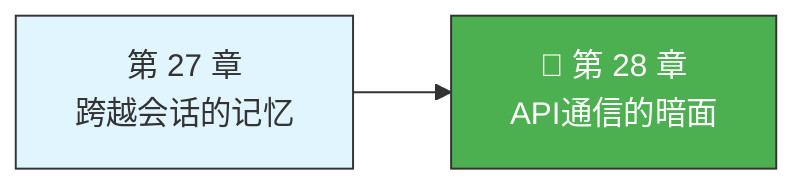
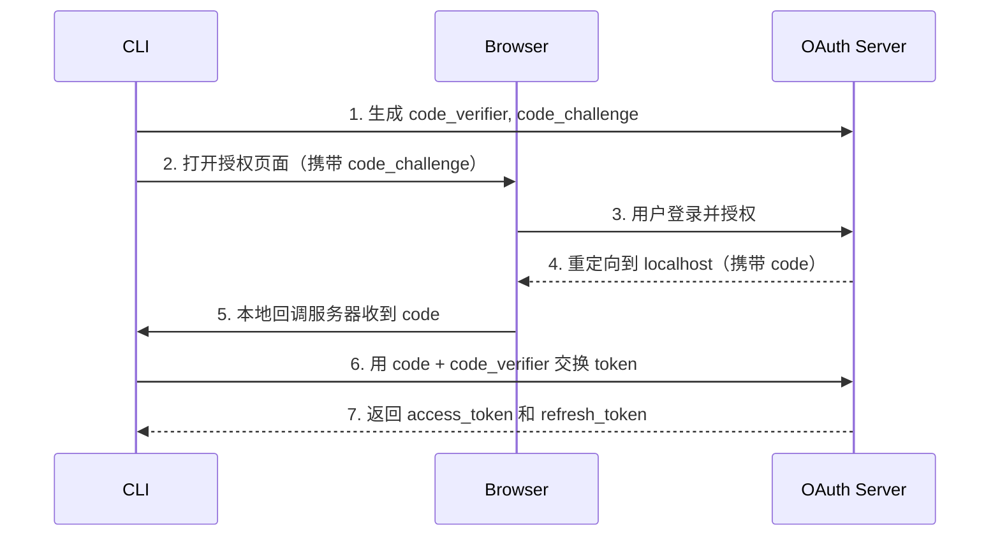

> 源码验证日期：2026-05-15，基于 commit `0d81bb6`

前面的章节里，我们一直在看 Claude Code 的"正面"——消息怎么流转、工具怎么执行、对话怎么压缩、记忆怎么跨越会话。所有这些美好的流程都有一个前提：API 调用成功了。

但真实世界不是这样的。

你坐在公司 VPN 后面，防火墙拦截了 SSL 证书；你用的是 API Key 认证，但 key 过期了；你提了一个特别长的请求，超过了模型能处理的极限；又或者 Anthropic 的服务器刚好在高峰期，返回了 529 Overloaded。

每一条 API 调用都可能失败。而且失败的方式比你想象的多得多。

Claude Code 的 `src/services/api/` 目录就是应对这些失败的"暗面"。这里有错误分类系统、重试循环、指数退避算法、流式传输错误恢复……它们像引擎室里的减震器和保险丝，平时你看不到它们在工作，但它们决定了整个系统在压力下会不会崩溃。

---

## 路线图



---

## 这是什么

想象你给朋友发一条微信。大多数时候，消息秒达。但偶尔：

- 信号不好，消息发出去了但对方没收到——你等一会儿再发一次
- 对方手机关机了——你不再重试，改天再说
- 你发了一段 1GB 的视频——微信说文件太大，发送失败
- 你的账号在另一台设备上登录了——微信提示"账号异常"

API 调用面对的问题一模一样，只是更复杂：

- **网络错误**：连接超时、DNS 解析失败、SSL 证书有问题
- **服务器错误**：500 Internal Server Error、529 Overloaded
- **客户端错误**：400 Bad Request、401 Unauthorized
- **容量限制**：429 Rate Limit、prompt too long

对每种错误，Claude Code 的策略都不一样。有些要重试（服务器过载，等一会儿就好），有些不能重试（API Key 无效，重试一百遍也没用），有些需要特殊处理（token 超限时调整参数再重试）。

这套策略不是随意决定的，而是经过精心设计的**错误分类 + 重试决策**系统。

---

## 打开源码

API 通信层的核心代码在 `src/services/api/` 目录下：

| 文件 | 作用 |
|------|------|
| `withRetry.ts` | 重试循环的核心——指数退避策略 |
| `errors.ts` | 错误分类 + 错误消息生成 |
| `errorUtils.ts` | 错误工具函数——连接错误、SSL 错误 |
| `client.ts` | API 客户端创建（Anthropic SDK 配置） |
| `claude.ts` | 主查询函数（流式 + 非流式） |
| `logging.ts` | API 日志和遥测 |

我们从重试循环开始，因为它是整个通信层的骨架。

---

## 它怎么工作

### 重试循环：一个不会放弃的 for 循环

`withRetry` 函数是整个重试系统的核心。它是一个 **AsyncGenerator**——不仅能重试，还能在等待期间向调用者"汇报"重试状态（比如在终端显示"正在重试..."）。

```typescript
// → src/services/api/withRetry.ts（简化版）
export async function* withRetry<T>(
  getClient: () => Promise<Anthropic>,
  operation: (client: Anthropic, attempt: number, context: RetryContext) => Promise<T>,
  options: RetryOptions,
): AsyncGenerator<SystemAPIErrorMessage, T> {
```

它的结构可以用伪代码概括：

```
for (从第1次到最大重试次数+1) {
  try {
    发起 API 请求
    成功 → 直接返回结果
  } catch (error) {
    这个错误能重试吗？
      不能 → 抛出 CannotRetryError，放弃
      能 → 计算等待时间，yield 重试状态，sleep，继续循环
  }
}
```

默认最大重试次数是 10：

```typescript
// → src/services/api/withRetry.ts
const DEFAULT_MAX_RETRIES = 10
```

10 次意味着最多尝试 11 次（1 次初始请求 + 10 次重试），才会最终放弃。

### 错误分类：一张精密的决策表

`shouldRetry` 函数是重试决策的核心。它接收一个 API 错误，返回 `true` 或 `false`：

```typescript
// → src/services/api/withRetry.ts（简化版）
function shouldRetry(error: APIError): boolean {
  // 连接错误 → 重试（可能是临时网络问题）
  if (error instanceof APIConnectionError) return true

  // 408 Request Timeout → 重试
  if (error.status === 408) return true

  // 409 Conflict → 重试
  if (error.status === 409) return true

  // 429 Rate Limit → 订阅用户不重试，其他用户重试
  if (error.status === 429) {
    return !isClaudeAISubscriber() || isEnterpriseSubscriber()
  }

  // 401 Unauthorized → 清除缓存后重试（可能是 token 过期）
  if (error.status === 401) {
    clearApiKeyHelperCache()
    return true
  }

  // 5xx 服务器错误 → 重试
  if (error.status >= 500) return true

  // 其他情况不重试
  return false
}
```

这段代码体现了几条重要的设计原则：

1. **连接错误总是重试**——网络问题通常是临时的
2. **429 Rate Limit 对订阅用户不重试**——他们有固定的使用配额，重试只会让情况更糟
3. **401 会清除缓存再重试**——认证失败可能是因为缓存的 token 过期了
4. **5xx 总是重试**——服务器错误不是客户端的锅

而在 `errors.ts` 里，还有一个更精细的分类函数 `classifyAPIError`，用于遥测分析——告诉后端到底是哪种错误发生了。分类结果作为 `tengu_api_error` 事件的 `errorType` 字段发送到遥测系统。

### 指数退避：不是傻等，而是越等越久

决定了要重试之后，等多久？这就是**指数退避（exponential backoff）**算法的工作。

```typescript
// → src/services/api/withRetry.ts（简化版）
export function getRetryDelay(
  attempt: number,
  retryAfterHeader?: string | null,
  maxDelayMs = 32000,
): number {
  // 如果服务器告诉了我们等多久，就听服务器的
  if (retryAfterHeader) {
    const seconds = parseInt(retryAfterHeader, 10)
    if (!isNaN(seconds)) return seconds * 1000
  }

  // 指数退避：500ms * 2^(attempt-1) + 随机抖动
  const baseDelay = Math.min(
    BASE_DELAY_MS * Math.pow(2, attempt - 1),
    maxDelayMs,
  )
  const jitter = Math.random() * 0.25 * baseDelay
  return baseDelay + jitter
}
```

`BASE_DELAY_MS = 500`。如果服务器通过 `retry-after` 响应头告诉了客户端应该等多久，直接用服务器的值。否则用指数退避：

- 第 1 次重试：500ms + 抖动
- 第 2 次重试：1000ms + 抖动
- 第 3 次重试：2000ms + 抖动
- 第 4 次重试：4000ms + 抖动
- ...
- 上限：32000ms（32 秒）

那个 `jitter`（抖动）是什么？想象 1000 个客户端同时请求 API，同时收到 429 Rate Limit，同时等 2 秒后重试——它们会同时再次冲击服务器。加上随机抖动（0 到 25% 的基础延迟），这些客户端的重试时间就错开了，避免了"重试风暴"。

### 529 Overloaded：特殊的过载处理

529 状态码是 Anthropic API 特有的"服务器过载"信号。Claude Code 对 529 有专门的处理逻辑。

不是所有 529 都要重试。只有来自"前台"查询来源的 529 才会重试：

```typescript
// → src/services/api/withRetry.ts（简化版）
const FOREGROUND_529_RETRY_SOURCES = new Set<QuerySource>([
  'repl_main_thread',     // 主对话线程
  'sdk',                  // SDK 调用
  'compact',              // 压缩
  'verification_agent',   // 验证代理
])
```

后台任务（比如生成对话标题、建议补全）遇到 529 直接放弃——用户根本看不到这些任务失败，重试只会增加服务器负担。

连续 529 还有上限。如果连续 3 次（`MAX_529_RETRIES = 3`）都是 529，并且配置了 fallback 模型，系统会触发模型降级——从 Opus 降级到 Sonnet：

```typescript
// → src/services/api/withRetry.ts（简化版）
if (consecutive529Errors >= MAX_529_RETRIES) {
  if (options.fallbackModel) {
    throw new FallbackTriggeredError(options.model, options.fallbackModel)
  }
}
```

### 持久重试：为无人值守场景设计

有一个特殊的重试模式叫**持久重试（persistent retry）**，通过环境变量 `CLAUDE_CODE_UNATTENDED_RETRY` 开启。它用于无人值守的自动化场景。

```typescript
// → src/services/api/withRetry.ts（简化版）
const PERSISTENT_MAX_BACKOFF_MS = 5 * 60 * 1000    // 最多等 5 分钟
const PERSISTENT_RESET_CAP_MS = 6 * 60 * 60 * 1000  // 最多等 6 小时
const HEARTBEAT_INTERVAL_MS = 30_000                  // 每 30 秒心跳一次
```

持久模式有个巧妙的设计：长等待被切分成 30 秒的小块，每个小块都通过 `yield` 向上层发送一条"系统消息"。这保证了：

1. 宿主环境（比如 CI 系统）能看到终端有输出，不会判定会话空闲而杀掉进程
2. 用户如果回来查看终端，能看到"正在等待 API 恢复..."之类的提示

### SSL 错误：企业用户的噩梦

如果你在公司网络里用 Claude Code，大概率遇到过 SSL 错误。很多企业使用 TLS 拦截代理（比如 Zscaler），它们会用自己的 CA 证书替换网站的证书，导致 Node.js 的 SSL 验证失败。

`errorUtils.ts` 专门处理了这个问题：

```typescript
// → src/services/api/errorUtils.ts（简化版）
const SSL_ERROR_CODES = new Set([
  'UNABLE_TO_VERIFY_LEAF_SIGNATURE',
  'CERT_HAS_EXPIRED',
  'SELF_SIGNED_CERT_IN_CHAIN',
  'ERR_TLS_CERT_ALTNAME_INVALID',
  // ... 更多 SSL 错误代码
])
```

`extractConnectionErrorDetails` 会沿着错误的 `cause` 链一路往下找，最多找 5 层，找到最底层的错误代码。找到 SSL 错误后，`getSSLErrorHint` 给出具体的修复建议：

```
SSL certificate error (SELF_SIGNED_CERT_IN_CHAIN).
If you are behind a corporate proxy or TLS-intercepting firewall,
set NODE_EXTRA_CA_CERTS to your CA bundle path, or ask IT to
allowlist *.anthropic.com. Run /doctor for details.
```

这种"诊断 + 建议修复方案"的模式，比简单抛出 `ECONNREFUSED` 有用得多。

### 错误消息生成：给用户看的不是堆栈跟踪

`getAssistantMessageFromError` 函数是错误处理的最后一道关卡——把原始 API 错误转换成用户能理解的消息。它有近 500 行，是一个巨大的 if-else 链：

- **PDF 相关**：密码保护的 PDF、无效的 PDF、PDF 页数超限
- **图片相关**：图片太大、图片尺寸超限
- **认证相关**：API Key 无效、OAuth token 被撤销、组织被禁用
- **模型相关**：模型名称无效、Opus 不适用于当前订阅
- **容量相关**：Rate Limit、信用余额不足

这些消息区分交互模式和非交互模式。图片太大的错误，交互模式提示"Double press esc to go back"，非交互模式说"Try resizing the image"。非交互模式下用户无法按 Esc——他们可能是在 CI 里运行。

还有一个有趣的细节：有些 API 错误消息包含 HTML（比如 CloudFlare 的拦截页面）。`sanitizeMessageHTML` 会检测这种情况，从 HTML 中提取 `<title>` 标签内容，避免把一堆 HTML 直接展示给用户。

---

## 四种认证方式

你的请求到底是怎么证明"我是合法用户"的？Claude Code 支持四种认证方式：

| 方式 | 配置 | 适用场景 |
|------|------|---------|
| API Key | `ANTHROPIC_API_KEY` 环境变量 | 直连 Anthropic API，开发者最常用 |
| OAuth | 浏览器交互式授权 | Claude.ai 订阅用户（Max/Pro） |
| AWS Bedrock | `CLAUDE_CODE_USE_BEDROCK=1` | AWS 企业用户 |
| Google Vertex | `CLAUDE_CODE_USE_VERTEX=1` | GCP 企业用户 |

对于企业用户，Bedrock 和 Vertex 模式意味着请求根本不到 Anthropic 的服务器——流量留在你自己的云账号里。这对合规性要求高的场景（金融、医疗）至关重要。

### OAuth PKCE：不用密码也能证明你是你

如果你是 Claude.ai 的订阅用户，Claude Code 用的是 **OAuth PKCE**（Proof Key for Code Exchange）流程。PKCE 的精妙之处在于：终端**永远不接触密码**。



七个步骤环环相扣：CLI 生成暗号对（`code_verifier` + SHA-256 哈希的 `code_challenge`），浏览器里用户授权，OAuth 服务器重定向回 localhost，CLI 用 code 和 `code_verifier` 换 token。服务器验证 `code_verifier` 的哈希是否等于之前的 `code_challenge`——如果匹配，说明请求确实来自同一个 CLI。

token 被安全存储到系统 Keychain（macOS）或加密存储（Linux/Windows）。

---

## 远程会话：不在本地也能用

Claude Code 支持三种远程连接模式：

| 模式 | 连接方式 | 典型场景 |
|------|---------|---------|
| **RemoteSession** | SSH / WebSocket | 远程服务器上运行，本地终端做前端 |
| **Bridge** | IDE 插件通信 | VS Code / JetBrains 插件调用 |
| **Direct Connect** | URL 直连 | `claude connect <url>` 连接远程实例 |

三种模式最终都汇聚到同一个 API 通信层。不管是本地 REPL 发出的请求，还是 Bridge 转发的请求，都会走 `createMessageStream()` → `withRetry()` → 指数退避这一套流程。错误处理逻辑天然统一。

关键区别在于**连接层本身的可靠性**。RemoteSession 和 Bridge 模式在网络断开时需要额外的重连机制，这是在传输层（SSH/WebSocket）处理的，不属于 API 重试的范畴。

---

## 常见错误与检查方法

| 常见错误 | 检查方法 |
|---------|---------|
| 频繁 529 Overloaded | 检查是否触发了模型降级——连续 3 次 529 会切换到 fallback 模型 |
| SSL 证书错误 | 设置 `NODE_EXTRA_CA_CERTS` 指向企业 CA 证书路径 |
| 认证失败 | 检查认证方式——API Key 是否过期，OAuth token 是否被撤销 |
| 429 Rate Limit | 检查订阅类型——订阅用户的 429 不重试 |
| 重试次数耗尽 | 调整 `CLAUDE_CODE_MAX_RETRIES` 环境变量 |
| 请求超时 | 调整 `API_TIMEOUT_MS` 环境变量（默认 600 秒） |

---

## 试试看

### 练习一：调整重试次数

```bash
# 减少重试次数，快速失败
export CLAUDE_CODE_MAX_RETRIES=3

# 增加重试次数，更顽强
export CLAUDE_CODE_MAX_RETRIES=20
```

代码在 `withRetry.ts` 的 `getDefaultMaxRetries` 函数里。

### 练习二：开启持久重试模式

如果你在 CI/CD 环境中运行 Claude Code：

```bash
export CLAUDE_CODE_UNATTENDED_RETRY=true
```

这会让 Claude Code 在遇到 429/529 时无限重试（最多等 6 小时）。

### 练习三：追踪重试过程

在 `withRetry.ts` 的重试循环里加日志：

```typescript
console.log('[DEBUG] Retry attempt:', attempt, 'delay:', delay, 'error:', error.status)
```

发起一个 API 请求，如果遇到错误，观察重试的行为和退避时间。

### 练习四：调整超时时间

```bash
export API_TIMEOUT_MS=1200000  # 20 分钟
```

默认 600 秒（10 分钟）。如果网络特别慢可以增加。

---

## 检查点

1. **重试循环**：AsyncGenerator，最多 11 次，等待期间向终端报告状态
2. **错误分类**：基于 HTTP 状态码 + 消息内容的精细匹配，用于遥测分析和重试决策
3. **指数退避**：500ms 开始每次翻倍，上限 32 秒，加随机抖动避免"重试风暴"
4. **529 Overloaded**：前台任务才重试，连续 3 次触发模型降级，后台任务直接放弃
5. **持久重试**：无人值守模式下最多等 6 小时，30 秒心跳保持会话活跃
6. **SSL 错误**：沿 cause 链找到底层错误代码，给出具体修复建议
7. **错误消息**：区分交互/非交互模式，过滤 HTML 内容，确保用户看到的不是堆栈跟踪
8. **四种认证**：API Key / OAuth / Bedrock / Vertex，OAuth 用 PKCE 流程
9. **三种远程模式**：RemoteSession / Bridge / Direct Connect，复用同一套通信基础设施

从配置到可用，从连接到断开，从成功到失败到重试——你现在理解了 Claude Code 通信层的完整面貌。引擎室的每一台机器都拆开看过了。

**卷二完。**

---

## 对比：如果用 Java

Java 生态中，resilience4j 和 Spring Retry 提供了与 `withRetry` 类似的能力——指数退避、重试决策、熔断器。但一个关键区别在于实现范式：Claude Code 的 `withRetry` 是 AsyncGenerator（`yield` 在等待时向上层汇报重试状态），而 Java 的 `RetryTemplate` 是基于回调的——重试过程中的状态汇报需要额外的监听器接口。AsyncGenerator 让"等待中的通信"变成了一个自然的 `for await` 循环，Java 的等价实现需要 `CompletableFuture` + 事件总线才能达到同样的透明度。在指数退避和抖动算法上两者一致——数学不因语言而改变。Java 的 resilience4j 额外提供了线程池隔离和信号量隔离，Claude Code 的持久重试用 30 秒心跳保持了类似的会话保活效果。

---

## 你能改什么

**安全区域**：环境变量配置（`CLAUDE_CODE_MAX_RETRIES`、`API_TIMEOUT_MS`、`CLAUDE_CODE_UNATTENDED_RETRY`）——改动局限在重试行为，不影响业务逻辑；`getAssistantMessageFromError` 的错误消息文本——纯展示层改动。

**危险区域**：`shouldRetry` 的重试决策逻辑——一个错误分类的修改可能导致两类问题：不该重试的反复重试（浪费 API 配额）或该重试的直接放弃（任务失败）；`getRetryDelay` 的指数退避参数——抖动比例改动可能导致"重试风暴"；OAuth PKCE 流程的任何环节——认证改动如果出错，所有订阅用户无法登录。

---

[上一章：跨越会话的记忆](/posts/b5164991/) | [下一卷：搭建你的工坊](/posts/ffe062a9/)
