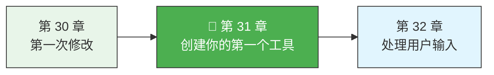
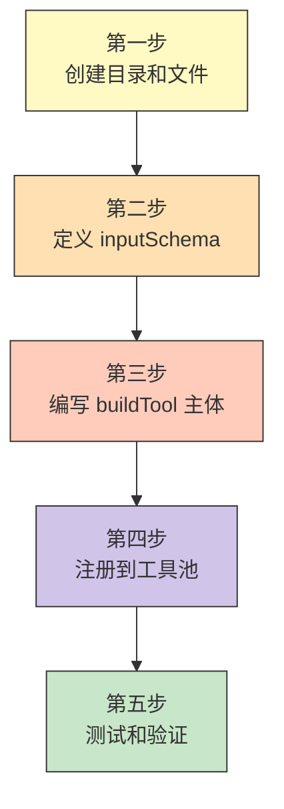

> 源码验证日期：2026-05-15，基于 commit `0d81bb6`

上一章你改了一个工具的描述文字。你已经会打开源码、找到目标位置、做最小化的修改了。

但那终究是在别人的工具上动手。今天，我们要从一张白纸开始，亲手造一个全新的工具。它会出现在 AI 的工具列表里，AI 会主动调用它，你能在终端里看到它跑起来的样子。

听上去很酷？让我们开始。

---

## 路线图



---

## 目标

创建一个叫 `Timestamp` 的工具。它做的事情极其简单：AI 调用它时，它返回当前的日期时间。没有文件操作，没有网络请求，没有任何复杂逻辑。纯粹的"输入 -> 输出"。

为什么选它？因为它足够简单，不会让你陷入业务细节；但又足够完整，能让你走通创建工具的全部流程——定义 Schema、写 prompt、实现 call、处理权限、注册到工具池。这五步走完，你就掌握了创建任何工具的模板。

---

## 工具开发的五步流程



---

## 第一步：创建工具目录和文件

打开源码，找到 `src/tools/` 目录。你会看到几十个子目录，每个对应一个工具：`BashTool/`、`GlobTool/`、`FileReadTool/`......

我们也要创建一个。在 `src/tools/` 下新建目录 `TimestampTool/`，然后创建两个文件：

```
src/tools/TimestampTool/
  ├── prompt.ts          # 工具的名字和使用说明
  └── TimestampTool.ts   # 工具的主体实现
```

先写 `prompt.ts`。这个文件负责两件事：导出工具的名字常量，导出 AI 看到的那段使用说明。

```typescript
// 文件：src/tools/TimestampTool/prompt.ts

export const TIMESTAMP_TOOL_NAME = 'Timestamp'

export const DESCRIPTION = `
Returns the current date and time in ISO 8601 format.
Use this tool when you need to know the current date or time — for example,
to timestamp a log entry, calculate elapsed time, or reference "now" in a response.
No parameters needed.
`
```

你看，就这么几行。`TIMESTAMP_TOOL_NAME` 是工具的名字——AI 会用这个名字来调用工具。`DESCRIPTION` 是给 AI 看的简短说明，告诉它什么时候该用这个工具。

对照一下 GlobTool 的 `prompt.ts`（`src/tools/GlobTool/prompt.ts`），你会发现结构一模一样：一个名字常量加一段描述文本。

---

## 第二步：定义 inputSchema

现在打开 `TimestampTool.ts`。我们要用 `buildTool` 来构建这个工具。回忆一下卷二第 4 章的内容：`buildTool` 接收一个 `ToolDef` 对象，帮你填上默认值，返回一个完整的 `Tool`。

第一步是定义输入 Schema——告诉系统（和 AI）这个工具接收什么参数。

我们的 Timestamp 工具不需要任何参数，但 Schema 仍然要定义。在 Claude Code 里，Schema 用 Zod 编写：

```typescript
// 文件：src/tools/TimestampTool/TimestampTool.ts

import { z } from 'zod/v4'
import { buildTool, type ToolDef } from '../../Tool.js'
import { lazySchema } from '../../utils/lazySchema.js'
import { DESCRIPTION, TIMESTAMP_TOOL_NAME } from './prompt.js'

const inputSchema = lazySchema(() =>
  z.strictObject({
    format: z
      .enum(['iso', 'unix', 'locale'])
      .optional()
      .describe(
        'Output format: "iso" for ISO 8601, "unix" for Unix timestamp, ' +
        '"locale" for human-readable local time. Defaults to "iso".'
      ),
  }),
)
type InputSchema = ReturnType<typeof inputSchema>
```

逐行拆解：

- `import { z } from 'zod/v4'`——Zod 验证库，卷二第 4 章讲过它的双重身份：运行时验证 + 编译时类型推导。
- `lazySchema(() => ...)`——延迟求值的包装器。因为模块加载时，某些 Zod 依赖可能还没准备好。`lazySchema` 把 schema 的创建推迟到第一次被访问时。你可以在 `src/utils/lazySchema.ts` 里看到它的实现——只有三行，一个带缓存的工厂函数。
- `z.strictObject({ ... })`——定义一个严格的对象 Schema。`strictObject` 不允许出现未定义的额外字段。我给了一个可选的 `format` 参数，让你能体验带参数的工具是怎么定义的。
- `type InputSchema = ReturnType<typeof inputSchema>`——从 `lazySchema` 的返回值推导类型，稍后在 `buildTool` 里用到。

---

## 第三步：编写 buildTool 主体

现在到了最关键的部分——用 `buildTool` 组装整个工具：

```typescript
// 定义输出 Schema
const outputSchema = lazySchema(() =>
  z.object({
    timestamp: z.string().describe('The formatted timestamp string'),
    format: z.string().describe('The format that was used'),
  }),
)
type OutputSchema = ReturnType<typeof outputSchema>

export type Output = z.infer<OutputSchema>

export const TimestampTool = buildTool({
  name: TIMESTAMP_TOOL_NAME,
  maxResultSizeChars: 10_000,

  get inputSchema(): InputSchema {
    return inputSchema()
  },
  get outputSchema(): OutputSchema {
    return outputSchema()
  },

  isConcurrencySafe() {
    return true
  },
  isReadOnly() {
    return true
  },

  async description() {
    return DESCRIPTION
  },

  async prompt() {
    return DESCRIPTION
  },

  userFacingName() {
    return 'Timestamp'
  },

  toAutoClassifierInput() {
    return ''
  },

  mapToolResultToToolResultBlockParam(output, toolUseID) {
    return {
      tool_use_id: toolUseID,
      type: 'tool_result',
      content: output.timestamp,
    }
  },

  renderToolUseMessage(input) {
    const format = input.format ?? 'iso'
    return `Getting current time (${format})`
  },

  async call(input) {
    const format = input.format ?? 'iso'

    let timestamp: string
    switch (format) {
      case 'unix':
        timestamp = String(Math.floor(Date.now() / 1000))
        break
      case 'locale':
        timestamp = new Date().toLocaleString()
        break
      case 'iso':
      default:
        timestamp = new Date().toISOString()
        break
    }

    return {
      data: {
        timestamp,
        format,
      },
    }
  },
} satisfies ToolDef<InputSchema, Output>)
```

内容看起来不少，但我们逐一过一遍：

**name**——工具的名字。AI 在 API 请求里用这个名字来标识要调用哪个工具。

**maxResultSizeChars**——工具返回结果的最大字符数。超过这个限制，结果会被保存到文件而不是直接传给 AI。10,000 对我们的简单工具绰绰有余。

**inputSchema / outputSchema**——用 getter 包裹 `lazySchema` 调用。这是 Claude Code 工具的标准写法，确保延迟求值正确工作。

**isConcurrencySafe()**——返回 `true`，表示这个工具可以和其他工具同时执行。读时间不会影响任何状态，所以安全。

**isReadOnly()**——返回 `true`，表示这个工具不修改任何文件或状态。

**description()**——返回工具的简短描述，用于 UI 展示和 AI 工具列表。

**prompt()**——返回给 AI 的详细使用说明。这里和 `description()` 返回同样的内容，因为我们的工具很简单。

**userFacingName()**——用户在终端里看到的名字。

**toAutoClassifierInput()**——返回空字符串，因为这个工具不涉及安全问题。

**mapToolResultToToolResultBlockParam()**——把工具的输出转换成 API 需要的格式。我们直接把时间字符串作为 content 返回。

**renderToolUseMessage()**——在终端里渲染"工具正在被调用"的状态。

**call()**——核心逻辑。根据用户选择的格式，用不同的方式格式化当前时间。注意返回值的结构：`{ data: { ... } }`。

最后的 `satisfies ToolDef<InputSchema, Output>` 是 TypeScript 的类型检查——它确保你写的对象满足 `ToolDef` 的类型要求。

### 你没看到什么

你可能会问：`checkPermissions()` 呢？`isEnabled()` 呢？

它们不见了，因为 `buildTool` 提供了默认值。回忆卷二第 4 章的 `TOOL_DEFAULTS`：

- `checkPermissions` 默认放行——我们的工具不需要额外的权限控制
- `isEnabled` 默认 `true`——我们的工具始终启用
- `isDestructive` 默认 `false`——正确，获取时间不是破坏性操作

这正是 `buildTool` 的价值：简单工具只需要写核心逻辑，安全相关的默认值自动填上。

---

## 第四步：注册到工具池

工具写好了，但系统还不知道它的存在。最后一步：把它注册到 `src/tools.ts` 中。

打开 `src/tools.ts`，在文件顶部的 import 区域添加一行：

```typescript
// 文件：src/tools.ts，import 区域
import { TimestampTool } from './tools/TimestampTool/TimestampTool.js'
```

然后找到 `getAllBaseTools()` 函数。这个函数返回所有基础工具的数组。把 `TimestampTool` 加进去：

```typescript
// 文件：src/tools.ts，getAllBaseTools() 函数内部
export function getAllBaseTools(): Tools {
  return [
    AgentTool,
    TaskOutputTool,
    BashTool,
    // ... 其他工具 ...
    TimestampTool,    // <-- 加这一行，位置不限
    // ... 后续工具 ...
  ]
}
```

加在哪里？只要在数组里就行。顺序不影响功能——最终 `assembleToolPool()` 会对工具按名字排序。

---

## 第五步：测试和验证

### 编译检查

```bash
npx tsc --noEmit
```

如果没有类型错误，恭喜，第一步通过。

### 启动 Claude Code 验证

正常启动 Claude Code CLI，进入交互模式。然后对 AI 说：

```
现在几点了？
```

如果一切正常，你会看到类似这样的输出：

```
● Timestamp(getting current time)
  2026-05-10T14:32:18.456Z
```

AI 识别出需要知道当前时间，调用了你的 Timestamp 工具，拿到了 ISO 格式的时间戳。

### 测试不同格式

试试说：

```
给我当前的 Unix 时间戳
```

你应该看到类似 `1746888738` 的数字。再试：

```
用人类可读的格式告诉我现在几点
```

你应该看到类似 `2026/5/10 14:32:18` 的本地时间格式。

---

## 常见错误

| 常见错误 | 检查方法 |
|----------|----------|
| `Cannot find module '../../Tool.js'` | import 路径用 `.js` 后缀（ESM 约定），实际文件是 `.ts` |
| `Type '...' is not assignable to type 'ToolDef<...>'` | 加上 `satisfies ToolDef<InputSchema, Output>`，看具体报什么错 |
| 工具注册了但 AI 不调用 | 检查 `getAllBaseTools()` 是否包含了 `TimestampTool` |
| AI 调用了但参数不对 | 检查 `.describe()` 描述是否清晰，用 `z.strictObject` 防止多余字段 |
| `lazySchema` 导致的问题 | 不用 `lazySchema` 大多也能工作，但养成习惯用它 |

---

## 试试看

1. **给 TimestampTool 添加一个新格式 `rfc2822`**（如 `"Fri, 15 May 2026 14:32:18 GMT"`）。你需要修改 `z.enum`、`call()` 的 switch 语句和 `renderToolUseMessage()`。看看你能走多快。
2. **让 `renderToolUseMessage()` 显示得更丰富**——比如在调用时同时显示调用时间。观察终端里工具状态的显示效果。
3. **阅读 `src/tools/GlobTool/GlobTool.ts` 的完整实现**——它的结构比 TimestampTool 复杂得多，但骨架是一样的。找出所有你认识的模式。

---

## 检查点

- **目录结构**：每个工具有自己的文件夹，至少包含一个 prompt 文件和一个主实现文件
- **inputSchema**：用 Zod 的 `z.strictObject` 定义输入参数，`lazySchema` 延迟创建避免循环依赖
- **prompt()**：写给 AI 的使用手册，告诉它什么时候该用这个工具
- **call()**：工具的核心逻辑。接收参数，返回 `{ data: ... }` 格式的结果
- **buildTool**：帮你填上 `checkPermissions`、`isEnabled`、`isReadOnly` 等默认值
- **注册**：在 `src/tools.ts` 的 import 区域和 `getAllBaseTools()` 数组中各加一行

---

[上一章：第一次修改](/posts/7c313f38/) | [下一章：处理用户输入](/posts/739a4125/)
