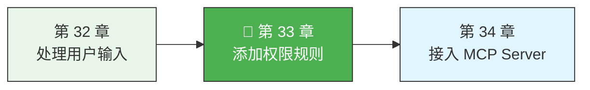
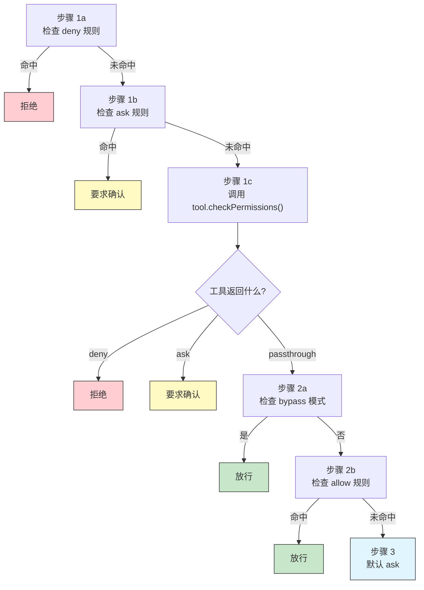

> 源码验证日期：2026-05-15，基于 commit `0d81bb6`

上一章，你学会了用 Zod 验证输入。现在 AI 传过来的参数是合法的了——但你有没有想过另一个问题：**参数合法，就代表这个操作应该被执行吗？**

想象一下，AI 要执行 `rm -rf /`。参数格式完全合法——它就是一个字符串，Zod 不会拒绝。但这个命令显然不应该被默许执行。

这就是权限系统要解决的问题。在 Claude Code 里，权限检查发生在输入验证之后、工具执行之前。它回答的唯一问题是：**这个操作，是自动放行、直接拒绝、还是需要用户确认？**

这一章，我们从源码出发，理解 Claude Code 的权限决策流程，然后为你的工具添加自定义的权限规则。

---

## 路线图



---

## 三态决策：allow、deny、ask

Claude Code 的权限系统不是简单的"允许或拒绝"二选一。它有三种行为，定义在 `src/utils/permissions/PermissionRule.ts` 中：

```typescript
// 文件：src/utils/permissions/PermissionRule.ts
export const permissionBehaviorSchema = z.enum(['allow', 'deny', 'ask'])
```

- **`allow`**——自动放行，不需要用户确认
- **`deny`**——直接拒绝，不执行也不问用户
- **`ask`**——弹出确认对话框，等用户决定

这三种行为对应着权限规则的三个"桶"：`alwaysAllowRules`、`alwaysDenyRules`、`alwaysAskRules`。每条规则从配置中加载，被打上行为标签后进入对应的桶。

---

## 认识 PermissionRule 的结构

每条权限规则长这样：

```typescript
// 文件：src/types/permissions.ts
type PermissionRuleValue = {
  toolName: string           // 规则针对的工具名
  ruleContent?: string       // 可选的细粒度匹配内容
}

type PermissionRule = {
  source: PermissionRuleSource  // 规则来源：userSettings、projectSettings、cliArg、session 等
  ruleBehavior: 'allow' | 'deny' | 'ask'
  ruleValue: PermissionRuleValue
}
```

规则有两种粒度：

**工具级规则**——匹配整个工具。比如 `"Bash"` 表示"Bash 工具的所有操作"。

**内容级规则**——匹配工具的特定操作。比如 `"Bash(npm install)"` 表示"只有 npm install 这个命令"。

内容级规则的解析逻辑在 `permissionRuleParser.ts` 中。格式是 `ToolName(content)`：

```typescript
// 文件：src/utils/permissions/permissionRuleParser.ts
export function permissionRuleValueFromString(ruleString: string): PermissionRuleValue {
  // "Bash" → { toolName: "Bash" }
  // "Bash(npm install)" → { toolName: "Bash", ruleContent: "npm install" }
  // "Bash(git commit -m \"fix\\(bug\\)\")" → { toolName: "Bash", ruleContent: "git commit -m \"fix(bug)\"" }
}
```

解析器会找到第一个未转义的 `(` 和最后一个未转义的 `)`，把中间的内容提取为 `ruleContent`。

---

## 权限管线的完整流程

当 AI 要使用一个工具时，`hasPermissionsToUseTool` 函数被调用。这是整个权限管线的主入口，定义在 `src/utils/permissions/permissions.ts` 中。让我们按顺序走一遍：



源码中的关键片段：

```typescript
// 文件：src/utils/permissions/permissions.ts
// 步骤 1a：整个工具被 deny 规则拒绝
const denyRule = getDenyRuleForTool(appState.toolPermissionContext, tool)
if (denyRule) {
  return {
    behavior: 'deny',
    decisionReason: { type: 'rule', rule: denyRule },
    message: `Permission to use ${tool.name} has been denied.`,
  }
}
```

deny 规则拥有最高优先级。如果一个工具被加入了 deny 列表，后面所有检查都不会执行。这是安全设计的基本原则：**拒绝优先于放行**。

```typescript
// 步骤 1c：调用工具自身的权限检查
const parsedInput = tool.inputSchema.parse(input)
toolPermissionResult = await tool.checkPermissions(parsedInput, context)
```

这里调用了工具的 `checkPermissions()` 方法。这是你作为工具开发者可以自定义的部分。

```typescript
// 步骤 3：默认行为——转成 ask
const result = toolPermissionResult.behavior === 'passthrough'
  ? { ...toolPermissionResult, behavior: 'ask' as const }
  : toolPermissionResult
```

`passthrough` 是一个特殊值，意思是"工具自己没有意见，交给通用规则"。如果所有规则都没有命中，它会被转成 `ask`——要求用户确认。**默认安全**是这条管线的核心原则。

---

## 实现 checkPermissions

每个工具都可以通过实现 `checkPermissions` 方法来添加自己的权限逻辑。这个方法在 Tool 基类中的签名是：

```typescript
// 文件：src/Tool.ts
checkPermissions(
  input: z.infer<Input>,
  context: ToolUseContext,
): Promise<PermissionResult>
```

它接收已验证的输入和工具使用上下文，返回一个 `PermissionResult`：

```typescript
type PermissionResult =
  | { behavior: 'allow'; updatedInput?: Record<string, unknown> }
  | { behavior: 'deny'; message: string }
  | { behavior: 'ask'; message: string; suggestions?: PermissionUpdate[] }
  | { behavior: 'passthrough'; message: string }
```

- **`allow`**——工具自己决定放行，附带可选的修改后输入
- **`deny`**——工具自己决定拒绝
- **`ask`**——工具请求用户确认
- **`passthrough`**——工具没有意见，交给通用规则

大多数简单工具返回 `{ behavior: 'passthrough', message: '...' }`——它们自己不做权限判断，完全依赖规则系统。

---

## 为你的工具添加权限逻辑

假设你正在开发一个操作数据库的工具 `DBQueryTool`。你想实现这样的权限策略：

- `SELECT` 查询自动放行
- `DROP` 和 `DELETE` 直接拒绝
- 其他语句需要用户确认

```typescript
// 文件：src/tools/DBQueryTool/DBQueryTool.ts（checkPermissions 部分）
async checkPermissions(
  input: { query: string },
  context: ToolUseContext,
): Promise<PermissionResult> {
  const sql = input.query.trim().toUpperCase()

  // SELECT 查询——只读操作，自动放行
  if (sql.startsWith('SELECT')) {
    return {
      behavior: 'allow',
      updatedInput: input,
    }
  }

  // DROP 和 DELETE——危险操作，直接拒绝
  if (sql.startsWith('DROP') || sql.startsWith('DELETE')) {
    return {
      behavior: 'deny',
      message: 'Destructive SQL operations are not allowed.',
    }
  }

  // 其他操作——交给用户决定
  return {
    behavior: 'passthrough',
    message: `DBQuery tool requires permission for: ${input.query}`,
  }
}
```

这段代码做了三件事：

1. **安全操作自动放行**——`SELECT` 是只读的，不需要确认
2. **危险操作直接拒绝**——`DROP` 和 `DELETE` 太危险，连问都不问
3. **不确定的操作交给通用规则**——`INSERT`、`UPDATE` 等操作返回 `passthrough`，最终变成 `ask`

---

## Auto Mode 和分类器

Claude Code 还有一个特殊的权限模式：**auto mode**。在 auto mode 下，一个 AI 分类器（classifier）会代替用户做权限决定。

auto mode 有三个层级的安全网：

```typescript
// 文件：src/utils/permissions/permissions.ts
if (appState.toolPermissionContext.mode === 'auto') {
  // 层级 1：acceptEdits 快速路径
  const acceptEditsResult = await tool.checkPermissions(parsedInput, {
    ...context,
    getAppState: () => ({
      ...context.getAppState(),
      toolPermissionContext: { ...state.toolPermissionContext, mode: 'acceptEdits' },
    }),
  })
  if (acceptEditsResult.behavior === 'allow') {
    return { behavior: 'allow', decisionReason: { type: 'mode', mode: 'auto' } }
  }

  // 层级 2：安全工具白名单
  if (isAutoModeAllowlistedTool(tool.name)) {
    return { behavior: 'allow', decisionReason: { type: 'mode', mode: 'auto' } }
  }

  // 层级 3：运行分类器
  const classifierResult = await classifyYoloAction(...)
  if (classifierResult.shouldBlock) {
    return { behavior: 'deny', message: '...' }
  }
  return { behavior: 'allow' }
}
```

白名单定义在 `src/utils/permissions/classifierDecision.ts` 中：

```typescript
// 文件：src/utils/permissions/classifierDecision.ts
const SAFE_YOLO_ALLOWLISTED_TOOLS = new Set([
  FILE_READ_TOOL_NAME,
  GREP_TOOL_NAME,
  GLOB_TOOL_NAME,
  LSP_TOOL_NAME,
  TOOL_SEARCH_TOOL_NAME,
  // ... 更多只读工具
])
```

只读工具（Read、Grep、Glob 等）在 auto mode 下直接放行，不调用分类器。写操作工具（Write、Edit、Bash 等）才会进入分类器。

---

## 决策原因——decisionReason

权限系统的每一个决定都附带一个 `decisionReason`，记录了**为什么**做出这个决定：

```typescript
type PermissionDecisionReason =
  | { type: 'rule'; rule: PermissionRule }          // 命中了某条规则
  | { type: 'mode'; mode: PermissionMode }          // 当前权限模式
  | { type: 'classifier'; classifier: string; reason: string }  // AI 分类器的判断
  | { type: 'hook'; hookName: string }              // Hook 拦截
  | { type: 'safetyCheck' }                         // 安全检查
```

当权限请求被展示给用户时，`createPermissionRequestMessage` 会把 `decisionReason` 转换成人类可读的消息：

```
"Permission rule 'Bash(npm install)' from user settings requires approval for this Bash command"
```

---

## 为 TimestampTool 添加权限

回顾上一章升级后的 TimestampTool。它是一个纯只读工具，权限应该很简单。我们不需要覆盖 `checkPermissions`，因为 `buildTool` 的默认行为已经够用了——它会返回 `passthrough`，最终变成 `ask`。

但如果你想让它在 auto mode 下被自动放行（不需要分类器判断），你需要确保 `isReadOnly()` 返回 `true`：

```typescript
// TimestampTool 已经这样定义了
isReadOnly() {
  return true
}
```

只读工具天然安全，会被自动加入白名单。这就是为什么 `isReadOnly()` 和 `isConcurrencySafe()` 不只是标记——它们直接影响了工具的权限行为。

---

## 常见错误

| 常见错误 | 检查方法 |
|----------|----------|
| bypass 模式下仍要求确认 | 管线中有 bypass 免疫检查点：工具 `checkPermissions` 返回 `deny`、安全检查（`.git/` 路径）等 |
| MCP 工具的权限规则格式 | MCP 工具名是 `mcp__serverName__toolName`，规则写 `mcp__server1` 匹配整个 server |
| deny 和 allow 同时配置 | deny 永远优先——管线先检查 deny（步骤 1a）再检查 allow（步骤 2b） |
| `checkPermissions` 里 input 类型报错 | 确保 `inputSchema` 定义了 `checkPermissions` 中需要访问的所有字段 |
| auto mode 下工具仍被拦截 | 检查 `isReadOnly()` 是否返回 `true`，只读工具才会被白名单放行 |

---

## 试试看

1. **设计一个文件操作工具的权限逻辑**：读取操作自动放行，写入当前目录自动放行，写入当前目录之外需要确认，写入 `.env` 文件直接拒绝。写出来看看你的 `checkPermissions` 实现。
2. **分析规则优先级**：以下规则组合会产生什么效果？`Bash(rm *) → deny`，`Bash(npm *) → allow`，`Bash → deny`。当 AI 调用 `Bash(rm -rf /tmp)` 时会发生什么？（答案：deny 先命中，直接拒绝。）
3. **阅读 `src/utils/permissions/permissions.ts` 的 `hasPermissionsToUseTool` 函数**——它是整个权限管线的入口。追踪一下从函数入口到最终返回的完整路径。

---

## 检查点

- **三态决策**——`allow`/`deny`/`ask` 不是非黑即白，`ask` 是一种尊重用户的安全默认
- **PermissionRule**——规则粒度从整个工具到特定内容，支持多层配置来源
- **权限管线**——deny 优先于 allow，安全检查优先于 bypass，默认行为是 ask
- **checkPermissions**——工具级自定义权限的入口，返回 allow/deny/ask/passthrough
- **auto mode**——分类器替代用户做决定，但有多层安全网保护
- **isReadOnly()**——标记只读的工具会被自动加入安全白名单，在 auto mode 下直接放行
- **decisionReason**——每个决定都有原因追踪，保证可解释性

记住权限系统的设计原则：**默认安全，拒绝优先，工具可以自定义但通用规则兜底。**

---

## 验证——你的权限规则做对了吗？

1. **allow 路径测试**：发起一个符合 allow 规则的操作（如 `SELECT` 查询），确认自动放行，无需确认弹窗
2. **deny 路径测试**：发起一个符合 deny 规则的操作（如 `DROP TABLE`），确认被直接拒绝，AI 收到拒绝原因
3. **ask 路径测试**：发起一个未匹配任何规则的普通操作，确认弹出确认对话框
4. **优先级测试**：构造一个同时匹配 allow 和 deny 的场景（deny 永远优先——确认 deny 胜出）
5. **passthrough 回退测试**：工具返回 `passthrough` 后确认降级到通用规则（如默认 ask）

---

[上一章：处理用户输入](/posts/739a4125/) | [下一章：接入 MCP Server](/posts/dd1dcb0d/)
