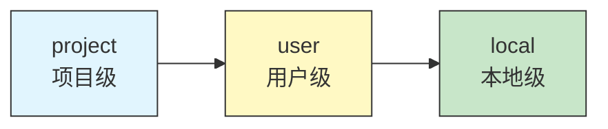

> 源码验证日期：2026-05-15，基于 commit `0d81bb6`

在卷二的第九章里，我们从协议层面理解了 MCP（Model Context Protocol）——它是一种标准化的工具发现和调用协议。但理解协议和实际接入一个 MCP 服务器是两码事。

这一章，我们从实践角度出发：如何配置一个外部 MCP 服务器，让它连上 Claude Code，让 AI 能够使用它提供的工具。

---

## 路线图


---

## 第一步：创建你的第一个 .mcp.json

MCP 服务器的配置入口是项目根目录下的 `.mcp.json` 文件。格式非常简单：

```json
{
  "mcpServers": {
    "my-server": {
      "command": "node",
      "args": ["./my-mcp-server.js"]
    }
  }
}
```

这个配置告诉 Claude Code：启动一个名为 `my-server` 的 MCP 服务器，用 `node ./my-mcp-server.js` 命令启动它，通过标准输入/输出（stdio）与之通信。

源码中配置解析在 `src/services/mcp/config.ts`：

```typescript
// 文件：src/services/mcp/config.ts
export function getProjectMcpConfigsFromCwd(): {
  servers: Record<string, ScopedMcpServerConfig>
  errors: ValidationError[]
} {
  const mcpJsonPath = join(getCwd(), '.mcp.json')
  const { config, errors } = parseMcpConfigFromFilePath({
    filePath: mcpJsonPath,
    expandVars: true,
    scope: 'project',
  })
  // ...
}
```

它读取当前目录下的 `.mcp.json`，解析并验证配置，然后返回带有作用域标签的服务器配置。

---

## 第二步：理解三种通信方式

MCP 服务器有三种通信方式，对应三种配置格式：

**stdio——通过标准输入输出通信。** 最常见的方式，适合本地进程：

```json
{
  "command": "node",
  "args": ["./server.js"],
  "env": { "API_KEY": "xxx" }
}
```

**SSE——通过 Server-Sent Events 通信。** 适合远程 HTTP 服务器：

```json
{
  "type": "sse",
  "url": "https://mcp.example.com/sse"
}
```

**HTTP——通过 Streamable HTTP 通信。** MCP 协议的新传输方式：

```json
{
  "type": "http",
  "url": "https://mcp.example.com/mcp"
}
```

在源码中，这三种方式通过 `type` 字段区分。`type` 省略时默认为 `stdio`：

```typescript
// 文件：src/services/mcp/types.ts
type McpStdioServerConfig = {
  type?: 'stdio'       // 可选，默认为 stdio
  command: string       // 要执行的命令
  args?: string[]       // 命令参数
  env?: Record<string, string>  // 环境变量
}

type McpSSEServerConfig = {
  type: 'sse'
  url: string           // SSE 端点 URL
  headers?: Record<string, string>  // 自定义请求头
}

type McpHTTPServerConfig = {
  type: 'http'
  url: string           // HTTP 端点 URL
  headers?: Record<string, string>
}
```

---

## 第三步：配置的作用域

MCP 服务器配置有三个作用域，决定了谁能看到这个服务器：



**project**——配置在项目根目录的 `.mcp.json` 中，只有这个项目的会话能看到。团队协作时，把 `.mcp.json` 提交到版本控制，整个团队都能用上同样的 MCP 服务器。

**user**——配置在用户全局设置中（`~/.claude/settings.json` 的 `mcpServers` 字段），对所有项目生效。适合放个人偏好的工具。

**local**——配置在项目的 `.claude/settings.local.json` 中，对本机当前项目生效，但不提交到版本控制。适合放包含密钥的配置。

源码中的优先级是 `plugin < user < project < local`：

```typescript
// 文件：src/services/mcp/config.ts
const configs = Object.assign(
  {},
  dedupedPluginServers,    // 优先级最低
  userServers,
  approvedProjectServers,
  localServers,            // 优先级最高
)
```

---

## 第四步：连接是如何建立的

当你配置好 MCP 服务器并启动 Claude Code 后，`MCPConnectionManager` 负责建立连接。它是一个 React Context Provider，包裹在应用的顶层：

```typescript
// 文件：src/services/mcp/MCPConnectionManager.tsx
export function MCPConnectionManager({
  children,
  dynamicMcpConfig,
  isStrictMcpConfig,
}) {
  const { reconnectMcpServer, toggleMcpServer } =
    useManageMCPConnections(dynamicMcpConfig, isStrictMcpConfig)

  return (
    <MCPConnectionContext.Provider value={{ reconnectMcpServer, toggleMcpServer }}>
      {children}
    </MCPConnectionContext.Provider>
  )
}
```

实际的连接建立发生在 `src/services/mcp/client.ts` 的 `connectToServer` 函数中：

```typescript
// 文件：src/services/mcp/client.ts（简化）
async function connectToServer(name, config) {
  let transport: Transport

  if (config.type === 'sse') {
    transport = new SSEClientTransport(new URL(config.url))
  } else if (config.type === 'http') {
    transport = new StreamableHTTPClientTransport(new URL(config.url))
  } else {
    // 默认 stdio
    transport = new StdioClientTransport({
      command: config.command,
      args: config.args,
      env: { ...process.env, ...config.env },
    })
  }

  const client = new Client({ name: `claude-code-${name}`, version: '1.0' })
  await client.connect(transport)

  return { type: 'connected', client, name, cleanup: () => client.close() }
}
```

对于 stdio 服务器，Claude Code 会启动一个子进程，通过标准输入发送 JSON-RPC 消息，从标准输出读取响应。

---

## 第五步：工具发现——MCP 服务器告诉 Claude Code 它能做什么

连接建立后，Claude Code 会调用 MCP 协议的 `tools/list` 方法，获取服务器提供的工具列表：

```typescript
// 文件：src/services/mcp/client.ts
async function fetchToolsForClient(client) {
  const { tools } = await client.request(
    { method: 'tools/list' },
    ListToolsResultSchema,
  )

  // 把每个 MCP 工具包装成 Claude Code 的 Tool 对象
  return tools.map(toolDef => new MCPTool(client, toolDef))
}
```

每个 MCP 工具会被包装成 `MCPTool` 实例。`MCPTool` 实现了 Claude Code 的 `Tool` 接口，这样 AI 就能像调用内置工具一样调用 MCP 工具。

MCP 工具的名字会被加上前缀 `mcp__serverName__`。比如你的服务器叫 `weather`，它提供一个 `get_forecast` 工具，那么 AI 看到的工具名就是 `mcp__weather__get_forecast`。这个前缀避免了不同服务器之间的名字冲突。

---

## 第六步：动手——接入一个真实的 MCP 服务器

让我们用一个实际例子来体验。创建 `.mcp.json`：

```json
{
  "mcpServers": {
    "filesystem": {
      "command": "npx",
      "args": [
        "-y",
        "@modelcontextprotocol/server-filesystem",
        "/Users/you/documents"
      ]
    }
  }
}
```

启动 Claude Code 后，服务器会自动连接。你可以用 `/mcp` 命令查看所有 MCP 服务器的状态：

```
> /mcp

MCP Servers:
  filesystem (connected)
    Tools: read_file, write_file, list_directory, search_files, ...
```

现在 AI 可以使用 `mcp__filesystem__read_file` 等工具来操作你的文档目录了。

---

## 第七步：环境变量和安全配置

很多 MCP 服务器需要 API 密钥或其他敏感信息。你可以通过 `env` 字段传递环境变量：

```json
{
  "mcpServers": {
    "github": {
      "command": "npx",
      "args": ["-y", "@modelcontextprotocol/server-github"],
      "env": {
        "GITHUB_PERSONAL_ACCESS_TOKEN": "${GITHUB_TOKEN}"
      }
    }
  }
}
```

注意 `${GITHUB_TOKEN}` 的写法。Claude Code 支持在配置值中使用 `${VAR_NAME}` 格式的环境变量引用。解析逻辑在 `envExpansion.ts` 中：

```typescript
// 文件：src/services/mcp/envExpansion.ts
export function expandEnvVarsInString(input: string): {
  expanded: string
  missingVars: string[]
} {
  // 把 ${VAR_NAME} 替换成 process.env.VAR_NAME 的值
  // 记录哪些变量不存在（missingVars）
}
```

如果引用的环境变量不存在，配置会被标记为有警告，但不会阻止启动。这样你可以在 `.mcp.json` 中写好配置模板，实际值从环境中读取——避免把密钥写进版本控制。

---

## 第八步：企业策略控制

在企业环境中，管理员可能需要控制哪些 MCP 服务器可以被使用。Claude Code 支持三层策略：

**allowlist（白名单）**——只有白名单中的服务器被允许。空的 allowlist 意味着阻止所有服务器。

**denylist（黑名单）**——黑名单中的服务器被阻止，其他都允许。

**企业配置（enterprise）**——当存在企业 MCP 配置文件时，其他所有来源都被忽略，只使用企业配置。

```typescript
// 文件：src/services/mcp/config.ts
function isMcpServerAllowedByPolicy(serverName, config) {
  // 先检查 denylist
  if (isMcpServerDenied(serverName, config)) {
    return false
  }
  // 再检查 allowlist
  const settings = getMcpAllowlistSettings()
  if (!settings.allowedMcpServers) {
    return true  // 没有白名单 = 允许所有
  }
  // 按名字、命令、URL 匹配
}
```

---

## MCP 工具如何变成 Claude Code Tool

从 MCP 工具定义到 Claude Code 可用的工具，有一个适配过程：

| MCP 属性 | Claude Code Tool 属性 |
|---------|---------------------|
| `name` | `name`（加 `serverName__` 前缀） |
| `inputSchema` | `inputJSONSchema`（保持 JSON Schema） |
| `description` | `description()` + `prompt()` |
| `annotations.readOnlyHint` | `isReadOnly()` + `isConcurrencySafe()` |
| `annotations.destructiveHint` | `isDestructive()` |
| `tools/call` | `call()` |

注意 MCP 工具绕过了 Zod——它们用原始 JSON Schema 作为 `inputJSONSchema`。这是因为 MCP 协议规范使用 JSON Schema，MCP 服务器返回的工具定义已经是 JSON Schema 格式，不需要再经过 Zod 转换。

---

## 常见错误

| 常见错误 | 检查方法 |
|----------|----------|
| 服务器显示 `disconnected` | 手动运行配置中的命令，确认服务器可以启动；检查环境变量是否设置 |
| 工具名冲突 | MCP 工具名有 `mcp__serverName__` 前缀，不同服务器的同名工具不会冲突 |
| 项目级服务器需要手动批准 | 首次使用时 Claude Code 会弹出确认框，批准后记录在 `.claude/settings.local.json` |
| Windows 上 npx 无法启动 | 改为 `"command": "cmd", "args": ["/c", "npx", ...]` |
| 环境变量没有被展开 | 确认 `${VAR_NAME}` 格式正确，用 `echo $VAR_NAME` 验证变量存在 |
| 工具不出现 | 检查 deny 规则是否过滤了该工具，用 `/mcp` 查看状态 |

---

## 试试看

1. **创建一个简单的 MCP 服务器**。新建一个文件 `my-mcp-server.js`，实现一个 `hello` 工具（返回 "Hello, World!"）。在 `.mcp.json` 中配置它，启动 Claude Code，用 `/mcp` 确认连接成功，然后让 AI 调用它。
2. **配置一个远程 MCP 服务器**。找一个公开的 MCP 服务器（比如 GitHub MCP），用 SSE 或 HTTP 方式配置。观察连接建立的过程。
3. **测试环境变量展开**。在配置中使用 `${HOME}` 变量，确认它被正确展开。再试一个不存在的变量，观察警告信息。

---

## 检查点

- **`.mcp.json`**——项目级配置文件，定义服务器名称、命令和参数
- **三种通信方式**——stdio（本地进程）、SSE（HTTP 长连接）、HTTP（Streamable HTTP）
- **三个作用域**——project、user、local，优先级递增
- **连接管理器**——`MCPConnectionManager` 负责建立和维护连接
- **工具发现**——通过 `tools/list` 获取工具列表，包装为 `MCPTool`
- **名字前缀**——`mcp__serverName__toolName` 格式避免冲突
- **环境变量**——用 `${VAR_NAME}` 安全引用敏感配置
- **企业策略**——allowlist/denylist 控制服务器的可用性

记住，MCP 的核心思想是**工具即服务**。你不需要把所有功能都写进 Claude Code 里，只需接入一个 MCP 服务器，AI 就能使用它提供的所有工具。

---

[上一章：添加权限规则](/posts/dde49500/) | [下一章：构建多 Agent 协作](/posts/ca99ec19/)
