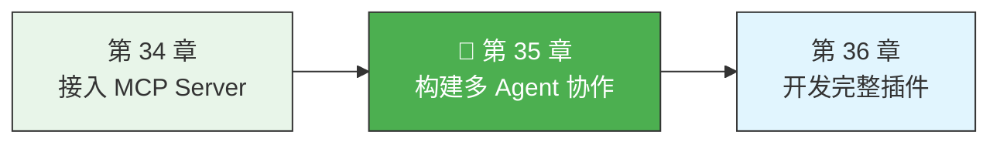
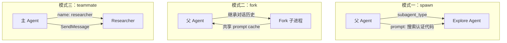

> 源码验证日期：2026-05-15，基于 commit `0d81bb6`

到目前为止，我们一直在讨论单个工具——一个工具做一件事。但有些任务太复杂了，需要多个"工人"协同完成。比如你想同时搜索三个数据库，或者让一个 Agent 做研究、另一个 Agent 写代码。

Claude Code 通过 `AgentTool` 实现了多 Agent 协作。这不是一个普通工具——它是一个**工具工厂**，能够启动独立的子进程（Agent），每个子进程都有自己的系统提示词、工具集和对话历史。

这一章，我们深入 `src/tools/AgentTool/` 目录，理解多 Agent 协作是如何构建的。

---

## 路线图



---

## 认识 AgentDefinition——Agent 的蓝图

每个 Agent 都由一个 `AgentDefinition` 定义。这是 Agent 的"基因"，决定了它的行为、能力和边界：

```typescript
// 文件：src/tools/AgentTool/loadAgentsDir.ts（简化）
type AgentDefinition = {
  agentType: string              // Agent 的类型标识，如 "Explore"、"Plan"
  whenToUse: string              // 什么时候使用这个 Agent
  tools?: string[]               // Agent 可以使用的工具白名单
  disallowedTools?: string[]     // Agent 不能使用的工具黑名单
  model?: string                 // 模型偏好
  permissionMode?: PermissionMode // 权限模式
  maxTurns?: number              // 最大对话轮数
  skills?: string[]              // 预加载的技能
  hooks?: HooksSettings          // Agent 的钩子配置
  mcpServers?: AgentMcpServerSpec[] // Agent 专属的 MCP 服务器
  getSystemPrompt: (context) => string  // Agent 的系统提示词
}
```

这些字段控制了 Agent 的方方面面：

- **`tools` 和 `disallowedTools`**——控制 Agent 能用什么工具。没有配置时，Agent 可以使用所有工具
- **`permissionMode`**——控制 Agent 的权限级别。比如 `plan` 模式下 Agent 不能执行写操作
- **`maxTurns`**——限制 Agent 的最大对话轮数，防止失控
- **`mcpServers`**——Agent 可以自带 MCP 服务器，不依赖全局配置

Claude Code 内置了几个 Agent。看看它们的定义：

```typescript
// 文件：src/tools/AgentTool/builtInAgents.ts
export function getBuiltInAgents(): AgentDefinition[] {
  const agents: AgentDefinition[] = [
    GENERAL_PURPOSE_AGENT,    // 通用 Agent
    STATUSLINE_SETUP_AGENT,   // 状态栏设置
  ]

  if (areExplorePlanAgentsEnabled()) {
    agents.push(EXPLORE_AGENT, PLAN_AGENT)  // 探索和规划
  }

  return agents
}
```

其中 `Explore` Agent 是一个只读的搜索工具：
- `tools: [Read, Grep, Glob, Bash]`（只读工具）
- `disallowedTools: [Write, Edit]`（不能写文件）
- `maxTurns: 20`（限制轮数）
- `omitClaudeMd: true`（不需要 CLAUDE.md 上下文，节省 token）

---

## Agent 的输入——启动参数

当 AI 调用 AgentTool 时，它传递一组参数来控制 Agent 的启动：

```typescript
// 文件：src/tools/AgentTool/AgentTool.tsx
const baseInputSchema = lazySchema(() => z.object({
  description: z.string()
    .describe('A short (3-5 word) description of the task'),
  prompt: z.string()
    .describe('The task for the agent to perform'),
  subagent_type: z.string().optional()
    .describe('The type of specialized agent to use for this task'),
  model: z.enum(['sonnet', 'opus', 'haiku']).optional()
    .describe("Optional model override for this agent"),
  run_in_background: z.boolean().optional()
    .describe('Set to true to run this agent in the background'),
}))
```

关键参数：

- **`prompt`**——给 Agent 的任务描述。这是最重要的参数。Agent 看不到父 Agent 的对话历史（除非是 fork 模式），所以 `prompt` 需要包含足够的上下文
- **`subagent_type`**——选择哪种类型的 Agent。不指定时使用 `GENERAL_PURPOSE_AGENT`
- **`run_in_background`**——是否在后台运行。前台 Agent 会阻塞父 Agent，后台 Agent 异步运行，完成后通知

---

## 三种协作模式



**模式一：spawn——类型化 Agent。** 通过 `subagent_type` 指定一个预定义的 Agent 类型：

```
Agent({
  subagent_type: "Explore",
  prompt: "Search the codebase for all files related to authentication",
  description: "auth search"
})
```

spawn 出来的 Agent 从零开始——没有父 Agent 的对话历史，只有 `prompt` 中提供的上下文。这意味着 `prompt` 必须足够详细。

**模式二：fork——继承式分支。** 不指定 `subagent_type` 时，Agent 会继承父 Agent 的完整对话历史：

```
Agent({
  prompt: "Check if the migration is safe",
  description: "migration review"
})
```

fork 的优势是子进程能看到父 Agent 之前的所有对话。它的代价是消耗更多的 token。但 fork 有一个精妙的优化——**prompt cache 共享**。所有 fork 子进程共享相同的 API 请求前缀，只有最后的指令不同，大幅减少 token 消耗：

```typescript
// 文件：src/tools/AgentTool/forkSubagent.ts
export function buildForkedMessages(directive, assistantMessage) {
  // 保持完整的 assistant 消息（所有 tool_use 块）
  // 用相同的占位符替换所有 tool_result
  // 只有最后的指令文本不同
  // → 最大化 prompt cache 命中率
}
```

**模式三：teammate——独立协作者。** 通过 `name` 参数启动一个命名的 Agent：

```
Agent({
  name: "researcher",
  prompt: "Research the latest authentication patterns",
  description: "auth research"
})
```

teammate 可以通过 `SendMessage({ to: "researcher" })` 被后续联系，形成一个持久化的协作网络。

---

## Agent 的启动流程——runAgent

当 AI 调用 AgentTool 时，核心函数 `runAgent` 被调用：

```typescript
// 文件：src/tools/AgentTool/runAgent.ts
export async function* runAgent({
  agentDefinition,
  promptMessages,
  toolUseContext,
  canUseTool,
  isAsync,
}): AsyncGenerator<Message, void> {
```

`runAgent` 是一个异步生成器——它逐步产出消息，而不是一次性返回。这个设计让 UI 可以实时显示 Agent 的进展。

启动流程按以下顺序进行：

**3a. 创建 Agent 上下文。** Agent 获得自己的 `toolUseContext`：

```typescript
const agentToolUseContext = createSubagentContext(toolUseContext, {
  options: agentOptions,
  agentId,
  agentType: agentDefinition.agentType,
  messages: initialMessages,
  readFileState: agentReadFileState,
  abortController: agentAbortController,
  getAppState: agentGetAppState,
})
```

**3b. 工具分配。** 如果 Agent 定义了 `tools` 白名单，只有列表中的工具被分配。如果定义了 `disallowedTools` 黑名单，被列出的工具被移除。两者都没定义，Agent 获得完整的工具集。

**3c. 权限继承。** 关键的安全设计——父 Agent 的 `bypassPermissions` 模式永远优先于子 Agent 的设置：

```typescript
const agentGetAppState = () => {
  const state = toolUseContext.getAppState()
  let toolPermissionContext = state.toolPermissionContext

  if (agentPermissionMode &&
      state.toolPermissionContext.mode !== 'bypassPermissions' &&
      state.toolPermissionContext.mode !== 'acceptEdits') {
    toolPermissionContext = {
      ...toolPermissionContext,
      mode: agentPermissionMode,
    }
  }

  // 后台 Agent 不能弹出权限对话框
  if (isAsync) {
    toolPermissionContext = {
      ...toolPermissionContext,
      shouldAvoidPermissionPrompts: true,
    }
  }
}
```

**3d. MCP 服务器初始化。** Agent 可以定义自己的 MCP 服务器，在启动时连接，结束时清理：

```typescript
const { clients: mergedMcpClients, tools: agentMcpTools, cleanup: mcpCleanup } =
  await initializeAgentMcpServers(agentDefinition, toolUseContext.options.mcpClients)
```

**3e. 进入查询循环。** Agent 的核心是一个 `query()` 循环——不断与 AI 模型对话，执行工具调用，直到任务完成或达到轮数限制：

```typescript
for await (const message of query({
  messages: initialMessages,
  systemPrompt: agentSystemPrompt,
  maxTurns: maxTurns ?? agentDefinition.maxTurns,
})) {
  yield message
}
```

---

## 生命周期管理——从启动到清理

每个 Agent 都会占用资源（内存、API 连接、子进程），需要在结束时正确清理。`runAgent` 使用 try/finally 保证清理总是执行：

```typescript
// 文件：src/tools/AgentTool/runAgent.ts
try {
  for await (const message of query({ ... })) {
    yield message
  }
} finally {
  await mcpCleanup()                    // 清理 Agent 专属的 MCP 服务器
  if (agentDefinition.hooks) {
    clearSessionHooks(rootSetAppState, agentId)  // 清理 hooks
  }
  agentToolUseContext.readFileState.clear()       // 释放文件状态缓存
  killShellTasksForAgent(agentId, ...)            // 终止后台 shell 任务
  // 清理 todo 状态
  rootSetAppState(prev => {
    const { [agentId]: _removed, ...todos } = prev.todos
    return { ...prev, todos }
  })
}
```

这个 finally 块做了五件事：清理 MCP 连接、清理 hooks、释放缓存、杀掉后台任务、清理状态。

---

## 创建自定义 Agent

你可以创建自己的 Agent，定义文件放在 `.claude/agents/` 目录下。Agent 定义是一个 Markdown 文件，frontmatter 指定 `tools`（工具列表）、`max_turns`（最大轮数）、`description`（触发条件），正文是 Agent 的 system prompt。

下一章（第 36 章「开发完整插件」的「创建 Agent」一节）会给出完整的 db-inspector Agent 创建示例，这里不重复。本章聚焦于 Agent 的运行机制——`runAgent` 的 AsyncGenerator 模式、会话隔离、和 Team 协作架构。

---

## 常见错误

| 常见错误 | 检查方法 |
|----------|----------|
| Agent 启动后没有反应 | 检查是否有权限提示等待确认；后台 Agent 检查 `/mcp` 状态 |
| Agent 报错说没有某个工具 | 检查 Agent 定义中的 `tools` 白名单是否包含了需要的工具 |
| 后台 Agent 的权限被自动拒绝 | 这是预期行为——后台 Agent 不能弹出 UI，ask 自动变 deny。配置好 allow 规则 |
| fork 子进程递归创建 Agent | 源码有递归检测：`isInForkChild()` 检查 `FORK_BOILERPLATE_TAG` |
| Agent 超过 maxTurns 自动停止 | 增大 `maxTurns` 参数，或在 prompt 中指示 Agent 尽快完成 |

---

## 试试看

1. **在对话中让 AI 启动一个 Explore Agent**。说"搜索代码库中所有与 MCP 相关的文件"。观察 Agent 的启动、工具调用和结果返回的完整过程。
2. **创建一个自定义 Agent**。在 `.claude/agents/` 下创建一个 `code-reviewer.md`，定义一个只读的代码审查 Agent。它只能使用 Read、Grep、Glob 工具，最多运行 10 轮。给它一个审查代码的系统提示词。
3. **对比 spawn 和 fork 的 token 消耗**。让 AI 用 spawn 方式执行一个任务（需要完整上下文），然后用 fork 方式执行同一个任务。比较两次的 token 用量。

---

## 检查点

- **AgentDefinition**——Agent 的蓝图，定义了它的能力、工具、权限和生命周期
- **runAgent**——Agent 的启动器，负责创建上下文、分配工具、建立连接和清理资源
- **三种模式**——spawn（类型化，从零开始）、fork（继承式，共享缓存）、teammate（持久协作者）
- **工具分配**——通过 `tools` 和 `disallowedTools` 控制每个 Agent 的能力边界
- **权限继承**——子 Agent 的权限受父 Agent 约束，bypass 模式不可被子覆盖
- **生命周期管理**——finally 块保证资源总是被正确清理
- **自定义 Agent**——在 `.claude/agents/` 目录下创建 Markdown 文件即可

多 Agent 协作的本质是**分而治之**——把复杂任务拆成独立的子任务，分配给专门的 Agent，然后收集结果。关键在于设计好每个 Agent 的能力边界，让它只做它擅长的事。

---

[上一章：接入 MCP Server](/posts/dd1dcb0d/) | [下一章：开发完整插件](/posts/c5e6ebbf/)
