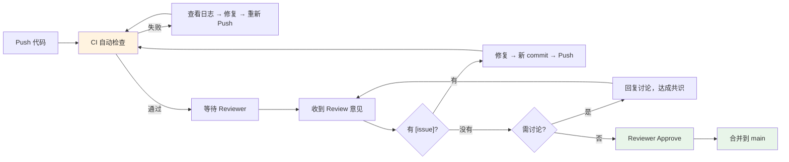

> 源码验证日期：2026-05-15，基于 commit `0d81bb6`

你已经能写工具、写测试、调试问题了。你的本地环境里可能已经有了几个能跑的改动。但代码停留在本地，就像文章留在草稿箱——只有发表出去，它才有价值。

这一章，我们讨论如何把你的本地改动变成对项目的贡献。从 Git 分支到代码审查，从 commit message 到 Pull Request，走完"从代码到贡献"的完整旅程。

---

## 路线图


---

## 理解项目的贡献入口

Claude Code 的源码仓库在 GitHub 上。在开始之前，先了解几个关键位置：

**Issue 列表**——项目的 bug 报告和功能请求。这是你找到贡献机会的地方。

**Pull Request 列表**——所有待合并的代码改动。浏览已合并的 PR 可以帮你理解项目的贡献风格。

**README 和文档**——通常包含贡献指南、行为准则和联系方式。

**源码仓库的特殊性**——回忆第 29 章的内容：我们从 npm 包提取出来的源码仓库不是 Anthropic 的内部开发仓库。真正的贡献需要推送到 GitHub 上的官方仓库。你需要 fork 官方仓库，在 fork 上开发，然后向官方仓库提 PR。

---

## Fork 和分支策略

**Fork** 是你自己的仓库副本。你在 fork 上有完整的写权限，可以自由地创建分支和推送代码。

```bash
# 1. 在 GitHub 上 fork 官方仓库
# 2. 克隆你的 fork
git clone https://github.com/your-username/claude-code.git
cd claude-code

# 3. 添加官方仓库作为上游
git remote add upstream https://github.com/anthropics/claude-code.git

# 4. 确认远程仓库配置
git remote -v
# origin    https://github.com/your-username/claude-code.git (fetch)
# origin    https://github.com/your-username/claude-code.git (push)
# upstream  https://github.com/anthropics/claude-code.git (fetch)
# upstream  https://github.com/anthropics/claude-code.git (push)
```

**分支策略**：永远不要在 `main` 分支上直接开发。为每个贡献创建一个独立的分支：

```bash
# 从最新的 main 创建分支
git checkout main
git pull upstream main
git checkout -b fix/glob-tool-symlink-resolution

# 或者为功能开发
git checkout -b feat/add-timestamp-tool
```

分支命名建议：

- `fix/` 前缀：bug 修复（如 `fix/permission-deny-rule-override`）
- `feat/` 前缀：新功能（如 `feat/add-timestamp-tool`）
- `refactor/` 前缀：代码重构
- `docs/` 前缀：文档更新
- `test/` 前缀：测试补充

---

## 编写好的 Commit Message

Commit message 是你的改动的故事。Claude Code 项目使用 Conventional Commits 风格：

```
<type>(<scope>): <description>

[optional body]

[optional footer]
```

**type（类型）**：

- `feat`：新功能
- `fix`：bug 修复
- `refactor`：代码重构
- `test`：测试相关
- `docs`：文档相关
- `chore`：构建、工具、依赖更新
- `perf`：性能优化

**scope（范围）**：标识改动影响的模块。比如 `tools`、`permissions`、`api`、`mcp`。

**description（描述）**：简短的一句话，用祈使句（"Add" 而不是 "Added"）。

举几个例子：

```
feat(tools): add Timestamp tool for ISO/unix/locale time formats

fix(permissions): prevent deny rule bypass in bypassPermissions mode

refactor(debug): extract debug filter logic into separate module

test(schemas): add validation tests for tool input schemas
```

好的 commit message 的标准：

1. **第一行不超过 72 个字符**
2. **第一行是祈使句**
3. **解释"为什么"而不是"什么"**——`git diff` 已经告诉读者改了什么
4. **引用相关的 Issue**——`Fixes #1234`

---

## 控制 PR 的范围

一个 PR 只做一件事。

这是最重要的贡献原则。大而全的 PR 很难审查——审查者面对 500 行改动时会犹豫从哪里开始看，可能遗漏关键问题。小而聚焦的 PR 审查起来轻松，合并起来快速。

**好的 PR 范围**：

- "为 TimestampTool 添加 unix 格式支持"——15 行改动
- "修复 BashTool 在 Windows 下的路径处理"——30 行改动
- "为权限规则解析器添加单元测试"——100 行改动，全是新文件

**不好的 PR 范围**：

- "改进工具系统"——500 行改动，混合了重构、新功能、bug 修复
- "修复所有 lint 警告"——200 行改动，涉及几十个文件

如果你发现自己在一个 PR 里做了多件不相关的事，把它拆分成多个 PR。

---

## 创建 Pull Request

代码准备好了，推送到你的 fork：

```bash
git push origin fix/glob-tool-symlink-resolution
```

然后在 GitHub 上创建 PR。好的 PR 有以下要素：

**标题**——和 commit message 的第一行格式一样。

**描述模板**：

```markdown
## Summary

<!-- 一到三句话说明这个 PR 做了什么 -->

## Changes

- Added `format` parameter to TimestampTool inputSchema
- Implemented unix timestamp format in call()
- Added validation tests for the new format

## Testing

- [x] Unit tests pass (`npx vitest run`)
- [x] Manual test: `claude` then "给我当前的 Unix 时间戳"
- [x] No type errors (`npx tsc --noEmit`)

## Related Issues

Fixes #1234
```

---

## 理解代码审查

提交 PR 之后，项目维护者会审查你的代码。但在人介入之前，自动化系统先做第一轮检查。

### PR 的生命周期



### CI/CD：自动化门禁

推送到 GitHub 后，CI（Continuous Integration）系统自动运行。典型的 CI 检查项：

| 检查项 | 命令 | 作用 |
|--------|------|------|
| 类型检查 | `npx tsc --noEmit` | 确保没有 TypeScript 类型错误 |
| 单元测试 | `npx vitest run` | 确保改动没有破坏已有功能 |
| Lint | `npx eslint src/` | 确保代码风格符合项目规范 |
| 格式化 | `npx prettier --check src/` | 确保代码格式一致 |
| 构建 | `npm run build` | 确保代码可以正确打包 |

**如何阅读 CI 失败日志**：

1. **先看最上面**——第一条错误往往是最根本的原因，后续错误可能是级联效应
2. **搜索关键错误信息**——`error TS`、`FAIL`、`AssertionError`、`Cannot find module`
3. **对比本地**——在本地运行相同的命令，看是否复现
4. **检查文件路径**——CI 的文件系统可能和本地不同（如大小写敏感差异）
5. **看 diff 范围**——CI 失败是否在你的改动范围内？如果是范围外的失败，可能是已知的 flaky test

```bash
# 在本地模拟 CI 检查
npx tsc --noEmit && npx vitest run && npx eslint src/ && npx prettier --check src/
```

### 签名提交与 DCO

一些开源项目要求 **DCO（Developer Certificate of Origin）**——你在提交代码时声明你有权贡献这些代码。Claude Code 使用 Signed-off-by 机制：

```bash
git commit -s -m "fix(tools): resolve symlink in GlobTool"
# -s 自动添加 Signed-off-by: Your Name <email>
```

你的 commit message 底部会出现：

```
Signed-off-by: Your Name <your.email@example.com>
```

这不是 GPG 签名，而是法律声明——你确认代码是你写的，或者你有权在开源许可证下贡献它。没有 DCO 签名的 PR 会被 CI 自动拒绝。

**GPG 签名**（可选但加分）——用加密密钥证明 commit 确实是你创建的：

```bash
git config --global user.signingkey YOUR_GPG_KEY_ID
git commit -S -m "feat(tools): add TimestampTool"
# -S 使用 GPG 签名
```

GitHub 上 GPG 签名的 commit 会显示"Verified"标记——这给维护者额外的信任信号。

---

## 理解代码审查

提交 PR 之后，项目维护者会审查你的代码。审查通常关注以下方面：

**正确性**——代码是否做了它声称要做的事？有没有边界情况遗漏？

**安全性**——改动是否引入了安全风险？比如路径穿越、注入攻击。

**可读性**——代码是否容易理解？命名是否清晰？

**一致性**——代码风格是否和项目其他部分保持一致？

**性能**——改动是否引入了不必要的性能开销？

**测试**——改动是否有相应的测试覆盖？

### 审查的五种反馈标记

| 标记 | 含义 | 阻塞？ |
|------|------|--------|
| `[nitpick]` | 小建议，非阻塞 | 否 |
| `[suggestion]` | 建议改进 | 否 |
| `[question]` | 需要澄清 | 否 |
| `[issue]` | 阻塞性问题——必须修复 | 是 |
| `[praise]` | 好的做法 | - |

优先级：`[issue]` 必须修，`[question]` 必须答，`[suggestion]` 值得考虑，`[nitpick]` 随你心意。

---

## 回应审查反馈

收到审查意见后，你的回应方式很重要。

**不要急于修改**——先理解意见的意图。审查者说"这里用一个 Map 更好"，不要马上改。先想想为什么。

**如果不同意，说清楚**——好的审查是技术讨论。用"我认为...因为..."，而不是"你不懂..."。

**逐条回复**——对每条审查意见都给出回应，即使是 "Done" 或 "Good point, fixed in abc123"。

**用新的 commit 回应**——不要 force push。推一个新的 commit，说明修改了什么：

```bash
git add -A
git commit -m "refactor(permissions): use Map for rule lookup per review feedback"
git push origin fix/glob-tool-symlink-resolution
```

### 示例：一次审查对话

**审查者**：
> [issue] 这个循环每次调用 `fs.exists()` 去检查文件是否存在——如果目录里有 10000 个文件，这会非常慢。应该用 `fs.readdir()` 一次性拿到所有文件名，然后在内存里过滤。

**你的两个选择**：

*选择一：同意并修改*
```
Good catch. Changed to readdir + in-memory filter in abc123.
Benchmarked: 10000 files went from 3.2s to 0.04s.
```

*选择二：你有理由不同意*
```
I considered this, but there's a reason for the per-file check:
we need to verify each file's readability, not just existence.
fs.readdir returns entries that may be broken symlinks or
permission-denied files. The per-file stat is necessary to
catch those edge cases.

Would it help if I added a comment explaining this?
```

关键是：提供新的信息或推理，让审查者能重新评估。

### 审查停滞怎么办

如果两三天没有回应：

1. **温和地 ping**——在 PR 里 @ 审查者，加一句 "Just checking if you had a chance to look at this"
2. **提供更多上下文**——可能是因为审查者需要更多信息来做决定
3. **检查 CI**——如果 CI 没通过，审查者可能在等你自己先修复
4. **不要重复 ping**——每天一次是上限。过了这个频率就变成骚扰了

### 被拒绝了怎么办

PR 被拒绝（Closed without merge）不一定是坏事。常见原因：

| 原因 | 应对 |
|------|------|
| 范围太大，难以审查 | 拆成多个小 PR |
| 与项目方向不一致 | 先在 Issue 里讨论设计方案再写代码 |
| 已有类似功能 | 看看已有的实现，考虑是否有改进空间 |
| 维护者没有带宽 | 保持分支更新，等合适时机重新提 |

被拒绝的 PR 也是贡献——你提供了项目维护者一个具体的讨论基础。

---

## 动手练习：审查一段真实代码

假设有人提交了以下 PR，添加了一个叫 `DoubleReadTool` 的新工具。你来当审查者：

```typescript
class DoubleReadTool {
  name = 'double_read';

  async execute(args: { file_path: string }) {
    const content1 = await fs.readFile(args.file_path, 'utf-8');
    const content2 = await fs.readFile(args.file_path, 'utf-8');

    if (content1 === content2) {
      return { success: true, result: '文件内容一致' };
    } else {
      return { success: true, result: '文件内容不一致' };
    }
  }
}
```

**审查意见**：

**[issue] 缺少 `input_schema`**——工具没有定义 Zod schema，AI 无法知道如何调用它。

**[issue] 权限检查缺失**——直接读取文件，没有检查 `checkPermissions()`。

**[suggestion] 错误处理缺失**——没有 `try/catch`，文件不存在时会崩溃。

**[suggestion] 命名风格不统一**——Claude Code 的工具使用 PascalCase（如 `ReadTool`）。建议改为 `FileCompareTool`。

**[praise] 逻辑清晰**——比较两次读取结果的逻辑很直观。

这个练习的关键是培养思维习惯：看到代码时，本能地检查 schema、权限、错误处理、命名一致性。

---

## 保持 PR 更新

在你等待审查的过程中，`main` 分支可能在继续演进。你需要定期同步：

```bash
git checkout fix/glob-tool-symlink-resolution
git fetch upstream
git merge upstream/main
git push origin fix/glob-tool-symlink-resolution
```

如果差距太大，审查者可能要求你 rebase：

```bash
git fetch upstream
git rebase upstream/main
git push origin fix/glob-tool-symlink-resolution --force-with-lease
```

注意 `--force-with-lease` 而不是 `--force`。前者更安全——如果远程分支有别人的改动，它会拒绝推送。

---

## 项目健康度评估

在决定向一个项目贡献之前，先评估它的"健康状况"。以下是在 Claude Code 项目中常见的七类信号：

| 问题类型 | 具体表现 |
|----------|----------|
| **CI/CD 问题** | 测试覆盖率不足，部分关键路径没有自动化测试 |
| **代码审查瓶颈** | PR 审查队列积压，reviewer 资源不足 |
| **技术债累积** | 大量 `TODO` 和 `FIXME` 注释未处理 |
| **文档不一致** | README 与实际代码行为存在差异 |
| **依赖管理** | 依赖版本过旧，存在已知安全漏洞 |
| **测试不稳定** | 存在 flaky tests，偶尔失败但代码无问题 |
| **流程不透明** | 新 contributor 不知道从哪开始 |

看到这些信号不要害怕——它们恰恰是贡献机会。每一个"技术债"都是你可以帮忙清理的入口。

---

## 常见错误

| 常见错误 | 检查方法 |
|----------|----------|
| PR 好几周没有人审查 | 在 PR 描述里提供充分上下文；在相关 Issue 里提及你的 PR |
| CI 测试失败 | 仔细阅读错误输出；在本地复现 CI 的测试命令 |
| 审查者要求大范围重构 | 提议把重构拆成单独的 PR，先处理当前 PR 的问题 |
| merge conflict 太多 | 频繁合并 main（至少每周一次），专注于小范围 PR |
| commit message 太模糊 | 用 Conventional Commits 格式，解释"为什么"而不是"什么" |

---

## 试试看

1. **Fork 一个你感兴趣的开源项目**（不一定是 Claude Code）。创建一个分支，做一个小改动（比如修一个 typo），提交 PR。体验完整的 fork -> branch -> commit -> PR 流程。
2. **练习写 commit message**。回顾你之前在源码上做的所有改动，为每个改动写一个 Conventional Commits 格式的 commit message。
3. **审查别人的代码**。在 GitHub 上找一个最近提交的 PR（任何项目），按照"正确性、安全性、可读性、一致性、性能、测试"六个维度写出审查意见。

---

## 检查点

- **Fork 和分支**——fork 官方仓库，从 main 创建功能分支，命名有规范
- **Commit message**——Conventional Commits 格式，解释"为什么"而不是"什么"
- **签名提交**——DCO（Signed-off-by）是法律声明，GPG 签名是身份证明
- **CI/CD 门禁**——类型检查、测试、Lint、格式化，五项自动检查必须全部通过
- **PR 范围**——一个 PR 只做一件事，小而聚焦
- **PR 描述**——Summary、Changes、Testing、Related Issues 四要素
- **代码审查**——正确性、安全性、可读性、一致性、性能、测试
- **回应反馈**——先理解再修改，逐条回复，用新 commit 而不是 force push
- **审查韧性**——停滞时温和 ping，被拒绝时分析原因、调整策略
- **保持更新**——定期合并 main，处理冲突，`--force-with-lease` 比 `--force` 安全
- **项目健康度**——七类信号是贡献机会，不是障碍

贡献不只是写代码。它是一整套社交流程——和项目维护者沟通、接受反馈、在技术讨论中保持尊重和专业。

---

[上一章：调试的艺术](/posts/a8a62cc2/) | [下一章：第一个真实贡献](/posts/88a5b455/)
