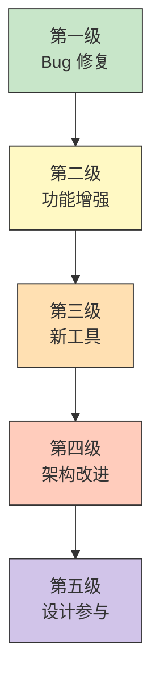

> 源码验证日期：2026-05-15，基于 commit `0d81bb6`

你已经走过了十一章。

第 29 章，你搭起了工坊。第 30 章，你做了第一次修改。第 31 章，你造了一个工具。第 32 章到第 36 章，你学了输入验证、权限控制、MCP 接入、多 Agent 协作和完整插件开发。第 37 章你学会了写测试，第 38 章你掌握了调试，第 39 章你理解了贡献流程。

现在，是时候把所有这些技能串联起来，走一遍完整的实战旅程了。

这一章，我们模拟一个真实的贡献场景：从发现一个 Issue 开始，到代码被合并结束。每一步都用到你前面学过的东西。

---

## 路线图


---

## 第一步：找到一个好问题

好的贡献从好的 Issue 开始。不是所有 Issue 都适合第一次贡献——有些需要深入的项目知识，有些涉及复杂的架构决策。

**适合新手的好 Issue 通常有这些特征**：

- **范围明确**——问题描述清晰，预期行为和实际行为都很清楚
- **代码位置已知**——Issue 里已经提到了大概在哪个文件或模块
- **影响有限**——修复不会牵扯到多个系统或模块
- **有复现步骤**——你能稳定地重现问题

**举个例子**。假设你在 GitHub Issues 里看到这样一个 Issue：

> **Issue #247: GlobTool ignores symlink directories**
>
> When using the Glob tool to search for files, directories that are symbolic links are not traversed.
>
> Steps to reproduce:
> 1. Create a symlink: `ln -s /path/to/real/dir ./linked-dir`
> 2. Place a file in the real directory: `echo "test" > /path/to/real/dir/test.txt`
> 3. Run glob: `Glob("linked-dir/**/*.txt")`
> 4. Expected: finds `linked-dir/test.txt`
> 5. Actual: no results
>
> Suspected location: `src/tools/GlobTool/GlobTool.ts`

这个 Issue 完美符合"好的第一次贡献"的标准：问题清楚、位置已知、影响范围小、有复现步骤。

---

## 第二步：理解代码上下文

找到了 Issue，下一步是理解相关代码。不要急着动手改——先读懂现有代码。

打开 `src/tools/GlobTool/GlobTool.ts`，看 `call()` 方法的实现。同时看 `prompt.ts` 了解工具的用途。

**理解代码的策略**：

1. **从入口开始**——`call()` 是工具的入口，从这里开始读
2. **追踪数据流**——输入参数怎么被使用？中间经过了哪些处理？
3. **查找相关工具**——类似的工具（比如 `GrepTool`）是否有类似的逻辑？
4. **搜索关键词**——在代码库里搜索 `symlink`、`followSymlinks`、`followLinks`

在 Claude Code 的代码库里，你会发现文件遍历通常使用 `glob` 或 `fast-glob` 库。这些库默认不跟随符号链接——有一个选项可以改变它。

---

## 第三步：创建分支和复现问题

按照第 39 章学到的流程：

```bash
# 从最新的 main 创建分支
git checkout main
git pull upstream main
git checkout -b fix/glob-tool-symlink-traversal
```

然后复现问题：

```bash
# 创建测试环境
mkdir -p /tmp/glob-test/real-dir
echo "test content" > /tmp/glob-test/real-dir/test.txt
ln -s /tmp/glob-test/real-dir /tmp/glob-test/linked-dir

# 启动 Claude Code 并尝试 glob
claude
# 在对话中：找到 linked-dir 目录下的所有 .txt 文件
```

如果复现了——确认 bug 存在。如果没有复现，在 Issue 下面留言说明你的发现。

---

## 第四步：编写失败的测试

回忆第 37 章的原则：**先写测试，再写修复。** 测试先确保问题存在（测试失败），然后你修复代码，测试通过，验证修复成功。

```typescript
// 文件：src/tools/GlobTool/GlobTool.test.ts
import { describe, it, expect, beforeEach, afterEach } from 'vitest'
import { mkdir, writeFile, symlink, rm } from 'fs/promises'
import { join } from 'path'

describe('GlobTool symlink handling', () => {
  const testDir = join(process.env.TEMP || '/tmp', 'glob-symlink-test')

  beforeEach(async () => {
    await mkdir(join(testDir, 'real-dir'), { recursive: true })
    await writeFile(join(testDir, 'real-dir', 'test.txt'), 'content')
  })

  afterEach(async () => {
    await rm(testDir, { recursive: true, force: true })
  })

  it('finds files inside symlinked directories', async () => {
    await symlink(
      join(testDir, 'real-dir'),
      join(testDir, 'linked-dir'),
    )

    const result = await globTool.call({
      pattern: 'linked-dir/**/*.txt',
      path: testDir,
    })

    expect(result.data.files).toContain(
      join(testDir, 'linked-dir', 'test.txt')
    )
  })
})
```

运行测试——它应该失败，因为当前代码不跟随符号链接。这个"失败的测试"就是你修复的目标。

---

## 第五步：实现修复

去读 `GlobTool` 的 `call()` 方法，找到文件遍历的代码：

```typescript
const entries = await glob(pattern, {
  cwd: searchPath,
  // 注意：没有 followSymbolicLinks 选项
})
```

修复可能很简单——加上跟随符号链接的选项：

```typescript
const entries = await glob(pattern, {
  cwd: searchPath,
  followSymbolicLinks: true,  // <-- 你的修复
})
```

但在动手之前，**先想清楚后果**。跟随符号链接有风险：

- **循环链接**——A 指向 B，B 指向 A，无限循环
- **性能影响**——符号链接可能指向一个巨大的目录树
- **安全影响**——符号链接可能指向用户不期望被搜索的位置

所以更好的修复是添加深度限制：

```typescript
const entries = await glob(pattern, {
  cwd: searchPath,
  followSymbolicLinks: true,
  deep: Math.min(maxDepth, 20),
})
```

这就是为什么"理解代码上下文"比"快速修复"更重要——一个好的修复不只是让测试通过，还要考虑边界情况、安全性和性能。

---

## 第六步：验证修复

修复代码后，重新运行测试：

```bash
npx vitest run src/tools/GlobTool/GlobTool.test.ts
```

测试通过了。但还不够——你还需要：

**手动验证**：

```bash
claude
# 在对话中：找到 linked-dir 目录下的所有 .txt 文件
# 确认找到了 linked-dir/test.txt
```

**回归测试**——确认修复没有破坏现有功能：

```bash
npx vitest run  # 运行所有测试
```

**边界测试**——测试循环链接：

```bash
mkdir -p /tmp/cycle-test/a
ln -s /tmp/cycle-test/a /tmp/cycle-test/a/link-to-self
# 搜索 /tmp/cycle-test 下的所有文件
# 确认不会无限循环
```

---

## 第七步：提交和推送

确认一切正常后，提交改动：

```bash
git add src/tools/GlobTool/GlobTool.ts
git add src/tools/GlobTool/GlobTool.test.ts
git commit -m "fix(glob): follow symbolic links during directory traversal

Previously, GlobTool did not follow symbolic links when searching
for files. This caused files inside symlinked directories to be
invisible to the glob search.

This commit enables followSymbolicLinks in the glob options and
adds a depth limit to prevent infinite recursion with circular symlinks.

Fixes #247"
```

推送到你的 fork：

```bash
git push origin fix/glob-tool-symlink-traversal
```

---

## 第八步：创建 Pull Request

按照第 39 章的模板创建 PR：

```markdown
## Summary

Fix GlobTool to follow symbolic links when traversing directories.

## Changes

- Enabled `followSymbolicLinks` option in the glob library call
- Added depth limit to prevent infinite recursion with circular symlinks
- Added unit test for symlink directory traversal

## Testing

- [x] New test passes
- [x] All existing tests pass
- [x] Manual test: created symlink dir, confirmed files are found
- [x] Edge case: circular symlinks don't cause infinite loop

## Related Issues

Fixes #247
```

---

## 第九步：应对代码审查

PR 提交后，审查者可能提出以下意见：

**意见 1："This could be a security issue. Symlinks could point outside the project."**

回应：你说得对。加一个检查，确保符号链接的目标在项目根目录内：

```typescript
const realPath = await realpath(linkPath)
if (!realPath.startsWith(projectRoot)) {
  continue  // 跳过指向项目外的符号链接
}
```

**意见 2："nit: The test should also cover broken symlinks."**

回应：加一个测试：

```typescript
it('handles broken symlinks gracefully', async () => {
  await symlink('/nonexistent/path', join(testDir, 'broken-link'))
  const result = await globTool.call({
    pattern: '**/*',
    path: testDir,
  })
  expect(result.data.files).not.toContain(
    join(testDir, 'broken-link', 'anything')
  )
})
```

**意见 3："Can you add a comment explaining why we limit depth?"**

回应：好的：

```typescript
// Limit traversal depth to prevent circular symlink loops
// and avoid excessive traversal of large linked directory trees
deep: Math.min(maxDepth, 20),
```

每次回应都用新的 commit：

```bash
git commit -m "fix(glob): restrict symlink following to project directory per review"
git commit -m "test(glob): add broken symlink test case per review"
git commit -m "docs(glob): add depth limit comment per review"
git push origin fix/glob-tool-symlink-traversal
```

---

## 第十步：合并

审查者满意了，留下了 "LGTM"（Looks Good To Me）。项目维护者合并了你的 PR。

你做到了。从发现 Issue 到代码被合并，你走完了完整的贡献流程。

---

## 超越第一个贡献

一个被合并的 PR 不是终点，是起点。以下是你从"第一次贡献"到"熟练贡献者"的进阶路径：



**第一级：Bug 修复**——你已经完成了。修复已知问题，范围小，影响明确。

**第二级：功能增强**——在现有工具上添加新功能。比如为 GlobTool 添加 `.gitignore` 支持过滤。这要求你更深入地理解工具的设计意图。

**第三级：新工具**——从零创建一个工具。你在第 31 章已经做过这个练习，但真实的贡献需要考虑更多：命名、prompt 措辞、权限策略、边缘情况、测试覆盖。

**第四级：架构改进**——重构共享模块、优化性能、改进错误处理。需要理解多个子系统之间的关系。

**第五级：设计参与**——参与新功能的 RFC 讨论，提出架构建议，review 其他人的 PR。你不只是写代码，还在影响项目的发展方向。

每一级都需要前一级的经验积累。不要跳级——把每一级的基础打扎实。

---

## 常见错误

| 常见错误 | 检查方法 |
|----------|----------|
| 找不到适合的 Issue | 搜索 `good first issue` 或 `help wanted` 标签；从测试入手 |
| 代码太复杂读不懂 | 用第 38 章的调试技术在关键函数上设断点；在 Issue 下提问 |
| 修复引入了新问题 | 分析新问题是你的修复导致的还是预先存在的；分开处理 |
| PR 被拒绝 | 理解拒绝原因；尝试不同的实现方式或找另一个 Issue |

---

## 试试看

1. **在 GitHub 上找一个 `good first issue`**。不一定要在 Claude Code 项目里——任何你感兴趣的开源项目都可以。走一遍完整的贡献流程：fork、分支、修改、测试、提交 PR。
2. **为你在第 31 章创建的 TimestampTool 写一个完整的 PR**。包括代码改动、测试、commit message、PR 描述。假设你是向官方仓库提交。
3. **找一个最近合并的 PR，审查它的 diff**。按照"正确性、安全性、可读性、一致性、性能、测试"六个维度写出你的审查意见。然后对比真实的审查讨论，看看你遗漏了什么。

---

## 检查点

- **找问题**——筛选适合自己的 Issue：范围明确、位置已知、影响有限
- **读代码**——从入口追踪数据流，搜索关键词，参考类似工具
- **复现问题**——按 Issue 的步骤复现，确认 bug 存在
- **先写测试**——测试失败确认问题存在，测试通过确认修复成功
- **实现修复**——不只让测试通过，还要考虑安全性、性能、边界情况
- **全面验证**——单元测试、手动测试、回归测试、边界测试
- **提交 PR**——好的 commit message + 完整的 PR 描述
- **应对审查**——理解意见、逐条回应、用新 commit 修改
- **进阶路径**——Bug 修复 -> 功能增强 -> 新工具 -> 架构改进 -> 设计参与

---

## 卷三的终点

十二个章节，你从一个读者变成了一个工匠。

第 29 章搭起了工坊，第 30 章动了第一刀。然后你学会了造工具、处理输入、控制权限、接入外部服务、让 Agent 协作、组装完整插件。这些是造物的手艺。

第 37 章到第 40 章，你学会了测试、调试、贡献。这些是打磨的手艺——确保造出来的东西是好的、对的、能被别人使用的。

造物和打磨，缺一不可。只会造不会磨，造出来的是半成品。只会磨不会造，磨的是空气。

现在，你两手都有了。

卷四，我们要换一个视角。不再是从工匠的角度看代码，而是从架构师的角度——为什么代码是这样的？这个设计决定背后的权衡是什么？如果你来做，你会怎么选？

那是更深的水域。但你在卷三练就的动手能力，是你游泳的底气。

去吧。水面就在前面。

**卷三完。**

---

[上一章：从代码到贡献](/posts/5fd4e9ba/) | [下一卷：卷四](../卷四-架构师的棋盘/)
