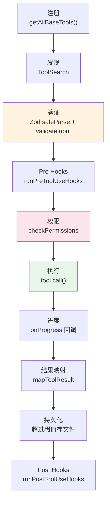

> 源码验证日期：2026-05-15，基于 commit `0d81bb6`

你在第 43 章看到了 Zod 如何为每个工具定义输入校验。但 Zod 只是工具系统的一个零件。这一章讨论更大的图景：**为什么所有工具长得都一样？**

打开 `src/tools/` 目录，43 个子目录一字排开。BashTool 的目录里有 18 个文件，FileReadTool 有 5 个文件，GlobTool 有 3 个文件。它们做完全不同的事——一个执行命令、一个读文件、一个搜索文件名模式。但如果你只看它们的骨架，你会发现形状一模一样：

```typescript
export const SomeTool = buildTool({
  name: '...',
  inputSchema: lazySchema(() => z.object({ ... })),
  async call(args, context, canUseTool, parentMessage, onProgress) { ... },
  async description() { ... },
  // ...
})
```

这种一致性不是巧合。它来自一个精心设计的接口——`Tool<Input, Output, P>`——以及一个把所有工具串成一条管线的执行函数——`runToolUse`。

这一章讨论这个设计是怎么来的，还有什么别的选择，以及它是不是最好的选择。

---

## 本章路线图


---

## 现状：统一的工具接口

### Tool<Input, Output, P>：一个接口，三十多种形态

`src/Tool.ts` 定义了整个工具系统的核心类型：

```typescript
export type Tool<
  Input extends AnyObject = AnyObject,
  Output = unknown,
  P extends ToolProgressData = ToolProgressData,
> = {
  name: string
  inputSchema: Input
  call(
    args: z.infer<Input>,
    context: ToolUseContext,
    canUseTool: CanUseToolFn,
    parentMessage: AssistantMessage,
    onProgress?: ToolCallProgress<P>,
  ): Promise<ToolResult<Output>>
  // ... 还有几十个方法和属性
}
```

三个泛型参数：`Input` 是 Zod schema（第 43 章讨论过），`Output` 是工具返回数据的类型，`P` 是进度事件的类型。每个工具有自己具体的这三样东西，但它们共享同一个 `Tool` 接口形状。

这意味着什么？意味着在任何需要"一个工具"的地方，你不需要知道它是哪种工具。`Tools` 类型就是 `readonly Tool[]`——一组工具，不关心具体类型。

### ToolResult：工具输出的丰富结构

```typescript
export type ToolResult<T> = {
  data: T           // 类型化的输出数据
  newMessages?: (UserMessage | AssistantMessage | ...)[]
                    // 工具可以向对话注入额外消息
  contextModifier?: (context: ToolUseContext) => ToolUseContext
                    // 修改后续工具的上下文
}
```

`newMessages` 是一个有趣的机制——工具可以不通过模型而在对话中注入消息。`contextModifier` 让工具修改同一轮后续工具的执行上下文。这些能力只有在统一的接口下才可能实现。

### buildTool：默认值的聪明处理

`Tool` 类型有二十多个方法和属性，但很多工具只关心其中十来个。`buildTool` 函数用安全默认值填充剩余部分：

```typescript
const TOOL_DEFAULTS = {
  isEnabled: () => true,                      // 默认启用
  isConcurrencySafe: (_input?) => false,      // 默认不安全
  isReadOnly: (_input?) => false,             // 默认写操作
  isDestructive: (_input?) => false,          // 默认非破坏性
  checkPermissions: (input, _ctx?) =>
    Promise.resolve({ behavior: 'allow', updatedInput: input }),
}

export function buildTool<D extends AnyToolDef>(def: D): BuiltTool<D> {
  return {
    ...TOOL_DEFAULTS,
    userFacingName: () => def.name,
    ...def,
  } as BuiltTool<D>
}
```

这是一种"约定优于配置"的模式。默认值是保守的（假设最危险的情况），工具定义通过覆盖来声明自己更安全。GlobTool 声明 `isConcurrencySafe() { return true }` 和 `isReadOnly() { return true }`，因为搜索文件名不会修改任何东西。

### 统一执行管线：runToolUse

所有工具调用都经过同一个函数：`src/services/tools/toolExecution.ts` 里的 `runToolUse`。这个函数是一条精心设计的管线：



这条管线不在乎它是执行 BashTool 还是 FileReadTool 还是 MCP 工具。它只依赖 `Tool` 接口定义的方法。每一个工具自己决定这些方法的具体实现，管线只负责按顺序调用它们。

### MCPTool：原型 + 克隆模式

MCP 工具使用原型模式——一个骨架对象在运行时被每个 MCP 服务器的具体实现覆盖：

```typescript
// 运行时组装
return {
  ...MCPTool,                           // 从骨架开始
  name: fullyQualifiedName,             // 覆盖名称
  mcpInfo: { serverName, toolName },
  isMcp: true,
  isConcurrencySafe() {
    return tool.annotations?.readOnlyHint ?? false
  },
  call(args, context) {
    const result = await client.callTool(toolName, args)
    return { data: result.content, mcpMeta: result._meta }
  },
}
```

内置工具和 MCP 工具使用完全相同的执行路径，调用方不需要区分它们。

---

## 当时还有什么选择

### 硬编码 switch-case

最直接的方式：一个大 switch 语句，根据工具名字分发到不同的处理逻辑。

```typescript
function executeTool(name: string, input: Record<string, unknown>) {
  switch (name) {
    case 'Bash': return executeBash(input.command)
    case 'Read': return readFile(input.file_path)
    // ... 30 个 case
  }
}
```

缺点在规模化之后致命：每加一个工具改 switch，校验逻辑散落各处，没有类型安全，没有统一生命周期。

### 插件系统（类似 webpack loader）

```typescript
const toolChain = [
  inputValidator,
  permissionChecker,
  hookRunner,
  toolExecutor,
  outputFormatter,
]
```

灵活性过高，调试一个 5 层插件链比调试一个 switch 语句难得多。Claude Code 的工具系统不需要那种程度的灵活性——所有工具都走同一条管线。

### 纯函数 Map

```typescript
const tools = new Map<string, {
  schema: ZodSchema
  execute: (input: unknown) => Promise<unknown>
}>()
```

类型安全的问题依然存在。`input` 是 `unknown`，每个工具自己负责类型转换，没有编译器帮你检查。

---

## 为什么选了这个

### 理由一：类型安全不是奢侈品

在一个有 43 种输入格式的系统里，`Tool<Input, Output, P>` 的泛型设计让每个工具有自己精确的类型，同时保持接口的统一。当你写 `FileReadTool.call(args, ...)` 时，TypeScript 知道 `args` 的类型是精确到每个字段的结构。纯函数 Map 做不到这一点——它的 `input` 永远是 `unknown`。

### 理由二：统一的生命周期防止遗漏

校验 -> 语义检查 -> 权限 -> 执行 -> 后处理。这个顺序不是随意的。如果由每个工具自己实现，迟早会有工具忘记某一步。统一的 `runToolUse` 管线确保了每一步都不遗漏。

### 理由三：扩展不需要碰核心代码

加一个新工具，在 `src/tools/` 下建一个目录，写一个 `buildTool({ ... })` 定义，然后在 `getAllBaseTools()` 数组里加上它。不需要改 `runToolUse`，不需要改权限管线，不需要改任何核心代码。MCP 工具更极端——它们甚至不需要注册，自动被包装成 `Tool` 接口的实现。

---

## 如果重新设计

### 更好的工具组合

当前的 `Tool` 接口是扁平的。能力标记（`isReadOnly`、`isConcurrencySafe`、`isMcp`）散落在接口各处。如果用组合模式替代扁平标记——用 mixin 或能力集合——可能更 DRY。

### 声明式工具定义

对于简单的工具（比如 MCP 代理），声明式的定义方式可能更清晰：

```yaml
name: ReadFile
input:
  file_path: { type: string, required: true }
permissions: read-only
concurrency: safe
```

但 BashTool 那种复杂的命令语义分析很难用声明式表达。

### 工具链（Tool Chaining）

当前的工具执行是独立的——一个工具调用完了，结果返回给 AI，AI 决定下一步。如果支持工具链（`Glob -> Read`），某些操作会更高效。但工具链也带来错误传播、权限检查、组合爆炸等复杂性。

---

## 试试看

### 练习一：比较工具复杂度

在 `getAllBaseTools()` 的 return 前加一段代码，统计每个工具的方法数量。观察哪些工具最复杂（Bash、Agent 通常最多），哪些最简单。

### 练习二：追踪 MCP 工具的组装

从一个 MCP 服务器的配置开始，追踪它是如何被包装成 `Tool` 接口实现的。找到 `client.ts` 里的运行时组装代码，理解原型 + 克隆模式。

### 练习三：写一个最小工具

创建一个只有 `name`、`inputSchema`、`call` 三个字段的工具定义，观察 `buildTool` 如何用默认值填充其他字段。

---

## 检查点

- **Tool 泛型类型**：三个类型参数（Input, Output, Progress），约 50 个字段
- **ToolResult**：`data` + `newMessages`（注入消息）+ `contextModifier`（修改上下文）
- **buildTool 工厂**：7 个字段有默认值（防御性：`isReadOnly` 默认 false）
- **统一执行管线**：注册 -> 发现 -> 验证 -> PreHooks -> 权限 -> 执行 -> 进度 -> 映射 -> PostHooks
- **MCPTool**：原型 + 克隆——骨架在运行时被每个服务器覆盖
- **扩展性**：新工具只需 `buildTool` + 注册，不碰核心代码

---

> **导航**
>
> 上一章：[第 43 章：为什么用 Zod](/posts/a2549689/)
>
> 下一章：[第 45 章：安全与便利的平衡](/posts/30a8a6e4/)
