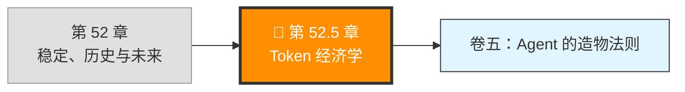
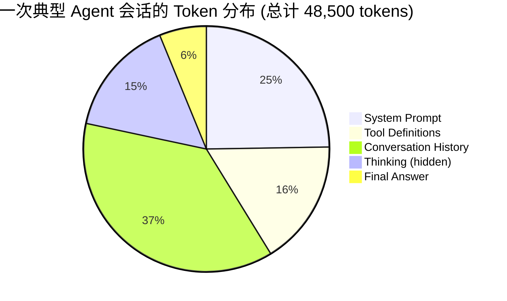

> 源码验证日期：2026-05-15，基于 commit `0d81bb6`

你已经理解了 Claude Code 的全部架构。卷五你将构建自己的 Agent 框架。
但在拿起键盘之前，有一个贯穿全书却被刻意回避的底层约束：Token 不是免费的。

---

## 路线图



---

## 为什么在这里、为什么现在

前面 52 章，我刻意避免谈钱。不是因为它不重要，而是因为在你看完引擎室之前，成本的讨论都是空中楼阁。你不知道一次 `queryLoop()` 到底发多少次 API 请求，不知道 Context Window 的大小如何影响成本，不知道 Compaction 既能省钱也能费钱。

现在你知道了。你理解了 Claude Code 的每一次工具调用、每一次上下文压缩、每一次子 Agent 的 fork——所有这些都有一个共同的分母：**Token**。

卷五你要从零构建 Agent 框架。如果你不理解 token 的经济学，你设计的缓存策略可能是赔钱的，你选的默认 max_tokens 可能在大部分场景下是浪费，你的 thinking budget 可能设得太大或太小。

所以这一章是一座桥。桥的这边是"别人的代码怎么做的"，桥的那边是"我写的代码应该怎么做"。

---

## 一、Token 怎么计数

### 1.1 Tokenizer：把文字切成 Token 的机器

LLM 不读"字"，读的是 Token。一个 Token 大约等于 3/4 个英文单词。但"大约"不够精确——Tokenizer 是一台碎纸机，它按自己的一套规则把文字切成碎片。

Claude 使用的 tokenizer 基于 BPE（Byte Pair Encoding）算法。原理很简单：

1. 从字节开始：每个字符是一个独立的 token
2. 统计频率：找最常出现在一起的那一对 token
3. 合并：把这一对合并成一个新 token
4. 重复 2-3，直到达到目标词汇量

举个例子。"Claude" 这个词：

```
第一次切分：C l a u d e              (6 tokens)
BPE 合并一轮：Cl au de                (3 tokens)
再合并：Claude                        (1 token)
```

"Claude" 在模型词汇表里是一个高频词，所以它是一个 token。但 "Claudeini" 不是，所以它可能是 "Claude" + "ini" 两个 token。

**不同模型的 tokenizer 差异**：

| 模型 | Tokenizer | 英文效率 | 中文效率 | 代码效率 |
|------|-----------|---------|---------|---------|
| Claude (Sonnet/Opus/Haiku) | Anthropic BPE | ~4 chars/token | ~1.5 chars/token | ~3.5 chars/token |
| GPT-4 | cl100k_base | ~4 chars/token | ~1.8 chars/token | ~3 chars/token |
| Gemini | SentencePiece | ~4 chars/token | ~1 char/token | ~2.5 chars/token |

注意差距：同一段中文，在 Gemini 上消耗的 token 大约是 Claude 的 1.5 倍。如果你在构建多模型框架，这个差异会影响你的模型选择决策。

### 1.2 不调用 API 怎么估算 Token 数

你不能每次都调一次 API 来数 token。在工程中，你需要一个快速估算：

```typescript
// → 最简 token 估算器（保守估计，实际值通常在 80%-95% 之间）
function estimateTokens(text: string): number {
  // 英文/代码：按空格分词，每个词 ~1.3 token
  const englishWords = text.match(/[a-zA-Z0-9_]+/g)?.length ?? 0

  // 中文/日文/韩文：每个字符 ~0.6 token
  const cjkChars = text.match(/[一-鿿぀-ゟ゠-ヿ가-힯]/g)?.length ?? 0

  // 标点和空白：每两个字符 ~1 token
  const other = text.length - englishWords * 5 - cjkChars // 粗略估算

  return Math.ceil(englishWords * 1.3 + cjkChars * 0.6 + other * 0.5)
}

// 验证
console.log(estimateTokens("hello world"))                // ~3 (实际 2)
console.log(estimateTokens("你好世界"))                    // ~2 (实际 4)
console.log(estimateTokens("async function main() {}"))   // ~7 (实际 6)
```

这个函数不精确，但在大量文本上的平均值偏差 < 15%。对于成本预算来说足够。

**更精确的方法**：如果你需要精确计数（比如在计费场景），用 Anthropic 官方的 `@anthropic-ai/tokenizer` 包，或者在请求中设 `max_tokens: 1` 观察 usage 返回的 input_tokens。

### 1.3 一次 Agent 会话的 Token 分布解剖

拿出一份真实的 Claude Code 会话日志。这次会话用户说"帮我修 src/auth.ts 的 login bug"，Agent 经过 4 轮 loop 完成了修复。我们来解剖它的 token 分布：



```
分布明细：
┌──────────────────────┬──────────┬────────┐
│ 类别                 │ Tokens   │ 占比   │
├──────────────────────┼──────────┼────────┤
│ System Prompt (静态) │ 8,000    │ 16.5%  │
│ System Prompt (动态) │ 4,000    │ 8.2%   │
│ Tool Definitions     │ 8,000    │ 16.5%  │
│ 对话历史 (前 3 轮)   │ 14,000   │ 28.9%  │
│ 当前消息             │ 4,000    │ 8.2%   │
│ Thinking Block       │ 7,500    │ 15.5%  │
│ Final Output         │ 3,000    │ 6.2%   │
└──────────────────────┴──────────┴────────┘
```

关键发现：

1. **System Prompt + Tool Definitions 占了 41%**。它们几乎不变，是 Prompt Caching 的最佳目标。
2. **Thinking 占了 15.5%**。这部分对用户不可见，但同价收费。
3. **Conversation History 是最大的单项 (28.9%)**。这就是 Compaction 存在的经济原因。

不同任务类型的分布差异：

| 任务类型 | 典型 Turns | Token 消耗 | 特点 |
|---------|-----------|-----------|------|
| 简单问答 | 1 | 8K-15K | 大部分 token 在 system + tools |
| 读文件分析 | 2-3 | 20K-40K | 文件内容占据高比例 |
| 代码修改 | 3-5 | 35K-70K | thinking 占比高 |
| 大重构 | 5-10 | 80K-200K | 可能触发 compaction |

---

## 二、Prompt Caching 的经济学

### 2.1 缓存的盈利模型

每次请求都要把 system prompt 和 tool definitions 发给 API。对于 Claude Code，这两项合计约 16K tokens。如果不缓存，每次请求都按全价计费。

Anthropic 的 Prompt Caching 提供了一个巨大的折扣：

| 操作 | 价格倍率 | 说明 |
|------|---------|------|
| 普通输入 | 1.0× | 基准价 |
| 缓存写入 | 1.25× | 第一次发送时多付 25% |
| 缓存命中 | 0.10× | 后续命中只需付 10% |

**盈亏平衡点**：缓存写入多付 25%，读取省 90%。如果同一段内容被使用 ≥ 2 次，就有利可图。

```
计算公式：
  不缓存总成本 = N × P_input × len
  缓存总成本   = 1.25 × P_input × len + (N-1) × 0.10 × P_input × len

  当 N=2: 缓存 = 1.35P·len, 不缓存 = 2P·len → 省 32.5%
  当 N=5: 缓存 = 1.65P·len, 不缓存 = 5P·len → 省 67%
  当 N=10: 缓存 = 2.15P·len, 不缓存 = 10P·len → 省 78.5%
```

Agent 的一次任务通常有 3-10 轮 loop，所以缓存是**绝对划算的**。

### 2.2 缓存命中率：分界线在 "动态边界"

Claude Code 的 system prompt 里有一个关键设计：`SYSTEM_PROMPT_DYNAMIC_BOUNDARY`。

```typescript
// → src/context.ts (简化)
// 静态区（可缓存）：
//   - 角色定义、行为规则、Markdown 格式规范
//   - 工具列表的 name + description + input_schema
//
// --- SYSTEM_PROMPT_DYNAMIC_BOUNDARY ---
//
// 动态区（不可缓存）：
//   - 当前工作目录
//   - Git 状态
//   - 当前打开的文件
//   - CLAUDE.md 内容
//   - Memory 条目
```

静态区占 system prompt 的 ~60-70%，每次请求都一样，是缓存的完美目标。动态区每次不同，不能缓存。

这意味着 12K system prompt 中约 8K 可缓存，4K 不可缓存。按 Sonnet 价格算：

```
无缓存：每轮 12K tokens × $3/M = $0.036
有缓存：每轮 8K × $0.3/M (缓存读取) + 4K × $3/M = $0.0024 + $0.012 = $0.0144

节省：$0.0216 / 轮 → 60% 节省
```

### 2.3 缓存预热 (Cache Warming)

有时你在第一轮发送消息之前就想预热缓存。可以发一个 `max_tokens: 0` 的空请求：

```typescript
// → 缓存预热：只写缓存，不生成回复
await client.messages.create({
  model: "claude-sonnet-4-6",
  max_tokens: 0,  // 不生成内容
  system: [{
    type: "text",
    text: systemPromptStaticPart,
    cache_control: { type: "ephemeral" }
  }],
  tools: tools.map(t => ({
    ...t,
    cache_control: { type: "ephemeral" }
  })),
  messages: [{ role: "user", content: "ping" }]
})
// 这个请求的成本 = 缓存写入价格 (1.25×)，但 max_tokens:0 无输出成本
```

预热的意义：如果你的 Agent 框架在启动时就知道接下来会有多轮对话，可以先预热缓存。第一轮真实请求就享受缓存命中。

**但不要滥用**：如果对话只有一轮（比如简单问答），预热就是净亏损。只在预期 3+ 轮的场景下预热。

### 2.4 缓存失效：什么时候缓存白费了

Prompt Caching 是 ephemeral 的——5 分钟 TTL。每次命中刷新 TTL。

缓存失效的触发条件：
- 超过 5 分钟没使用
- 被标记为 `cache_control` 的内容发生了任何变化
- 服务端重启

在 Agent 框架设计中，这意味着：
- **工具定义变了（装了新 MCP Server）→ 整个缓存失效**
- **CLAUDE.md 变了 → 动态区内容变了，但静态区缓存仍然有效**

---

## 三、模型选择的决策树

### 3.1 三级模型的价格断层

Anthropic 的模型谱系像一个三层的价格阶梯（以 2026-05 标价为准）：

```
┌─────────────────────────────────────────────────────┐
│ Opus 4.7  ───  $15/M in  /  $75/M out              │
│  ┌──────────────────────────────────────────────┐   │
│  │ 用场景：多文件复杂重构、安全审查、架构分析  │   │
│  │ 不用场景：读文件、跑命令、简单修改           │   │
│  └──────────────────────────────────────────────┘   │
│                                                     │
│ Sonnet 4.6 ───  $3/M in   /  $15/M out              │
│  ┌──────────────────────────────────────────────┐   │
│  │ 用场景：日常编程、代码分析、bug 修复         │   │
│  │ 不用场景：极简单任务（文件列表、状态查询）   │   │
│  └──────────────────────────────────────────────┘   │
│                                                     │
│ Haiku 4.5  ───  $0.80/M in /  $4/M out              │
│  ┌──────────────────────────────────────────────┐   │
│  │ 用场景：文件分类、简单摘要、formatting       │   │
│  │ 不用场景：复杂推理、多文件分析、安全审查     │   │
│  └──────────────────────────────────────────────┘   │
└─────────────────────────────────────────────────────┘
```

价格比：Opus 是 Sonnet 的 5 倍，是 Haiku 的 ~19 倍（输入价格）。

### 3.2 自动降级策略

Claude Code 在三种模型之间切换。切换规则不仅仅是用户手动选择——有些场景是自动的：

```typescript
// → 模型选择决策树（你需要在卷五框架中实现类似逻辑）
function chooseModel(
  task: TaskType,
  complexity: "low" | "medium" | "high",
  budget: Budget
): ModelId {
  // 1. 预算受限 → 强制降级
  if (budget.dailyRemaining < OpusCostPerTask * 2) {
    if (budget.dailyRemaining < SonnetCostPerTask * 2) {
      return "haiku"  // 只有 Haiku 付得起了
    }
    return "sonnet"   // 至少用 Sonnet
  }

  // 2. 任务复杂度匹配
  switch (complexity) {
    case "low":
      // 读文件列表、检查 git status → Haiku 完全够
      return "haiku"
    case "medium":
      return "sonnet"
    case "high":
      return "opus"
  }

  // 3. 安全相关任务 → 永远用最强模型
  if (task.involvesSecurity || task.involvesAuth) {
    return "opus"
  }

  return "sonnet" // 默认
}
```

### 3.3 子 Agent 的模型经济学

当主 Agent fork 出子 Agent 时，token 成本不只是加倍——每个子 Agent 有独立的 Context Window：

```
主 Agent (Sonnet, 200K window, 4 turns)
  → 子 Agent 1 (Haiku, 50K window, 2 turns)
  → 子 Agent 2 (Haiku, 30K window, 1 turn)
```

为什么子 Agent 默认用 Haiku？两个原因：
1. **子任务通常更聚焦**——只分析一个文件、只跑一类测试，不需要 Sonnet 的推理深度
2. **子 Agent 的上下文是全新的**——它没有主 Agent 的对话历史，system prompt 更短

一个经验法则：子 Agent 的模型可以比主 Agent 低一档。

---

## 三.五、采样参数 — Agent 行为的隐藏维度

模型选择（Opus vs Sonnet vs Haiku）决定的是"用哪个大脑"。但同一个大脑在不同**采样参数**下，行为可以截然不同。Temperature 和 top_p 是 Agent 行为的两个隐藏旋钮。

### 3.5.1 Temperature：确定性 vs 创造性的光谱

Temperature 控制模型输出的随机性。0 = 确定性（同样的输入永远同样的输出），1 = 最大随机性。

```
Temperature = 0.0
  → 每次选概率最高的 token
  → 行为：确定、可复现、有时会陷入重复
  → 适合：测试、评估、安全审查

Temperature = 0.3
  → 高概率 token 占主导，但有微小变异
  → 行为：稳定但不僵硬，工具选择准确
  → 适合：日常编程、bug 修复

Temperature = 0.7
  → 中等概率 token 被显著采样
  → 行为：有创意，工具参数可能"有想法"
  → 适合：代码生成、头脑风暴

Temperature = 1.0
  → 所有 token 按原始概率采样
  → 行为：不可预测，Agent 可能拒绝用工具、或反复用同一个工具
  → 适合：几乎不适合 Agent 场景
```

Temperature 与 Agent 行为的非直觉关系：

**低 temperature 可能导致死循环。** 如果 temperature=0，Agent 在同一场景下永远做相同决策。如果这个决策是"再读一次文件"，它就会永远读文件——直到 maxTurns。

**高 temperature 可能导致工具调用不稳定。** 模型可能生成畸形的 JSON（`{"city": "北`），或调用根本不存在的工具。

### 3.5.2 top_p：概率质量的截断

top_p（核采样）从另一个维度控制输出。它只从累积概率达到 top_p 的 token 中采样。

```
top_p = 0.9
  → 只考虑概率最高的前 N 个 token，直到累积概率 ≥ 90%
  → 丢弃了长尾的低概率 token

top_p = 1.0
  → 考虑所有 token
  → 低概率 token（包括错误 token）也有机会被选中
```

对于 Agent 场景，top_p 的主要影响在**工具参数**上：

```typescript
// 工具调用的 input 是 JSON
// { "city": "___" } —— 模型需要填城市名

// top_p=0.9：几乎只填 "北京"、"上海"、"深圳" 这些高概率城市
// top_p=1.0：可能填 "北𖠵"、"🜀" 等无效 token
```

### 3.5.3 不同任务的推荐配置

| 任务 | temp | top_p | 原因 |
|------|------|-------|------|
| Bug 修复 | 0.1 | 0.9 | 需要精确。幻觉的代价是改错代码 |
| 代码生成 | 0.3 | 0.95 | 需要创造力但不想跑太偏 |
| 安全审查 | 0.0 | 0.9 | 不能有幻觉。漏报比误报更危险 |
| 头脑风暴 | 0.7 | 1.0 | 需要多样性。错误的后果是可逆的 |
| 测试生成 | 0.3 | 0.95 | 需要覆盖边界情况但语法必须正确 |
| 文档生成 | 0.5 | 0.95 | 需要自然表达但事实必须准确 |

### 3.5.4 评估中的采样固定

附录 G 讲了 Agent 评估。评估时务必：

```typescript
// 评估配置：锁定采样参数以确保可复现
const evalConfig = {
  temperature: 0,       // 确定性输出
  top_p: 0.9,           // 截断长尾
  // 不用 top_k（与 top_p 互斥）
}
```

**但注意**：temperature=0 的评估结果不等于 temperature=0.3 的使用体验。如果在日常使用中 temp=0.3，应该在评估中也用 temp=0.3 的多轮取平均。

### 3.5.5 在你的 Agent 框架中暴露采样参数

```typescript
// → Agent 配置中加入采样参数
interface AgentSamplingConfig {
  temperature: number      // 0-1
  top_p: number            // 0-1
  top_k?: number           // 与 top_p 互斥，一般不设
}

// 每种任务类型的预设
const SAMPLING_PRESETS: Record<string, AgentSamplingConfig> = {
  "bug-fix":      { temperature: 0.1, top_p: 0.9 },
  "code-review":  { temperature: 0.0, top_p: 0.9 },
  "code-gen":     { temperature: 0.3, top_p: 0.95 },
  "brainstorm":   { temperature: 0.7, top_p: 1.0 },
  "default":       { temperature: 0.3, top_p: 0.95 },
}

// Agent 创建时根据任务类型自动选择
function createAgent(taskType: string): AgentLoop {
  const sampling = SAMPLING_PRESETS[taskType] ?? SAMPLING_PRESETS.default
  return new AgentLoop({ ...sampling, /* 其他配置 */ })
}
```

---

## 四、Thinking 的成本

### 4.1 Thinking Token 与普通 Token 同价

Thinking 不是免费的。在 Messages API 中，thinking block 的 token 按输出价格计费——跟普通输出一样。

```
Thinking: enabled, budget_tokens: 8000
实际用了 5000 thinking tokens + 3000 normal tokens
成本 = 8000 output tokens × $15/M (Sonnet) = $0.12
```

但 thinking 的价值在于：它可能减少后续 turn 的次数。一次深度思考（多花 5000 token）能省掉一整轮对话（省 20K+ token），那它就是赚的。

### 4.2 什么时候关掉 Thinking

Thinking 适合需要推理的任务。但很多 Agent 任务不需要：

| 任务 | 需要 Thinking？ | 原因 |
|------|----------------|------|
| "列出 src/ 下的所有 .ts 文件" | 不需要 | 直接调 Glob 工具 |
| "运行 npm test 并报告结果" | 不需要 | 直接调 Bash 工具 |
| "分析这个 bug 的根本原因" | 需要 | 需要推理因果关系 |
| "重构这个模块的架构" | 需要 | 需要多步规划 |
| "总结这段代码做了什么" | 视情况 | 简单代码不需要，复杂代码需要 |

在你的 Agent 框架中，可以考虑一个简单的启发式：**如果任务描述中包含特定关键词（"为什么会"、"根本原因"、"设计"、"重构"、"架构"），开启 thinking；否则默认关闭。**

### 4.3 Adaptive vs Fixed Budget

```typescript
// 模式 1：固定预算 — 总消耗可预测
thinking: { type: "enabled", budget_tokens: 8000 }

// 模式 2：自适应 — 模型自己决定想多少
thinking: { type: "adaptive" }
```

Adaptive 模式的好处是简单任务不会浪费 token（模型可能只用 200 token 的思考），但坏处是成本不可预测。固定预算的好处是上限明确，但简单任务也在浪费。

**建议**：日常 Agent 用 adaptive，安全审查/架构分析用 enabled + 高 budget。

---

## 五、成本监控与告警

### 5.1 Claude Code 的 Cost Tracker

Claude Code 源码中有专门的 cost tracking 模块：

```typescript
// → src/cost-tracker.ts 的核心思路（简化重写）
class CostTracker {
  private sessions = new Map<string, SessionCost>()

  recordUsage(sessionId: string, usage: Usage, model: string) {
    const session = this.getOrCreate(sessionId)
    const price = MODEL_PRICES[model]

    const inputCost = (usage.input_tokens / 1_000_000) * price.input
    const cacheWriteCost = (usage.cache_creation_input_tokens / 1_000_000) * price.input * 1.25
    const cacheReadCost = (usage.cache_read_input_tokens / 1_000_000) * price.input * 0.10
    const outputCost = (usage.output_tokens / 1_000_000) * price.output

    session.totalCost += inputCost + cacheWriteCost + cacheReadCost + outputCost
    session.totalTokens.input += usage.input_tokens
    session.totalTokens.output += usage.output_tokens
    session.turns += 1
  }

  getSessionCost(sessionId: string): number {
    return this.sessions.get(sessionId)?.totalCost ?? 0
  }

  shouldWarn(sessionId: string, limit: number): boolean {
    return this.getSessionCost(sessionId) > limit * 0.8 // 超过 80% 告警
  }
}
```

### 5.2 在卷五框架中集成成本控制

你的 Agent 框架需要三个成本控制点：

```typescript
// → 成本控制的三道防线
class CostController {
  constructor(
    private limits: {
      maxTokensPerTurn: number    // 单轮上限
      maxCostPerSession: number   // 会话上限
      maxTurnsPerTask: number     // 轮次上限
    }
  ) {}

  // 防线 1：调用前检查
  checkBeforeCall(agent: AgentLoop): boolean {
    if (agent.sessionCost > this.limits.maxCostPerSession * 0.9) {
      console.warn("⚠️ 会话成本即将达到上限，当前任务后将停止")
    }
    return agent.sessionCost < this.limits.maxCostPerSession
  }

  // 防线 2：调用后追踪
  trackAfterCall(agent: AgentLoop, usage: Usage): void {
    agent.sessionCost += this.computeCost(usage, agent.model)
    agent.turnCount += 1

    if (agent.turnCount > this.limits.maxTurnsPerTask) {
      throw new CostLimitExceeded("已超过最大轮次限制")
    }
  }

  // 防线 3：自动降级
  maybeDowngrade(agent: AgentLoop): ModelId {
    if (agent.sessionCost > this.limits.maxCostPerSession * 0.5) {
      return "haiku" // 后半程省钱
    }
    return agent.model
  }
}
```

---

## 六、卷五的经济学预设

你在卷五要构建的 Agent 框架，从第一天就应该内置成本意识。以下是几条设计约束：

**约束 1：默认启用 Prompt Caching**
```typescript
// 你的 ApiClient 默认行为
const client = new ApiClient({
  apiKey: "...",
  enableCaching: true,  // 默认开启
  cacheWarmup: 3,       // 预期 3+ 轮时预热
})
```

**约束 2：默认设置成本上限**
```typescript
const agent = framework.createAgent({
  model: "claude-sonnet-4-6",
  maxTokensPerTurn: 32_000,
  maxCostPerSession: 5.00,  // 单会话不超过 $5
  maxTurnsPerTask: 25,
})
```

**约束 3：工具定义精益化**
```typescript
// 不是所有工具都需要发给模型
// 按任务场景裁剪工具列表，减少缓存体积
const tools = router.getToolsForScenario("code-review") // 只带相关工具
```

**约束 4：compaction 的触发既考虑上下文、也考虑成本**
```typescript
// 不仅当 context > 阈值时触发
// 也要当 session 成本 > 一半预算时主动压缩
if (agent.sessionCost > agent.maxSessionCost * 0.5) {
  await agent.compact({ strategy: "aggressive" })
}
```

---

## 试一试

### 练习 1：分析一次真实会话的成本

如果你有 Claude Code 的使用权限，完成以下步骤：
```bash
# 做一次小任务（3-5 轮）
claude  # 然后输入："帮我看看 src/ 目录的结构，分析一下代码组织"

# 退出后，用 cost-tracker 查看成本
```

如果没有 API key，用下面的模拟数据演算：
```
任务："修复 auth.ts 中的 login bug"
模型：Sonnet，4 轮 loop
输入：120K tokens（含缓存命中 80K）
输出：15K tokens（含 thinking 8K）
```
计算总成本。

### 练习 2：实现一个最简 CostTracker

```typescript
// → minimal-cost-tracker.ts
const MODEL_PRICES = {
  "claude-sonnet-4-6": { input: 3, output: 15 },
  "claude-haiku-4-5": { input: 0.80, output: 4 },
}

function computeCost(usage: { input_tokens: number; output_tokens: number; cache_read: number }, model: string) {
  const price = MODEL_PRICES[model]
  const inputCost = (usage.input_tokens / 1_000_000) * price.input
  const cacheReadCost = (usage.cache_read / 1_000_000) * price.input * 0.10
  const outputCost = (usage.output_tokens / 1_000_000) * price.output
  return inputCost + cacheReadCost + outputCost
}

// 测试
console.log(computeCost({ input_tokens: 45000, output_tokens: 3500, cache_read: 30000 }, "claude-sonnet-4-6"))
// 预期：约 $0.19
```

### 练习 3：设计你的模型选择策略

```
写一个函数 chooseModel(taskDescription: string): ModelId
输入是用户的任务描述
输出是推荐的模型 ID (opus/sonnet/haiku)
规则：
  - 包含 "分析" / "review" / "安全" → opus
  - 包含 "列表" / "状态" / "检查" → haiku
  - 其他 → sonnet
```

---

## 常见误解

| 误解 | 实际情况 |
|------|---------|
| "Haiku 比 Sonnet 差很多" | 简单任务（分类、摘要、格式化）Haiku 几乎一样好，成本却便宜 70% |
| "Thinking 是免费的" | Thinking token 跟输出 token 同价 |
| "缓存越多越好" | 缓存有写入成本 (1.25×)。如果只用一次就过期，缓存是纯亏损 |
| "Token 数可以用字符数除以 4" | 英文 ~4 chars/token，中文 ~1.5 chars/token，代码 ~3.5 chars/token。差异很大 |
| "减少 max_tokens 就能省钱" | max_tokens 只限输出，不影响输入。真正的省钱在：压缩上下文 + 缓存 + 降级模型 |
| "Temperature=0 最安全" | Temperature=0 可能导致 Agent 陷入重复循环（每次做相同决策）。Agent 场景通常需要 0.1-0.3 的微小随机性 |
| "top_p=1.0 和 top_p=0.9 差不多" | top_p=1.0 包含长尾低概率 token，可能导致工具参数中出现无效值 |

---

## 检查点

- [ ] 理解 Token 的计算方式（BPE 算法）和不同模型的 tokenizer 差异
- [ ] 能估算文本的 token 数（不调用 API）
- [ ] 理解 Prompt Caching 的盈亏模型（命中 ≥ 2 次才赚）
- [ ] 能设计三级模型（Opus/Sonnet/Haiku）的自动切换策略
- [ ] 理解 Temperature 对 Agent 行为的影响（低 temp 可能死循环，高 temp 工具调用不稳定）
- [ ] 知道不同任务类型的最佳采样配置（temp + top_p）
- [ ] 理解 Thinking 的成本（与输出同价）和开关决策
- [ ] 能用 CostTracker 追踪会话成本并实现三道防线
- [ ] 知道卷五框架设计中的经济学约束

---

> **下一站**：卷五第一章——从一个 HTTP 请求开始，构建你自己的 Agent 框架。每一行代码写出时，你都会记得：这行代码对应的 token，正在燃烧预算。

---

[← 上一章：第 52 章 稳定、历史与未来](/posts/5668d4ef/) | [下一卷：卷五 Agent 的造物法则 →](/posts/ec951c22/)
