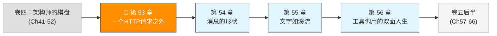
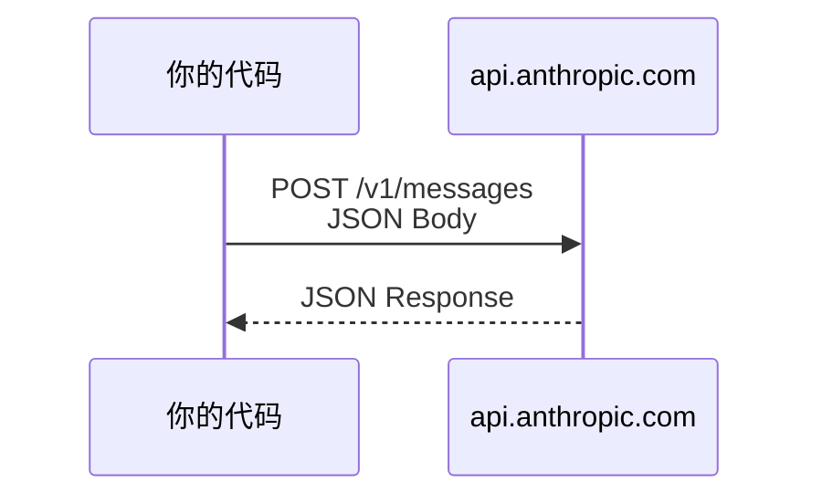
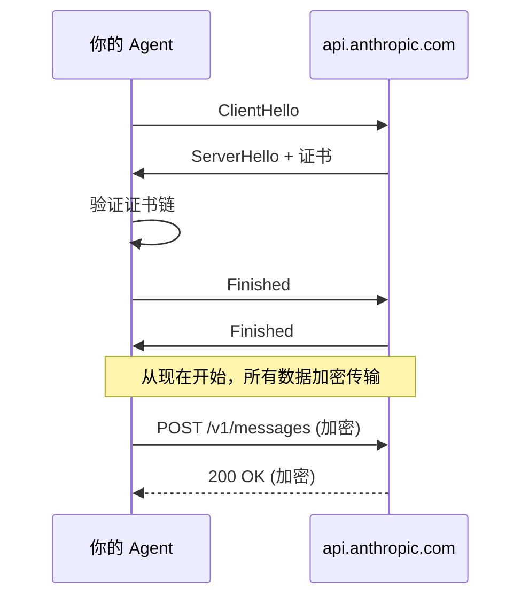

> 卷五协议验证日期：2026-05-17，基于 Anthropic Messages API 最新版（2023-06-01 version header）

你在卷一到卷四里追踪了 Claude Code 的每一层源码。现在，我们换个方向——不从别人的源码出发，而是从零开始，自己实现一套能与 Claude 通信的协议栈。

这一切的起点，是一个 HTTP 请求。

---

## 路线图



---

## 法则一：一切始于 HTTP

Agent 框架再复杂，底层通信只有一件事：把一个 JSON 对象通过 HTTPS 发出去，再把一个 JSON 对象收回来。



没有 WebSocket，没有 gRPC，没有自定义协议。就是 HTTPS + JSON。

---

## 第一步：认证与 Headers

Messages API 需要三个关键 header：

```
POST /v1/messages
x-api-key: sk-ant-api03-xxxxxxxxxxxxx
anthropic-version: 2023-06-01
Content-Type: application/json
```

`anthropic-version` 是 Anthropic 的 API 版本控制机制。你传什么版本，API 就用那个版本的语义处理你的请求。当前稳定版本是 `2023-06-01`。

> **为什么用 header 版本而不是 URL 版本？** 因为 API 的语义变化可能很细微——某个字段的默认值变了、某个错误码的含义调整了。用 header 版本控制，你可以精确锁定 API 的行为，不会被服务端升级意外影响。

---

## 第二步：最小的请求

一个能成功返回的最小 Messages API 请求只有三个必填字段：

```typescript
// → src/my-agent/api-client.ts
const response = await fetch("https://api.anthropic.com/v1/messages", {
  method: "POST",
  headers: {
    "x-api-key": process.env.ANTHROPIC_API_KEY!,
    "anthropic-version": "2023-06-01",
    "content-type": "application/json",
  },
  body: JSON.stringify({
    model: "claude-sonnet-4-6",
    max_tokens: 1024,
    messages: [{ role: "user", content: "你好，Claude。" }],
  }),
});

const data = await response.json();
console.log(data.content[0].text);
```

这就是全部的"协议"——没有 SDK、没有框架、没有依赖。30 行代码。

---

## 第三步：理解响应结构

响应 JSON 的结构非常稳定：

```typescript
// → src/my-agent/types.ts
interface MessageResponse {
  id: string;           // "msg_01XFDUDYJgAACzvnptvVo4EL"
  type: "message";      // 固定值
  role: "assistant";    // 固定值
  model: string;        // 实际使用的模型
  content: ContentBlock[];  // 回复内容（核心）
  stop_reason: "end_turn" | "tool_use" | "max_tokens" | "stop_sequence";
  stop_sequence: string | null;
  usage: {
    input_tokens: number;
    output_tokens: number;
    cache_creation_input_tokens: number;
    cache_read_input_tokens: number;
  };
}
```

核心字段是 `content`——它是一个数组，每个元素有不同的 `type`。最简单的回复只有文本：

```json
{
  "id": "msg_01XxX...",
  "type": "message",
  "role": "assistant",
  "content": [
    { "type": "text", "text": "你好！有什么我可以帮助你的吗？" }
  ],
  "stop_reason": "end_turn",
  "usage": { "input_tokens": 10, "output_tokens": 15 }
}
```

---

## 第四步：封装 API Client

把上面的裸 fetch 封装成一个可复用的 client：

```typescript
// → src/my-agent/api-client.ts
export interface ApiClientConfig {
  apiKey: string;
  baseUrl?: string;  // 默认 https://api.anthropic.com/v1
}

export class ApiClient {
  private baseUrl: string;
  private headers: Record<string, string>;

  constructor(config: ApiClientConfig) {
    this.baseUrl = config.baseUrl ?? "https://api.anthropic.com/v1";
    this.headers = {
      "x-api-key": config.apiKey,
      "anthropic-version": "2023-06-01",
      "content-type": "application/json",
    };
  }

  async createMessage(params: MessageCreateParams): Promise<MessageResponse> {
    const response = await fetch(`${this.baseUrl}/messages`, {
      method: "POST",
      headers: this.headers,
      body: JSON.stringify(params),
    });

    if (!response.ok) {
      const error = await response.json();
      throw new ApiError(response.status, error);
    }

    return response.json();
  }
}
```

---

## 第五步：错误处理

Messages API 用两种方式报告错误：

**HTTP 状态码**：4xx = 你的问题，5xx = 服务端问题。

**错误体格式**：

```json
{
  "type": "error",
  "error": {
    "type": "invalid_request_error",
    "message": "max_tokens: must be greater than thinking budget_tokens"
  }
}
```

常见的错误类型：

| 错误 type | HTTP | 含义 |
|-----------|------|------|
| `invalid_request_error` | 400 | 请求参数不合法 |
| `authentication_error` | 401 | API key 无效 |
| `permission_error` | 403 | 无权使用该模型 |
| `not_found_error` | 404 | 模型不存在 |
| `rate_limit_error` | 429 | 请求太频繁 |
| `api_error` | 500 | 服务端临时故障 |
| `overloaded_error` | 529 | 服务过载，稍后重试 |

**实现**：

```typescript
// → src/my-agent/api-client.ts
export class ApiError extends Error {
  constructor(
    public status: number,
    public body: { error: { type: string; message: string } }
  ) {
    super(`Anthropic API error ${status}: ${body.error.message}`);
  }

  get isRetryable(): boolean {
    return this.status === 429 || this.status === 529 || this.status >= 500;
  }
}
```

---

## 第六步：不只是 POST — HTTP 的隐藏细节

前面 30 行代码已经能跟 Claude 对话了。但那是理想环境——你的笔记本电脑、家里的 Wi-Fi、直接的互联网连接。真实世界要脏得多。

### 6.1 HTTP/2 多路复用

Messages API 默认使用 HTTP/2。HTTP/2 和 HTTP/1.1 之间有一个关键差异：**多路复用（Multiplexing）**。

```
HTTP/1.1:
  连接1 ──→ 请求1 → 响应1 → 请求2 → 响应2
  连接2 ──→ 请求3 → 响应3
  (每个连接同时只能处理一个请求)

HTTP/2:
  连接1 ──→ 请求1 ──→ 响应1
       ──→ 请求2 ──→ 响应2
       ──→ 请求3 ──→ 响应3
  (一个连接同时承载多个请求)
```

对 Agent 框架这意味着什么？当你的 Agent Loop 同时 fork 出 3 个子 Agent，它们都通过同一个 ApiClient 发送请求。HTTP/2 的多路复用让这 3 个请求共享一个 TCP 连接，不会排队等待。

Node.js 的 `fetch()` 原生支持 HTTP/2——你不需要做任何事。服务端在 TLS 握手阶段通过 ALPN（Application-Layer Protocol Negotiation）协商协议，如果服务端支持 HTTP/2，客户端自动升级。

### 6.2 TLS 1.3 握手

每次 API 调用发生之前还有一个 TLS 握手：



TLS 1.3 的握手只需要 1-RTT。加上 TCP 三次握手（1-RTT），整个连接建立约 2-RTT。到 `api.anthropic.com` 的典型 RTT 是 50-150ms（取决于地理位置），所以每次新连接的 TLS 开销约 100-300ms。

当然，这个开销只发生在**新连接**上。Node.js 的 HTTP 客户端维护连接池，后续请求复用现有连接——这就是 HTTP keep-alive 的作用。

### 6.3 企业环境中的自定义 CA 证书

在个人开发环境中，`fetch("https://api.anthropic.com")` 直接能通——你的系统信任 Anthropic 的证书（由公共 CA 签发）。

但在企业网络中，流量可能被企业代理解密和重签。这时 Anthropic 的证书会被替换为企业自签名证书，Node.js 不信任它：

```
UNABLE_TO_VERIFY_LEAF_SIGNATURE
```

解决办法：

```bash
# 告诉 Node.js 信任企业的 CA 证书
export NODE_EXTRA_CA_CERTS=/etc/ssl/certs/corporate-ca.pem
```

在你的 Agent 框架中，应该支持自定义 CA：

```typescript
// → ApiClient 配置中支持自定义 CA
export interface ApiClientConfig {
  apiKey: string
  baseUrl?: string
  ca?: string  // 自定义 CA 证书路径
}

// 在 fetch 时通过 undici agent 传入
import { Agent } from "undici"
import { readFileSync } from "fs"

function createDispatcher(config: ApiClientConfig) {
  if (config.ca) {
    return new Agent({
      connect: { ca: readFileSync(config.ca) }
    })
  }
  return undefined  // 使用默认行为
}
```

### 6.4 企业代理穿透

企业网络环境中，直接出站连接可能被阻断。所有流量必须通过 HTTP 代理：

```
你的 Agent → 企业代理 (proxy.corp.com:8080) → api.anthropic.com
```

Node.js 读取 `HTTP_PROXY` / `HTTPS_PROXY` 环境变量，但 `fetch()` API 不自动使用它们。你需要手动实现代理支持：

```typescript
// → 最简代理支持（使用 undici ProxyAgent）
import { ProxyAgent } from "undici"

function getProxyDispatcher(): ProxyAgent | undefined {
  const proxyUrl = process.env.HTTPS_PROXY || process.env.HTTP_PROXY
  if (!proxyUrl) return undefined
  return new ProxyAgent({ uri: proxyUrl })
}

const response = await fetch(url, {
  method: "POST",
  headers,
  body,
  dispatcher: getProxyDispatcher(),  // 经过代理发送
})
```

**NO_PROXY 规则**：某些地址应该绕过代理。常见规则包括 `localhost`、`127.0.0.1`、内部域名。`NO_PROXY` 环境变量用逗号分隔域名列表。在你的 Agent 框架中，应该尊重这个约定：

```typescript
function shouldBypassProxy(host: string): boolean {
  const noProxy = process.env.NO_PROXY?.split(",").map(s => s.trim()) ?? []
  return noProxy.some(pattern =>
    host === pattern || host.endsWith("." + pattern)
  )
}
```

---

## 第七步：当网络不可靠 — 重试与韧性

`fetch()` 不是 100% 可靠的。网络抖动、服务过载、临时的 DNS 故障都会让请求失败。Agent 框架必须处理这些。

### 7.1 哪些错误值得重试

重试决策的第一原则：**只重试那些可能在下一次成功的错误**。

| HTTP 状态码 | 含义 | 重试？ | 原因 |
|------------|------|--------|------|
| 429 | 速率限制 | ✓ 重试 | 等一段时间后配额恢复 |
| 529 | 服务过载 | ✓ 重试 | 过载是暂时的 |
| 500/502/503 | 服务端错误 | ✓ 重试 | 可能是暂时故障 |
| 400 | 参数错误 | ✗ 不重试 | 重试不会改变结果 |
| 401/403 | 认证/权限 | ✗ 不重试 | 凭据不会自动变有效 |
| 404 | 模型不存在 | ✗ 不重试 | 模型名不会自动变对 |

### 7.2 指数退避

重试不是立即重试——如果服务端正在过载，立即重试只会加剧问题。正确做法是**指数退避**：

```typescript
// → 带指数退避的 fetch
async function fetchWithRetry(
  url: string,
  options: RequestInit,
  retries = 3,
): Promise<Response> {
  for (let attempt = 0; attempt <= retries; attempt++) {
    try {
      const response = await fetch(url, options)

      if ((response.status === 429 || response.status >= 500) && attempt < retries) {
        const delay = Math.min(1000 * Math.pow(2, attempt), 30000)
        await sleep(delay + Math.random() * 1000) // + jitter 防惊群
        continue
      }

      return response
    } catch (err) {
      if (attempt === retries) throw err
      const delay = Math.min(1000 * Math.pow(2, attempt), 30000)
      await sleep(delay + Math.random() * 1000)
    }
  }

  throw new Error("unreachable")
}

function sleep(ms: number): Promise<void> {
  return new Promise(resolve => setTimeout(resolve, ms))
}
```

三个关键设计：
- **指数因子 2**：1s → 2s → 4s → 8s → ... → 封顶 30s
- **Jitter**：每次等待时间加 `Math.random() * 1000`（0-1秒随机值），防止多个 Agent 实例同时重试
- **最大等待**：不无限增加，封顶 30 秒

### 7.3 速率限制与令牌桶

Anthropic API 有速率限制。429 响应头的 `Retry-After` 字段告诉你需要等多久。但更好的方式是自己管理速率——**通过令牌桶**：

```typescript
// → 令牌桶速率限制器
class TokenBucket {
  private tokens: number
  private lastRefill: number

  constructor(
    private maxTokens: number,    // 桶容量
    private refillRate: number,   // 每秒补充的 token 数
  ) {
    this.tokens = maxTokens
    this.lastRefill = Date.now()
  }

  async acquire(tokens = 1): Promise<void> {
    this.refill()

    if (this.tokens >= tokens) {
      this.tokens -= tokens
      return
    }

    // 计算需要等待多少秒
    const deficit = tokens - this.tokens
    const waitMs = (deficit / this.refillRate) * 1000 + 50
    await sleep(waitMs)

    this.refill()
    this.tokens -= tokens
  }

  private refill(): void {
    const now = Date.now()
    const elapsed = (now - this.lastRefill) / 1000
    this.tokens = Math.min(this.maxTokens, this.tokens + elapsed * this.refillRate)
    this.lastRefill = now
  }
}

// 使用：每分钟最多 50 次请求
const limiter = new TokenBucket(50, 50 / 60)
await limiter.acquire(1)
```

### 7.4 连接池与 DNS 行为

Node.js 的 `fetch()` 底层使用 undici HTTP 客户端，它维护一个连接池。默认行为：

- 每个 origin（如 `api.anthropic.com`）最多保持 8 个并行连接
- 空闲连接在 15 秒后关闭
- DNS 结果缓存至 TTL 过期

在大部分 Agent 场景中这些默认值够用。但如果你的框架并发 fork 了 20 个子 Agent，可能需要调大连接池：

```typescript
import { Agent, setGlobalDispatcher } from "undici"

setGlobalDispatcher(new Agent({
  connections: 16,               // 每个 origin 最多 16 个连接
  keepAliveTimeout: 30_000,      // 空闲连接保持 30 秒
}))
```

---

## 封装：升级版 ApiClient

将网络韧性整合进 ApiClient：

```typescript
// → src/my-agent/api-client.ts (升级版)
export class ApiClient {
  private rateLimiter: TokenBucket
  private dispatcher: ProxyAgent | undefined

  constructor(config: ApiClientConfig) {
    this.baseUrl = config.baseUrl ?? "https://api.anthropic.com/v1"
    this.headers = { /* 同上 */ }
    this.rateLimiter = new TokenBucket(
      config.rpm ?? 50,
      (config.rpm ?? 50) / 60,
    )
    this.dispatcher = getProxyDispatcher()  // 仅在代理环境创建
  }

  async createMessage(params: MessageCreateParams): Promise<MessageResponse> {
    await this.rateLimiter.acquire(1)  // 控速

    const response = await fetchWithRetry(
      `${this.baseUrl}/messages`,
      {
        method: "POST",
        headers: this.headers,
        body: JSON.stringify(params),
        dispatcher: this.dispatcher,
      },
      3  // 最多重试 3 次
    )

    if (!response.ok) {
      const error = await response.json()
      throw new ApiError(response.status, error)
    }

    return response.json()
  }
}
```

---

## 第八步：当 API 不可用 — 本地模型与 Ollama

你的 Agent 框架默认调用 Anthropic API。但在以下场景中你需要备选方案：

- 离线环境（无互联网连接）
- 敏感数据不能离开本地
- API 费用太高，简单任务想用免费模型
- Anthropic API 宕机时的降级

**Ollama** 是运行本地模型最简单的方式。它提供与 OpenAI 兼容的 HTTP API。

### 安装和启动

```bash
# 安装 Ollama
curl -fsSL https://ollama.com/install.sh | sh

# 拉取模型
ollama pull llama3.2        # 3B 参数，轻量
ollama pull qwen2.5-coder   # 代码特化，中文好
ollama pull mistral          # 通用，7B

# 启动服务（默认 localhost:11434）
ollama serve
```

### 适配 ApiClient

Ollama 的 API 与 OpenAI 兼容，但 Messages API 略有不同。你需要一个适配层：

```typescript
// → src/my-agent/providers/ollama.ts
interface OllamaConfig {
  baseUrl: string  // "http://localhost:11434"
  model: string    // "qwen2.5-coder:latest"
}

class OllamaClient {
  constructor(private config: OllamaConfig) {}

  async createMessage(params: MessageCreateParams): Promise<MessageResponse> {
    // Ollama 的 API 格式与 Anthropic 不同，需要转换
    const ollamaBody = {
      model: this.config.model,
      messages: this.convertMessages(params.messages),
      stream: false,
      options: {
        temperature: params.temperature ?? 0.3,
        num_predict: params.max_tokens,
      },
    }

    const response = await fetch(`${this.config.baseUrl}/api/chat`, {
      method: "POST",
      body: JSON.stringify(ollamaBody),
    })

    const data = await response.json()
    return this.convertResponse(data)
  }

  private convertMessages(messages: MessageParam[]): Array<{ role: string; content: string }> {
    return messages.map(m => ({
      role: m.role,
      content: typeof m.content === "string" ? m.content : JSON.stringify(m.content),
    }))
  }

  private convertResponse(data: any): MessageResponse {
    return {
      id: data.id ?? `local-${Date.now()}`,
      type: "message",
      role: "assistant",
      model: this.config.model,
      content: [{ type: "text", text: data.message?.content ?? "" }],
      stop_reason: "end_turn",
      stop_sequence: null,
      usage: {
        input_tokens: data.prompt_eval_count ?? 0,
        output_tokens: data.eval_count ?? 0,
        cache_creation_input_tokens: 0,
        cache_read_input_tokens: 0,
      },
    }
  }
}
```

### 多供应商抽象

ApiClient 和 OllamaClient 都是 HTTP 调用，但 API 格式不同。把它们统一到同一个接口下：

```typescript
// → src/my-agent/provider-interface.ts
interface LLMProvider {
  createMessage(params: MessageCreateParams): Promise<MessageResponse>
  createMessageStream(params: MessageCreateParams): AsyncGenerator<SSEEvent>
  supportsFeature(feature: string): boolean  // thinking? caching? tools?
}

class ProviderRouter {
  private providers = new Map<string, LLMProvider>()

  register(name: string, provider: LLMProvider): void {
    this.providers.set(name, provider)
  }

  get(modelId: string): LLMProvider {
    // 按模型名路由
    if (modelId.startsWith("claude-")) return this.providers.get("anthropic")!
    if (modelId.startsWith("gpt-")) return this.providers.get("openai")!
    // 本地模型
    return this.providers.get("local")!
  }

  // 自动降级：API 不可用时切换到本地
  async getWithFallback(preferredModel: string): Promise<LLMProvider> {
    try {
      const provider = this.get(preferredModel)
      await provider.createMessage({
        model: preferredModel,
        max_tokens: 0,
        messages: [{ role: "user", content: "ping" }],
      })
      return provider  // 首选可用
    } catch {
      console.warn(`${preferredModel} 不可用，降级到本地模型`)
      return this.providers.get("local")!
    }
  }
}
```

### 本地模型的局限

| 维度 | 云端 (Claude/GPT) | 本地 (Ollama) |
|------|------------------|---------------|
| 工具调用 | 原生稳定 | 不稳定，可能生成畸形的 JSON |
| Context Window | 200K tokens | 通常 4K-8K，少数 32K |
| 推理质量 | 高 | 小模型明显弱 |
| 延迟 | 取决于网络 | 取决于 GPU/CPU |
| 成本 | 按 token 计费 | 免费（除了电费） |
| 隐私 | 数据离开本地 | 数据完全本地 |

**本地模型适合**：简单分类、格式转换、语法修正、轻量代码生成。

**本地模型不适合**：多文件重构、安全审查、复杂推理、需要工具调用的场景。

---

## 试试看

**任务 1**：用上面的 `ApiClient` 发一条消息，打印 `response.content[0].text`。

**任务 2**：故意把 `max_tokens` 设为 0（不传其他参数），观察错误信息的结构。

**任务 3**：发一条带 system prompt 的消息：
```typescript
await client.createMessage({
  model: "claude-sonnet-4-6",
  max_tokens: 1024,
  system: "你是一个只用文言文回答的助手。",
  messages: [{ role: "user", content: "今天天气如何？" }],
});
```
观察 system prompt 如何影响回答风格。

**任务 4**：用 Ollama 在本地跑一个模型，实现 `OllamaClient`，发一条消息验证。

**任务 5**：实现 `ProviderRouter`，注册 Anthropic 和 Ollama 两个 provider，测试自动降级。

---

## 常见错误

| 现象 | 原因 | 解法 |
|------|------|------|
| `401 authentication_error` | API key 未设置或错误 | 检查 `ANTHROPIC_API_KEY` 环境变量 |
| `400 invalid_request_error: "messages: required"` | 忘了传 `messages` | 检查 body 结构 |
| `404 not_found_error` | 模型名拼写错误 | 对照[模型列表](https://docs.anthropic.com/en/docs/about-claude/models) |
| 响应为空 | `max_tokens` 设为 0 | `max_tokens: 0` 是缓存预热模式，不返回内容 |
| `529 overloaded_error` | 服务过载 | 等几秒后重试，实现指数退避 |
| `ECONNREFUSED` | 直接出站被阻断 | `curl -v https://api.anthropic.com` 检查；可能需要配置代理 |
| `ETIMEDOUT` | 代理地址错误 | `echo $HTTPS_PROXY` 确认代理 URL 格式正确 |
| `UNABLE_TO_VERIFY_LEAF_SIGNATURE` | 企业代理做 TLS 拦截 | 设置 `NODE_EXTRA_CA_CERTS` 指向企业 CA 证书 |

---

## 检查点

- [ ] 理解了 Messages API 是纯 HTTPS + JSON 协议
- [ ] 能从头实现一个最小 API Client（不依赖 SDK）
- [ ] 理解了 `anthropic-version` header 的版本控制机制
- [ ] 能区分六种错误类型并实现重试判断
- [ ] 知道 `content` 是数组结构（不是纯字符串）
- [ ] 理解 HTTP/2 多路复用对并发 Agent 请求的意义
- [ ] 能配置 TLS 自定义 CA 和 HTTP 代理穿透
- [ ] 能实现指数退避重试和令牌桶速率限制
- [ ] 理解 TLS 握手的开销（~1-RTT）和连接池的默认行为
- [ ] 能用 Ollama 在本地运行模型，实现适配 Client
- [ ] 能设计多供应商抽象（ProviderRouter），支持自动降级
- [ ] 理解本地模型的四大局限和适用场景

---

[← 上一章：第 52.5 章 Token 经济学](/posts/50285c92/) | [下一章：第 54 章 消息的形状 →](/posts/562862ed/)
