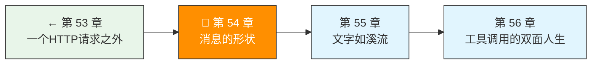

> 卷五协议验证日期：2026-05-17，基于 Anthropic Messages API Content Blocks 规范

上一章的 `content: "你好"` 是一个便利简写。真正的消息是一个**多态的内容块数组**。这一章我们为它建立完整的类型系统。

---

## 路线图



---

## 法则二：消息不是字符串，是类型系统

```typescript
// 这是简写（语法糖）
{ role: "user", content: "你好" }

// 这等价于
{ role: "user", content: [{ type: "text", text: "你好" }] }
```

当你想发图片、文档、或者回传工具结果时，就必须用 `content` 数组。

---

## Content Block 完整类型

Messages API 定义了 14 种 content block 类型。按用途分三大类：

### 输入型（你发给模型的）

| type | 用途 | 核心字段 |
|------|------|---------|
| `text` | 纯文本 | `text: string` |
| `image` | 图片 | `source: { type, media_type, data }` |
| `document` | PDF/文档 | `source: { type, media_type, data }` |
| `tool_result` | 工具执行结果 | `tool_use_id, content` |

### 输出型（模型返回的）

| type | 用途 | 核心字段 |
|------|------|---------|
| `text` | 文本回复 | `text: string` |
| `tool_use` | 工具调用请求 | `id, name, input` |
| `thinking` | 扩展思考过程 | `thinking, signature` |
| `redacted_thinking` | 被隐藏的思考 | `data` |

### 服务端工具专用

| type | 用途 |
|------|------|
| `server_tool_use` | 服务端工具调用（web_search 等） |
| `web_search_tool_result` | 搜索结果 |
| `web_fetch_tool_result` | 网页抓取结果 |
| `code_execution_tool_result` | 代码执行结果 |
| `search_result` | 外部搜索结果 |
| `container_upload` | 容器文件上传 |

---

## Text Block — 最基础的类型

```typescript
// → src/my-agent/content-blocks.ts
interface TextBlock {
  type: "text";
  text: string;
  cache_control?: CacheControl;  // 可选缓存标记
  citations?: Citation[];        // 引用标注（模型输出）
}
```

`citations` 是模型输出的"来源引用"——当 Claude 引用了你提供的文档或搜索结果时，引用信息会出现在这里。

---

## Image Block — 多模态的关键

```typescript
// → src/my-agent/content-blocks.ts
interface ImageBlock {
  type: "image";
  source: {
    type: "base64";
    media_type: "image/jpeg" | "image/png" | "image/gif" | "image/webp";
    data: string;  // base64 编码
  };
}
```

支持四种图片格式。5MB 上限（base64 编码后约 6.7MB）。

**实现图片编码**：

```typescript
// → src/my-agent/image-utils.ts
export async function imageToBlock(
  filePath: string,
  mediaType: "image/png" | "image/jpeg"
): Promise<ImageBlock> {
  const buffer = await readFile(filePath);
  const base64 = buffer.toString("base64");
  return {
    type: "image",
    source: { type: "base64", media_type: mediaType, data: base64 },
  };
}
```

---

## Document Block — PDF 和文本文件

```typescript
// → src/my-agent/content-blocks.ts
interface DocumentBlock {
  type: "document";
  source: {
    type: "base64" | "text" | "content" | "url";
    media_type: "application/pdf" | "text/plain";
    data: string;
  };
  title?: string;
  context?: string;        // 文档的上下文说明
  citations?: { enabled: boolean };  // 是否启用引用
}
```

- PDF 最大 32MB（base64 前）
- 纯文本最大 5MB
- `source.type: "url"` 可以直接传 PDF URL

---

## Tool Use Block — 模型说"我要做事"

```typescript
// → src/my-agent/content-blocks.ts
// 模型请求调用工具（输出）
interface ToolUseBlock {
  type: "tool_use";
  id: string;       // 如 "toolu_01D7FLrfh4GYq7yT1ULFeyMV"
  name: string;     // 工具名
  input: object;    // 工具参数（JSON object）
}

// 你回传工具执行结果（输入）
interface ToolResultBlock {
  type: "tool_result";
  tool_use_id: string;  // 对应 ToolUseBlock 的 id
  content: string | ContentBlock[];  // 结果内容
  is_error?: boolean;   // 标记执行失败
}
```

---

## MessageBuilder — 类型安全的构造器

把所有类型整合进一个 builder：

```typescript
// → src/my-agent/message-builder.ts
import type { ContentBlock, MessageParam } from "./content-blocks";

export class MessageBuilder {
  private messages: MessageParam[] = [];

  user(content: string | ContentBlock[]): this {
    this.messages.push({
      role: "user",
      content: typeof content === "string"
        ? content
        : content,
    });
    return this;
  }

  userText(text: string): this {
    return this.user([{ type: "text", text }]);
  }

  userImage(filePath: string, mediaType: "image/png" | "image/jpeg"): this {
    const block = imageToBlock(filePath, mediaType);
    return this.user([block]);
  }

  toolResult(toolUseId: string, result: string, isError = false): this {
    return this.user([{
      type: "tool_result",
      tool_use_id: toolUseId,
      content: result,
      is_error: isError,
    }]);
  }

  build(): MessageParam[] {
    // 验证 user/assistant 交替规则
    this.validateAlternation();
    return this.messages;
  }

  private validateAlternation(): void {
    for (let i = 1; i < this.messages.length; i++) {
      if (this.messages[i].role === this.messages[i - 1].role) {
        console.warn(
          `连续两条 ${this.messages[i].role} 消息，API 会自动合并`
        );
      }
    }
  }
}
```

---

## 对话历史管理

Messages API 的对话是**无状态**的——每次请求你必须传完整的对话历史：

```typescript
// → src/my-agent/conversation.ts
export class Conversation {
  private messages: MessageParam[] = [];
  private systemPrompt?: string;

  setSystem(prompt: string): void {
    this.systemPrompt = prompt;
  }

  addUser(text: string): void {
    this.messages.push({ role: "user", content: text });
  }

  addAssistant(response: MessageResponse): void {
    this.messages.push({
      role: "assistant",
      content: response.content,
    });
  }

  addToolResult(toolUseId: string, result: string): void {
    this.messages.push({
      role: "user",
      content: [{ type: "tool_result", tool_use_id: toolUseId, content: result }],
    });
  }

  toApiParams(model: string, maxTokens: number) {
    return {
      model,
      max_tokens: maxTokens,
      system: this.systemPrompt,
      messages: this.messages,
    };
  }
}
```

---

## 试试看

**任务 1**：发送一条同时包含文本和图片的消息，让 Claude 描述图片内容。

**任务 2**：验证 user/assistant 交替规则——故意发两条连续 user 消息，看 API 是否接受。

**任务 3**：实现 `MessageBuilder.userDocument(filePath, mediaType)` 方法，发送一个 PDF 并让 Claude 总结。

---

## 常见错误

| 现象 | 原因 | 解法 |
|------|------|------|
| 图片太大 | 超过 5MB 限制 | 压缩图片或使用更低分辨率 |
| base64 格式错误 | 包含了 `data:image/png;base64,` 前缀 | 只传纯 base64 数据 |
| `tool_use_id` 不匹配 | tool_result 引用了不存在的 tool_use | 确保 `id` 精确对应 |
| 对话历史混乱 | 中间漏传了一条 | 每次请求带上完整历史 |

---

## 检查点

- [ ] 理解了 Content Block 是多态类型（14 种 type）
- [ ] 能区分输入型和输出型 content block
- [ ] 实现了 MessageBuilder 和 Conversation 类
- [ ] 理解了 user/assistant 交替规则
- [ ] 能发送包含图片和文档的多模态请求

---

[← 上一章：第 53 章 一个HTTP请求之外](/posts/ec951c22/) | [下一章：第 55 章 文字如溪流 →](/posts/f32444d4/)
