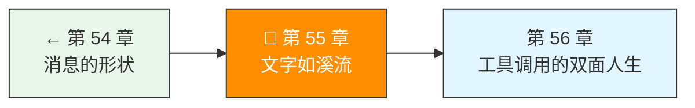
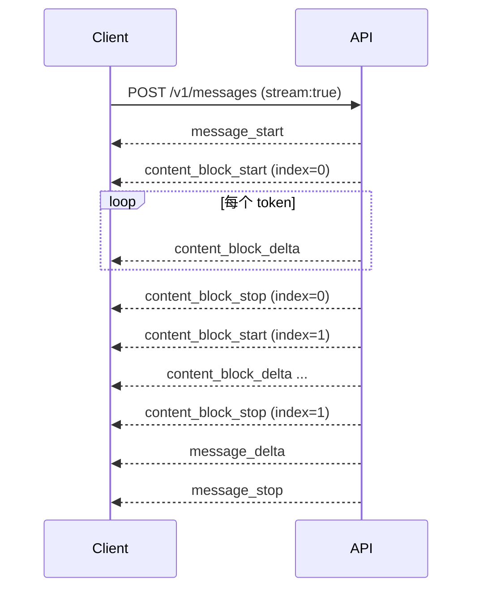

> 卷五协议验证日期：2026-05-17，基于 Anthropic SSE Streaming 规范

非流式响应像发邮件——全部写完再发。流式响应像打电话——一边想一边说。对 Agent 来说，流式不仅仅是体验问题：它让 Agent 能实时响应用户中断，也是工具调用的基础。

---

## 路线图



---

## 法则三：流是默认，不是可选

只需在请求里加 `stream: true`，响应就从 JSON 变成 SSE 事件流：

```bash
curl https://api.anthropic.com/v1/messages \
  -H "x-api-key: $ANTHROPIC_API_KEY" \
  -H "anthropic-version: 2023-06-01" \
  -H "content-type: application/json" \
  -d '{
    "model": "claude-sonnet-4-6",
    "max_tokens": 1024,
    "stream": true,
    "messages": [{"role": "user", "content": "讲个笑话"}]
  }'
```

响应不再是 JSON 对象，而是一个 `text/event-stream`：

```
event: message_start
data: {"type":"message_start","message":{"id":"msg_...","type":"message","role":"assistant","model":"claude-sonnet-4-6","usage":{"input_tokens":10}}}

event: content_block_start
data: {"type":"content_block_start","index":0,"content_block":{"type":"text","text":""}}

event: content_block_delta
data: {"type":"content_block_delta","index":0,"delta":{"type":"text_delta","text":"为什么"}}

event: content_block_delta
data: {"type":"content_block_delta","index":0,"delta":{"type":"text_delta","text":"程序员"}}

event: content_block_delta
data: {"type":"content_block_delta","index":0,"delta":{"type":"text_delta","text":"分不清"}}
...
```

---

## SSE 事件类型完整规范

流式传输共有 7 种事件，按生命周期排列：



| 事件 | 含义 | 关键数据 | 次数 |
|------|------|---------|------|
| `message_start` | 消息开始 | `message.id, message.model` | 1 |
| `content_block_start` | 内容块开始 | `index, content_block.type` | 每块 1 |
| `content_block_delta` | 增量数据 | `index, delta.type, delta.text/thinking/partial_json` | 每块 N |
| `content_block_stop` | 内容块结束 | `index` | 每块 1 |
| `message_delta` | 消息元数据更新 | `delta.stop_reason, usage.output_tokens` | 1 |
| `message_stop` | 消息结束 | — | 1 |
| `ping` | 保活 | — | 任意 |

---

## Delta 子类型

`content_block_delta` 的 `delta.type` 有三种：

| delta.type | 对应 content block | 含义 |
|-----------|-------------------|------|
| `text_delta` | `text` | 文本增量 |
| `thinking_delta` | `thinking` | 思考文本增量 |
| `input_json_delta` | `tool_use` | 工具参数 JSON 增量 |
| `signature_delta` | `thinking` | 思考签名增量 |

---

## 实现 SSE 解析器

SSE 格式很简单：`event:` + `data:` + 空行分隔。

```typescript
// → src/my-agent/sse-parser.ts
export interface SSEEvent {
  event: string;
  data: string;
}

export function parseSSE(chunk: string): SSEEvent[] {
  const events: SSEEvent[] = [];
  const lines = chunk.split("\\n");

  let currentEvent = "";
  let currentData = "";

  for (const line of lines) {
    if (line.startsWith("event: ")) {
      currentEvent = line.slice(7);
    } else if (line.startsWith("data: ")) {
      currentData = line.slice(6);
    } else if (line === "" && currentData) {
      events.push({ event: currentEvent || "message", data: currentData });
      currentEvent = "";
      currentData = "";
    }
  }

  return events;
}
```

---

## 实现 StreamParser（AsyncGenerator）

SSE 解析器上面一层是需求驱动的流解析器。核心思想：把 HTTP Response body 的 `ReadableStream` 包装成异步可迭代器。

```typescript
// → src/my-agent/stream-parser.ts
export type StreamEvent =
  | { type: "message_start"; message: MessageStartData }
  | { type: "content_block_start"; index: number; block: ContentBlockStart }
  | { type: "content_block_delta"; index: number; delta: Delta }
  | { type: "content_block_stop"; index: number }
  | { type: "message_delta"; delta: MessageDeltaData }
  | { type: "message_stop" }
  | { type: "error"; error: Error };

export async function* parseStream(
  response: Response
): AsyncGenerator<StreamEvent> {
  if (!response.ok) {
    throw new ApiError(response.status, await response.json());
  }

  const reader = response.body!.getReader();
  const decoder = new TextDecoder();
  let buffer = "";

  try {
    while (true) {
      const { done, value } = await reader.read();
      if (done) break;

      buffer += decoder.decode(value, { stream: true });
      const events = parseSSEBuffer(buffer);

      for (const sse of events) {
        const json = JSON.parse(sse.data);
        switch (sse.event) {
          case "message_start":
            yield { type: "message_start", message: json.message };
            break;
          case "content_block_start":
            yield {
              type: "content_block_start",
              index: json.index,
              block: json.content_block,
            };
            break;
          case "content_block_delta":
            yield {
              type: "content_block_delta",
              index: json.index,
              delta: json.delta,
            };
            break;
          case "content_block_stop":
            yield { type: "content_block_stop", index: json.index };
            break;
          case "message_delta":
            yield { type: "message_delta", delta: json.delta };
            break;
          case "message_stop":
            yield { type: "message_stop" };
            break;
        }
      }

      // 更新 buffer（去掉已消费的部分）
      buffer = getRemainingBuffer(buffer);
    }
  } finally {
    reader.releaseLock();
  }
}
```

---

## 实战：实时渲染文本

```typescript
// → src/my-agent/stream-example.ts
async function streamText(client: ApiClient, prompt: string) {
  const response = await client.createMessageStream({
    model: "claude-sonnet-4-6",
    max_tokens: 1024,
    messages: [{ role: "user", content: prompt }],
  });

  let textBuffer = "";
  for await (const event of parseStream(response)) {
    if (
      event.type === "content_block_delta" &&
      event.delta.type === "text_delta"
    ) {
      process.stdout.write(event.delta.text);  // 即时输出
      textBuffer += event.delta.text;
    }
  }
  return textBuffer;
}
```

---

## 工具调用的流式处理

当模型决定调用工具时，流里会有特殊的 delta 类型：

```
event: content_block_start
data: {"type":"content_block_start","index":1,"content_block":{"type":"tool_use","id":"toolu_01...","name":"get_weather"}}

event: content_block_delta
data: {"type":"content_block_delta","index":1,"delta":{"type":"input_json_delta","partial_json":"{\\"city\\":"}}

event: content_block_delta
data: {"type":"content_block_delta","index":1,"delta":{"type":"input_json_delta","partial_json":"\\"北京\\"}"}}
```

**工具参数的累积**：

```typescript
// → src/my-agent/tool-call-parser.ts
export function accumulateToolCall(
  deltas: { type: "input_json_delta"; partial_json: string }[]
): object {
  const json = deltas.map(d => d.partial_json).join("");
  return JSON.parse(json);
}
```

`input_json_delta` 不会一次性返回完整 JSON——它是一块一块地来，你需要积累所有的 `partial_json` 再解析。

---

## 当溪流比处理快 — Backpressure 与断线恢复

SSE 流式传输中，模型可能以 100+ token/s 的速度产出。大部分时候，你的代码处理速度比这个快——写文本到终端、累积 JSON 字符串——不存在瓶颈。但在两种场景下，流比处理快：

1. **工具执行延迟**：流提前到达工具调用，但工具本身需要 5 秒执行
2. **Batch 预取**：你并行发了多个 API 请求，同时有多个流在消费

### AsyncGenerator 的天然 Backpressure

好消息是：AsyncGenerator 自动提供了 Backpressure。`for await...of` 在每次 `yield` 之后暂停，直到消费者处理完当前值：

```typescript
// → AsyncGenerator 的自动 Backpressure
async function* fastProducer(): AsyncGenerator<string> {
  for (let i = 0; i < 100; i++) {
    yield `event-${i}`  // 每次 yield 后暂停，直到消费者 ready
  }
}

// 慢消费者
for await (const event of fastProducer()) {
  await sleep(100)  // 模拟慢处理
  console.log(event)
}
// 不会丢失任何事件。生产者自动等待。
```

在 StreamParser 中，这个机制天然生效——你 `yield` 每个 delta，消费者（Agent Loop）处理完当前 delta 后，流才继续读取下一块。

### 手动 Backpressure 控制

如果你需要在消费中主动暂停流（比如等待用户确认），手动实现：

```typescript
// → 带手动暂停的流消费者
class PausableStream<T> {
  private paused = false
  private pending: T[] = []

  pause(): void {
    this.paused = true
  }

  resume(): T[] {
    this.paused = false
    const drained = [...this.pending]
    this.pending = []
    return drained
  }

  async *consume(source: AsyncGenerator<T>): AsyncGenerator<T> {
    for await (const item of source) {
      if (this.paused) {
        this.pending.push(item)  // 缓存，不传递给下游
        continue
      }

      // 先排空缓存
      while (this.pending.length > 0) {
        yield this.pending.shift()!
      }

      yield item
    }
  }
}
```

### SSE 断线重连

SSE 连接断开后，不能从中间恢复——你收到的最后一个 delta 之后的內容已经丢失了。这是 SSE 协议本身的局限。

但浏览器的 `EventSource` API 有内置的自动重连——它使用 `Last-Event-Id` header：

```
// 服务端发：
id: 42
data: some event

// 客户端重连时发：
GET /stream
Last-Event-Id: 42
```

Messages API 不支持 `Last-Event-Id`（它不是标准的浏览器 SSE）。所以断线后的唯一恢复方式是**重新发送整个请求**：

```typescript
// → SSE 断线处理策略
async function* resilientStream(
  params: MessageCreateParams,
  client: ApiClient,
  retries = 2,
): AsyncGenerator<SSEEvent> {
  for (let attempt = 0; attempt <= retries; attempt++) {
    try {
      const stream = await client.createMessageStream(params)
      for await (const event of stream) {
        yield event
      }
      return  // 成功完成
    } catch (err) {
      if (attempt === retries) throw err

      if (err instanceof NetworkError) {
        const delay = Math.min(1000 * Math.pow(2, attempt), 10000)
        console.warn(`SSE 断线，${delay}ms 后重试 (${attempt + 1}/${retries})`)
        await sleep(delay)
        // 重新发送请求——流会从头开始
        continue
      }

      throw err  // 非网络错误，不重试
    }
  }
}
```

**警告**：重发请求意味着模型会从头生成一遍。第一遍生成的文字和第二遍的可能不同（temperature > 0 时）。对于 Agent 来说这通常可以接受——最终结果比中间过程重要。

### 流内错误边界

当 `input_json_delta` 的累积 JSON 不完整时怎么办？

```typescript
// → 流内错误容忍策略
function safeAccumulateAndParse(
  deltas: { partial_json: string }[],
): object | null {
  const json = deltas.map(d => d.partial_json).join("")

  try {
    return JSON.parse(json)
  } catch {
    // 策略 1：部分修复（简单场景）
    // 尝试加闭合括号
    const fixed = autoCloseBrackets(json)
    if (fixed) {
      try { return JSON.parse(fixed) } catch {}
    }

    // 策略 2：放弃本工具调用，返回错误
    console.error(`无法解析累积的 tool_use input: ${json.substring(0, 200)}`)
    return null
  }
}

function autoCloseBrackets(json: string): string | null {
  const opens = (json.match(/[{[]/g) || []).length
  const closes = (json.match(/[}\]]/g) || []).length
  if (opens === closes) return null  // 不是括号不匹配

  // 补齐缺失的闭合符号
  let fixed = json
  let depth = 0
  for (const ch of json) {
    if (ch === '{' || ch === '[') depth++
    if (ch === '}' || ch === ']') depth--
  }
  while (depth > 0) {
    fixed += (json.includes('{') && depth === 1) ? '}' : ']'
    depth--
  }
  return fixed
}
```

**但不要过度投入修复逻辑**。大部分情况下，如果 JSON 真的坏了，是模型输出的问题，不是你的解析器的问题。简单重试整个请求通常比修 JSON 更可靠。

---

## 试试看

**任务 1**：实现一个计时器——统计从发出请求到收到第一个 `text_delta` 的延迟（TTFT: Time To First Token）。

**任务 2**：在流中故意断开网络（Ctrl+C），实现断线重连。注意：流不支持从中间恢复，需要重新发送完整请求。

**任务 3**：实现进度提示——当超过 3 秒没有新 delta 时，显示"思考中…"。

**任务 4**：实现带 Backpressure 的流消费者——当 pause() 被调用时，后续 delta 被缓存，resume() 时按序输出。

---

## 常见错误

| 现象 | 原因 | 解法 |
|------|------|------|
| `parseSSE` 丢事件 | 数据跨 chunk 边界 | 用 buffer 累积，按换行切割后保留尾部 |
| JSON parse 失败 | `input_json_delta` 拼接的 JSON 不完整 | 只在 `content_block_stop` 后解析 |
| 内存泄漏 | 流未释放 | `finally` 中 `reader.releaseLock()` |
| 连接中断后数据不全 | SSE 不支持断点续传 | 重发完整请求；Agent 场景中重新执行完整 turn |
| 流消费慢导致积压 | 消费者处理速度 < 生产者 | AsyncGenerator 自动 Backpressure；手动实现 PausableStream |
| `input_json_delta` 累积 JSON 不完整 | 流中间截断或模型输出异常 | 尝试补齐闭合括号；失败则重试请求 |
| 断线重连后内容不一致 | temperature > 0 导致重生成不同 | Agent 场景可接受；对结果做幂等检查 |

---

## 检查点

- [ ] 理解了 SSE 协议的 7 种事件类型
- [ ] 实现了 SSE 解析器和 StreamParser（AsyncGenerator）
- [ ] 理解了三种 delta 子类型（text/thinking/input_json）
- [ ] 能实时渲染流式文本
- [ ] 能累积 `input_json_delta` 解析工具调用参数
- [ ] 理解 AsyncGenerator 的天然 Backpressure 机制
- [ ] 能实现带暂停/恢复的流消费者
- [ ] 知道 SSE 断线后只能重发请求，无法从中间恢复
- [ ] 能处理流内 JSON 解析错误的容错策略

---

[← 上一章：第 54 章 消息的形状](/posts/562862ed/) | [下一章：第 56 章 工具调用的双面人生 →](/posts/6290407d/)
