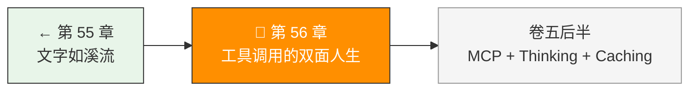
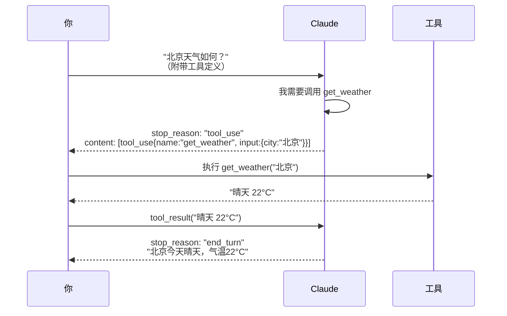

> 卷五协议验证日期：2026-05-17，基于 Anthropic Tool Use / Function Calling 规范

LLM 本质只能输出文字。工具调用让它能说"我要做这件事"。这不是魔法——只是一种特殊的 content block 配合特定的对话模式。

---

## 路线图



---

## 法则四：工具调用就是另一个消息类型

一个完整的工具调用有四步：



---

## 第一步：定义工具

工具定义使用 JSON Schema 描述参数：

```typescript
// → src/my-agent/tools.ts
export interface ToolDefinition {
  name: string;
  description: string;
  input_schema: {
    type: "object";
    properties: Record<string, {
      type: string;
      description: string;
      enum?: string[];
    }>;
    required: string[];
  };
}

export const weatherTool: ToolDefinition = {
  name: "get_weather",
  description: "获取指定城市的当前天气",
  input_schema: {
    type: "object",
    properties: {
      city: {
        type: "string",
        description: "城市名，如 北京、上海",
      },
    },
    required: ["city"],
  },
};
```

---

## 第二步：发送带工具的请求

工具定义放在顶层的 `tools` 数组里：

```typescript
// → src/my-agent/tool-client.ts
const response = await client.createMessage({
  model: "claude-sonnet-4-6",
  max_tokens: 1024,
  messages: [{ role: "user", content: "北京今天天气怎么样？" }],
  tools: [weatherTool],                    // 提供工具
  tool_choice: { type: "auto" },          // 让模型自己决定
});
```

---

## 第三步：解析工具调用

当模型决定用工具时，`stop_reason` 变成 `"tool_use"`，`content` 里出现 `tool_use` block：

```json
{
  "stop_reason": "tool_use",
  "content": [
    { "type": "text", "text": "让我查一下北京的天气。" },
    {
      "type": "tool_use",
      "id": "toolu_01D7FLrfh4GYq7yT1ULFeyMV",
      "name": "get_weather",
      "input": { "city": "北京" }
    }
  ]
}
```

**提取工具调用**：

```typescript
// → src/my-agent/tool-client.ts
export function extractToolCalls(
  response: MessageResponse
): ToolUseBlock[] {
  return response.content.filter(
    (block): block is ToolUseBlock => block.type === "tool_use"
  );
}
```

---

## 第四步：执行工具并回传结果

```typescript
// → src/my-agent/tool-executor.ts
export class ToolExecutor {
  private handlers = new Map<string, ToolHandler>();

  register(name: string, handler: ToolHandler): void {
    this.handlers.set(name, handler);
  }

  async execute(toolUse: ToolUseBlock): Promise<ToolResultBlock> {
    const handler = this.handlers.get(toolUse.name);
    if (!handler) {
      return {
        type: "tool_result",
        tool_use_id: toolUse.id,
        content: `Unknown tool: ${toolUse.name}`,
        is_error: true,
      };
    }

    try {
      const result = await handler(toolUse.input);
      return {
        type: "tool_result",
        tool_use_id: toolUse.id,
        content: JSON.stringify(result),
      };
    } catch (err) {
      return {
        type: "tool_result",
        tool_use_id: toolUse.id,
        content: `Tool execution error: ${(err as Error).message}`,
        is_error: true,
      };
    }
  }
}
```

---

## 第五步：组装完整的工具循环

```typescript
// → src/my-agent/tool-loop.ts
export async function* toolUseLoop(
  client: ApiClient,
  params: MessageCreateParams & { tools: ToolDefinition[] },
  executor: ToolExecutor,
  maxIterations = 10
): AsyncGenerator<TurnEvent> {
  let messages = [...params.messages];
  let iterations = 0;

  while (iterations < maxIterations) {
    const response = await client.createMessage({
      ...params,
      messages,
    });

    yield { type: "response", response };

    if (response.stop_reason === "end_turn") {
      return response; // 完成
    }

    if (response.stop_reason === "tool_use") {
      const toolCalls = extractToolCalls(response);

      // 添加 assistant 的 tool_use 到历史
      messages.push({
        role: "assistant",
        content: response.content,
      });

      // 执行所有工具调用
      const results = await Promise.all(
        toolCalls.map(tc => executor.execute(tc))
      );

      yield { type: "tool_results", results };

      // 添加 tool_result 到历史
      messages.push({
        role: "user",
        content: results,
      });

      iterations++;
      continue;
    }

    // 其他 stop_reason：max_tokens 或 stop_sequence
    return response;
  }

  throw new Error(`超过最大迭代次数 ${maxIterations}`);
}
```

---

## 第六步：实现一个真实工具

```typescript
// → src/my-agent/tools/weather.ts
type ToolHandler = (input: Record<string, unknown>) => Promise<unknown>;

const weatherHandler: ToolHandler = async (input) => {
  const city = input.city as string;
  // 实际应用中，这里调用天气 API
  const weatherData = await fetch(
    `https://api.weather.example.com/current?city=${encodeURIComponent(city)}`
  );
  return weatherData.json();
};

executor.register("get_weather", weatherHandler);
```

---

## tool_choice 的精细控制

`tool_choice` 不仅仅可以设 `auto`。四种模式：

```typescript
// → src/my-agent/tools.ts
type ToolChoice =
  | { type: "auto"; disable_parallel_tool_use?: boolean }   // 默认
  | { type: "any"; disable_parallel_tool_use?: boolean }     // 必须用工具
  | { type: "tool"; name: string }                           // 必须用指定工具
  | { type: "none" };                                        // 禁止用工具
```

| 场景 | tool_choice | 原因 |
|------|-------------|------|
| 开放式问答 | `{ type: "auto" }` | 让模型自己判断 |
| 数据提取 | `{ type: "tool", name: "extract" }` | 强制用提取工具 |
| 纯聊天 | `{ type: "none" }` | 禁止工具调用 |
| 必须行动 | `{ type: "any" }` | 防止模型只回文本 |

---

## 错误处理：工具执行失败

当工具执行失败时（网络错误、参数不合法），传回 `is_error: true`：

```typescript
// → src/my-agent/tool-executor.ts
// 输入验证错误（让模型能自我纠正）
if (!input.city) {
  return {
    type: "tool_result",
    tool_use_id: toolUse.id,
    content: "错误：缺少必填参数 'city'。请提供城市名。",
    is_error: true,
  };
}
```

模型看到 `is_error: true` 的结果后，会自动调整参数重试。

---

## 试试看

**任务 1**：实现三个工具——`get_weather`（查天气）、`calculator`（计算器）、`file_reader`（读文件）。让 Claude 自己选择用哪个。

**任务 2**：观察 `tool_choice: { type: "none" }` 的效果——Claude 会如何处理一个需要工具才能回答的问题？

**任务 3**：实现并行工具调用——发送一个需要查询三个城市天气的问题，用 `Promise.all` 并行执行。

---

## 常见错误

| 现象 | 原因 | 解法 |
|------|------|------|
| 模型不调用工具 | `tools` 参数没传 | 检查请求 body |
| `tool_use_id` 不匹配 | 回传结果时 id 写错了 | 精确复制原始 `tool_use.id` |
| 无限循环 | 工具总是返回 error | 设 `max_iterations` 上限 |
| 模型重复调用同一工具 | 返回值不够清晰 | 用结构化返回值（JSON） |
| tool_choice 报错 | 与 thinking 冲突 | `tool_choice: { type: "any" }` 和 extended thinking 不兼容 |

---

## 检查点

- [ ] 理解了工具调用的四步完整流程
- [ ] 实现了 ToolExecutor（工具注册 + 执行）
- [ ] 实现了 toolUseLoop（自动循环直到 end_turn）
- [ ] 能处理工具执行错误和 is_error
- [ ] 理解了四种 tool_choice 模式的使用场景

---

[← 上一章：第 55 章 文字如溪流](/posts/f32444d4/) | [下一章：第 57 章 MCP 的双面 →](/posts/09cfbc35/)
