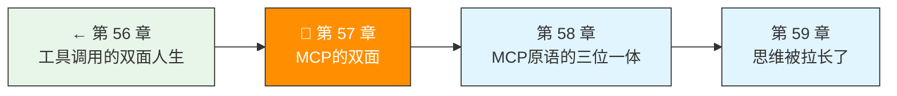
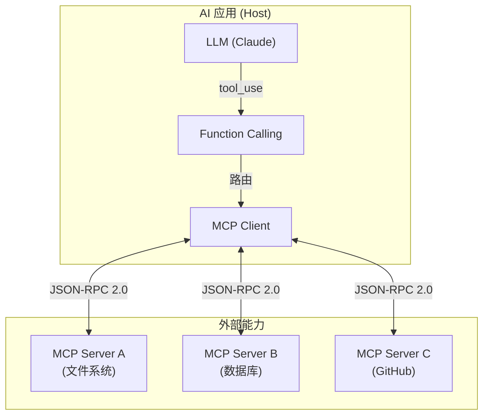
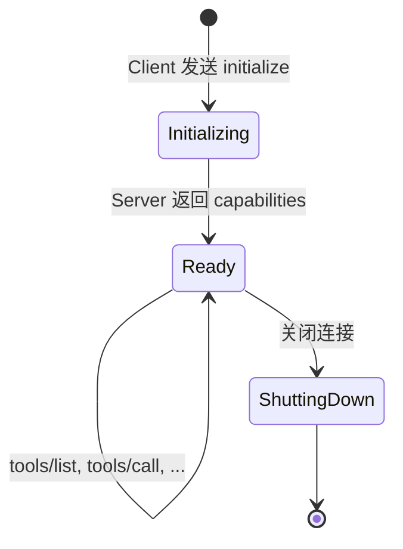

> 卷五协议验证日期：2026-05-17，基于 MCP 规范 2025-11-25（最新 Release Candidate），传输层 stdio + Streamable HTTP

第 56 章的工具是嵌在你的代码里的。MCP 把它拆开——工具可以在另一个进程、另一台机器上运行。MCP 有两面：Client 面（消费工具）和 Server 面（提供工具）。

---

## 路线图



---

## 法则五：协议的价值在于解耦

MCP 解决的是：如何让 AI 应用以标准方式连接外部工具和数据。它的核心设计：



---

## MCP 协议架构

MCP 分三层：

| 层 | 内容 | 用途 |
|----|------|------|
| 功能层 | Tools, Resources, Prompts | API 语义 |
| 协议层 | JSON-RPC 2.0 | 消息格式 |
| 传输层 | stdio, Streamable HTTP | 管道 |

所有消息都是 JSON-RPC 2.0 格式：

```typescript
// 请求
{ "jsonrpc": "2.0", "id": 1, "method": "tools/list", "params": {} }

// 响应
{ "jsonrpc": "2.0", "id": 1, "result": { "tools": [...] } }

// 错误
{ "jsonrpc": "2.0", "id": 1, "error": { "code": -32601, "message": "Method not found" } }

// 通知（无 id，无响应）
{ "jsonrpc": "2.0", "method": "notifications/initialized" }
```

---

## 生命周期



**关键**：Server 在收到 `initialized` 通知之前不能发送除 ping 和 logging 之外的任何请求。

---

## 第一面：实现 MCP Server（stdio）

Server 从 stdin 读 JSON-RPC，写 stdout：

```typescript
// → src/my-agent/mcp/server.ts
import { createInterface } from "node:readline";

interface McpTool {
  name: string;
  description: string;
  inputSchema: {
    type: "object";
    properties: Record<string, unknown>;
    required?: string[];
  };
  handler: (args: Record<string, unknown>) => Promise<McpToolResult>;
}

interface McpToolResult {
  content: Array<{ type: "text"; text: string }>;
  isError?: boolean;
}

export class McpServer {
  private tools = new Map<string, McpTool>();
  private initialized = false;

  registerTool(tool: McpTool): void {
    this.tools.set(tool.name, tool);
  }

  async start(): Promise<void> {
    const rl = createInterface({ input: process.stdin });

    for await (const line of rl) {
      if (!line.trim()) continue;
      const message = JSON.parse(line);
      await this.handleMessage(message);
    }
  }

  private async handleMessage(msg: JsonRpcMessage): Promise<void> {
    switch (msg.method) {
      case "initialize":
        this.send({
          jsonrpc: "2.0", id: msg.id,
          result: {
            protocolVersion: "2025-11-25",
            capabilities: {
              tools: { listChanged: false },
            },
            serverInfo: {
              name: "my-agent-mcp-server",
              version: "1.0.0",
            },
          },
        });
        break;

      case "notifications/initialized":
        this.initialized = true;
        break;

      case "tools/list":
        this.send({
          jsonrpc: "2.0", id: msg.id,
          result: {
            tools: Array.from(this.tools.values()).map(t => ({
              name: t.name,
              description: t.description,
              inputSchema: t.inputSchema,
            })),
          },
        });
        break;

      case "tools/call":
        const tool = this.tools.get(msg.params.name);
        if (!tool) {
          this.send({
            jsonrpc: "2.0", id: msg.id,
            error: { code: -32602, message: `Unknown tool: ${msg.params.name}` },
          });
          return;
        }
        try {
          const result = await tool.handler(msg.params.arguments);
          this.send({ jsonrpc: "2.0", id: msg.id, result });
        } catch (err) {
          this.send({
            jsonrpc: "2.0", id: msg.id,
            result: {
              content: [{ type: "text", text: `Error: ${(err as Error).message}` }],
              isError: true,
            },
          });
        }
        break;

      default:
        this.send({
          jsonrpc: "2.0", id: msg.id,
          error: { code: -32601, message: `Method not found: ${msg.method}` },
        });
    }
  }

  private send(message: JsonRpcMessage): void {
    process.stdout.write(JSON.stringify(message) + "\\n");
  }
}
```

---

## 第二面：实现 MCP Client（stdio）

Client 启动 Server 作为子进程，通过 stdin/stdout 通信：

```typescript
// → src/my-agent/mcp/client.ts
import { spawn, ChildProcess } from "node:child_process";
import { createInterface } from "node:readline";

export class McpClient {
  private process: ChildProcess;
  private requestId = 0;
  private pending = new Map<number, {
    resolve: (value: unknown) => void;
    reject: (error: Error) => void;
  }>();
  private tools: McpToolInfo[] = [];

  constructor(command: string, args: string[]) {
    this.process = spawn(command, args, {
      stdio: ["pipe", "pipe", "inherit"],  // stdin, stdout, stderr
    });

    const rl = createInterface({ input: this.process.stdout! });
    rl.on("line", (line) => {
      if (!line.trim()) return;
      const msg = JSON.parse(line);
      if (msg.id && this.pending.has(msg.id)) {
        const { resolve, reject } = this.pending.get(msg.id)!;
        this.pending.delete(msg.id);
        if (msg.error) reject(new Error(msg.error.message));
        else resolve(msg.result);
      }
    });
  }

  async initialize(): Promise<void> {
    const result = await this.sendRequest("initialize", {
      protocolVersion: "2025-11-25",
      capabilities: {},
      clientInfo: { name: "my-agent", version: "1.0.0" },
    }) as InitializeResult;

    // 发送 initialized 通知
    this.sendNotification("notifications/initialized");
  }

  async listTools(): Promise<McpToolInfo[]> {
    const result = await this.sendRequest("tools/list", {}) as ListToolsResult;
    this.tools = result.tools;
    return this.tools;
  }

  async callTool(name: string, args: Record<string, unknown>): Promise<McpToolResult> {
    return this.sendRequest("tools/call", {
      name,
      arguments: args,
    }) as Promise<McpToolResult>;
  }

  private sendRequest(method: string, params: unknown): Promise<unknown> {
    const id = ++this.requestId;
    const message = { jsonrpc: "2.0", id, method, params };
    this.process.stdin!.write(JSON.stringify(message) + "\\n");

    return new Promise((resolve, reject) => {
      this.pending.set(id, { resolve, reject });
      // 5 秒超时
      setTimeout(() => {
        if (this.pending.has(id)) {
          this.pending.delete(id);
          reject(new Error(`Request ${method} timed out`));
        }
      }, 5000);
    });
  }

  private sendNotification(method: string, params?: unknown): void {
    const message = { jsonrpc: "2.0", method, params };
    this.process.stdin!.write(JSON.stringify(message) + "\\n");
  }

  close(): void {
    this.process.kill();
  }
}
```

---

## 将 MCP 工具桥接到 Function Calling

MCP Client 发现的工具需要转换成 Messages API 能用的格式：

```typescript
// → src/my-agent/mcp/bridge.ts
export function mcpToolsToApiTools(mcpTools: McpToolInfo[]): ToolDefinition[] {
  return mcpTools.map(t => ({
    name: `mcp__${t.name}`,
    description: t.description,
    input_schema: t.inputSchema,
  }));
}

export async function executeMcpTool(
  client: McpClient,
  toolName: string,    // 已经是 mcp__ 前缀的
  args: Record<string, unknown>
): Promise<ToolResultBlock> {
  const realName = toolName.replace("mcp__", "");
  const result = await client.callTool(realName, args);

  return {
    type: "tool_result",
    tool_use_id: "",  // 调用者填充
    content: result.content.map(c => c.text).join("\\n"),
    is_error: result.isError,
  };
}
```

---

## Streamable HTTP 传输

对于远程 MCP Server，使用 Streamable HTTP（MCP 2025-11-25 推荐）：

```typescript
// → src/my-agent/mcp/http-client.ts
export class HttpMcpClient {
  constructor(
    private baseUrl: string,
    private sessionId?: string
  ) {}

  async initialize(): Promise<void> {
    const response = await fetch(this.baseUrl, {
      method: "POST",
      headers: {
        "Content-Type": "application/json",
        "Accept": "application/json, text/event-stream",
        "MCP-Protocol-Version": "2025-11-25",
      },
      body: JSON.stringify({
        jsonrpc: "2.0", id: 1, method: "initialize",
        params: {
          protocolVersion: "2025-11-25",
          capabilities: {},
          clientInfo: { name: "my-agent", version: "1.0.0" },
        },
      }),
    });

    const result = await response.json();
    this.sessionId = response.headers.get("MCP-Session-Id") ?? undefined;

    // 发送 initialized（带上 session ID）
    await this.post({
      jsonrpc: "2.0",
      method: "notifications/initialized",
    });
  }

  private async post(message: JsonRpcMessage): Promise<Response> {
    const headers: Record<string, string> = {
      "Content-Type": "application/json",
      "Accept": "application/json, text/event-stream",
      "MCP-Protocol-Version": "2025-11-25",
    };
    if (this.sessionId) {
      headers["MCP-Session-Id"] = this.sessionId;
    }
    return fetch(this.baseUrl, {
      method: "POST",
      headers,
      body: JSON.stringify(message),
    });
  }

  async close(): Promise<void> {
    if (this.sessionId) {
      await fetch(this.baseUrl, {
        method: "DELETE",
        headers: { "MCP-Session-Id": this.sessionId },
      });
    }
  }
}
```

---

## 试试看

**任务 1**：用 stdio 模式启动你的 McpServer 和 McpClient，验证 `initialize` → `tools/list` → `tools/call` 完整流程。

**任务 2**：在 MCP Server 中注册一个"真实"的工具——比如读文件的工具。用 McpClient 调用它。

**任务 3**：将 MCP 工具通过 `mcpToolsToApiTools` 桥接到第 56 章的 toolUseLoop，让 Claude 能通过 MCP 调用你的工具。

---

## 常见错误

| 现象 | 原因 | 解法 |
|------|------|------|
| `Method not found` | 方法名拼写错误 | 检查 JSON-RPC method 字段 |
| 初始化无响应 | 忘了发 `initialized` 通知 | 在 `initialize` 成功后发送 |
| stdio 管道堵塞 | 同时写太多请求 | 实现请求队列 |
| Session 失效 (HTTP 404) | session 过期或服务重启 | 重新 initialize |
| `inputSchema` 不兼容 | MCP 用 JSON Schema 2020-12 | 确保 Schema 格式正确 |

---

## 检查点

- [ ] 理解了 MCP 的三层架构（功能/协议/传输）
- [ ] 实现了 MCP Server（stdio 模式）
- [ ] 实现了 MCP Client（stdio 模式）
- [ ] 理解了 MCP 生命周期（initialize → initialized → operation → shutdown）
- [ ] 能桥接 MCP 工具到 Messages API 的 Function Calling

---

[← 上一章：第 56 章 工具调用的双面人生](/posts/6290407d/) | [下一章：第 58 章 MCP 原语的三位一体 →](/posts/47721a8f/)
