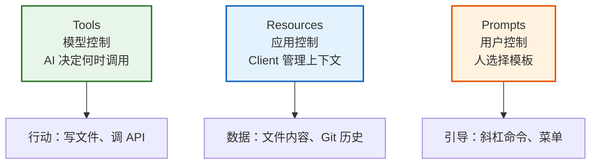

> 卷五协议验证日期：2026-05-17，基于 MCP 规范 2025-11-25 Server Features

MCP 不只是工具协议。它有三个原语——Tools、Resources、Prompts——分别对应三种控制权：



---

## 路线图


---

## Resources — 应用控制的上下文

Resources 让 MCP Server 暴露数据给 AI 应用。Client 决定何时读取、如何展示。

### Resource 的结构

```typescript
interface MCPResource {
  uri: string;           // 如 "file:///project/src/index.ts"
  name: string;          // 人类可读名称
  description?: string;   // 描述
  mimeType?: string;      // MIME 类型
  annotations?: {
    audience?: ("user" | "assistant")[];
    priority?: number;     // 0.0-1.0, 越高越重要
    lastModified?: string; // ISO 8601
  };
}
```

### 在 Server 中注册 Resources

```typescript
// → src/my-agent/mcp/resource-server.ts
interface ResourceHandler {
  read(uri: string): Promise<ResourceContent>;
  list?(): Promise<MCPResource[]>;
  subscribe?(uri: string): () => void;  // 返回取消订阅函数
}

export class ResourceRegistry {
  private resources = new Map<string, MCPResource>();
  private handlers = new Map<string, ResourceHandler>();

  register(pattern: string, resources: MCPResource[], handler: ResourceHandler): void {
    for (const res of resources) {
      this.resources.set(res.uri, res);
    }
    this.handlers.set(pattern, handler);
  }

  async handleList(cursor?: string): Promise<ListResourcesResult> {
    const all = Array.from(this.resources.values());
    // 简化：不分页
    return { resources: all };
  }

  async handleRead(uri: string): Promise<ReadResourceResult> {
    const resource = this.resources.get(uri);
    if (!resource) throw new Error(`Resource not found: ${uri}`);

    // 找到匹配的 handler
    for (const [pattern, handler] of this.handlers) {
      if (uri.startsWith(pattern)) {
        const content = await handler.read(uri);
        return { contents: [{ uri, mimeType: resource.mimeType, ...content }] };
      }
    }
    throw new Error(`No handler for: ${uri}`);
  }
}
```

### Resource 内容类型

Resources 可以返回文本或二进制内容：

```typescript
// 文本资源
interface TextResourceContents {
  uri: string;
  mimeType?: string;
  text: string;
}

// 二进制资源
interface BlobResourceContents {
  uri: string;
  mimeType?: string;
  blob: string;  // base64 编码
}
```

### Resource Templates

参数化的 URI 模板，让 Client 发现动态资源：

```typescript
// → src/my-agent/mcp/resource-templates.ts
// 注册模板
server.registerTemplate({
  uriTemplate: "file:///{path}",
  name: "Project Files",
  description: "Read files from the project",
  mimeType: "text/plain",
});

// Client 展开: file:///{path} + { path: "src/index.ts" } → file:///src/index.ts
```

### 订阅机制

```typescript
// Server 声明支持订阅
capabilities: {
  resources: { subscribe: true, listChanged: true }
}

// Server 推送资源更新
{ jsonrpc: "2.0", method: "notifications/resources/updated", params: { uri: "file:///..." } }
```

---

## Prompts — 用户控制的模板

Prompts 是预定义的对话模板，用户主动选择：

```typescript
interface MCPPrompt {
  name: string;              // "code-review"
  description?: string;      // "Review code for issues"
  arguments?: PromptArgument[];  // 可参数化
}

interface PromptArgument {
  name: string;
  description?: string;
  required?: boolean;
}
```

### 实现 Prompt 注册

```typescript
// → src/my-agent/mcp/prompt-server.ts
export class PromptRegistry {
  private prompts = new Map<string, {
    definition: MCPPrompt;
    handler: (args: Record<string, string>) => Promise<PromptMessage[]>;
  }>();

  register(
    definition: MCPPrompt,
    handler: (args: Record<string, string>) => Promise<PromptMessage[]>
  ): void {
    this.prompts.set(definition.name, { definition, handler });
  }

  async handleList(): Promise<ListPromptsResult> {
    return {
      prompts: Array.from(this.prompts.values()).map(p => p.definition),
    };
  }

  async handleGet(name: string, args: Record<string, string>): Promise<GetPromptResult> {
    const prompt = this.prompts.get(name);
    if (!prompt) throw new Error(`Prompt not found: ${name}`);

    const messages = await prompt.handler(args);
    return { messages };
  }
}

// 示例 Prompt
registry.register(
  {
    name: "code-review",
    description: "Review code for bugs and style issues",
    arguments: [{ name: "language", description: "Programming language", required: true }],
  },
  async (args) => [{
    role: "user",
    content: {
      type: "text",
      text: `Please review the following ${args.language} code for bugs, security issues, and style problems.`,
    },
  }]
);
```

---

## 高级特性（2025-11-25 新增）

### Tasks — 长时间运行操作

MCP 2025-11-25 引入了实验性的 Tasks 支持：

```json
// Tool 声明支持 task
{
  "name": "train_model",
  "execution": { "taskSupport": "optional" }  // forbidden / optional / required
}
```

### Elicitation — 服务器向用户请求输入

```
Client capability: { "elicitation": { "form": {}, "url": {} } }
```

### Icons — 资源/工具/提示的图标

```json
{
  "icons": [
    { "src": "https://example.com/icon.png", "mimeType": "image/png", "sizes": ["48x48"] }
  ]
}
```

---

## 完整的三原语 Server

```typescript
// → src/my-agent/mcp/full-server.ts
export class FullMcpServer extends McpServer {
  resources = new ResourceRegistry();
  prompts = new PromptRegistry();
  resourceTemplates: ResourceTemplate[] = [];

  protected async handleMethod(msg: JsonRpcMessage): Promise<void> {
    switch (msg.method) {
      // === Resources ===
      case "resources/list":
        return this.respond(msg.id, await this.resources.handleList(msg.params?.cursor));
      case "resources/read":
        return this.respond(msg.id, await this.resources.handleRead(msg.params.uri));
      case "resources/templates/list":
        return this.respond(msg.id, { resourceTemplates: this.resourceTemplates });

      // === Prompts ===
      case "prompts/list":
        return this.respond(msg.id, await this.prompts.handleList());
      case "prompts/get":
        return this.respond(msg.id, await this.prompts.handleGet(
          msg.params.name, msg.params.arguments
        ));

      // === Tools（继承自 McpServer）===
      default:
        super.handleMethod(msg);
    }
  }
}
```

### 能力声明

```json
{
  "capabilities": {
    "tools": { "listChanged": true },
    "resources": { "subscribe": true, "listChanged": true },
    "prompts": { "listChanged": true },
    "logging": {}
  }
}
```

---

## 试试看

**任务 1**：用 `ResourceRegistry` 注册一个文件系统资源模式 (`file:///*`)，让 Client 能读取任意文件。

**任务 2**：注册一个"解释代码"的 Prompt 模板，接受参数 `language` 和 `code`。

**任务 3**：实现资源变更通知——当你修改了一个文件时，Server 自动推送 `notifications/resources/updated`。

---

## 常见错误

| 现象 | 原因 | 解法 |
|------|------|------|
| Resource 读不到 | URI 没有注册 handler | 检查 pattern 匹配 |
| Prompt 参数缺失 | required 参数未传 | Client 应校验参数 |
| listChanged 不生效 | Server 没声明 `listChanged` | 在 capabilities 中声明 |
| 订阅收不到通知 | `subscribe` 未声明 | Server 必须声明 subscribe 能力 |

---

## 检查点

- [ ] 理解了三原语的控制模型差异（模型/应用/用户控制）
- [ ] 实现了 ResourceRegistry（list/read/templates/subscribe）
- [ ] 实现了 PromptRegistry（模板注册 + 参数化渲染）
- [ ] 理解了 Resources 的 URI 模板和订阅机制
- [ ] 能构建完整的三原语 MCP Server

---

[← 上一章：第 57 章 MCP 的双面](/posts/09cfbc35/) | [下一章：第 59 章 思维被拉长了 →](/posts/47ac6791/)
