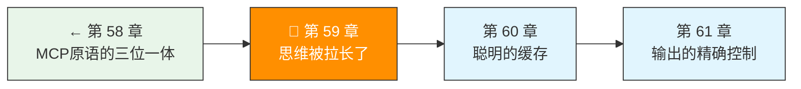

> 卷五协议验证日期：2026-05-17，基于 Anthropic Extended Thinking 规范（含 Opus 4.7 adaptive thinking 更新）

普通模式下 Claude 直接回答。Extended Thinking 模式让 Claude 在回答前先"想一想"——想的过程作为一个独立的 content block 返回。

---

## 路线图



---

## Thinking 的三种模式

| 模式 | 参数 | 适用模型 |
|------|------|---------|
| 手动 | `type: "enabled", budget_tokens: N` | Opus 4.5, Sonnet 4.5, 旧模型 |
| 自适应 | `type: "adaptive"` | **Opus 4.7 (必需)** , Opus 4.6, Sonnet 4.6 (推荐) |
| 禁用 | `type: "disabled"` | 所有模型 |

**重要变更**：Opus 4.7 不再支持手动 `budget_tokens`。必须用 `adaptive` + `effort` 控制思考深度。

---

## 手动模式：固定预算

```typescript
// → src/my-agent/thinking.ts
import type { ThinkingConfig } from "./types";

// 手动模式（旧模型兼容）
const manualThinking: ThinkingConfig = {
  type: "enabled",
  budget_tokens: 8000,   // 思考 token 预算
};

// 必须约束: max_tokens > budget_tokens
const response = await client.createMessage({
  model: "claude-sonnet-4-5",
  max_tokens: 16000,       // 必须 > 8000
  thinking: manualThinking,
  messages: [{ role: "user", content: "证明素数有无穷多个" }],
});
```

---

## 自适应模式：让模型决定

```typescript
// → src/my-agent/thinking.ts
// 自适应模式（Opus 4.7 / Sonnet 4.6 推荐）
const adaptiveThinking: ThinkingConfig = {
  type: "adaptive",
};

// 配合 effort 控制思考深度
const response = await client.createMessage({
  model: "claude-opus-4-7",
  max_tokens: 64000,
  thinking: adaptiveThinking,
  output_config: { effort: "xhigh" },  // effort 控制思考深度
  messages: [{ role: "user", content: "设计一个分布式缓存系统" }],
});
```

---

## Thinking Block 的结构

响应中的 thinking block 包含加密的思考过程：

```typescript
// → src/my-agent/thinking.ts
interface ThinkingBlock {
  type: "thinking";
  thinking: string;     // 思考内容（可能为空）
  signature: string;    // 加密签名 —— 验证思考完整性
}
```

`signature` 是关键——它携带加密的完整思考过程，用于多轮对话的上下文连续性。即使 `thinking` 字段为空（`display: "omitted"`），signature 仍然包含完整的思考信息。

---

## display 字段：控制思考可见性

```typescript
// display: "summarized" — 返回摘要（Opus 4.6/Sonnet 4.6 默认）
thinking: { type: "adaptive", display: "summarized" }

// display: "omitted" — 隐藏思考（Opus 4.7/Mythos 默认）
thinking: { type: "adaptive", display: "omitted" }
```

| display | thinking 字段 | 流式 thinking_delta | 速度 |
|---------|-------------|-------------------|------|
| `summarized` | 思考摘要文本 | 有 | 较慢（需传思考） |
| `omitted` | 空字符串 | 无（只有 signature_delta） | 更快 |

---

## 流式 Thinking 处理

```typescript
// → src/my-agent/thinking-parser.ts
// 流式事件序列（summarized 模式）
// content_block_start(type=thinking)
//   content_block_delta(type=thinking_delta) × N
//   content_block_delta(type=signature_delta)
// content_block_stop
// content_block_start(type=text)
//   content_block_delta(type=text_delta) × N
// content_block_stop

export async function* parseThinkingStream(
  stream: AsyncGenerator<StreamEvent>
): AsyncGenerator<ThinkingOrText> {
  let thinkingBuffer = "";
  let signature = "";

  for await (const event of stream) {
    if (event.type === "content_block_delta") {
      if (event.delta.type === "thinking_delta") {
        thinkingBuffer += event.delta.thinking;
        yield { kind: "thinking", text: event.delta.thinking };
      } else if (event.delta.type === "signature_delta") {
        signature += event.delta.signature;
      } else if (event.delta.type === "text_delta") {
        yield { kind: "text", text: event.delta.text };
      }
    }
  }
}
```

---

## 交错思考 (Interleaved Thinking)

交错思考让 Claude 在工具调用之间也能思考：

```
# 非交错：
[thinking] → [tool_use] → [tool_use] → [text]

# 交错：
[thinking] → [tool_use] → [thinking] → [tool_use] → [thinking] → [text]
```

模型支持：

| 模型 | 状态 |
|------|------|
| Mythos Preview | 自动（无需 header） |
| Opus 4.7 | 自动（adaptive thinking） |
| Opus 4.6 | 自动（adaptive thinking） |
| Sonnet 4.6 | 自动（adaptive thinking）/ 手动仍可用但已弃用 |

---

## Thinking 与多轮对话

在多轮对话中，**必须原封不动地把 thinking block 传回去**：

```typescript
// → src/my-agent/thinking.ts
// ✅ 正确：保留完整的 assistant content（含 thinking）
messages.push({
  role: "assistant",
  content: response.content,  // 包含 thinking + text + tool_use
});

// ❌ 错误：丢弃了 thinking block
messages.push({
  role: "assistant",
  content: response.content.filter(b => b.type === "text"),
});
```

API 会自动过滤和缓存 thinking block。Opus 4.5+ 和 Sonnet 4.6+ 默认保留；更早模型默认丢弃。

---

## 工具使用的限制

当启用 extended thinking 时：
- ✅ `tool_choice: { type: "auto" }` — 正常
- ✅ `tool_choice: { type: "none" }` — 正常
- ❌ `tool_choice: { type: "any" }` — 会报错
- ❌ `tool_choice: { type: "tool", name: "X" }` — 会报错

---

## 试试看

**任务 1**：同一个数学证明题，分别用 `type: "disabled"`、`type: "enabled"`（budget=4000）、`type: "enabled"`（budget=16000）发送。对比回答质量和 token 消耗。

**任务 2**：用 `display: "omitted"` 测试——观察流中是否还能收到 `signature_delta`。

**任务 3**：实现交错思考的追踪器——统计一次对话中模型"想了"几次。

---

## 常见错误

| 现象 | 原因 | 解法 |
|------|------|------|
| `max_tokens must be > budget_tokens` | 手动模式没设够 | `max_tokens` > `budget_tokens` |
| Opus 4.7 对手动模式返回 400 | 不支持 `type: "enabled"` | 改用 `adaptive` |
| 丢失 thinking 导致回答质量下降 | 多轮对话丢弃了 thinking block | 原封不动传回 |
| tool_choice 报错 | extended thinking 不允许 `any` | 用 `auto` 或 `none` |

---

## 检查点

- [ ] 理解了三种 thinking 模式及其适用模型
- [ ] 能解析 thinking/signature content block
- [ ] 理解了 display 字段对速度和可见性的影响
- [ ] 理解了交错思考的工作机制
- [ ] 知道多轮对话中必须保留 thinking block

---

[← 上一章：第 58 章 MCP 原语的三位一体](/posts/47721a8f/) | [下一章：第 60 章 聪明的缓存 →](/posts/2f25aabd/)
