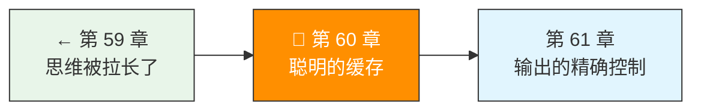

> 卷五协议验证日期：2026-05-17，基于 Anthropic Prompt Caching 规范

Agent 每次请求都要重传 system prompt 和 tools——这几千个 token 完全不变。Prompt Caching 让重复前缀只处理一次，后续请求便宜 90%。

> **与 ch52.5 的关系**：ch52.5（Token 经济学）从成本角度分析了 Prompt Caching 的盈亏模型（命中 ≥ 2 次才赚）和缓存预热策略。本章从实现角度构建 CacheStrategy 组件。

---

## 路线图



---

## 法则六：缓存是透明的优化层

缓存不影响 API 的语义——只影响延迟和费用。你的代码不需要知道缓存是否命中，只需要正确标记哪些内容可以缓存。

---

## 两种缓存方式

### 方式 1：自动缓存（推荐起点）

在请求顶层加一个 `cache_control`，API 自动选择最佳断点：

```typescript
// → src/my-agent/cache.ts
const response = await client.createMessage({
  model: "claude-opus-4-7",
  max_tokens: 1024,
  cache_control: { type: "ephemeral" },  // 自动断点
  system: "你是一个代码审查专家...",  // 几千 token
  messages: [{ role: "user", content: "审查这段代码" }],
});
```

**工作原理**：每轮对话后，缓存断点自动前移。第 1 次写缓存，第 2 次命中前缀 + 新增内容：

```
Request 1: [system][msg1][asst1][msg2]  ← 全部写入缓存
Request 2: [system][msg1][asst1][msg2]  ← 缓存命中
                         [asst2][msg3]  ← 新增，写入缓存
Request 3: [system][msg1][asst1][msg2][asst2][msg3]  ← 缓存命中
                                              [msg4] ← 新增
```

### 方式 2：显式断点

精确控制缓存在哪个 content block 之后生效：

```typescript
// → src/my-agent/cache.ts
const response = await client.createMessage({
  model: "claude-opus-4-7",
  max_tokens: 1024,
  system: [{
    type: "text",
    text: "你是一个代码审查专家。以下是项目规范...",  // 大段文本
    cache_control: { type: "ephemeral" },  // 缓存这段！
  }],
  tools: [{
    name: "read_file",
    description: "...",
    input_schema: { /* ... */ },
    cache_control: { type: "ephemeral" },  // 工具定义也缓存！
  }],
  messages: [{ role: "user", content: "审查这段代码" }],
});
```

---

## 缓存标记的位置

`cache_control` 可以加在：

| 位置 | 格式 | 适用场景 |
|------|------|---------|
| 顶层 | `cache_control: { type: "ephemeral" }` | 自动断点 |
| system text block | 在 block 对象内 | 大型系统指令 |
| tool definition | 在 tool 对象内 | 工具定义（Agent 复用） |
| message content block | 在 content block 内 | 固定前缀 |
| image/document block | 在 block 对象内 | 大型图片/文档 |

---

## 缓存限制

| 约束 | 值 |
|------|-----|
| 最大断点数 | 4 个 |
| 每个断点回顾窗口 | 20 个 block |
| 最小可缓存 token 数 | Opus 4.7: 4096 / Sonnet 4.6: 1024 / Haiku 4.5: 4096 |
| 默认 TTL | 5 分钟（每次命中刷新） |
| 长 TTL | 1 小时（`ttl: "1h"`） |

---

## TTL 选项

```typescript
// 5 分钟（默认）
{ type: "ephemeral" }
{ type: "ephemeral", ttl: "5m" }

// 1 小时（大型项目，长时间会话）
{ type: "ephemeral", ttl: "1h" }
```

---

## 费用模型

```typescript
// → src/my-agent/cache-stats.ts
export function calculateCacheCost(
  model: string,
  usage: MessageUsage
): { cacheWriteCost: number; cacheReadCost: number; totalInputCost: number } {
  const prices = MODEL_PRICES[model];

  return {
    cacheWriteCost: (usage.cache_creation_input_tokens / 1_000_000)
      * prices.input * 1.25,   // 写入：1.25× 基础价格
    cacheReadCost: (usage.cache_read_input_tokens / 1_000_000)
      * prices.input * 0.10,   // 读取：0.10× 基础价格（便宜 90%）
    totalInputCost: (usage.input_tokens / 1_000_000) * prices.input,
  };
}

// → 价格与 ch52.5 Token 经济学一致
const MODEL_PRICES: Record<string, { input: number; output: number }> = {
  "claude-opus-4-7":  { input: 15, output: 75 },    // $15/M in, $75/M out
  "claude-sonnet-4-6": { input: 3, output: 15 },     // $3/M in, $15/M out
  "claude-haiku-4-5": { input: 0.80, output: 4 },    // $0.80/M in, $4/M out
};
```

---

## 监控缓存命中

```typescript
// → src/my-agent/cache-monitor.ts
export function checkCacheHit(usage: MessageUsage): {
  hit: boolean;
  hitRate: number;
  report: string;
} {
  const totalInput = usage.input_tokens
    + (usage.cache_creation_input_tokens ?? 0)
    + (usage.cache_read_input_tokens ?? 0);

  const hitRate = totalInput > 0
    ? (usage.cache_read_input_tokens ?? 0) / totalInput
    : 0;

  return {
    hit: (usage.cache_read_input_tokens ?? 0) > 0,
    hitRate,
    report: `缓存命中率: ${(hitRate * 100).toFixed(1)}%`
      + ` | 读取: ${usage.cache_read_input_tokens ?? 0} tokens`
      + ` | 写入: ${usage.cache_creation_input_tokens ?? 0} tokens`,
  };
}
```

---

## 缓存预热

在用户第一条消息到达前预热缓存，消除首次延迟：

```typescript
// → src/my-agent/cache-warmup.ts
async function warmupCache(client: ApiClient): Promise<void> {
  // max_tokens: 0 → 不生成内容，只写缓存
  await client.createMessage({
    model: "claude-opus-4-7",
    max_tokens: 0,
    system: [{
      type: "text",
      text: "你是一个专业的软件工程师...",  // 大型 system prompt
      cache_control: { type: "ephemeral", ttl: "1h" },
    }],
    messages: [{ role: "user", content: "warmup" }],  // 占位消息
  });
  // 返回: stop_reason="max_tokens", content=[], usage 包含 cache_creation
}
```

**预热限制**：必须用显式断点（自动缓存会产生不匹配），不能与 `stream: true` 或 extended thinking 同用。

---

## 缓存失效规则

缓存的层级结构：`tools` → `system` → `messages`。上层变化使下层全部失效：

| 变化 | tools 缓存 | system 缓存 | messages 缓存 |
|------|:--:|:--:|:--:|
| 工具定义修改 | ✗ | ✗ | ✗ |
| thinking 参数变化 | ✓ | ✓ | ✗ |
| 消息历史变化 | ✓ | ✓ | ✗ |

---

## 实现 CacheStrategy

```typescript
// → src/my-agent/cache-strategy.ts
export class CacheStrategy {
  private lastRequestTokens = 0;

  shouldCache(systemPrompt: string, toolCount: number): boolean {
    const estimatedTokens = systemPrompt.length / 4 + toolCount * 200;
    // 只在 token 数超过最小阈值时才缓存
    return estimatedTokens > 1024;
  }

  chooseBreakpointType(
    systemSize: number,
    conversationTurns: number
  ): "auto" | "explicit" {
    if (systemSize > 4096 && conversationTurns < 5) return "explicit";
    return "auto";
  }
}
```

---

## 试试看

**任务 1**：对比同一段长 system prompt 在无缓存、5 分钟 TTL、1 小时 TTL 下的延迟和费用。用 `usage` 字段统计。

**任务 2**：实现一个 cache hit rate 仪表盘——每轮对话后打印命中率。

**任务 3**：用 `max_tokens: 0` 预热缓存，然后发送真实用户请求，观察预热前后的首 token 延迟差异。

---

## 常见错误

| 现象 | 原因 | 解法 |
|------|------|------|
| 缓存不命中 | 断点位置在变化的内容上 | 断点放在最后不变的内容块 |
| `cache_read` 始终为 0 | prompt 太短，不够最小阈值 | 确认 token 数 >= 1024/4096 |
| 费用没下降 | 每次都写新缓存（命中但断点前移） | 用自动缓存管理 |
| 1h TTL 不生效 | 与 5m TTL 混合使用时顺序错误 | 1h 断点必须在 5m 断点之前 |

---

## 检查点

- [ ] 理解了自动缓存和显式断点的区别
- [ ] 能在 system prompt 和 tools 上标记 cache_control
- [ ] 能通过 usage 字段监控缓存命中率
- [ ] 理解了缓存的层级失效规则
- [ ] 能用 max_tokens: 0 预热缓存

---

> **下一站预告**：缓存控制了输入的成本，但输出的质量同样需要精确控制——如何让 Claude 以你想要的深度、格式和确定性来回答？下一章，我们构建 OutputController。

---

[← 上一章：第 59 章 思维被拉长了](/posts/47ac6791/) | [下一章：第 61 章 输出的精确控制 →](/posts/214c692e/)
