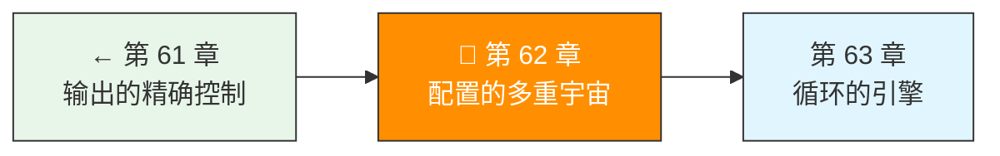

> 卷五协议验证日期：2026-05-17，基于 Claude Code Configuration Protocol 和 Settings 规范

协议实现好了，但怎么让用户配置模型、切换提供商、管理权限？这一章构建 Agent 框架的配置层。

---

## 路线图



---

## 五级配置优先级

Claude Code 的配置是递归覆盖模型。我们的框架采用同样的设计：

```typescript
// → src/my-agent/config/loader.ts
// 优先级从低到高
export const CONFIG_PRIORITY = [
  "global",           // ~/.agent/settings.json
  "global_local",     // ~/.agent/settings.local.json
  "project_global",   // ~/.agent/projects/<hash>/settings.json
  "project",          // <project>/.agent/settings.json（可提交 Git）
  "project_local",    // <project>/.agent/settings.local.json（不提交）
  "env",              // 环境变量
  "cli",              // 命令行参数
] as const;

export type ConfigScope = typeof CONFIG_PRIORITY[number];
```

---

## 配置类型定义

```typescript
// → src/my-agent/config/types.ts
export interface AgentConfig {
  // 模型配置
  model: string;
  smallModel?: string;     // 轻量任务
  largeModel?: string;     // 复杂任务

  // API 配置
  apiKey?: string;
  baseUrl?: string;        // 自定义 API endpoint
  headers?: Record<string, string>;

  // MCP Server 配置
  mcpServers?: Record<string, McpServerConfig>;

  // 权限配置
  permissions?: PermissionConfig;

  // 行为配置
  maxTokens?: number;
  maxIterations?: number;  // Agent 循环上限
  temperature?: number;
  effort?: "low" | "medium" | "high" | "xhigh" | "max";
}

export interface McpServerConfig {
  type: "stdio" | "streamableHttp";
  command?: string;        // stdio 模式
  args?: string[];
  url?: string;            // HTTP 模式
  headers?: Record<string, string>;
  env?: Record<string, string>;
}
```

---

## 实现 ConfigLoader

```typescript
// → src/my-agent/config/loader.ts
import { readFile } from "node:fs/promises";
import { homedir } from "node:os";
import { join } from "node:path";

export class ConfigLoader {
  private configs: Map<ConfigScope, Partial<AgentConfig>> = new Map();

  async loadFile(scope: ConfigScope, path: string): Promise<void> {
    try {
      const content = await readFile(path, "utf-8");
      const expanded = this.expandEnvVars(content);
      this.configs.set(scope, JSON.parse(expanded));
    } catch {
      // 文件不存在不是错误，跳过
    }
  }

  // 按优先级加载所有配置
  async loadAll(projectRoot?: string): Promise<void> {
    const home = homedir();

    // 全局配置
    await this.loadFile("global", join(home, ".agent", "settings.json"));
    await this.loadFile("global_local", join(home, ".agent", "settings.local.json"));

    // 项目配置
    if (projectRoot) {
      await this.loadFile("project", join(projectRoot, ".agent", "settings.json"));
      await this.loadFile("project_local", join(projectRoot, ".agent", "settings.local.json"));
    }

    // 环境变量
    this.loadFromEnv();
  }

  private loadFromEnv(): void {
    const env: Partial<AgentConfig> = {};
    if (process.env.AGENT_MODEL) env.model = process.env.AGENT_MODEL;
    if (process.env.AGENT_API_KEY) env.apiKey = process.env.AGENT_API_KEY;
    if (process.env.AGENT_BASE_URL) env.baseUrl = process.env.AGENT_BASE_URL;
    if (process.env.AGENT_EFFORT) env.effort = process.env.AGENT_EFFORT as AgentConfig["effort"];
    this.configs.set("env", env);
  }

  // 按优先级合并
  resolve(): AgentConfig {
    let merged: Partial<AgentConfig> = {};

    for (const scope of CONFIG_PRIORITY) {
      const config = this.configs.get(scope);
      if (config) {
        merged = this.deepMerge(merged, config);
      }
    }

    return this.applyDefaults(merged as AgentConfig);
  }

  private deepMerge<T extends Record<string, unknown>>(base: T, overlay: Partial<T>): T {
    const result = { ...base };
    for (const key of Object.keys(overlay) as Array<keyof T>) {
      if (this.isObject(overlay[key]) && this.isObject(result[key])) {
        result[key] = this.deepMerge(
          result[key] as Record<string, unknown>,
          overlay[key] as Record<string, unknown>
        ) as T[keyof T];
      } else {
        result[key] = overlay[key] as T[keyof T];
      }
    }
    return result;
  }

  // 环境变量展开：${VAR_NAME} → 实际值
  private expandEnvVars(content: string): string {
    return content.replace(/\$\{(\w+)\}/g, (_, name) => process.env[name] ?? "");
  }

  private applyDefaults(config: AgentConfig): AgentConfig {
    return {
      model: config.model ?? "claude-sonnet-4-6",
      maxTokens: config.maxTokens ?? 4096,
      maxIterations: config.maxIterations ?? 25,
      temperature: config.temperature ?? 1.0,
      effort: config.effort ?? "high",
      ...config,
    };
  }
}
```

---

## 提供商抽象

```typescript
// → src/my-agent/providers/interface.ts
export interface AIProvider {
  readonly name: string;
  createMessage(params: MessageCreateParams): Promise<MessageResponse>;
  createMessageStream(params: MessageCreateParams): Promise<Response>;
}

// Anthropic 提供商
export class AnthropicProvider implements AIProvider {
  readonly name = "anthropic";
  private client: ApiClient;

  constructor(config: { apiKey: string; baseUrl?: string }) {
    this.client = new ApiClient({
      apiKey: config.apiKey,
      baseUrl: config.baseUrl,
    });
  }

  async createMessage(params: MessageCreateParams): Promise<MessageResponse> {
    return this.client.createMessage(params);
  }

  async createMessageStream(params: MessageCreateParams): Promise<Response> {
    const response = await fetch(`${this.client.baseUrl}/messages`, {
      method: "POST",
      headers: this.client.headers,
      body: JSON.stringify({ ...params, stream: true }),
    });
    return response;
  }
}

// OpenAI 兼容提供商
export class OpenAICompatibleProvider implements AIProvider {
  readonly name = "openai-compatible";
  private apiKey: string;
  private baseUrl: string;

  constructor(config: { apiKey: string; baseUrl: string }) {
    this.apiKey = config.apiKey;
    this.baseUrl = config.baseUrl;
  }

  async createMessage(params: MessageCreateParams): Promise<MessageResponse> {
    // 将 Anthropic 格式转换为 OpenAI 格式
    const openaiParams = this.convertToOpenAI(params);
    const response = await fetch(`${this.baseUrl}/chat/completions`, {
      method: "POST",
      headers: {
        "Authorization": `Bearer ${this.apiKey}`,
        "Content-Type": "application/json",
      },
      body: JSON.stringify(openaiParams),
    });
    const data = await response.json();
    // 将 OpenAI 响应转回 Anthropic 格式
    return this.convertFromOpenAI(data);
  }

  // 格式转换（简化版）
  private convertToOpenAI(params: MessageCreateParams): unknown {
    return {
      model: params.model,
      max_tokens: params.max_tokens,
      messages: params.messages.map(m => ({
        role: m.role,
        content: typeof m.content === "string" ? m.content : JSON.stringify(m.content),
      })),
      tools: params.tools?.map(t => ({
        type: "function",
        function: {
          name: t.name,
          description: t.description,
          parameters: t.input_schema,
        },
      })),
    };
  }

  private convertFromOpenAI(data: any): MessageResponse {
    const choice = data.choices[0];
    return {
      id: data.id,
      type: "message",
      role: "assistant",
      model: data.model,
      content: [{ type: "text", text: choice.message.content }],
      stop_reason: choice.finish_reason === "tool_calls" ? "tool_use" : "end_turn",
      stop_sequence: null,
      usage: {
        input_tokens: data.usage?.prompt_tokens ?? 0,
        output_tokens: data.usage?.completion_tokens ?? 0,
      },
    };
  }
}

// 提供商工厂
export function createProvider(config: AgentConfig): AIProvider {
  if (config.baseUrl?.includes("openai.com")) {
    return new OpenAICompatibleProvider({
      apiKey: config.apiKey!,
      baseUrl: config.baseUrl,
    });
  }
  return new AnthropicProvider({
    apiKey: config.apiKey!,
    baseUrl: config.baseUrl,
  });
}
```

---

## 权限配置

```typescript
// → src/my-agent/config/permissions.ts
export interface PermissionConfig {
  allow?: string[];
  deny?: string[];
  defaultMode?: "acceptEdits" | "bypassPermissions" | "default";
}

export class PermissionEngine {
  constructor(private config: PermissionConfig) {}

  canExecute(toolName: string, args: Record<string, unknown>): "allow" | "deny" | "ask" {
    // deny 优先
    if (this.matchAny(toolName, this.config.deny)) return "deny";
    // allow 次之
    if (this.matchAny(toolName, this.config.allow)) return "allow";
    // 默认询问
    return "ask";
  }

  private matchAny(name: string, patterns?: string[]): boolean {
    if (!patterns) return false;
    return patterns.some(p => {
      // 支持 glob: Bash(ls *) 匹配 Bash(ls -la)
      const regex = new RegExp(
        "^" + p.replace(/\*/g, ".*") + "$"
      );
      return regex.test(name);
    });
  }
}
```

---

## 试试看

**任务 1**：实现三级配置——全局 `~/.agent/settings.json`、项目 `.agent/settings.json`、环境变量 `AGENT_MODEL`。验证覆盖顺序。

**任务 2**：接入一个 OpenAI 兼容的第三方 API（如 OpenRouter），用你的 `OpenAICompatibleProvider` 发消息。

**任务 3**：实现一个简单的命令行参数解析器，让 `--model` 覆盖所有文件配置。

---

## 常见错误

| 现象 | 原因 | 解法 |
|------|------|------|
| 配置不生效 | 被更高优先级的配置覆盖 | 检查合并顺序 |
| 环境变量不展开 | 用了 `${}` 但未设环境变量 | 展开时替换为空字符串 |
| 权限规则不匹配 | glob 正则写错了 | 测试正则表达式 |
| 第三方 API 报错 | 格式转换不正确 | 检查 convertToOpenAI 逻辑 |

---

## 检查点

- [ ] 理解了五级递归覆盖的配置模型
- [ ] 实现了 ConfigLoader（文件 + 环境变量 + 合并）
- [ ] 实现了 AIProvider 抽象（Anthropic + OpenAI 兼容）
- [ ] 理解了 PermissionEngine 的 glob 匹配逻辑

---

[← 上一章：第 61 章 输出的精确控制](/posts/214c692e/) | [下一章：第 63 章 循环的引擎 →](/posts/36d40204/)
