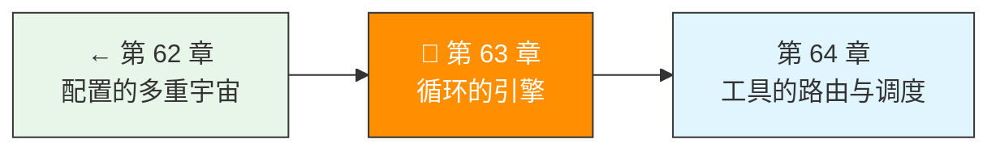
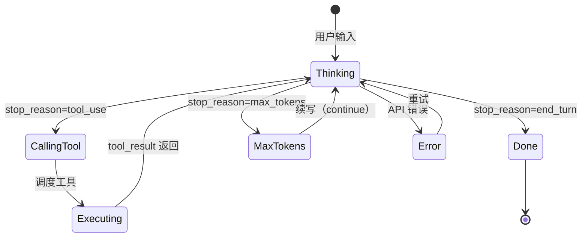

> 卷五协议验证日期：2026-05-17，基于 Agentic Loop 模式和本书卷一/卷四设计分析

这是卷五的基石章——把所有协议组装成一个能自主工作的 Agent 引擎。

---

## 路线图



---

## 法则七：Agent 就是循环加工具

Agent 的形式化定义：

```
Agent = LLM + Tools + Loop + ContextManager
```

循环是引擎——它把单次 API 调用变成持续的自主行动。

---

## Agent Loop 的状态机



---

## 核心实现

```typescript
// → src/my-agent/agent-loop.ts
import type {
  MessageParam,
  MessageResponse,
  ToolDefinition,
  ToolUseBlock,
  ToolResultBlock,
} from "./types";

export interface AgentConfig {
  model: string;
  maxTokens: number;
  maxIterations: number;   // 防止无限循环
  maxContextTokens: number; // 上下文窗口上限
  tools: ToolDefinition[];
  systemPrompt?: string;
  thinking?: ThinkingConfig;
  outputConfig?: OutputConfig;
}

export interface TurnEvent {
  type: "thinking" | "tool_call" | "tool_result" | "response" | "error" | "compaction";
  turnNumber: number;
  data: unknown;
}

// → 与 ch52.5 的成本控制一致
const MODEL_PRICES: Record<string, { input: number; output: number }> = {
  "claude-sonnet-4-6": { input: 3, output: 15 },
  "claude-haiku-4-5": { input: 0.80, output: 4 },
}

export class AgentLoop {
  private messages: MessageParam[] = [];
  private turnCount = 0;
  private totalTokens = { input: 0, output: 0 };
  private sessionCost = 0;        // 累计美元成本
  private maxSessionCost = 5.00;  // 单会话成本上限（ch52.5 约束2）

  constructor(
    private client: ApiClient,
    private toolExecutor: ToolExecutor,
    private config: AgentConfig
  ) {}

  async *run(userMessage: string): AsyncGenerator<TurnEvent> {
    this.messages.push({ role: "user", content: userMessage });

    while (this.turnCount < this.config.maxIterations) {
      this.turnCount++;

      // 0. 成本防线（ch52.5 约束2）：调用前检查
      if (this.sessionCost > this.maxSessionCost * 0.8) {
        yield { type: "warning", data: { message: "会话成本已超过 80% 上限" } }
      }
      if (this.sessionCost >= this.maxSessionCost) {
        yield { type: "error", data: { message: "会话成本已达上限，停止执行" } }
        return
      }

      // 1. 上下文管理：检查是否超限
      const contextSize = this.estimateContextSize();
      if (contextSize > this.config.maxContextTokens * 0.8) {
        yield { type: "compaction", turnNumber: this.turnCount, data: { contextSize } };
        await this.compact();
      }

      // 2. 调用模型
      let response: MessageResponse;
      try {
        response = await this.client.createMessage({
          model: this.config.model,
          max_tokens: this.config.maxTokens,
          system: this.config.systemPrompt,
          messages: this.messages,
          tools: this.config.tools,
          thinking: this.config.thinking,
          output_config: this.config.outputConfig,
        });
      } catch (err) {
        yield {
          type: "error",
          turnNumber: this.turnCount,
          data: { error: err as Error, retryable: this.isRetryable(err) },
        };
        // 可重试的错误等待后继续
        if (this.isRetryable(err)) {
          await this.delay(2000);
          continue;
        }
        throw err;
      }

      // 3. 更新用量 + 计算成本（ch52.5 约束2: CostTracker 三道防线）
      this.totalTokens.input += response.usage.input_tokens;
      this.totalTokens.output += response.usage.output_tokens;
      const prices = MODEL_PRICES[this.config.model] ?? MODEL_PRICES["claude-sonnet-4-6"];
      const inputCost = (response.usage.input_tokens / 1_000_000) * prices.input;
      const cacheReadCost = (response.usage.cache_read_input_tokens / 1_000_000) * prices.input * 0.10;
      const outputCost = (response.usage.output_tokens / 1_000_000) * prices.output;
      this.sessionCost += inputCost + cacheReadCost + outputCost;

      // 4. 添加 assistant 回复到历史
      this.messages.push({ role: "assistant", content: response.content });

      // 5. 根据 stop_reason 决定下一步
      switch (response.stop_reason) {
        case "end_turn":
          yield {
            type: "response",
            turnNumber: this.turnCount,
            data: {
              response,
              totalTokens: { ...this.totalTokens },
              sessionCost: this.sessionCost,
            },
          };
          return;

        case "tool_use": {
          const toolCalls = this.extractToolCalls(response);
          yield {
            type: "tool_call",
            turnNumber: this.turnCount,
            data: { toolCalls },
          };

          // 执行工具
          const results = await this.executeTools(toolCalls);
          yield {
            type: "tool_result",
            turnNumber: this.turnCount,
            data: { results },
          };

          // 添加结果到历史
          this.messages.push({ role: "user", content: results });
          continue;  // 继续循环
        }

        case "max_tokens":
          // 续写：给一个 continuation 提示
          yield {
            type: "response",
            turnNumber: this.turnCount,
            data: { response, note: "max_tokens reached, continuing" },
          };
          this.messages.push({
            role: "user",
            content: "请继续。你之前的回答被截断了。",
          });
          continue;

        case "stop_sequence":
          yield {
            type: "response",
            turnNumber: this.turnCount,
            data: { response, stopReason: "stop_sequence" },
          };
          return;
      }
    }

    throw new Error(`超过最大迭代次数: ${this.config.maxIterations}`);
  }

  // === 工具执行 ===

  private extractToolCalls(response: MessageResponse): ToolUseBlock[] {
    return response.content.filter(
      (b): b is ToolUseBlock => b.type === "tool_use"
    );
  }

  private async executeTools(toolCalls: ToolUseBlock[]): Promise<ToolResultBlock[]> {
    // 并行执行独立的工具调用
    return Promise.all(
      toolCalls.map(tc => this.toolExecutor.execute(tc))
    );
  }

  // === 上下文管理 ===

  private estimateContextSize(): number {
    return JSON.stringify(this.messages).length / 4;  // 粗略估计
  }

  private async compact(): Promise<void> {
    // 压缩策略：用模型摘要对话历史
    const summary = await this.client.createMessage({
      model: this.config.smallModel ?? this.config.model,
      max_tokens: 1024,
      messages: [
        ...this.messages.slice(0, -3),
        { role: "user", content: "请用中文简洁摘要以上对话的关键信息。" },
      ],
    });

    const summaryText = summary.content
      .filter(b => b.type === "text")
      .map(b => b.text)
      .join("");

    // 替换旧消息为摘要
    const recentMessages = this.messages.slice(-3);
    this.messages = [
      { role: "user", content: `[之前的对话摘要：${summaryText}]` },
      ...recentMessages,
    ];
  }

  // === 工具函数 ===

  private isRetryable(err: unknown): boolean {
    if (err instanceof ApiError) return err.isRetryable;
    return false;
  }

  private delay(ms: number): Promise<void> {
    return new Promise(resolve => setTimeout(resolve, ms));
  }
}
```

---

## 使用 Agent Loop

```typescript
// → src/my-agent/usage-example.ts
const config = ConfigLoader.loadAll(process.cwd());
const provider = createProvider(config);
const executor = new ToolExecutor();
executor.register("read_file", readFileHandler);
executor.register("run_command", runCommandHandler);

const agent = new AgentLoop(provider, executor, {
  model: config.model,
  maxTokens: config.maxTokens ?? 4096,
  maxIterations: 25,
  maxContextTokens: 180_000,
  tools: [
    {
      name: "read_file",
      description: "读取文件内容",
      input_schema: {
        type: "object",
        properties: { path: { type: "string" } },
        required: ["path"],
      },
    },
    {
      name: "run_command",
      description: "执行 shell 命令",
      input_schema: {
        type: "object",
        properties: { command: { type: "string" } },
        required: ["command"],
      },
    },
  ],
  systemPrompt: "你是一个软件工程师助手。",
  thinking: { type: "adaptive" },
});

for await (const event of agent.run("帮我看看当前项目的文件结构")) {
  console.log(`[Turn ${event.turnNumber}] ${event.type}`, event.data);
}
```

---

## 上下文管理的三种策略

| 策略 | 做法 | 优点 | 缺点 |
|------|------|------|------|
| **压缩** | 用模型摘要历史 | 保留语义 | 摘要可能丢失细节 |
| **截断** | 丢弃最早的消息 | 简单 | 可能丢失关键上下文 |
| **分层** | 近期完整 + 远期摘要 | 平衡 | 实现复杂 |

我们的实现用分层策略：保留最后 3 条，其余压缩为摘要。

---

## 试试看

**任务 1**：让 Agent 执行一个需要多轮工具调用的任务（如"在项目中搜索所有 TODO 注释并汇总"）。观察完整循环。

**任务 2**：触发 `max_iterations` 限制（设为 2），观察 Agent 如何处理被截断的任务。

**任务 3**：实现"人类确认"——在每次工具调用前暂停，等待用户输入 `y/n`。

---

## 常见错误

| 现象 | 原因 | 解法 |
|------|------|------|
| 无限循环 | `max_iterations` 太大 | 设置合理上限（默认 25） |
| 上下文溢出 | 未触发 compaction | 降低 `maxContextTokens` 阈值 |
| 工具结果丢失 | `messages` 中漏了 tool_result | 确保推入消息历史 |
| 重复调用同一工具 | 返回值不清晰 | 在 tool_result 中加更多信息 |

---

## 实现循环检测：终结那个贯穿全书的 Bug

还记得卷零 ch02 的那个 Agent 死循环吗？在卷一中我们理解了循环退出条件，卷二中追踪了工具执行引擎的局限，卷三中我们调试定位了 root cause，卷四中讨论了为什么这是一个架构权衡。现在，我们亲手解决它。

### 设计：工具调用历史追踪

```typescript
// → src/my-agent/loop-detector.ts
interface ToolCallRecord {
  tool: string
  input: Record<string, unknown>
  count: number           // 连续调用次数
  firstSeenAt: number     // 首次调用的 turn
}

class LoopDetector {
  private history: ToolCallRecord[] = []

  constructor(
    private maxRepeats = 3,           // 连续 N 次后触发警告
    private inputSimilarity = 0.8,    // 参数相似度阈值
  ) {}

  // 每轮调用：记录工具调用并检查是否循环
  check(turnCount: number, toolName: string, input: Record<string, unknown>): LoopDetection {
    // 找到最近的相同工具调用
    const last = this.history
      .filter(r => r.tool === toolName)
      .at(-1)

    if (last && this.isSimilarInput(last.input, input)) {
      last.count++
      last.input = input  // 更新为最新参数
    } else {
      // 新的工具或新的参数 → 重置
      this.history.push({
        tool: toolName,
        input,
        count: 1,
        firstSeenAt: turnCount,
      })
      return { isLoop: false }
    }

    // 判断：连续相同工具+相同参数 ≥ maxRepeats 次
    if (last.count >= this.maxRepeats) {
      return {
        isLoop: true,
        message: `⚠️ 检测到可能的循环：${toolName} 已被调用 ${last.count} 次 (从第 ${last.firstSeenAt} 轮开始)`,
        suggestion: "STOP_AND_ASK_USER",
      }
    }

    // 还没到阈值，但给个提醒
    if (last.count === this.maxRepeats - 1) {
      return {
        isLoop: false,
        message: `ℹ️ ${toolName} 已连续调用 ${last.count} 次，如果下一轮还调用将触发循环检测`,
        suggestion: "WARN_MODEL",
      }
    }

    return { isLoop: false }
  }

  private isSimilarInput(a: Record<string, unknown>, b: Record<string, unknown>): boolean {
    const aStr = JSON.stringify(a)
    const bStr = JSON.stringify(b)
    if (aStr === bStr) return true

    // 对于字符串值，用相似度而非完全匹配
    // （file_path: "src/auth.ts" 和 file_path: "./src/auth.ts" 应该算相同）
    const keys = new Set([...Object.keys(a), ...Object.keys(b)])
    let same = 0
    for (const key of keys) {
      if (JSON.stringify(a[key]) === JSON.stringify(b[key])) same++
    }
    return same / keys.size >= this.inputSimilarity
  }

  reset(): void {
    this.history = []
  }
}

interface LoopDetection {
  isLoop: boolean
  message?: string
  suggestion?: "STOP_AND_ASK_USER" | "WARN_MODEL" | null
}
```

### 集成到 AgentLoop

```typescript
// → 在 AgentLoop 中集成循环检测
class AgentLoop {
  private loopDetector = new LoopDetector(3)  // 连续 3 次触发

  async *run(input: string): AsyncGenerator<AgentEvent> {
    // ...

    for (let turn = 1; turn <= this.config.maxTurns; turn++) {
      const response = await this.client.createMessage({ /*...*/ })

      if (response.stop_reason === "tool_use") {
        for (const block of response.content) {
          if (block.type === "tool_use") {
            // 循环检测
            const detection = this.loopDetector.check(
              turn,
              block.name,
              block.input as Record<string, unknown>,
            )

            if (detection.isLoop) {
              // 策略 1：注入警告到上下文，给模型一次改正机会
              this.messages.push({
                role: "user",
                content: detection.message + "\n请解释下一步的意图，或尝试不同的方法。"
              })
              this.loopDetector.reset()
              yield { type: "warning", data: { message: detection.message } }
              break  // 重新进入思考，不执行重复的工具
            }

            if (detection.message) {
              yield { type: "info", data: { message: detection.message } }
            }

            // 正常执行工具
            const result = await this.toolExecutor.execute(block)
            yield { type: "tool_result", data: result }
          }
        }
        continue
      }

      yield { type: "response", data: response }
      return
    }
  }
}
```

### 测试循环检测

```typescript
// → test/loop-detector.test.ts
import { describe, it, expect } from "vitest"

describe("LoopDetector", () => {
  it("detects 3 consecutive same tool calls", () => {
    const detector = new LoopDetector(3)

    const input = { file_path: "src/auth.ts" }

    expect(detector.check(1, "Read", input).isLoop).toBe(false)
    expect(detector.check(2, "Read", input).isLoop).toBe(false)
    expect(detector.check(3, "Read", input).isLoop).toBe(true)
  })

  it("does not trigger when tool differs", () => {
    const detector = new LoopDetector(3)

    detector.check(1, "Read", { file_path: "auth.ts" })
    detector.check(2, "Grep", { pattern: "login" })
    expect(detector.check(3, "Read", { file_path: "auth.ts" }).isLoop).toBe(false)
  })

  it("does not trigger with different arguments", () => {
    const detector = new LoopDetector(3)

    detector.check(1, "Read", { file_path: "auth.ts" })
    detector.check(2, "Read", { file_path: "db.ts" })     // 不同文件
    expect(detector.check(3, "Read", { file_path: "auth.ts" }).isLoop).toBe(false)
  })
})
```

### 那个 Bug 的终结

用这个 LoopDetector 重新跑卷零的那个场景：

```
第 1 轮：Read("src/auth.ts") → LoopDetector: 第 1 次
第 2 轮：Read("src/auth.ts") → LoopDetector: 第 2 次
第 3 轮：Read("src/auth.ts") → LoopDetector: 第 3 次
  → ⚠️ 检测到可能的循环
  → 注入警告："Read 已被调用 3 次。请解释下一步意图，或尝试不同的方法。"
  → Agent 收到警告，重新思考，决定 Edit("src/auth.ts:42")
  → 任务继续，正常完成
```

这个 bug 从卷零跟你到卷五，经历了"认识 → 分析 → 调试 → 反思 → 解决"的完整旅程。这就是为什么这本书叫《跟着消息走》——同一条消息，在不同层次上展现出完全不同的意义。

---

## 检测 Agent 的幻觉 — 当模型"确认"了不存在的事

循环检测解决了 Agent "反复做同一件事"的问题。但 Agent 还有另一个更隐蔽的失败模式：**Hallucination（幻觉）**——模型说它改了代码，但其实没改；说测试全部通过，但测试根本没跑。

### 幻觉的三种形态

| 形态 | 表现 | 例子 |
|------|------|------|
| **事实幻觉** | 断言代码中存在不存在的函数/变量 | "第 42 行有个 `handleLogin` 函数"——其实没有 |
| **行动幻觉** | 声称执行了操作但实际没执行 | "我已经修复了 bug"——但 `src/auth.ts` 没变化 |
| **状态幻觉** | 声称验证了结果但实际没验证 | "测试全部通过"——但 `npm test` 根本没跑 |

循环检测捕获的是"重复调用相同工具"——一个**可量化的模式**。幻觉检测更难，因为它捕获的是"模型声称 vs 实际情况"的不一致——需要**外部验证**。

### 策略一：要求引用，然后验证

最有效的幻觉预防是要求模型引用源码行号，然后用 Read 工具验证：

```typescript
// → system prompt 中的幻觉预防指令
const HALLUCINATION_PREVENTION = `
When you make claims about code, cite specific file paths and line numbers.
If you claim to have fixed a bug, run the tests to verify.
If you are unsure whether a claim is correct, say "I'm not sure" rather than guessing.
`
```

验证中间件：

```typescript
// → 在 AgentLoop 中验证模型的代码引用
function verifyCodeClaims(response: string, workspacePath: string): ClaimVerification {
  // 提取所有 "文件名:行号" 模式的引用
  const references = response.match(/(\S+\.\w{1,4}):(\d+)/g) ?? []

  const verified: string[] = []
  const unverified: string[] = []

  for (const ref of references) {
    const [file, line] = ref.split(":")
    const fullPath = path.join(workspacePath, file)
    if (fs.existsSync(fullPath)) {
      const content = fs.readFileSync(fullPath, "utf-8")
      const actualLines = content.split("\n")
      if (parseInt(line) <= actualLines.length) {
        verified.push(ref)
        continue
      }
    }
    unverified.push(ref)
  }

  return { verified, unverified, hallucinationRisk: unverified.length / references.length }
}
```

如果 `hallucinationRisk > 0.5`（超过一半引用无法验证），注入警告：

```typescript
if (verification.hallucinationRisk > 0.5) {
  this.messages.push({
    role: "user",
    content: `以下代码引用无法验证：${verification.unverified.join(", ")}。请重新检查这些位置。`
  })
}
```

### 策略二：行动验证

Agent 声称"已修改 `src/auth.ts`"。在下一轮循环中验证：

```typescript
// → 在工具执行后添加验证钩子
class ActionVerifier {
  private expectedModifications = new Map<string, string>()  // file → expected content hash

  // Agent 声称修改了文件 → 记录预期
  expectModification(filePath: string, expectedHash: string): void {
    this.expectedModifications.set(filePath, expectedHash)
  }

  // 下一轮验证
  verify(): VerificationResult {
    const results: string[] = []
    for (const [file, expectedHash] of this.expectedModifications) {
      if (!fs.existsSync(file)) {
        results.push(`✗ ${file} 不存在——Agent 可能声称修改了一个不存在的文件`)
        continue
      }
      const actualHash = crypto.createHash("sha256")
        .update(fs.readFileSync(file))
        .digest("hex")
      if (actualHash !== expectedHash) {
        results.push(`✗ ${file} 内容与 Agent 声称的不符`)
      }
    }
    this.expectedModifications.clear()
    return { verified: results.length === 0, details: results }
  }
}
```

### 策略三：自检提示

```typescript
// → 在每次工具结果返回后追加自检提示
function appendSelfCheck(toolResult: string, toolName: string): string {
  return `${toolResult}

[自检] 请确认以上 ${toolName} 操作的输出：
1. 输出是否与你的预期一致？
2. 如果不一致，请在下一轮重新检查。
3. 不要基于未经确认的输出做决策。`
}
```

### 三种策略的防御矩阵

| 策略 | 防止什么 | 代价 | 实施难度 |
|------|---------|------|---------|
| 引用验证 | 事实幻觉 | 每轮多一个 Read 调用 | 中 |
| 行动验证 | 行动幻觉 | 记录和比较 hash | 低 |
| 自检提示 | 状态幻觉 | 增加 ~50 tokens/turn | 极低 |

建议从自检提示开始（零成本），然后加行动验证，最后加引用验证。

---

## 检查点

- [ ] 理解了 Agent Loop 的五状态机模型
- [ ] 实现了完整的 AgentLoop（含上下文管理）
- [ ] 能处理四种 stop_reason 的不同分支
- [ ] 实现了上下文压缩（compaction）策略
- [ ] 能追踪 token 消耗和循环次数
- [ ] 实现了 LoopDetector（连续相同工具+相同参数检测）
- [ ] 能将循环警告注入上下文，给模型改正机会
- [ ] 写了循环检测的单元测试（相同工具、不同工具、不同参数）
- [ ] 理解幻觉的三种形态（事实/行动/状态）和三种防御策略
- [ ] 实现了引用验证中间件和行动验证器

---

[← 上一章：第 62 章 配置的多重宇宙](/posts/643aae51/) | [下一章：第 64 章 工具的路由与调度 →](/posts/953b4387/)
