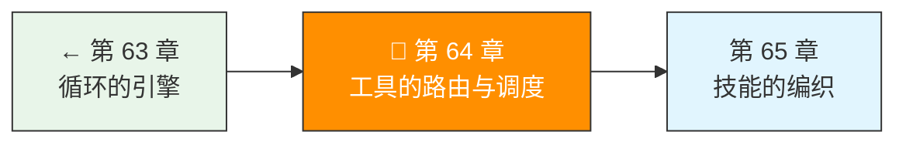
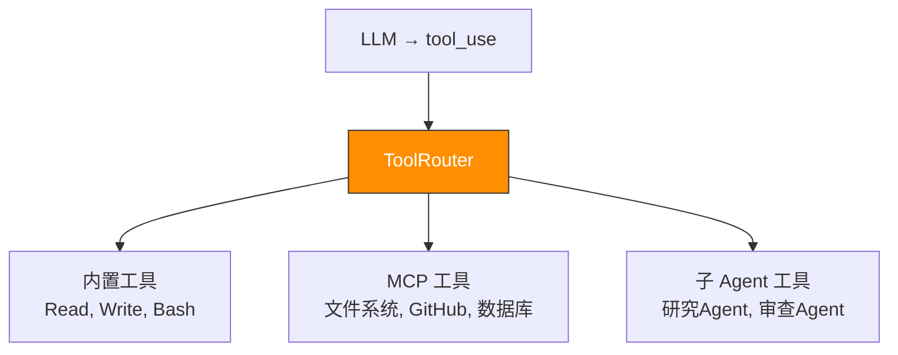

> 卷五协议验证日期：2026-05-17，基于 Agent 工具编排架构

单个 Agent 只有一套工具。当工具有几十个、来源各异（内置、MCP、子 Agent），就需要路由和调度。

---

## 路线图



---

## 工具来源的三层架构



---

## 实现 ToolRouter

```typescript
// → src/my-agent/tools/router.ts
export type ToolSource = "builtin" | "mcp" | "subagent";

export interface ToolDescriptor {
  source: ToolSource;
  definition: ToolDefinition;
  handler: ToolHandler;
  // 元信息
  readOnly?: boolean;       // 只读工具
  timeout?: number;         // 超时（ms）
  retryable?: boolean;      // 失败可重试
  requiresApproval?: boolean; // 需要人类确认
}

export class ToolRouter {
  private tools = new Map<string, ToolDescriptor>();

  register(descriptor: ToolDescriptor): void {
    const name = this.prefixName(descriptor.source, descriptor.definition.name);
    this.tools.set(name, descriptor);
  }

  registerBuiltin(tool: ToolDefinition, handler: ToolHandler): void {
    this.register({ source: "builtin", definition: tool, handler });
  }

  registerMcp(mcpClient: McpClient): void {
    for (const tool of mcpClient.getTools()) {
      const descriptor: ToolDescriptor = {
        source: "mcp",
        definition: {
          name: tool.name,
          description: tool.description,
          input_schema: tool.inputSchema,
        },
        handler: async (args) => {
          const result = await mcpClient.callTool(tool.name, args);
          return result.content.map(c => c.text).join("\n");
        },
        timeout: 30000,
      };
      this.register(descriptor);
    }
  }

  // 获取所有工具的 API 定义（传给 Messages API）
  getToolDefinitions(): ToolDefinition[] {
    return Array.from(this.tools.values()).map(t => ({
      name: this.prefixName(t.source, t.definition.name),
      description: t.definition.description,
      input_schema: t.definition.input_schema,
    }));
  }

  // 路由并执行
  async execute(toolUse: ToolUseBlock): Promise<ToolResultBlock> {
    const descriptor = this.tools.get(toolUse.name);
    if (!descriptor) {
      return {
        type: "tool_result",
        tool_use_id: toolUse.id,
        content: `错误：未知工具 "${toolUse.name}"`,
        is_error: true,
      };
    }

    try {
      const result = descriptor.timeout
        ? await this.withTimeout(descriptor.handler(toolUse.input), descriptor.timeout)
        : await descriptor.handler(toolUse.input);

      return {
        type: "tool_result",
        tool_use_id: toolUse.id,
        content: JSON.stringify(result),
      };
    } catch (err) {
      const message = (err as Error).message;
      return {
        type: "tool_result",
        tool_use_id: toolUse.id,
        content: `工具执行错误（${toolUse.name}）：${message}`,
        is_error: true,
      };
    }
  }

  private prefixName(source: ToolSource, name: string): string {
    switch (source) {
      case "mcp": return `mcp__${name}`;
      case "subagent": return `agent__${name}`;
      default: return name;
    }
  }

  private withTimeout<T>(promise: Promise<T>, ms: number): Promise<T> {
    return Promise.race([
      promise,
      new Promise<T>((_, reject) =>
        setTimeout(() => reject(new Error("Tool execution timed out")), ms)
      ),
    ]);
  }
}
```

---

## 并行工具调度

当模型同时请求多个工具调用时，判断哪些可以并行：

```typescript
// → src/my-agent/tools/scheduler.ts
export class ParallelScheduler {
  constructor(private router: ToolRouter) {}

  async executeAll(toolCalls: ToolUseBlock[]): Promise<ToolResultBlock[]> {
    // 分析依赖——如果两个工具操作同一文件，必须串行
    const groups = this.partitionIntoGroups(toolCalls);
    const results: ToolResultBlock[] = [];

    for (const group of groups) {
      if (group.length === 1) {
        // 单个工具直接执行
        results.push(await this.router.execute(group[0]));
      } else {
        // 组内并行执行
        const groupResults = await Promise.all(
          group.map(tc => this.router.execute(tc))
        );
        results.push(...groupResults);
      }
    }

    return results;
  }

  private partitionIntoGroups(toolCalls: ToolUseBlock[]): ToolUseBlock[][] {
    // 简化：检测读/写冲突
    const groups: ToolUseBlock[][] = [];
    let current: ToolUseBlock[] = [];

    for (const tc of toolCalls) {
      const descriptor = this.router.getDescriptor(tc.name);
      if (descriptor?.readOnly) {
        current.push(tc);  // 只读工具可以并行
      } else {
        if (current.length > 0) {
          groups.push(current);
          current = [];
        }
        groups.push([tc]);  // 写操作单独执行
      }
    }
    if (current.length > 0) groups.push(current);

    return groups;
  }
}
```

---

## 子 Agent 调度

```typescript
// → src/my-agent/subagent/spawner.ts
export interface SubAgentTask {
  id: string;
  description: string;
  tools: ToolDefinition[];   // 子 Agent 的工具集（受限）
  systemPrompt?: string;
  maxIterations?: number;
}

export class SubAgentSpawner {
  constructor(
    private baseClient: ApiClient,
    private maxDepth = 3       // 防止无限递归
  ) {}

  async spawn(
    task: SubAgentTask,
    currentDepth = 0
  ): Promise<SubAgentResult> {
    if (currentDepth >= this.maxDepth) {
      throw new Error(`超过最大子 Agent 深度 ${this.maxDepth}`);
    }

    // 子 Agent 的受限工具执行器
    const subExecutor = new ToolExecutor();
    // ... 仅注册 task.tools 中的工具

    // 独立的 Agent Loop
    const subAgent = new AgentLoop(
      this.baseClient,
      subExecutor,
      {
        model: "claude-haiku-4-5",  // 子 Agent 用轻量模型
        maxTokens: 2048,
        maxIterations: task.maxIterations ?? 5,
        maxContextTokens: 100_000,
        tools: task.tools,
        systemPrompt: task.systemPrompt,
      }
    );

    const outputs: string[] = [];
    for await (const event of subAgent.run(task.description)) {
      if (event.type === "response") {
        const data = event.data as { response: MessageResponse };
        const text = data.response.content
          .filter(b => b.type === "text")
          .map(b => b.text)
          .join("\n");
        outputs.push(text);
      }
    }

    return {
      taskId: task.id,
      success: true,
      output: outputs.join("\n\n"),
      toolCalls: subAgent.getStats().totalTurns,
    };
  }
}
```

---

## 工具注册示例

```typescript
// → src/my-agent/tools/registry-example.ts
const router = new ToolRouter();

// 内置工具
router.registerBuiltin(
  {
    name: "read_file",
    description: "读取文件内容",
    input_schema: {
      type: "object",
      properties: { path: { type: "string" } },
      required: ["path"],
    },
  },
  async ({ path }) => {
    const content = await readFile(path as string, "utf-8");
    return { path, content, lines: content.split("\n").length };
  }
);

router.registerBuiltin(
  {
    name: "run_command",
    description: "执行 shell 命令并返回输出",
    input_schema: {
      type: "object",
      properties: {
        command: { type: "string" },
        workdir: { type: "string" },
      },
      required: ["command"],
    },
  },
  async ({ command, workdir }) => {
    const { stdout, stderr } = await exec(command as string, {
      cwd: workdir as string ?? process.cwd(),
    });
    return { stdout, stderr, exitCode: 0 };
  }
);

// MCP 工具（自动注册）
const mcpClient = new McpClient("npx", [
  "-y", "@modelcontextprotocol/server-filesystem", "/project",
]);
await mcpClient.initialize();
await mcpClient.listTools();
router.registerMcp(mcpClient);

// 子 Agent 工具
router.registerBuiltin(
  {
    name: "research_task",
    description: "派生子 Agent 研究一个子问题",
    input_schema: {
      type: "object",
      properties: {
        question: { type: "string" },
      },
      required: ["question"],
    },
  },
  async ({ question }) => {
    const spawner = new SubAgentSpawner(client);
    const result = await spawner.spawn({
      id: `research-${Date.now()}`,
      description: question as string,
      tools: [searchTool, fileReaderTool],
      systemPrompt: "你是一个研究员。只搜索和阅读，不修改文件。",
    });
    return result;
  }
);
```

---

## 试试看

**任务 1**：注册三个 MCP Server，让 Agent 同时使用它们的工具。验证工具前缀（`mcp__`）不冲突。

**任务 2**：实现工具执行的超时和重试——一个工具超时后，自动重试一次。

**任务 3**：创建两个子 Agent——一个搜索代码，一个审查代码——让它们并行工作并汇总结果。

---

## 常见错误

| 现象 | 原因 | 解法 |
|------|------|------|
| 工具名冲突 | 两个来源的工具同名 | 用前缀区分（mcp__, agent__） |
| 子 Agent 用错模型 | 默认用了主 Agent 的模型 | 显式指定子 Agent 用小模型 |
| 递归创建子 Agent | 子 Agent 又创建子 Agent | 设置 maxDepth 上限 |
| 并行执行写冲突 | 两个工具同时写同一文件 | 依赖检测 + 串行化 |

---

## 检查点

- [ ] 理解了工具来源的三层架构（内置/MCP/子Agent）
- [ ] 实现了 ToolRouter（前缀、注册、路由执行）
- [ ] 实现了 ParallelScheduler（依赖检测、分组执行）
- [ ] 实现了 SubAgentSpawner（深度限制、独立循环）
- [ ] 能注册混合来源的 10+ 个工具

---

[← 上一章：第 63 章 循环的引擎](/posts/36d40204/) | [下一章：第 65 章 技能的编织 →](/posts/e089dbc5/)
