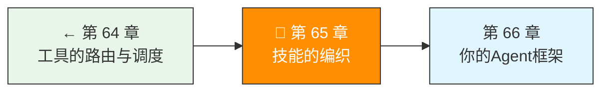

> 卷五协议验证日期：2026-05-17，基于 Claude Code Skills 系统和 Prompt 管理模式

工具给 Agent 能力（能做什么），Skill 给 Agent 专长（怎么做得好）。Skill 是封装了提示词模板、工具集和执行策略的可复用能力单元。

---

## 路线图



---

## Skill 的形式化定义

```
Skill = PromptTemplate + ToolSet + Strategy + Validator
```

| 组件 | 作用 | 示例 |
|------|------|------|
| PromptTemplate | 定义行为边界 | "你是一个代码审查专家..." |
| ToolSet | 专属工具 | `read_file`, `run_linter` |
| Strategy | 执行策略 | 先审查再测试 |
| Validator | 验证规则 | 所有测试必须通过 |

---

## Skill 定义格式

```yaml
# → src/my-agent/skills/code-review/skill.yaml
name: code-review
description: 审查代码的 bug、安全问题和风格
version: 1.0.0
author: agent-team

# 触发条件
triggers:
  - pattern: "审查|review|code review"
  - command: "/review"

# 系统指令模板
system_prompt: |
  你是一个资深代码审查专家。审查代码时：
  1. 先理解代码的意图
  2. 检查逻辑错误和边界条件
  3. 检查安全漏洞（注入、XSS、敏感信息泄露）
  4. 检查代码风格和可读性
  5. 给出具体的修改建议（含代码示例）

# 允许的工具
tools:
  - read_file
  - grep_search
  - run_linter

# 禁止的工具
disallowed_tools:
  - write_file
  - delete_file
  - run_command  # 只读审查

# 验证规则
validation:
  - type: output_check
    rule: must_contain_suggestions
    message: "审查结果必须包含具体的修改建议"
```

---

## 实现 SkillLoader

```typescript
// → src/my-agent/skills/loader.ts
import { readFile, readdir } from "node:fs/promises";
import { join, extname } from "node:path";
import { parse as parseYaml } from "yaml";

export interface SkillDefinition {
  name: string;
  description: string;
  version: string;
  author?: string;
  triggers: {
    pattern?: string;
    command?: string;
  }[];
  system_prompt: string;
  tools?: string[];          // 允许的工具（空 = 全部）
  disallowed_tools?: string[];
  validation?: {
    type: string;
    rule: string;
    message: string;
  }[];
  dependencies?: string[];   // 依赖的其他 Skill
}

export class SkillLoader {
  private skills = new Map<string, SkillDefinition>();

  async loadFromDirectory(dir: string): Promise<void> {
    const entries = await readdir(dir, { withFileTypes: true });
    for (const entry of entries) {
      if (entry.isDirectory()) {
        // 递归加载
        await this.loadFromDirectory(join(dir, entry.name));
      } else if (entry.name.endsWith(".yaml") || entry.name.endsWith(".yml")) {
        const content = await readFile(join(dir, entry.name), "utf-8");
        const skill = parseYaml(content) as SkillDefinition;
        this.skills.set(skill.name, skill);
      }
    }
  }

  get(name: string): SkillDefinition | undefined {
    return this.skills.get(name);
  }

  getAll(): SkillDefinition[] {
    return Array.from(this.skills.values());
  }

  // 根据用户输入匹配 Skill
  matchByInput(userInput: string): SkillDefinition[] {
    const matches: SkillDefinition[] = [];
    for (const skill of this.skills.values()) {
      for (const trigger of skill.triggers) {
        if (trigger.pattern) {
          const regex = new RegExp(trigger.pattern, "i");
          if (regex.test(userInput)) {
            matches.push(skill);
            break;
          }
        }
      }
    }
    return matches;
  }
}
```

---

## 实现 SkillInjector

```typescript
// → src/my-agent/skills/injector.ts
export class SkillInjector {
  constructor(private loader: SkillLoader) {}

  // 将激活的 Skill 注入 system prompt
  buildSystemPrompt(
    baseSystemPrompt: string,
    activeSkills: SkillDefinition[]
  ): string {
    if (activeSkills.length === 0) return baseSystemPrompt;

    const skillPrompts = activeSkills
      .map(s => `## Skill: ${s.name}\n${s.system_prompt}`)
      .join("\n\n---\n\n");

    return [
      baseSystemPrompt,
      "---",
      "## 当前激活的技能",
      skillPrompts,
    ].join("\n");
  }

  // 根据激活的 Skill 过滤工具
  filterTools(
    allTools: ToolDefinition[],
    activeSkills: SkillDefinition[]
  ): ToolDefinition[] {
    if (activeSkills.length === 0) return allTools;

    // 收集所有允许和禁止的工具
    const allowed = new Set<string>();
    const disallowed = new Set<string>();
    let hasAllowList = false;

    for (const skill of activeSkills) {
      if (skill.tools) {
        hasAllowList = true;
        for (const t of skill.tools) allowed.add(t);
      }
      if (skill.disallowed_tools) {
        for (const t of skill.disallowed_tools) disallowed.add(t);
      }
    }

    return allTools.filter(t => {
      if (disallowed.has(t.name)) return false;
      if (hasAllowList && !allowed.has(t.name)) return false;
      return true;
    });
  }

  // 验证输出是否符合 Skill 规则
  validateOutput(
    response: MessageResponse,
    activeSkills: SkillDefinition[]
  ): ValidationResult[] {
    const results: ValidationResult[] = [];
    for (const skill of activeSkills) {
      if (!skill.validation) continue;
      for (const rule of skill.validation) {
        results.push(this.checkRule(rule, response));
      }
    }
    return results;
  }

  private checkRule(
    rule: SkillDefinition["validation"][number],
    response: MessageResponse
  ): ValidationResult {
    const text = response.content
      .filter(b => b.type === "text")
      .map(b => b.text)
      .join("");

    switch (rule.rule) {
      case "must_contain_suggestions":
        return {
          skill: rule.message,
          passed: /建议|修改|改进|修复/.test(text),
          message: rule.message,
        };
      case "must_be_json":
        return {
          skill: rule.message,
          passed: (() => { try { JSON.parse(text); return true; } catch { return false; } })(),
          message: rule.message,
        };
      default:
        return { skill: rule.message, passed: true, message: rule.message };
    }
  }
}
```

---

## Skill 组合

多个 Skill 可以同时激活，但需要处理冲突：

```typescript
// → src/my-agent/skills/composer.ts
export class SkillComposer {
  compose(skills: SkillDefinition[]): ComposedSkill {
    // 按优先级排序（有依赖的在前）
    const sorted = this.topologicalSort(skills);

    return {
      systemPrompt: sorted.map(s => s.system_prompt).join("\n\n"),
      tools: this.mergeTools(sorted),
      validation: sorted.flatMap(s => s.validation ?? []),
    };
  }

  private topologicalSort(skills: SkillDefinition[]): SkillDefinition[] {
    const sorted: SkillDefinition[] = [];
    const visited = new Set<string>();

    const visit = (skill: SkillDefinition) => {
      if (visited.has(skill.name)) return;
      visited.add(skill.name);
      if (skill.dependencies) {
        for (const depName of skill.dependencies) {
          const dep = skills.find(s => s.name === depName);
          if (dep) visit(dep);
        }
      }
      sorted.push(skill);
    };

    for (const skill of skills) visit(skill);
    return sorted;
  }

  private mergeTools(skills: SkillDefinition[]): string[] {
    const allowed = new Set<string>();
    const disallowed = new Set<string>();
    let hasAllowList = false;

    for (const skill of skills) {
      if (skill.tools) {
        hasAllowList = true;
        for (const t of skill.tools) allowed.add(t);
      }
      if (skill.disallowed_tools) {
        for (const t of skill.disallowed_tools) disallowed.add(t);
      }
    }

    // 移除禁止的工具
    for (const t of disallowed) allowed.delete(t);

    return hasAllowList ? Array.from(allowed) : [];
  }
}
```

---

## 与 Agent Loop 集成

```typescript
// → src/my-agent/skills/agent-integration.ts
export class SkillAwareAgent {
  private agent: AgentLoop;
  private injector: SkillInjector;

  async *run(userInput: string): AsyncGenerator<TurnEvent> {
    // 1. 匹配 Skill
    const matched = this.injector.loader.matchByInput(userInput);

    if (matched.length > 0) {
      // 2. 注入 Skill prompt
      this.agent.updateSystemPrompt(
        this.injector.buildSystemPrompt(
          this.agent.getBaseSystemPrompt(),
          matched
        )
      );

      // 3. 过滤工具
      this.agent.restrictTools(
        this.injector.filterTools(
          this.agent.getAllTools(),
          matched
        )
      );
    }

    // 4. 执行
    for await (const event of this.agent.run(userInput)) {
      // 5. 验证输出（仅最终响应）
      if (event.type === "response" && matched.length > 0) {
        const validation = this.injector.validateOutput(
          (event.data as { response: MessageResponse }).response,
          matched
        );
        yield { ...event, validation };
      } else {
        yield event;
      }
    }
  }
}
```

---

## 试试看

**任务 1**：创建三个 Skill——`code-review`（审查代码）、`write-tests`（编写测试）、`document`（写文档）。为每个写 YAML 定义和 prompt。

**任务 2**：组合两个 Skill（如审查 + 安全审计），验证工具集合并是否正确。

**任务 3**：实现 Skill 的热加载——在 Agent 运行时添加新 Skill，下一个请求生效。

---

## 常见错误

| 现象 | 原因 | 解法 |
|------|------|------|
| Skill 不触发 | pattern 正则不匹配 | 测试正则，调低匹配阈值 |
| 工具过多/过少 | Skill 的 tools 配置错误 | 检查 allow/deny 逻辑 |
| Skill 间冲突 | 两个 Skill 对同一操作有不同要求 | 用优先级排序 |
| 循环依赖 | Skill A 依赖 B，B 依赖 A | 拓扑排序检测循环 |

---

## 检查点

- [ ] 理解了 Skill 的四组件模型
- [ ] 实现了 SkillLoader（YAML 解析 + 目录遍历）
- [ ] 实现了 SkillInjector（prompt 注入 + 工具过滤 + 输出验证）
- [ ] 实现了 SkillComposer（组合 + 冲突解决）
- [ ] 能将 Skill 系统集成到 Agent Loop

---

[← 上一章：第 64 章 工具的路由与调度](/posts/953b4387/) | [下一章：第 66 章 你的 Agent 框架 →](/posts/3ca45973/)
